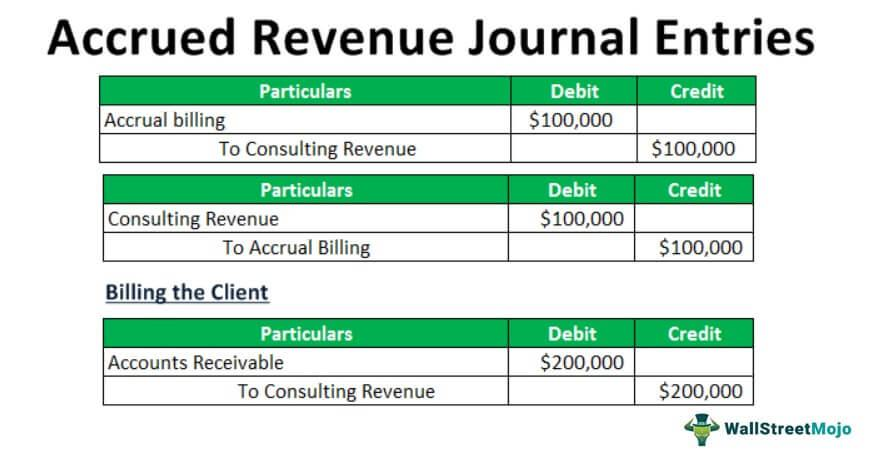

In the modern financial landscape, understanding the interplay between accounting principles and algorithmic trading is crucial for businesses aiming to optimize operations and maintain compliance. This article explores the key concepts of revenue recognition, expense recognition, and accrual accounting, and their relationship with the evolution of algorithmic trading.

Accounting methods like accrual accounting provide a comprehensive framework for accurately reporting financial health. Under accrual accounting, financial events are recorded when they occur rather than when cash transactions happen. This includes recording revenues and expenses in the accounting period they are earned or incurred. Such precision in financial reporting ensures that a company's financial statements reflect its true economic activities, enabling stakeholders to gauge performance accurately.



Algorithmic trading, on the other hand, enhances market efficiency by allowing trades to be executed at a speed and accuracy beyond human capability. Algorithms based on predefined criteria can swiftly analyze large volumes of market data, identify trading opportunities, and execute trades. This process not only increases liquidity and narrows bid-ask spreads but also significantly reduces transaction costs. The precision and speed of algorithmic trading are integral for achieving strategic decision-making and market competitiveness.

The convergence of these two domains offers significant advantages in transparency, accuracy, and strategic alignment. By integrating accounting practices with algorithmic trading strategies, companies can better align their operational activities with financial reporting and market positions. This integration enhances transparency, builds stakeholder confidence, and ensures regulatory compliance.

Through this overview, we aim to expand understanding of integrating these disciplines to achieve financial success. As businesses seek to navigate the increasingly competitive market landscape, mastering the synergy between accurate financial accounting and advanced trading technologies becomes essential. This fusion not only clarifies organizational performance but also optimizes decision-making processes and enhances operational efficiency.

## Table of Contents

## Understanding Accrual Accounting

Accrual accounting serves as a fundamental pillar of financial reporting, emphasizing the recording of revenues and expenses at the time they are incurred, rather than when cash exchanges hands. This approach provides a more precise representation of a company's financial standing, as it ensures that financial events are recorded in the periods in which they have a direct impact.

Central to the accrual accounting system are two key principles: revenue recognition and the matching principle. The revenue recognition principle mandates that revenue is recognized when goods or services are delivered, and the [earning](/wiki/earning-announcement) process is substantially complete. This is typically decided based on specific criteria, such as transfer of risks and rewards, transfer of control, or when the company has a right to payment. For example, under Accounting Standards Codification (ASC) Topic 606, also referred to as "Revenue from Contracts with Customers," a five-step model is employed to determine when revenue should be recognized. This involves identifying the contract, detailing the performance obligations, determining the transaction price, allocating it to the performance obligations, and recognizing revenue when obligations are fulfilled.

The matching principle works in tandem with revenue recognition, ensuring that expenses are recorded in the same period as the revenues that they help to generate. This alignment is crucial for presenting an accurate financial picture, as it ensures that all costs incurred in earning revenue are simultaneously recorded. For instance, if a company incurs costs related to a marketing campaign intended to drive sales, those costs should be recognized concurrently with the sales revenues they are designed to produce, regardless of when the costs are actually paid.

An essential aspect of accrual accounting is its ability to provide insights into potential financial obligations and revenues that may not yet embody actual cash flow changes, offering stakeholders a comprehensive understanding of an entity's financial dynamics. This system necessitates careful judgment in the estimation of revenues and expenses, involving various account adjustments such as accruals, deferrals, and provisions for potential losses.

Accrual accounting not only facilitates compliance with generally accepted accounting principles (GAAP) and international financial reporting standards (IFRS) but also enhances the quality of financial information available to investors and management. By providing a more accurate and actionable depiction of financial health, accrual accounting aids in strategic decision-making and long-term planning.

## Revenue Recognition and Expense Recognition

Revenue recognition is a critical component of financial accounting, ensuring that income is recognized consistently and transparently. This process requires adherence to standards such as the Accounting Standards Codification (ASC) 606 and International Financial Reporting Standards (IFRS) 15, which outline a five-step model for recognizing revenue:

1. **Identify the Contract**: A contract is defined as an agreement between two or more parties that creates enforceable rights and obligations. This step involves determining whether the contracts entered meet the criteria for revenue recognition.

2. **Identify Performance Obligations**: Within the contract, the specific performance obligations must be identified. Each obligation is a promise to transfer a distinct good or service to the customer.

3. **Determine Transaction Price**: The transaction price is the amount of consideration a company expects to receive in exchange for fulfilling its performance obligations. This amount can vary due to discounts, rebates, incentives, and penalties.

4. **Allocate Transaction Price**: The transaction price must be allocated to each performance obligation based on the stand-alone selling prices of each good or service.

5. **Recognize Revenue**: Revenue is recognized as the performance obligations are satisfied, either over time or at a point in time, depending on the terms set in the contract and the nature of the goods or services provided.

Conversely, expense recognition hinges on the matching principle, which requires that expenses are recorded in the same period as the revenues they help generate. This principle ensures that an organization’s financial statements provide a coherent depiction of economic activity. For example, if a company incurs costs directly associated with revenue generation, such as cost of goods sold, those costs are matched to the revenue they facilitate, offering an accurate picture of profitability.

The formula often used in expense recognition is:

$$
\text{Net Income} = \text{Revenues} - \text{Expenses}
$$

This ensures that only the expenses associated with realized revenue affect income statements, maintaining a precise record of financial performance. By adhering to these standards, organizations accurately reflect their financial realities, thereby providing stakeholders with clear insights into operational health and market standing.

## Algorithmic Trading: Enhancing Financial Markets

Algorithmic trading utilizes computer algorithms to execute trades at speeds and efficiencies unattainable by human traders. The core advantage lies in its ability to enhance market efficiency, achieved by narrowing bid-ask spreads and increasing market [liquidity](/wiki/liquidity-risk-premium). This approach leverages high-frequency data processing to respond to market changes in real-time, allowing traders to capitalize on minute price discrepancies.

One of the fundamental aspects of [algorithmic trading](/wiki/algorithmic-trading) is its ability to reduce transaction costs. By automating trading processes, algorithms can minimize the latency between market price changes and trade execution, reducing slippage and transaction costs. This precision facilitates optimal entry and [exit](/wiki/exit-strategy) points, critical in markets where timing affects profitability.

Algorithmic trading strategies are crafted using technical and quantitative analysis. These strategies range from simple moving averages to complex statistical [arbitrage](/wiki/arbitrage) models involving [machine learning](/wiki/machine-learning). For instance, mean reversion strategies are based on the assumption that prices will tend to revert to their historical average, while [momentum](/wiki/momentum) strategies capitalize on the continuation of existing trends.

The effectiveness of algorithmic trading rests in its integration with financial market models. Trading algorithms can be based on various market theories, like the Efficient Market Hypothesis or the Random Walk Theory, to predict price movements and execute trades accordingly. Additionally, machine learning techniques can further enhance algorithms by continuously learning from historical and real-time data to improve decision-making processes.

Python is a popular programming language for developing these algorithms due to its comprehensive libraries like Pandas for data manipulation, NumPy for numerical calculations, and Scikit-learn for implementing machine learning algorithms. Here's a basic example of a mean reversion strategy in Python:

```python
import pandas as pd
import numpy as np

# Historical price data
prices = pd.Series([100, 102, 101, 98, 105, 103, 100, 104])

# Compute rolling mean and standard deviation
rolling_mean = prices.rolling(window=3).mean()
rolling_std = prices.rolling(window=3).std()

# Define buy and sell signals
buy_signal = prices < (rolling_mean - 1 * rolling_std)
sell_signal = prices > (rolling_mean + 1 * rolling_std)

# Identify when to execute trades
trade_signals = pd.DataFrame({'Price': prices, 'Buy Signal': buy_signal, 'Sell Signal': sell_signal})

print(trade_signals)
```

In the financial market ecosystem, algorithmic trading is prominently employed by asset managers, hedge funds, and institutional investors to execute large volumes of trades while minimizing market impact. These algorithms are also pivotal in electronic markets and exchanges where speed, efficiency, and cost-effectiveness of trade execution are paramount.

The continuous evolution of algorithmic trading is shaping the future of financial markets, providing a dynamic tool for financial professionals to optimize trading operations and strategically manage investments. With technological advancements, this domain is set to further revolutionize market interactions.

## Integrating Accounting with Algorithmic Trading

Integrating accounting principles, specifically revenue recognition, with algorithmic trading strategies represents a significant advancement in the financial sector. This integration enhances the precision and compliance of financial activities, ensuring decisions made by trading algorithms are rooted in reliable financial data.

Revenue recognition principles, such as those outlined in ASC 606 and IFRS 15, provide a comprehensive framework that defines when and how much revenue should be recognized. By embedding these principles within algorithmic trading systems, financial institutions can ensure that their algorithms operate with a complete, accurate picture of the organization's financial status. This includes considering when revenue from trades is realized and how it aligns with overall financial goals.

Trading algorithms thrive on clear, accurate data. When they incorporate revenue recognition rules, they can assess market situations more effectively, aligning their strategies with the company's forecasts and strategic objectives. For example, algorithms can be programmed to adjust trading volumes or execution strategies based on quarterly revenue targets or anticipated market conditions, as defined in financial plans.

Moreover, this synergy fosters operational efficiency and transparency. Accurate financial inputs mean that algorithms can better predict market trends and execute trades that reflect true company performance. Furthermore, transparency is enhanced when stakeholders, including regulators and investors, can trace how financial data influences trading decisions. This traceability builds trust and helps maintain compliance with financial regulations.

On the technical side, integrating revenue recognition with algorithmic trading can involve using programming languages like Python. For instance, a Python script could be designed to ingest financial data, apply revenue recognition criteria, and feed this information into trading algorithms. Here is a simple illustration:

```python
# Example function to calculate recognized revenue
def calculate_recognized_revenue(total_revenue, criteria_met):
    if criteria_met:
        return total_revenue
    else:
        return 0

# Hypothetical trading algorithm function
def trading_algorithm(market_data, financial_data):
    recognized_revenue = calculate_recognized_revenue(financial_data['total_revenue'], financial_data['criteria_met'])
    if recognized_revenue > threshold_value:
        # Execute trades based on recognized financial input
        execute_trade(market_data, recognized_revenue)
    else:
        # Re-evaluate trading strategy
        re_evaluate_strategy()

# Example usage
financial_data = {'total_revenue': 100000, 'criteria_met': True}
market_data = get_market_data()
trading_algorithm(market_data, financial_data)
```

In conclusion, the integration of accounting standards with algorithmic trading ensures that trading activities are accurately aligned with an organization's real financial condition. This approach not only improves operational efficiency and compliance but also enforces a level of transparency that is crucial in the dynamic financial markets. By leveraging this synergy, financial professionals can achieve a more robust, informed decision-making process.

## Conclusion

The fusion of revenue recognition, accrual accounting, and algorithmic trading represents a compelling frontier in financial management. This integration empowers businesses to capitalize on the meticulous nature of financial reporting and the cutting-edge capabilities of trading technologies. By aligning business strategies with comprehensive accounting practices, such as the timely and accurate recording of financial activities through revenue and expense recognition, businesses enhance their ability to make informed decisions grounded in current financial realities.

Algorithmic trading further augments this framework by processing vast datasets at unprecedented speeds. This fusion allows for greater market efficiency and precision in financial operations. Consequently, companies can achieve heightened transparency by implementing systems where data-driven insights from trading activities harmonize with financial statements prepared under the accrual accounting method.

Efficiency is also markedly improved when these domains are intertwined. Algorithmic trading strategies, underpinned by accurate financial inputs and forecasts, can lead to better resource allocation and cost-management practices. This boosts competitive advantage and ensures that a company’s financial strategy is robust and adaptable to market fluctuations.

Moreover, strategic alignment becomes feasible when organizational goals and market positions are cohesively reflected in financial practices and trading operations. This alignment helps maintain consistency and reliability in financial reporting, which is crucial for regulatory compliance and stakeholder trust.

Understanding this intricate relationship is essential for financial professionals striving for enhanced organizational performance and adherence to regulations in a competitive market landscape. Recognizing and leveraging the synergies between thorough accounting practices and sophisticated trading technologies can guide companies toward sustained growth and innovation.

## References & Further Reading

For deeper insights into revenue recognition and algorithmic trading, consider consulting the following essential resources:

- **Revenue Recognition**: A comprehensive understanding of revenue recognition underlies many financial practices. 'Revenue from Contracts with Customers' by Deloitte provides a detailed examination of the accounting standard ASC 606. Additionally, 'IFRS 15', available through IAS Plus, expands on international financial reporting standards and their application. These resources elucidate how revenue is recognized and the implications for financial reporting.

- **Algorithmic Trading**: For those interested in the strategic and technical aspects of algorithmic trading, 'Algorithmic Trading: Winning Strategies' by Ernie Chan is a valuable resource. It discusses the creation and implementation of algorithm-based trading strategies. Furthermore, 'Advances in Financial Machine Learning' by Marcos Lopez de Prado offers insights into the intersection of machine learning and finance, illustrating sophisticated techniques for enhancing trading strategies through data analysis.

- **Financial Markets and Derivatives**: Textbooks and scholarly articles on financial markets and derivatives provide foundational knowledge that supports both accounting and trading disciplines. These readings explore market dynamics, instruments, and the theoretical frameworks necessary for informed financial decision-making.

These resources collectively provide a robust framework for understanding and integrating the principles of revenue recognition with the efficiencies and strategies of algorithmic trading, equipping professionals to navigate and succeed in the financial landscape.