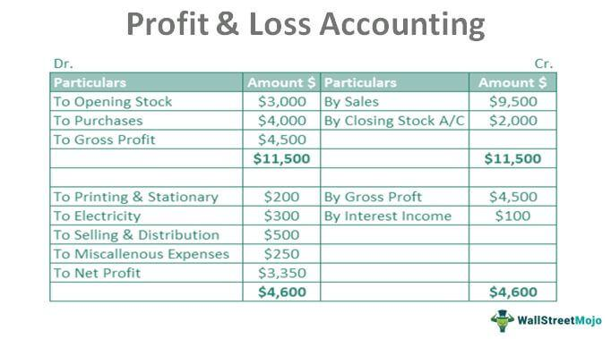

In the ever-evolving world of finance, understanding the intricacies of accounting, financial reporting, and the impact of algorithmic trading is crucial for investors and businesses alike. The rapid advancements in technology and data analytics have fundamentally transformed financial markets, making it imperative for stakeholders to comprehend these changes. This article explores the essential concepts of recognized loss in financial reporting and its intersection with algorithmic trading strategies, two critical areas that underscore modern financial dynamics.

Recognized losses occur when an asset or investment is sold for less than its purchase price, significantly affecting accounting records and tax implications. These losses play a crucial role in financial reporting, providing opportunities for tax deductions and influencing investment decisions. As financial metrics, recognized losses have become integral to aligning financial reporting with broader tax strategies, helping reduce taxable income by offsetting gains from other investments.



The rising trend of algorithmic trading adds a layer of complexity, necessitating a greater understanding of financial losses. Algorithmic trading, known for its speed and accuracy, uses sophisticated algorithms to execute trades based on various financial data and market trends. This approach to trading not only enhances efficiency but also impacts how recognized financial metrics, such as losses, are handled, fundamentally influencing market dynamics and investment strategies.

Join us as we unpack the dynamics between recognized losses and algorithmic trading. By exploring how these elements interact and influence each other, we aim to provide insights into their effects on financial reporting norms and investment decisions. This understanding is vital for investors and businesses seeking to navigate the complexities of modern financial markets and harness the potential benefits of strategic financial planning.

## Table of Contents

## What is Recognized Loss in Financial Accounting?

A recognized loss in financial accounting occurs when the sale price of an asset or investment is less than its original purchase price. This financial outcome impacts both accounting records and tax implications significantly. From an accounting perspective, recognized losses necessitate adjustments to the financial statements to reflect the diminished value of the asset, aligning the reported figures with the actual economic condition of the entity.

Recognized losses play a critical role in tax planning. They allow taxpayers to claim deductions against their capital gains, thereby reducing the overall taxable income. This process, known as tax-loss harvesting, involves the strategic sale of underperforming assets to offset capital gains elsewhere in the portfolio. For example, if an investor realizes a capital gain of $10,000 but also recognizes a loss of $3,000 from another investment, the taxable gain is effectively reduced to $7,000. This ability to offset gains against losses can be strategically significant, particularly in jurisdictions with progressive tax systems.

Moreover, recognized losses offer the possibility to align financial reporting with strategic tax planning objectives. By offsetting gains from other investments, companies can smooth out earnings fluctuations and present a more stable financial performance over time. This approach not only optimizes the tax outcome but also enhances the accuracy and reliability of financial reports, providing stakeholders with a clearer view of the financial health of the business.

Understanding recognized losses is essential for accurate financial reporting and compliance with tax regulations. Different accounting frameworks, such as Generally Accepted Accounting Principles (GAAP) and International Financial Reporting Standards (IFRS), provide specific guidelines on how these losses should be reported. Accurately reflecting recognized losses ensures transparency, which is crucial for informed decision-making by investors, analysts, and regulators. Accurate recognition and reporting of these losses prevent potential discrepancies that could lead to financial misstatements or regulatory scrutiny.

## Financial Reporting Implications of Recognized Loss

Recognized losses in financial accounting are crucial for understanding a company's financial health and transparency. These losses are typically reported in financial statements such as the income statement and balance sheet. Various accounting frameworks, including Generally Accepted Accounting Principles (GAAP) and International Financial Reporting Standards (IFRS), provide guidelines on how these losses should be recognized and reported.

Under GAAP, recognized losses are recorded when it is probable that an asset's carrying amount cannot be recovered. This typically occurs when an asset is sold for less than its book value, resulting in a realized loss. For instance, if a company purchases an asset for $100,000 and later sells it for $70,000, the recognized loss would be $30,000. GAAP requires such losses to be recorded in the income statement, impacting net income and subsequently, shareholder equity on the balance sheet.

IFRS has a similar approach but emphasizes the importance of "impairment testing." Under IFRS, an asset is considered impaired when its carrying amount exceeds its recoverable amount. If this occurs, the asset value is written down, and the loss is recognized in the income statement. This impairment loss is outlined in IFRS standards such as IAS 36, which covers the impairment of assets.

Recognized losses can significantly affect how stakeholders perceive a company's financial performance. A company consistently reporting high recognized losses might be perceived as having poor asset management or market conditions. This perception can influence investor confidence and impact the company’s market value and borrowing capabilities.

Properly reflecting recognized losses in financial statements is crucial for maintaining transparency. Transparent reporting ensures that stakeholders have a clear understanding of the company's financial situation, enabling informed decision-making. Investors and creditors rely on accurate reporting to assess the risk and potential return on investment.

Recognized losses also have tax implications. In some jurisdictions, these losses can be used to offset taxable income, thereby impacting the company’s tax obligations. This intersection of accounting and tax planning adds another layer of importance to the accurate reporting of recognized losses.

In conclusion, different accounting frameworks provide specific instructions for recording recognized losses, which are essential for presenting an accurate picture of a company's financial performance. This accurate representation is vital for transparency and helps stakeholders make informed investment and strategic decisions.

## Tax Aspects and Strategic Benefits of Recognized Losses

Recognized losses, essential components of financial accounting, play a significant role in tax-loss harvesting strategies. Tax-loss harvesting involves selling securities at a loss to offset taxable capital gains realized from the sale of other securities, thus reducing the overall tax liability for investors. By leveraging recognized losses, investors can optimize their after-tax returns, a critical aspect of effective financial management.

Consider an investor who realizes significant capital gains during a financial year. To mitigate the taxes owed on these gains, the investor can sell underperforming assets, thereby recognizing losses. According to tax regulations, these losses can be used to offset gains of the same kind, commonly referred to as capital losses offsetting capital gains. In the United States, for example, under the Internal Revenue Code, if capital losses exceed capital gains, an individual can deduct up to $3,000 ($1,500 if married filing separately) against ordinary income annually, with any excess losses carried forward to future years. This deduction optimizes taxable income and improves overall financial efficiency.

For businesses and sophisticated investors, comprehending the intricacies of tax regulations associated with recognized losses enables strategic financial planning. Tax-loss harvesting, when effectively employed, can defer tax liabilities, facilitating the reinvestment of cash that would otherwise be used for tax payments. This strategy supports enhanced portfolio growth by reinvesting the tax savings into other investment opportunities.

Moreover, understanding the specific tax codes and legal requirements in different jurisdictions is crucial. For instance, wash sale rules in the U.S. prevent the deduction of recognized losses if the same or a substantially identical security is purchased within 30 days before or after the sale. Thus, investors need to strategically time their trades to comply with these regulations and maximize tax benefits.

In essence, recognizing losses not only serves as a compliance measure but also as a tactical instrument in financial planning. By offsetting gains and strategically managing tax liabilities, investors can effectively navigate financial markets, ensuring that portfolios are aligned with both their financial goals and regulatory frameworks.

## Algorithmic Trading: An Overview

Algorithmic trading leverages advanced algorithms to execute orders on financial markets with remarkable speed and precision, surpassing human capabilities. At its core, [algorithmic trading](/wiki/algorithmic-trading) involves the use of computer programs that follow defined instructions for trading. These instructions can range from simple conditions such as initiating a buy order when a stock falls below a certain price, to more complex protocols that analyze various market variables in real-time.

The basis of algorithmic trading lies in its ability to process large volumes of financial data rapidly. These systems analyze past market data, current price patterns, and other economic indicators to make informed trading decisions. By utilizing historical and real-time data, algorithms can identify [arbitrage](/wiki/arbitrage) opportunities, execute high-frequency trades, implement trade strategies like [market making](/wiki/market-making), and even manage portfolio risks.

A key advantage of algorithmic trading is its ability to execute trades at much higher frequencies and with greater accuracy than manual trading. This is critical in environments where asset prices can change within fractions of a second. For instance, in high-frequency trading ([HFT](/wiki/high-frequency-trading-strategies)), firms deploy sophisticated algorithms to capitalize on minute price discrepancies, executing thousands of orders within milliseconds.

Algorithmic trading also impacts decisions concerning both realized and unrealized financial metrics. It facilitates the automation of not only executing orders but also in managing investment portfolios and adjusting positions based on pre-defined risk and return parameters. Furthermore, it enables the incorporation of complex models like Monte Carlo simulations or [machine learning](/wiki/machine-learning) techniques to predict future trends and assess potential risks.

The growing influence of algorithmic trading is evident in its pervasive integration into modern financial markets. According to a 2019 report by MarketsandMarkets, the algorithmic trading market is projected to grow significantly, fueled by the expanding financial services industry and increasing demand for market surveillance. Its prevalence in stock exchanges across the globe underscores its importance, with algorithmic trading accounting for a substantial portion of global trading volumes.

In summary, algorithmic trading is reshaping the landscape of investment strategies and financial market dynamics through its emphasis on speed, accuracy, and data-driven decision-making. As technological advancements continue to evolve, so too will the capabilities and applications of algorithmic trading systems, making them an indispensable tool in contemporary finance.

## Recognized Losses in the Context of Algorithmic Trading

Algorithmic trading platforms are increasingly incorporating recognized losses into their decision-making frameworks, leveraging these adjustments to optimize trade execution and enhance tax strategies. Recognized losses, which occur when assets are sold for less than their purchase price, can be strategically integrated into the trading algorithms to align trades with broader financial goals.

One of the primary advantages of algorithmic trading is its ability to process vast amounts of data at incredible speeds. By incorporating recognized losses into their systems, algorithmic trading platforms can automatically identify optimal moments to execute trades that minimize tax liabilities while maximizing financial gains. This capability is crucial in tax-loss harvesting, where strategically realizing losses can offset taxable capital gains.

Algorithmic systems utilize complex algorithms that consider a multitude of factors, such as market trends, asset performance, and current fiscal regulations. For instance, these systems can be programmed to recognize patterns where executing a trade involving a recognized loss would yield a favorable tax position. This automated recognition aligns with investors' larger tax strategies, optimizing their after-tax returns.

To effectively integrate recognized losses, algorithmic trading platforms need rigorous back-testing and data analysis. This ensures the reliability of their decision-making processes under varying market conditions. With robust algorithms, platforms can simulate various loss scenarios, predict their impacts on tax liabilities, and generate reports that guide strategic decisions.

Here's an example of how this might be accomplished in Python:

```python
import numpy as np
import pandas as pd

def calculate_tax_loss_harvest(trades, threshold_loss=-500):
    # trades is a DataFrame containing 'purchase_price', 'sale_price', 'volume'
    trades['recognized_loss'] = (trades['sale_price'] - trades['purchase_price']) * trades['volume']
    condition = trades['recognized_loss'] <= threshold_loss
    loss_driven_trades = trades[condition]
    aggregated_loss = loss_driven_trades['recognized_loss'].sum()
    return aggregated_loss, loss_driven_trades

# example usage
trade_data = pd.DataFrame({
    'purchase_price': np.random.uniform(100, 200, 100),
    'sale_price': np.random.uniform(80, 200, 100),
    'volume': np.random.randint(1, 10, 100)
})

total_loss, loss_trades = calculate_tax_loss_harvest(trade_data)
print(f"Total Recognized Loss: {total_loss}")
```

Understanding how these platforms handle recognized losses is essential for investors aiming to leverage their portfolios' tax efficiency. By automating the recognition and strategic use of losses, algorithmic trading systems enable investors to maintain an adaptive and proactive approach to financial management. This integration not only improves immediate financial outcomes but also positions portfolios to capitalize on future market opportunities. Such a sophisticated approach underscores the evolving nature of financial markets and the critical role of technology in optimizing investment strategies.

## Managing Investment Strategies with Recognized Losses

Proper management of recognized losses in investment strategies necessitates a strategic approach combining market analysis, financial tools, and careful planning. Investors often aim to utilize recognized losses to align with their broader financial goals while adjusting for varying levels of risk tolerance.

A fundamental step in managing recognized losses is rigorous portfolio monitoring. This involves regularly reviewing performance against defined financial objectives and ensuring the asset allocation aligns with an investor's risk tolerance. Continuous portfolio analysis helps in identifying which assets are underperforming and may potentially incur recognized losses. Such scrutiny allows for timely strategic decisions on whether to hold or divest these assets.

Advanced analytical tools further enhance decision-making by providing insights into market trends, asset performance, and potential tax implications. These tools can include software platforms that offer predictive analytics and risk assessment features. By leveraging these capabilities, investors can simulate different market scenarios and assess the impact of recognizing losses on their overall portfolio performance.

The use of financial tools can also aid in tax-loss harvesting strategies, where recognized losses are intentionally used to offset taxable gains. This is achieved by selling an underperforming asset to realize a loss that can be applied against capital gains from other investments. The objective is to minimize tax liabilities and improve after-tax returns. Implementing such strategies requires a deep understanding of tax regulations and implications, making the use of advanced algorithms and software essential.

Moreover, algorithmic trading can further optimize the management of recognized losses by executing trades at optimal times and prices, considering both current market conditions and tax strategies. By automating trade execution based on pre-defined criteria, algorithmic systems can efficiently handle the complexities associated with recognized loss management in synchronization with investment goals.

In conclusion, effective management of recognized losses requires a well-rounded approach integrating strategic planning, continuous market analysis, and innovative financial tools to optimize investment outcomes and align with financial goals.

## Conclusion

Recognized losses hold a critical position in financial accounting, influencing areas such as tax planning, investment strategies, and financial reporting. Their role is multifaceted, allowing entities to not only report losses accurately but also to strategically utilize these losses to offset capital gains, reducing taxable income and improving after-tax returns. In practice, recognized losses help align financial reporting with tax strategies, ensuring compliance and optimizing financial performance.

The relationship between recognized losses and algorithmic trading further underscores their importance, reflecting the complexity of contemporary financial markets. Algorithmic trading systems, characterized by their speed and precision, are capable of integrating recognized losses into trading algorithms. This integration allows for the strategic management of trades, contributing to a comprehensive financial strategy that encompasses loss recognition and tax optimization.

As financial markets evolve, staying informed and proactively managing recognized losses becomes imperative for investors and businesses. By understanding the interplay between recognized losses and algorithmic trading, stakeholders can exploit this dynamic to enhance their financial outcomes. This involves continuous monitoring and strategic adjustment of portfolios to align with financial goals and optimize tax implications. Recognized losses, therefore, are not merely accounting entries but valuable components of sophisticated financial strategies.

## References & Further Reading

[1]: ["Advances in Financial Machine Learning"](https://www.amazon.com/Advances-Financial-Machine-Learning-Marcos/dp/1119482089) by Marcos Lopez de Prado

[2]: ["Quantitative Trading: How to Build Your Own Algorithmic Trading Business"](https://github.com/LucindaYa/quant-resources/blob/master/Quantitative%20Trading%20How%20to%20Build%20Your%20Own%20Algorithmic%20Trading%20Business.pdf) by Ernest P. Chan

[3]: ["Machine Learning for Algorithmic Trading"](https://github.com/stefan-jansen/machine-learning-for-trading) by Stefan Jansen

[4]: ["Evidence-Based Technical Analysis: Applying the Scientific Method and Statistical Inference to Trading Signals"](https://www.amazon.com/Evidence-Based-Technical-Analysis-Scientific-Statistical/dp/0470008741) by David Aronson

[5]: Bergstra, J., Bardenet, R., Bengio, Y., & Kégl, B. (2011). ["Algorithms for Hyper-Parameter Optimization."](https://dl.acm.org/doi/10.5555/2986459.2986743) Advances in Neural Information Processing Systems 24.