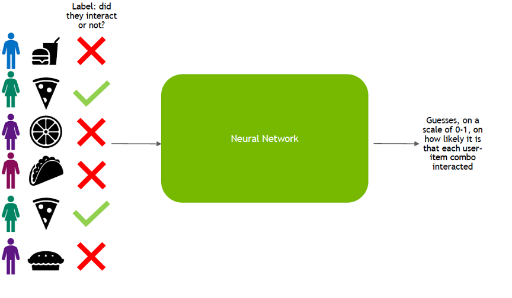

## Table of Contents

## What is a recommendation system and why is it important in machine learning?

A recommendation system is a type of machine learning model that suggests items or content to users based on their past behavior or preferences. For example, when you watch a movie on Netflix, the platform might suggest other movies you might like. These systems analyze large amounts of data to find patterns and make predictions about what a user might enjoy next. They use algorithms to match users with items, making the experience more personalized and enjoyable.

Recommendation systems are important in machine learning because they help businesses improve customer satisfaction and increase sales. By suggesting relevant products or content, companies can keep users engaged and coming back for more. This not only enhances the user experience but also helps businesses understand their customers better. For instance, if a user frequently buys books from a certain genre, the system can recommend similar books, leading to more sales and a happier customer. Overall, recommendation systems play a crucial role in making technology more user-friendly and tailored to individual needs.

## How do collaborative filtering methods work in recommendation systems?

Collaborative filtering methods in recommendation systems work by looking at the behavior of many users to make suggestions. Imagine you and your friends rate movies. If you both like similar movies, the system might suggest a movie your friend liked but you haven't seen yet. This method doesn't need to know anything about the movies themselves, just how people rate them. It's like getting advice from a large group of people with similar tastes.

There are two main types of collaborative filtering: user-based and item-based. In user-based filtering, the system finds other users with similar preferences to you and recommends items they liked. For example, if User A and User B both liked movies X and Y, and User A also liked movie Z, the system might suggest movie Z to User B. In item-based filtering, the system looks at the items you've liked and finds other items that are often liked by people who liked those items. So, if many people who liked movie X also liked movie Y, the system might recommend movie Y to someone who liked movie X.

Both methods use a similarity measure, often calculated using a formula like cosine similarity. The formula for cosine similarity between two vectors $$ \mathbf{u} $$ and $$ \mathbf{v} $$ is $$ \text{similarity} = \frac{\mathbf{u} \cdot \mathbf{v}}{\|\mathbf{u}\| \|\mathbf{v}\|} $$. This helps the system figure out how similar users or items are, making the recommendations more accurate and helpful.

## What are the differences between content-based and collaborative filtering recommendation systems?

Content-based recommendation systems work by understanding the features of items a user has liked in the past. For example, if you enjoy movies with action scenes and a specific actor, the system will look for other movies with similar features. It builds a profile of your preferences based on the content of the items you've enjoyed. This means the system needs to know a lot about the items, like their genres, actors, and other details. Content-based systems are good at recommending items similar to what you've already liked, but they might not introduce you to new types of items.

Collaborative filtering, on the other hand, focuses on the behavior of other users. It doesn't need to know anything about the items themselves, just how people interact with them. If many users who liked the same movies as you also liked another movie, the system might recommend that movie to you. There are two types of collaborative filtering: user-based and item-based. User-based looks at other users with similar tastes, while item-based looks at items that are liked by people with similar tastes. Collaborative filtering can introduce you to new types of items, but it relies heavily on having enough data from other users.

Both methods have their strengths and weaknesses. Content-based systems are great for when you want more of the same, but they might keep you in a bubble of similar items. Collaborative filtering can help you discover new things, but it needs a lot of user data to work well. Sometimes, recommendation systems use a mix of both methods to give the best suggestions, balancing familiarity with new discoveries.

## Can you explain the basic concepts of LightGCN and its advantages in recommendation systems?

LightGCN, which stands for Light Graph Convolutional Network, is a type of recommendation system that uses a graph to understand how users and items are connected. Imagine a big web where users and items are like dots, and the lines between them show which users liked which items. LightGCN looks at this web to find patterns and suggest items. It's simpler than other graph-based methods because it doesn't use extra steps to change the data, which makes it faster and easier to use.

One of the big advantages of LightGCN is that it's very efficient. It doesn't need a lot of complicated steps to work, so it can run quickly even on large datasets. This means it can give good recommendations without taking a long time. Also, because it's simple, it's easier to understand why it makes certain suggestions, which is helpful for improving the system. Overall, LightGCN is a powerful tool for recommendation systems because it balances speed, simplicity, and effectiveness.

## How does CPE (Collaborative Personalized Embedding) enhance recommendation system performance?

CPE, or Collaborative Personalized Embedding, helps make recommendation systems better by combining the strengths of both collaborative filtering and content-based methods. It looks at how users interact with items and also considers the features of those items. This means CPE can suggest items that are similar to what you've liked before, but it also uses information about the items themselves to make more accurate recommendations. By doing this, CPE can give you suggestions that are both familiar and new, making your experience more enjoyable.

One of the main ways CPE improves performance is by creating personalized embeddings for each user. An embedding is like a special code that represents a user or an item in a way that a computer can understand. CPE uses these embeddings to find similarities between users and items. For example, if two users have similar embeddings, they might like similar things. This helps the system suggest items that are more likely to be interesting to you. By using both user behavior and item features, CPE can make better recommendations than systems that only use one type of information.

## What is ComiRec and how does it incorporate both implicit and explicit feedback?

ComiRec is a recommendation system that uses both implicit and explicit feedback to suggest items to users. Implicit feedback is information about what users do, like watching a movie or buying a product. Explicit feedback is what users say, like giving a rating or writing a review. ComiRec combines these two types of feedback to understand what users like better. It looks at what users do and what they say to make more accurate recommendations.

ComiRec uses a special way to handle both types of feedback. It uses a formula to combine them, making sure that both are important in deciding what to recommend. For example, if a user watches a lot of action movies (implicit feedback) but gives high ratings to romantic movies (explicit feedback), ComiRec will consider both to suggest a mix of action and romantic movies. This way, ComiRec can give better suggestions by understanding the full picture of a user's preferences.

## How does SmeLU (Smooth and Efficient Learning Unit) improve the training of recommendation models?

SmeLU, which stands for Smooth and Efficient Learning Unit, is a special way to help recommendation models learn better. It makes the training process smoother and faster by using a new type of function called SmeLU. This function helps the model understand the data more easily, which means it can learn from the data without getting stuck or making big jumps. SmeLU is designed to be simple and work well with large amounts of data, making it perfect for recommendation systems that need to handle lots of information about users and items.

The main way SmeLU improves training is by making the learning process more stable. Imagine trying to climb a hill but the path keeps changing. SmeLU is like smoothing out the path so you can climb more easily. It does this by using a formula that gently adjusts how the model learns. The SmeLU function is $$ \text{SmeLU}(x) = x \cdot \sigma(x) $$, where $$ \sigma(x) $$ is the sigmoid function. This formula helps the model make small, smooth changes, which leads to better and faster learning. By using SmeLU, recommendation models can train more efficiently and give better suggestions to users.

## What are the key features of FM (Factorization Machines) and how do splines enhance their capabilities in recommendation systems?

Factorization Machines (FM) are a type of [machine learning](/wiki/machine-learning) model used in recommendation systems. They are good at handling lots of data and finding patterns in it. FM can work with different types of information, like what users do and what they say about items. They use a special way of breaking down the data into smaller parts, which helps them understand how different things are connected. For example, FM can see how a user's rating of a movie is affected by both the movie's genre and the user's past behavior. This makes FM very flexible and useful for making good recommendations.

Splines make FM even better by adding a way to handle data that changes smoothly over time. Imagine you're trying to guess how much someone will like a movie based on when they watched it. Splines help by creating a smooth curve that fits the data better. They do this by using a formula called a spline function, which can bend and twist to match the data more closely. By adding splines to FM, the model can understand how user preferences change over time, making the recommendations more accurate and up-to-date. This combination of FM and splines helps recommendation systems give better suggestions by considering both the big picture and the small details.

## How can you evaluate the performance of a recommendation system?

To evaluate the performance of a recommendation system, you can use different measures that look at how well the system suggests items to users. One common way is to check the accuracy of the recommendations. This means seeing if the items the system suggests are actually liked by the users. You can do this by using measures like precision and recall. Precision tells you how many of the recommended items were actually good suggestions, while recall tells you how many of the good items were actually recommended. For example, if a system suggests 10 movies and the user likes 8 of them, the precision is 80%. If there were 20 good movies in total and the system suggested 8 of them, the recall is 40%.

Another way to evaluate a recommendation system is by looking at how well it keeps users interested and coming back. This can be measured by metrics like click-through rate (CTR) and user engagement. CTR is the percentage of times users click on a recommended item, which shows if the suggestions are interesting. User engagement can be measured by how long users spend on the platform or how often they come back. These metrics help you understand if the recommendations are making the user experience better. By combining accuracy measures with engagement metrics, you can get a full picture of how well a recommendation system is working.

## What are some common challenges and solutions in deploying recommendation systems at scale?

Deploying recommendation systems at scale presents several challenges, one of which is handling large amounts of data efficiently. As the number of users and items grows, the system needs to process and analyze vast datasets in real-time to provide timely and relevant suggestions. This can strain computational resources and slow down the system. Another challenge is maintaining the quality of recommendations as the system scales. With more data, the risk of noise and irrelevant information increases, which can lead to poor recommendations. Additionally, ensuring the system can adapt to changing user preferences over time is crucial but difficult at scale.

To address these challenges, several solutions can be implemented. For handling large datasets, techniques like distributed computing and data partitioning can be used. Distributed computing involves spreading the workload across multiple machines, allowing the system to process data more quickly. Data partitioning breaks the data into smaller, manageable chunks, which can be processed independently. To maintain recommendation quality, algorithms like LightGCN or Factorization Machines (FM) can be employed. LightGCN uses a simple yet effective graph-based approach to find patterns in user-item interactions, while FM can handle different types of data and find complex relationships. To adapt to changing preferences, incorporating time-aware models, such as those using splines in FM, can help the system learn and adjust recommendations based on recent user behavior.

## Can you discuss advanced techniques like multi-task learning in recommendation systems?

Multi-task learning in recommendation systems is a smart way to make the system better at suggesting things to users. It works by training the system to do more than one job at the same time. For example, the system might learn to predict what movies a user will like and also guess how they will rate those movies. By doing both tasks together, the system can use information from one task to help with the other. This makes the recommendations more accurate because the system gets a fuller picture of what users want. Imagine you're trying to learn math and science at the same time. Learning about numbers in math can help you understand measurements in science better. That's how multi-task learning helps recommendation systems.

One way to do multi-task learning is by using a shared model that has different parts for each task. The shared part learns things that are useful for all tasks, like understanding user preferences. Then, each task has its own special part that focuses on that task alone. For example, the shared part might learn that a user likes action movies, and the rating prediction part might use that to guess how they will rate a new action movie. The recommendation part might use the same information to suggest other action movies. This way, the system can use what it learns from one task to help with another, making the whole system smarter and more helpful.

## What future trends and research directions are emerging in the field of recommendation systems?

In the future, recommendation systems are likely to become even smarter and more personalized. One big trend is the use of more advanced [artificial intelligence](/wiki/ai-artificial-intelligence) techniques, like [deep learning](/wiki/deep-learning) and [reinforcement learning](/wiki/reinforcement-learning). These methods can help the system understand user preferences better by learning from lots of data over time. For example, deep learning can find complex patterns in what users like, while reinforcement learning can help the system learn from its mistakes and get better at making suggestions. Another trend is the integration of more types of data, like social media activity and real-time user behavior, to make recommendations more relevant and timely. This means the system can use not just what you've done in the past, but also what you're doing right now to suggest things you might like.

Another important direction for research is making recommendation systems more fair and transparent. Right now, some systems might suggest things based on what they think you'll like, but they might not explain why. Future systems might need to be more open about how they make decisions, so users can trust them more. Also, researchers are working on ways to make sure the recommendations are fair and don't leave out certain groups of people. This means the system should suggest things to everyone in a way that's equal and doesn't favor one group over another. By focusing on these areas, recommendation systems can become more helpful, trustworthy, and inclusive for everyone.