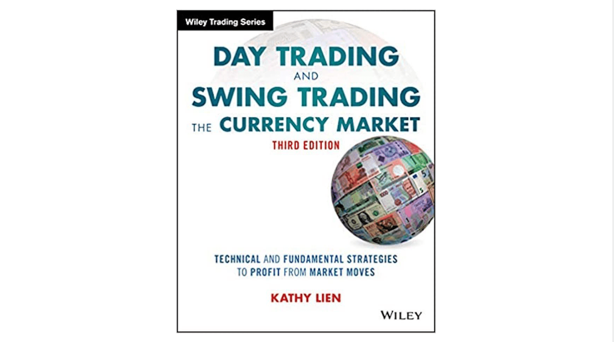

In today's fast-paced financial world, trading has become an essential skill for investors seeking to maximize their returns. With numerous financial markets available for trading, forex trading, in particular, stands out due to its significant potential for profitability and accessibility to individual investors. The forex market operates 24 hours a day, enabling traders to engage in buying and selling foreign currencies globally. Its high liquidity and leverage options make it an attractive choice for those looking to capitalize on currency price fluctuations.

For beginners, navigating the vast landscape of forex can be challenging without the right guidance and resources. Forex trading requires a solid understanding of market dynamics, currency pairs, and strategic planning to mitigate risks and enhance the chances of success. Thus, having access to essential trading guides and beginner books on forex is crucial for anyone starting in this field. These resources provide foundational knowledge, helping new traders understand complex concepts more easily.



In addition to traditional trading methods, the emerging field of algorithmic trading offers another avenue towards trading success. Algorithmic trading uses computer algorithms to automate trading decisions, which can enhance efficiency and reduce emotional biases. Understanding algorithmic trading principles can provide a competitive edge, particularly in high-frequency and volatile markets like forex.

This article aims to provide a comprehensive overview of key resources that can set you on the path to trading success. It explores crucial trading guides, recommended beginner books on forex trading, and the evolving role of algorithmic trading. Whether you are a novice trader eager to learn the basics or someone looking to explore advanced trading techniques, the information provided herein will equip you with the necessary insights to enhance your trading acumen.

## Table of Contents

## Trading Guides: A Beginner's Roadmap

Understanding the fundamentals of trading is a necessary step for anyone interested in exploring forex markets. Trading guides are valuable resources that provide structured insights into trade mechanics, strategies, and risk management. By starting with these guides, beginners create a solid foundation that allows them to grasp more complex market concepts later.

A good trading guide will typically cover the essential forms of analysis used in trading: technical analysis and [fundamental analysis](/wiki/fundamental-analysis). Technical analysis involves evaluating securities based on statistical trends extracted from trading activity, such as price movement and volume. Common tools used in technical analysis include moving averages and relative strength index (RSI). For instance, moving averages can help identify the direction of a trend by smoothing out price data over a set period, often aiding traders in making buy or sell decisions.

Fundamental analysis, on the other hand, focuses on understanding the intrinsic value of a currency by considering economic factors, political events, and other macroeconomic indicators. This analysis helps traders predict potential currency movements based on news releases and economic reports, such as changes in interest rates or employment data.

Risk management is another key component addressed in trading guides. Effective risk management involves strategies to minimize potential losses while maximizing gains. Techniques such as setting stop-loss orders and determining position sizing are critical. A stop-loss order allows traders to specify a price at which their position will be automatically closed to prevent further losses. Position sizing involves determining the amount of capital to risk on a trade, often calculated using metrics like the Kelly Criterion, which considers the probability of winning a trade and the ratio of profit to loss.

Beyond these components, trading guides also introduce various trading strategies, each suited to different market conditions and trader preferences. Common strategies include [day trading](/wiki/day-trading-spy), swing trading, and [trend following](/wiki/trend-following). Day trading involves buying and selling within the same day to capitalize on short-term price movements. Swing trading holds positions for several days, aiming to profit from intermediate price shifts. Trend following seeks to invest in the direction of the prevailing market trend, often using indicators like moving averages to confirm the trend's strength.

As traders gain confidence with the basics outlined in these guides, they can progress to more specialized resources and [books](/wiki/algo-trading-books) specific to the [forex](/wiki/forex-system) market. This foundational knowledge enables them to navigate the complexities of trading effectively, make informed decisions, and potentially enhance their financial success.

## Top Books for Forex Trading Beginners

Books remain one of the best ways to gain in-depth knowledge about forex trading. For newcomers eager to understand the intricacies of the forex market, "Currency Trading for Dummies" and "Forex Trading: The Basics Explained in Simple Terms" are invaluable resources. These titles are designed to break down complex forex concepts into easily digestible information, making the subject accessible to those without a background in finance.

"Currency Trading for Dummies" serves as an excellent introductory text, covering a broad spectrum of trading elements that are fundamental for understanding forex markets. It explains the mechanics of forex trading, including critical concepts like leverage, currency pairs, and the role of central banks. The book also offers a foundational understanding of both technical and fundamental analysis, allowing readers to interpret market trends and make informed trading decisions.

Similarly, "Forex Trading: The Basics Explained in Simple Terms" simplifies the learning process by focusing on essential aspects of forex trading. This book highlights market psychology and emphasizes the importance of developing a disciplined trading approach. It also introduces technical charts and indicators, providing practical trading tips that beginners can apply immediately.

Each book delivers unique insights—not only focusing on the factual and technical side but also exploring the psychological components of trading. Understanding market sentiment and trader psychology is crucial, as these elements significantly influence currency price movements. Moreover, practical tips embedded within these books aid traders in avoiding common pitfalls and improving their trading strategies.

By reading a variety of books on forex trading, beginners can cultivate a comprehensive understanding of the market. This broad perspective helps in recognizing different trading styles and strategies, enabling traders to tailor their approaches to suit their individual goals and risk tolerance. Engaging with these resources equips aspiring traders with the knowledge needed to navigate the forex market effectively.

## The Role of Algorithmic Trading in Modern Forex

Algorithmic trading, often referred to as algo trading, is revolutionizing forex trading by leveraging technology and advanced algorithms to enhance trading strategies. The core advantage of [algorithmic trading](/wiki/algorithmic-trading) lies in its ability to automate various trading processes, thereby increasing efficiency and speed. This automation means trades can be executed within milliseconds, a critical capability in the fast-paced foreign exchange market. This precision and speed make algorithmic trading particularly advantageous in high-frequency trading environments, where the rapid execution of large orders can capitalize on small price changes.

In forex trading, algorithms are designed to follow a set of predefined rules that decide various aspects of a trade, such as timing, price, and [volume](/wiki/volume-trading-strategy). These algorithms work by analyzing real-time data and market conditions, then executing trades based on the analysis. This provides traders with a significant competitive edge, allowing them to manage multiple trading accounts simultaneously and reducing the potential for human error. 

Books such as "Algorithmic Trading: Winning Strategies and Their Rationale" offer detailed explanations on the mechanisms behind algo trading. They discuss how algorithms can assess and react to market cues more effectively than manual strategies. Such resources explain the use of statistical models and data analysis techniques, like regression analysis, which can predict price movements and trading signals. For instance, a simple moving average crossover strategy can be automated to buy when the shorter-term moving average crosses above a longer-term one and sell when it crosses below.

Here's an example of how a basic moving average crossover strategy could be implemented in Python:

```python
import pandas as pd
import numpy as np

# Load forex data into a pandas DataFrame
data = pd.read_csv('forex_data.csv')

# Calculate moving averages
data['Short_MA'] = data['Close'].rolling(window=40).mean()
data['Long_MA'] = data['Close'].rolling(window=100).mean()

# Generate signals
data['Signal'] = 0
data['Signal'][40:] = np.where(data['Short_MA'][40:] > data['Long_MA'][40:], 1, -1)

# Calculate positions
data['Position'] = data['Signal'].diff()

# Print the first few rows
print(data.head())
```

The above code demonstrates a simple algorithmic trading strategy that can be used to automate trading decisions. More sophisticated strategies might incorporate additional indicators or [machine learning](/wiki/machine-learning) techniques to improve accuracy and adapt to different market conditions.

Understanding these automated strategies equips traders with a powerful toolset essential for modern forex trading success. As technology and market conditions continue to evolve, mastering algorithmic trading becomes increasingly important for those aiming to maintain a competitive edge in forex markets.

## Benefits and Challenges of Algorithmic Trading

Algorithmic trading offers substantial advantages over traditional manual trading approaches. One of the primary benefits is the reduction of emotional bias. Human traders can fall prey to emotional influences, which may lead to impulsive decisions and erratic trading patterns. In contrast, algorithmic trading is based on pre-defined rules and quantitative models, ensuring that trades are executed without the influence of emotions, thereby promoting more disciplined and consistent trading strategies.

Quicker execution is another significant advantage of algorithmic trading. Algorithms can respond to market changes within milliseconds, enabling traders to capitalize on fleeting market opportunities that would be impossible for human traders to exploit in real-time. This speed is particularly beneficial in high-frequency trading environments, where rapid order execution is critical for profitability.

Improved accuracy is also a noteworthy benefit, as algorithms can process vast amounts of data and execute trades with high precision. This meticulous attention to detail minimizes errors and enhances the reliability of trading strategies.

Despite these advantages, algorithmic trading is not without its challenges. The technical complexity of developing and maintaining trading algorithms requires a solid understanding of programming, financial markets, and quantitative methods. New traders might find the initial learning curve steep, necessitating education and training to build a competent skill set.

Moreover, precise data analysis is crucial, as the success of algorithmic trading heavily relies on the quality and integrity of the data used in the models. Inaccurate or incomplete data can lead to suboptimal trading decisions and potential financial losses.

Educational resources, such as books on algorithmic trading, frequently address these challenges by offering strategies for effective implementation and risk management. They provide insights into constructing robust trading algorithms and navigating technological hurdles. For example, strategies might include [backtesting](/wiki/backtesting) algorithms with historical data to identify and rectify potential weaknesses before deploying them in live markets.

Ultimately, traders must carefully evaluate the advantages and challenges of algorithmic trading to determine if it aligns with their trading style and objectives. The complexities involved might not suit every trader, especially those who prefer intuitive or discretionary trading methods. However, for those who embrace the technological aspects and have a knack for data analysis, algorithmic trading can offer a significant edge in the competitive landscape of modern financial markets.

## Practical Steps to Get Started

When embarking on your trading journey, it's important to start with foundational guides that resonate with your learning style and align with your trading interests. These resources lay the groundwork by offering structured insights into market mechanics, trading strategies, and risk management.

As you establish your foundational knowledge, gradually incorporate more specialized books and courses. Focus on niches such as forex or algorithmic trading based on your specific goals. Resources like "Currency Trading for Dummies" or "Algorithmic Trading: Winning Strategies and Their Rationale" can significantly enhance your understanding. These books provide practical tips, technical analysis, and insights into sophisticated trading mechanisms, allowing you to deepen your expertise in targeted areas.

Utilizing trading simulators and demo accounts is crucial for practicing and honing your skills without financial risk. These platforms simulate real-market conditions, enabling you to test out strategies and understand market dynamics in a safe environment. Many brokerage firms offer free demo accounts, which can be an invaluable tool for beginners to gain experience and confidence before committing real capital.

Continuous learning and adaptation are essential components of successful trading. Staying informed about market trends, economic indicators, and evolving trading technologies is key to maintaining a competitive edge. Consider subscribing to financial news platforms, participating in online forums, and engaging with trading communities to stay updated. Additionally, exploring webinars and online courses can provide insights into new techniques and strategies. 

By combining foundational learning with practical application and ongoing education, you can effectively prepare yourself for a successful trading career.

## Conclusion

Navigating the trading world as a beginner can be daunting, but with the right resources, it becomes a rewarding endeavor. Trading guides and beginner books provide the essential knowledge needed to start, while algorithmic trading offers a glimpse into the future of trading. These resources act as a solid foundation, equipping aspiring traders with critical insights into market dynamics and strategies.

By familiarizing yourself with these recommended resources, you can enhance your trading acumen. Beginner books and guides offer structured learning pathways, breaking down complex concepts into manageable lessons, whereas algo trading introduces automation and analytical depth. 

Whether you choose manual trading or embrace algorithms, consistent practice and learning are vital for success. Utilizing demo accounts and trading simulators facilitates skill development without financial risk, while staying abreast of market trends ensures adaptability in a fast-changing environment. The journey of a trader is ongoing, requiring a commitment to continuous improvement and education.

## References & Further Reading

[1]: ["Currency Trading For Dummies"](https://www.amazon.com/Currency-Trading-Dummies-4th/dp/B0B75RCY7Z) by Kathleen Brooks and Brian Dolan

[2]: ["Forex Trading: The Basics Explained in Simple Terms"](https://www.amazon.com/FOREX-TRADING-Explained-Beginners-Strategies/dp/1535198567) by Jim Brown

[3]: ["Algorithmic Trading: Winning Strategies and Their Rationale"](https://www.wiley.com/en-us/Algorithmic+Trading%3A+Winning+Strategies+and+Their+Rationale-p-9781118460146) by Ernest P. Chan

[4]: Engle, R. F. (2002). ["NewFrontiers for ARCH Models."](https://onlinelibrary.wiley.com/doi/full/10.1002/jae.683) Journal of Applied Econometrics, 17(5), 425-446.

[5]: ["Technical Analysis of the Financial Markets: A Comprehensive Guide to Trading Methods and Applications"](https://www.amazon.com/Technical-Analysis-Financial-Markets-Comprehensive/dp/0735200661) by John J. Murphy