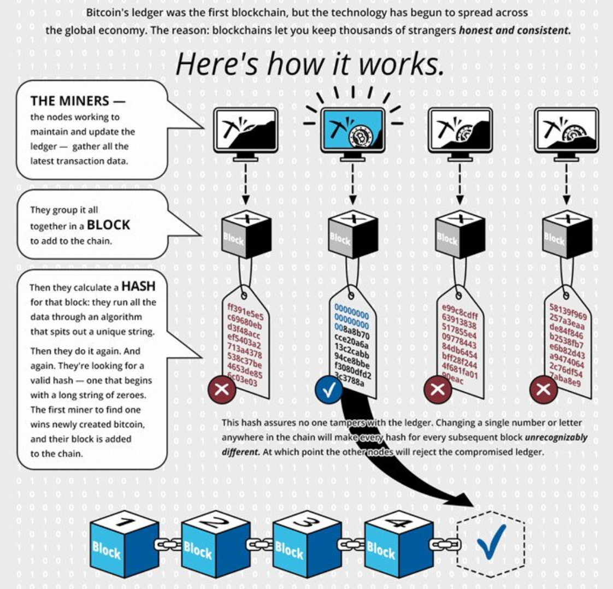

Understanding blockchain technology is essential in today's digital landscape as it provides a transformative approach to data transparency and security. As a decentralized digital ledger, blockchain is employed across various industries for its ability to securely record transactions. In the financial sector, blockchain's impact is evident through its application in cryptocurrencies, cross-border payments, and smart contracts, which streamline operations and reduce the risk of fraud. Supply chain management has also witnessed improvements, with blockchain enhancing traceability and accountability from origin to end-consumer, thereby boosting efficiency and trust.

This article explores the importance of learning blockchain technology and highlights influential literature that aids in understanding its foundational concepts. We examine its intersection with algorithmic trading, showcasing how blockchain is revolutionizing trading systems through enhanced transparency and security. Smart contracts automate processes, contributing to more efficient and reliable trading mechanisms. By gaining insights into these applications, readers can appreciate the vast potential of blockchain to redefine traditional systems and processes.



Get ready to explore foundational concepts and applications of blockchain, and understand how this technology is becoming a cornerstone in the evolution of various industries. Whether you're looking to harness blockchain expertise for professional growth or personal interest, understanding its applications is crucial in staying ahead in the rapidly evolving digital age.

## Table of Contents

## What is Blockchain Technology?

Blockchain technology is a decentralized digital ledger that facilitates the recording of transactions across a network of computers, ensuring that each participant possesses an identical copy of the ledger. This structure enhances data integrity and security by removing the need for a central authority to oversee or manage the ledger. At its core, blockchain consists of a series of blocks, each containing multiple transactions. When a new transaction is initiated, it is grouped together with other transactions into a block. This new block is then added to the chain, which all network participants authenticate and verify, resulting in an updated distributed ledger for all. 

The mechanics behind blockchain are designed to ensure transparency and immutability. Each block contains a cryptographic hash of the previous block, a timestamp, and transaction data, which links blocks together in a chronological order. The use of cryptographic hashing means that any modification to a block will alter its hash, consequently invalidating all subsequent blocks. This attribute underpins the security feature of blockchains, as any attempt to alter past transaction data would require consensus from a majority of the network participants, making such actions exceedingly difficult in practice.

Transparency is a fundamental advantage of blockchain technology. Since each transaction recorded on the blockchain is accessible to all participants, there is an inherent openness that deters fraudulent activity. Traditional models that rely on centralized databases are vulnerable to corruption and single points of failure, whereas blockchain's decentralized nature enhances trust among parties without requiring intermediaries.

Different consensus mechanisms are utilized in blockchain systems to achieve agreement on the network about the state of the ledger. Proof of Work (PoW) and Proof of Stake (PoS) are two widely adopted consensus algorithms. PoW involves network participants (miners) solving complex mathematical problems to validate transactions and create new blocks. PoS, on the other hand, assigns validation rights based on the number of coins a person holds, promoting energy efficiency by eschewing the computationally intensive tasks associated with PoW.

Understanding the technical structure and the consensus mechanisms of blockchain is crucial for harnessing its potential in various applications beyond cryptocurrencies. These include supply chain management, where blockchain can provide end-to-end visibility and enhance traceability, and healthcare, where it can secure patient data and streamline processes. Therefore, mastering blockchain technology offers significant leverage across different sectors by furnishing robust, transparent, and secure systems.

## Why Learn Blockchain Technology?

Blockchain technology is increasingly becoming a cornerstone of modern technological advancements, driving a demand for expertise that is reshaping tech careers. Its decentralized and secure nature offers transformative potential across various sectors, including finance, healthcare, and logistics. In the finance sector, blockchain facilitates secure and transparent transactions, reducing the need for intermediaries and thereby lowering costs. This efficiency and security are especially critical in areas such as international payments and smart contracts, where traditional systems often fall short.

In healthcare, blockchain can revolutionize the way patient data is handled, offering a secure and immutable method for storing medical records. This ensures that sensitive information is not only secure but also accessible to authorized parties across different medical institutions, enhancing coordination and accuracy in patient care. Similarly, the logistics industry can leverage blockchain to improve supply chain transparency by providing real-time tracking of goods, minimizing fraud, and ensuring the authenticity of transactions through tamper-proof records.

The growing integration of blockchain in such diverse domains underscores its importance as a skill set. For technology professionals, acquiring proficiency in blockchain not only enhances career prospects but also positions them as pioneers of innovative solutions. As more industries begin to explore the benefits of blockchain, the ability to design and implement blockchain-based systems becomes a valuable asset.

Furthermore, blockchain knowledge isn't limited to professional applications; it also invites personal exploration and development. Understanding blockchain fosters a deeper appreciation of how digital systems are evolving and encourages participation in groundbreaking technological advancements. Whether entering a blockchain-specific career or integrating blockchain solutions into existing roles, the opportunities and insights gained from mastering blockchain are vast and promising. 

Learning blockchain is a strategic step toward building a future-proof career while contributing to the ongoing digital transformation across global industries. The versatility and potential of blockchain make it a compelling technology for both current professionals and those aspiring to enter tech-related fields.

## Top Books for Learning Blockchain

Books provide a structured and comprehensive way to understand complex blockchain concepts. As the field of blockchain technology grows, having access to well-regarded resources can significantly enhance one's understanding. Some of the top [books](/wiki/algo-trading-books) in this domain are highly recommended for both beginners and those with a programming background.

"Mastering Bitcoin" by Andreas M. Antonopoulos is a foundational text for anyone interested in understanding the blockchain technology that underlies cryptocurrencies. This book offers a clear and in-depth explanation of Bitcoin's architecture and its potential impact on various industry sectors. It also covers basic cryptographic concepts and practical examples of how Bitcoin operates, making it a valuable resource for both newcomers and seasoned professionals.

"Blockchain Basics" by Daniel Drescher presents an accessible introduction to understanding blockchain. This book takes readers through 25 sequential steps that are designed to unravel the complexities of blockchain technology. By using a structured approach, Drescher ensures that the reader can build a solid conceptual foundation, regardless of their prior experience in computer science or cryptography.

For those interested in the programming side, "The Blockchain Developer" by Elad Elrom is essential. This book is particularly geared toward developers who wish to dive into coding applications using blockchain technologies. It covers key aspects of blockchain development, including design patterns, best practices, and practical frameworks for building robust blockchain applications.

These books are excellent starting points for anyone looking to gain a comprehensive understanding of blockchain technology and its myriad applications across different sectors.

## Blockchain and Algorithmic Trading

Algorithmic trading, commonly referred to as algo trading, leverages computer algorithms designed to execute trades at high speeds and volumes, based on predefined criteria. This technology has revolutionized financial markets by facilitating rapid and automated trading without the need for human intervention. Integrating blockchain technology into [algorithmic trading](/wiki/algorithmic-trading) processes introduces a layer of enhanced transparency and security, addressing some of the critical challenges traditionally faced in the sector.

Blockchain's decentralized nature ensures that every transaction is recorded across multiple nodes in a network. This transparency reduces the possibility of fraud as all participants have access to immutable transaction records, providing a reliable audit trail. For algo traders, this means less risk of manipulation and more trust in the integrity of market activities.

Smart contracts, operating on blockchain platforms, further augment algorithmic trading by automating the execution of trades when specific conditions are met. These self-executing contracts reduce the need for intermediaries, thereby minimizing delays and errors in transactions. For instance, a smart contract could be programmed to automatically buy a stock when its price falls below a certain threshold and sell when it rises above another, all without direct human involvement. This automation enhances the overall efficiency and speed of trading operations.

The fusion of blockchain technology with algorithmic trading not only streamlines the execution of trades but also introduces significant advancements for financial markets. By facilitating more secure and efficient trade executions, this combination serves to attract more participants and increase market [liquidity](/wiki/liquidity-risk-premium). As blockchain adoption grows within financial sectors, its potential to transform algorithmic trading will likely continue to expand, pushing the boundaries of what is possible in modern trading systems.

## Implementing Blockchain in Trading Strategies

Integrating blockchain technology within algorithmic trading can provide significant competitive advantages for financial institutions and individual traders alike. At its core, blockchain's decentralized nature enhances real-time settlements, fundamentally altering how trading systems operate. By reducing the reliance on intermediaries, blockchain improves the speed and efficiency of trades. Traditional trading systems often involve multiple parties and layers of verification, leading to delays. Blockchain, on the other hand, enables peer-to-peer transactions that are verified and settled almost instantaneously because each transaction is recorded on a distributed ledger that is automatically updated in real-time.

One of the most profound benefits of using blockchain in trading strategies is the reduction of transaction costs. By eliminating or reducing the role of intermediaries, such as brokers and clearinghouses, blockchain can lower the fees associated with trading, offering a direct channel between buyer and seller. This not only reduces costs but also diminishes the risk of errors and fraud as transactions are secured by cryptographic methods inherent to blockchain technology. The transparency of blockchain allows for precise auditing and tracking of every transaction, thereby enhancing data accuracy and trustworthiness.

Moreover, strategies that leverage blockchain can significantly improve data integrity and reliability. Each transaction is timestamped and linked to the previous transaction, thereby creating an immutable chain of records. This integrity ensures that all participants have access to the same verified dataset, which is crucial for algorithmic trading where decisions are made based on real-time data analytics. 

To maintain a competitive edge, traders and developers must stay updated on the evolving blockchain landscape. The rapid pace of innovation in blockchain technology means that new tools, protocols, and platforms are constantly emerging. Engaging with these advancements requires a proactive approach to learning and adaptation. For example, Python libraries such as `web3.py` allow developers to interact with the Ethereum blockchain, enabling the creation of smart contracts and decentralized applications (dApps). These smart contracts can automate complex trading strategies, reducing the need for manual intervention and further enhancing trading efficiency.

```python
from web3 import Web3

# Example of connecting to a blockchain network and retrieving the latest block number
# Ensure you have a web3 provider like Infura or Alchemy for network access

infura_url = "YOUR_INFURA_PROJECT_URL"
web3 = Web3(Web3.HTTPProvider(infura_url))

if web3.isConnected():
    latest_block = web3.eth.block_number
    print(f'Connected to Ethereum network. Latest block number is {latest_block}')
else:
    print('Connection failed')
```

By understanding and implementing blockchain technologies, traders can optimize their algorithmic strategies and adapt to an ever-changing market landscape, thus ensuring strategic advantage and operational efficiency.

## Future Trends in Blockchain and Trading

The future landscape of blockchain in trading is poised to evolve significantly with the enhancement of security protocols and the acceleration of transaction times. As blockchain technology matures, there is a concerted effort to bolster its security features. This involves the development and implementation of more sophisticated cryptographic techniques and consensus mechanisms designed to prevent threats such as Sybil attacks and double-spending. By building stronger security frameworks, blockchain-based trading platforms can offer increased protection against malicious activities, thereby fostering greater trust among users.

Additionally, there is a focus on minimizing latency in transaction processes, leveraging blockchain's decentralized nature to facilitate near-instantaneous settlements. This is particularly relevant in high-frequency trading environments where even microsecond delays can impact profitability. As blockchain protocols are refined, we can expect transaction speeds to improve, thus allowing traders to execute orders more quickly and efficiently.

Emergent technologies like Decentralized Finance (DeFi) are gaining significant traction and exemplify blockchain's potential to transform trading. DeFi leverages blockchain to remove traditional financial intermediaries, enabling direct peer-to-peer transactions. This not only democratizes access to financial services but also introduces novel trading possibilities such as decentralized exchanges and automated market makers. As DeFi continues to expand, it presents innovative solutions that could redefine traditional trading paradigms.

Furthermore, institutional adoption of blockchain is on the rise as organizations seek to streamline operations and enhance the security of trading platforms. By integrating blockchain into their systems, institutions can automate processes, reduce operational costs, and ensure transparency and traceability of transactions. This adoption is not limited to financial entities; supply chain management, healthcare, and insurance sectors are also recognizing the benefits of blockchain integration.

Staying informed about these trends is crucial for both traders and technology enthusiasts. As blockchain continues to evolve, those who are knowledgeable about emerging developments can better leverage new opportunities and adapt to technological advancements. Regular engagement with up-to-date resources, participation in industry events, and practical experimentation can be invaluable for keeping pace with the fast-moving blockchain and trading landscape.

## Conclusion

Blockchain technology is redefining industries and forming the backbone of future innovations. It provides a decentralized framework that is being rapidly adopted across various sectors due to its transparency, security, and efficiency. By learning blockchain, individuals can unlock numerous career opportunities and contribute to technological advancements that are reshaping the global economic landscape. This is particularly pertinent in fields such as finance, healthcare, supply chain management, and beyond.

Books offer invaluable resources for those wishing to deepen their understanding of blockchain. Titles like "Mastering Bitcoin" by Andreas M. Antonopoulos and "Blockchain Basics" by Daniel Drescher provide structured insights into the complexities of blockchain technology, catering to both beginners and seasoned professionals. These resources equip readers with the knowledge to harness blockchain's potential and contribute meaningfully to innovative projects.

Furthermore, blockchain's integration with algorithmic trading illustrates its transformative impact on finance. Utilizing blockchain in trading systems enhances transparency and reduces fraud risks, while smart contracts streamline trading operations. This confluence of technologies represents a significant leap forward, offering improved efficiency and reliability in financial transactions.

In conclusion, embracing blockchain learning is a step towards engaging with the future of technology. As blockchain continues to evolve, its role in driving innovation and enabling secure, efficient processes will only grow stronger. By staying informed and equipped with the right knowledge, individuals can not only seize emerging opportunities but also play a role in shaping the technological future.

## References & Further Reading

[1]: Antonopoulos, A. M. (2017). ["Mastering Bitcoin: Unlocking Digital Cryptocurrencies"](https://books.google.com/books/about/Mastering_Bitcoin.html?id=IXmrBQAAQBAJ). O'Reilly Media.

[2]: Drescher, D. (2017). ["Blockchain Basics: A Non-Technical Introduction in 25 Steps"](https://link.springer.com/book/10.1007/978-1-4842-2604-9). Apress.

[3]: Elrom, E. (2019). ["The Blockchain Developer: A Practical Guide for Designing, Implementing, Publishing, Testing, and Securing Distributed Blockchain-based Projects"](https://link.springer.com/book/10.1007/978-1-4842-4847-8). Apress.

[4]: Nakamoto, S. (2008). ["Bitcoin: A Peer-to-Peer Electronic Cash System."](https://nakamotoinstitute.org/library/bitcoin/) Bitcoin.org.

[5]: Mougayar, W. (2016). ["The Business Blockchain: Promise, Practice, and Application of the Next Internet Technology"](https://books.google.com/books/about/The_Business_Blockchain.html?id=CEsPDAAAQBAJ). Wiley.