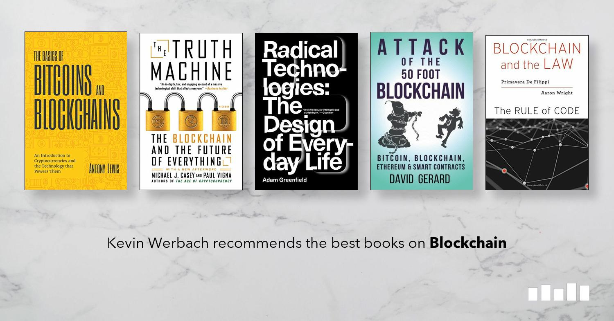

## Table of Contents

## What is blockchain technology and why is it important?

Blockchain technology is a way to store information in a way that is very hard to change or cheat. Imagine a digital notebook where every page is a record of something, like a money transfer. Once a page is written, it's locked and added to the book. Each page also has a special code that connects it to the page before it, making a chain. This chain is kept on many computers, so no single person can control it. This makes it very safe and trustworthy.

This technology is important because it can make things like money transfers, contracts, and record-keeping more secure and transparent. For example, with blockchain, you can send money to someone without needing a bank in the middle. This can be faster and cheaper. Also, because the information is hard to change, it's good for keeping important records, like property deeds or medical records, safe and accurate. This can help reduce fraud and mistakes, making many systems work better and more fairly.

## What are the best beginner-friendly books on blockchain technology?

If you're new to blockchain technology and want to learn more, "Blockchain Basics: A Non-Technical Introduction in 25 Steps" by Daniel Drescher is a great book to start with. It explains blockchain in simple terms, using everyday examples. The book breaks down complex ideas into easy-to-understand steps, making it perfect for beginners who might feel overwhelmed by technical jargon.

Another good choice is "Blockchain For Dummies" by Tiana Laurence. This book is part of the popular "For Dummies" series, known for making complex topics easy to grasp. It covers the basics of blockchain, how it works, and why it's important, all in a friendly and approachable way. It's great for anyone who wants a clear, straightforward introduction to the subject without getting bogged down in technical details.

## Which books provide a good introduction to the basics of blockchain?

"Blockchain Basics: A Non-Technical Introduction in 25 Steps" by Daniel Drescher is a great book for beginners. It explains blockchain in a way that is easy to understand. The book uses simple examples and breaks down the complex ideas into 25 easy steps. This makes it perfect for someone who is new to blockchain and might feel overwhelmed by technical terms.

Another good book is "Blockchain For Dummies" by Tiana Laurence. This book is part of the "For Dummies" series, which is known for making hard topics simple. It covers what blockchain is, how it works, and why it matters. The language is friendly and easy to follow, so it's a good choice for anyone starting to learn about blockchain without wanting to dive into the technical details.

## What books cover the history and evolution of blockchain technology?

"The Bitcoin Standard: The Decentralized Alternative to Central Banking" by Saifedean Ammous is a great book that talks about the history and evolution of blockchain technology. It focuses on Bitcoin, the first use of blockchain, and how it came to be. The book explains how Bitcoin was created and why it's important. It also talks about how blockchain technology changed over time and its impact on the world of money and finance.

Another good book is "Blockchain Revolution: How the Technology Behind Bitcoin and Other Cryptocurrencies is Changing the World" by Don Tapscott and Alex Tapscott. This book looks at how blockchain technology started with Bitcoin and then grew into many different areas. It explains the history of blockchain and how it's being used now in things like business, government, and more. The book is easy to read and gives a good picture of how blockchain has evolved and where it might go in the future.

## Which books are recommended for understanding the technical aspects of blockchain?

"Mastering Bitcoin: Unlocking Digital Cryptocurrencies" by Andreas M. Antonopoulos is a great book for learning about the technical side of blockchain. It explains how Bitcoin works, including the details of the blockchain itself. The book talks about things like how transactions are made, how they are verified, and how the whole system stays safe and secure. It's written in a way that someone new to the technical stuff can still understand it, but it goes deep enough to really get into the details.

Another good book is "Blockchain: Blueprint for a New Economy" by Melanie Swan. This book looks at the technology behind blockchain and how it can be used in different ways. It explains the technical parts like how data is stored on the blockchain, how it's encrypted, and how smart contracts work. The book is a bit more advanced, but it's still written clearly so that someone who wants to learn more about the technical aspects of blockchain can follow along and understand it well.

## What are the top books for learning about smart contracts and decentralized applications?

"Mastering Ethereum: Building Smart Contracts and DApps" by Andreas M. Antonopoulos and Gavin Wood is a great book for learning about smart contracts and decentralized applications (DApps). It explains how to build these things on the Ethereum blockchain. The book covers the basics of smart contracts, how they work, and how to write them using a special language called Solidity. It also talks about how to create DApps, which are like apps but run on a blockchain. The book is detailed but still easy to understand, making it perfect for someone who wants to learn how to build on blockchain.

Another good book is "Hands-On Smart Contract Development with Solidity and Ethereum" by Kevin Solorio, Randall Kanna, and David H. Hoover. This book focuses on teaching you how to write smart contracts using Solidity. It's very hands-on, meaning it gives you lots of examples and exercises to practice. The book also talks about how to test and deploy your smart contracts on the Ethereum network. It's a great choice if you want to learn by doing and get practical experience with smart contracts and DApps.

## Which books discuss the economic and financial implications of blockchain technology?

"The Bitcoin Standard: The Decentralized Alternative to Central Banking" by Saifedean Ammous is a great book for understanding how blockchain technology, especially Bitcoin, affects money and the economy. It explains how Bitcoin works as a new kind of money that isn't controlled by governments or banks. The book talks about how this can change the way we think about money and how it might make our financial systems more fair and stable. It's easy to understand and gives a good picture of why blockchain technology is important for the economy.

Another good book is "Blockchain Revolution: How the Technology Behind Bitcoin and Other Cryptocurrencies is Changing the World" by Don Tapscott and Alex Tapscott. This book looks at how blockchain can change many different parts of our economy, not just money. It explains how businesses, governments, and even regular people can use blockchain to make things like contracts, records, and transactions more secure and transparent. The book is written in a simple way and shows how blockchain can make our financial systems work better and be more trustworthy.

## What are the best resources for in-depth case studies on blockchain implementations?

"Blockchain: Blueprint for a New Economy" by Melanie Swan is a great resource for in-depth case studies on blockchain implementations. The book explores how blockchain is being used in different areas like finance, healthcare, and even art. It gives detailed examples of how companies and organizations are using blockchain to solve real-world problems. For example, it talks about how blockchain can help with supply chain management, making it easier to track products from start to finish. The case studies are explained in a way that is easy to understand, even if you're new to blockchain.

Another good resource is "Blockchain Revolution: How the Technology Behind Bitcoin and Other Cryptocurrencies is Changing the World" by Don Tapscott and Alex Tapscott. This book also includes many case studies showing how blockchain is being used in practice. It covers examples from different industries, like how banks are using blockchain to make international money transfers faster and cheaper. The book explains these case studies clearly and shows how blockchain can improve efficiency and trust in various sectors. It's a great way to see how blockchain is making a real difference in the world.

## Which books are recommended for professionals looking to implement blockchain in their business?

"Blockchain Revolution: How the Technology Behind Bitcoin and Other Cryptocurrencies is Changing the World" by Don Tapscott and Alex Tapscott is a great book for professionals looking to implement blockchain in their business. It explains how blockchain can be used in many different areas, like finance, healthcare, and supply chain management. The book gives real examples of how companies are already using blockchain to solve problems and make things more efficient. It's written in a way that is easy to understand, so even if you're new to blockchain, you can see how it can help your business.

Another good book is "Blockchain: Blueprint for a New Economy" by Melanie Swan. This book also focuses on how businesses can use blockchain. It goes into detail about how blockchain can improve things like record-keeping, contracts, and transactions. The book includes case studies that show how different industries are using blockchain to make their operations better. It's a helpful resource for professionals who want to learn how to apply blockchain in their own business and see the benefits it can bring.

## What advanced books cover the security and privacy aspects of blockchain technology?

"Mastering Bitcoin: Unlocking Digital Cryptocurrencies" by Andreas M. Antonopoulos is a great book for learning about the security and privacy aspects of blockchain technology. It goes into detail about how Bitcoin and other cryptocurrencies keep your money safe. The book talks about things like how transactions are encrypted and how the blockchain makes it hard for people to cheat or steal. It also explains how you can keep your own information private when using blockchain. The book is written in a way that even if you're not a tech expert, you can understand how blockchain keeps things secure and private.

Another good book is "Blockchain: Blueprint for a New Economy" by Melanie Swan. This book looks at how blockchain can be used to keep data safe and private in many different areas, not just money. It explains how blockchain can help protect important information like medical records or property deeds. The book also talks about the risks and challenges of keeping things secure on a blockchain. It's written clearly so that professionals and anyone interested in how blockchain can improve security and privacy can learn from it.

## Which books explore the future trends and potential developments in blockchain?

"Blockchain Revolution: How the Technology Behind Bitcoin and Other Cryptocurrencies is Changing the World" by Don Tapscott and Alex Tapscott is a great book for learning about the future of blockchain. It talks about how blockchain might change many parts of our lives, like how we do business, vote, or even share information. The book explains how blockchain can make things more fair and open, and it gives examples of new ideas and projects that could happen in the future. It's easy to understand and shows how blockchain could keep growing and making a big difference.

Another good book is "The Internet of Money" by Andreas M. Antonopoulos. This book looks at how blockchain and cryptocurrencies like Bitcoin might shape our future. It talks about how these technologies could change the way we think about money and how we use it. The book also explores new ways blockchain could be used, like in smart contracts and decentralized apps. It's written in a way that makes it easy to see how blockchain could keep evolving and what that might mean for us all.

## What are the must-read books for blockchain experts and researchers?

"Mastering Bitcoin: Unlocking Digital Cryptocurrencies" by Andreas M. Antonopoulos is a must-read for blockchain experts and researchers. The book dives deep into the technical details of Bitcoin and blockchain, explaining how transactions work, how the network stays secure, and how to develop on the platform. It's a comprehensive resource that covers everything from the basics to advanced topics like smart contracts and decentralized applications. The book is written clearly, making it valuable for both beginners looking to become experts and seasoned professionals seeking a thorough understanding of the technology.

"Blockchain: Blueprint for a New Economy" by Melanie Swan is another essential read for those in the field. This book explores the broader applications of blockchain beyond just cryptocurrencies, looking at how it can revolutionize industries like healthcare, finance, and more. It includes detailed case studies and discusses the future potential of blockchain, making it a great resource for researchers interested in the technology's wider impact. The book's clear explanations and broad scope make it an important tool for anyone looking to stay at the forefront of blockchain research and development.

## References & Further Reading

[1]: Antonopoulos, A. M. (2017). ["Mastering Bitcoin: Unlocking Digital Cryptocurrencies"](https://books.google.com/books/about/Mastering_Bitcoin.html?id=IXmrBQAAQBAJ). O'Reilly Media.

[2]: Drescher, D. (2017). ["Blockchain Basics: A Non-Technical Introduction in 25 Steps"](https://link.springer.com/book/10.1007/978-1-4842-2604-9). Apress.

[3]: Elrom, E. (2019). ["The Blockchain Developer: A Practical Guide for Designing, Implementing, Publishing, Testing, and Securing Distributed Blockchain-based Projects"](https://link.springer.com/book/10.1007/978-1-4842-4847-8). Apress.

[4]: Nakamoto, S. (2008). ["Bitcoin: A Peer-to-Peer Electronic Cash System."](https://nakamotoinstitute.org/library/bitcoin/) Bitcoin.org.

[5]: Mougayar, W. (2016). ["The Business Blockchain: Promise, Practice, and Application of the Next Internet Technology"](https://books.google.com/books/about/The_Business_Blockchain.html?id=CEsPDAAAQBAJ). Wiley.