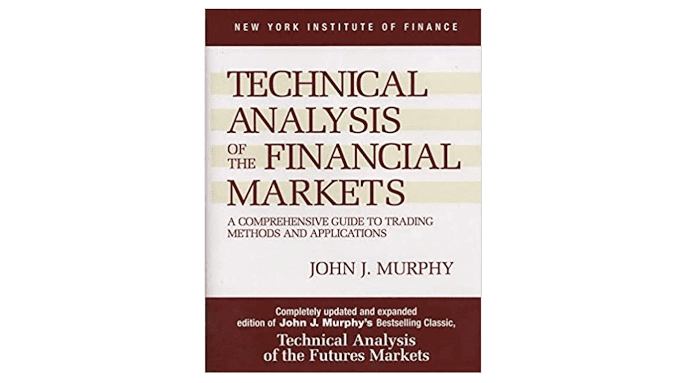

## Table of Contents

## What is technical analysis and why is it important for stock trading?

Technical analysis is a way to study and predict the future prices of stocks by looking at past price movements and trading volumes. Instead of focusing on the company's financial health or the economy, technical analysts use charts and other tools to spot patterns and trends in stock prices. They believe that all the information about a stock is already shown in its price and volume data, so they don't need to look at other things.

Technical analysis is important for stock trading because it helps traders make better decisions about when to buy or sell stocks. By recognizing patterns and trends, traders can predict where the stock price might go next. This can help them make money by buying low and selling high. Even though it's not perfect and doesn't always work, many traders use technical analysis because it gives them a structured way to look at the market and make choices based on data.

## What are the best books for beginners to learn the basics of technical analysis?

For beginners looking to learn the basics of technical analysis, "Technical Analysis of the Financial Markets" by John J. Murphy is a great starting point. This book is considered a classic and covers the essential concepts in an easy-to-understand way. Murphy explains how to read charts, identify trends, and use different technical indicators. He also includes practical examples to help you see how these ideas work in real trading situations. It's a comprehensive guide that can give you a solid foundation in technical analysis.

Another excellent book for beginners is "A Beginner's Guide to Technical Analysis" by Michael Sincere. This book is written specifically for people new to the topic, so it's very clear and straightforward. Sincere breaks down complex ideas into simple terms and uses lots of examples to make sure you understand. He covers important topics like chart patterns, moving averages, and how to use technical analysis in your trading strategy. It's a friendly and approachable book that can help you get started with confidence.

If you want a more hands-on approach, "Technical Analysis For Dummies" by Barbara Rockefeller is also a good choice. This book is part of the popular "For Dummies" series, known for making complex subjects easy to grasp. Rockefeller guides you through the basics of technical analysis with clear explanations and step-by-step instructions. She includes plenty of charts and examples to illustrate her points, making it easier for beginners to follow along. This book is perfect if you like learning through practical examples and want to start applying what you learn right away.

## How can intermediate traders enhance their technical analysis skills through books?

Intermediate traders looking to enhance their technical analysis skills can greatly benefit from "Technical Analysis Explained" by Martin J. Pring. This book is a step up from beginner guides and dives deeper into advanced concepts. Pring explains how to use a wide range of technical indicators and how to combine them for better trading decisions. He also covers how to analyze different market conditions and adjust your strategies accordingly. With clear explanations and real-world examples, this book can help intermediate traders understand the nuances of technical analysis and apply them more effectively in their trading.

Another great book for intermediate traders is "Japanese Candlestick Charting Techniques" by Steve Nison. This book focuses on candlestick patterns, which are very useful for spotting trends and reversals in the market. Nison goes beyond the basics and explains how to use candlestick patterns in combination with other technical tools. He includes plenty of charts and examples to show how these patterns work in practice. By mastering candlestick charting, intermediate traders can gain a more detailed understanding of market movements and improve their ability to make timely trading decisions.

## What advanced books on technical analysis should expert traders consider?

Expert traders looking to deepen their technical analysis skills should consider "Trading Systems and Methods" by Perry J. Kaufman. This book is a comprehensive guide that covers a wide range of advanced trading strategies and technical indicators. Kaufman explains how to develop, test, and refine trading systems to improve performance. He includes detailed discussions on topics like trend-following systems, volatility-based strategies, and how to use advanced statistical methods in trading. With its in-depth analysis and practical examples, this book can help expert traders enhance their understanding of complex technical analysis concepts and apply them more effectively in their trading.

Another valuable book for expert traders is "The New Science of Technical Analysis" by Thomas R. DeMark. This book introduces advanced technical indicators and methods that go beyond traditional analysis. DeMark focuses on unique concepts like sequential and setup indicators, which can help traders identify potential turning points in the market. He provides detailed explanations and real-world examples to show how these techniques can be used to improve trading decisions. By mastering the advanced techniques in this book, expert traders can gain a competitive edge and refine their technical analysis skills to a higher level.

## Which books provide a comprehensive overview of chart patterns and their significance?

"Encyclopedia of Chart Patterns" by Thomas N. Bulkowski is a great book for learning about chart patterns. Bulkowski explains many different patterns and tells you what they mean for trading. He uses lots of examples and data to show how often these patterns work and what you can expect when you see them. This book is very detailed and covers everything from simple patterns like head and shoulders to more complex ones. If you want to understand chart patterns and use them in your trading, this book is a must-read.

Another good book is "Chart Patterns: After the Buy" by Thomas N. Bulkowski. This book focuses on what happens after you spot a chart pattern and decide to buy. Bulkowski looks at how well different patterns predict future price movements and gives you tips on how to use this information to make better trading decisions. He includes lots of charts and statistics to back up his findings. This book is useful if you want to know not just how to identify patterns, but also how to use them effectively in your trading strategy.

## Can you recommend books that focus on the psychological aspects of trading using technical analysis?

"Trading in the Zone" by Mark Douglas is a great book that talks about the mental side of trading with technical analysis. Douglas explains how your thoughts and feelings can affect your trading decisions. He gives tips on how to stay calm and focused, even when the market is moving a lot. The book helps you understand why you might make bad choices when trading and how to avoid those mistakes. It's full of stories and examples that show how important it is to have the right mindset when you're using technical analysis to trade.

Another good book is "The Disciplined Trader" by Mark Douglas. This book also focuses on the psychology of trading but goes deeper into how to control your emotions. Douglas talks about how fear and greed can mess up your trading plans and how to keep them from doing that. He gives you steps to follow to build a strong mental approach to trading. By reading this book, you'll learn how to use technical analysis more effectively by keeping your emotions in check and sticking to your trading strategy.

## What are some must-read books on technical indicators and how to use them effectively?

"Technical Analysis of the Financial Markets" by John J. Murphy is a key book for learning about technical indicators. Murphy explains how to use many different indicators like moving averages, RSI, and MACD. He shows you how these tools can help you see trends and make better trading choices. The book is easy to follow and has lots of examples to help you understand how to use the indicators in real trading situations. It's a great choice if you want to learn the basics and more advanced ways to use technical indicators.

"Technical Analysis Explained" by Martin J. Pring is another important book for understanding technical indicators. Pring goes into detail about how to use indicators to analyze the market. He talks about how to mix different indicators to get a better picture of what the market is doing. The book also covers how to use these tools in different market conditions. Pring's explanations are clear and he uses real examples to show you how to apply what you learn. This book is perfect for anyone who wants to get good at using technical indicators to improve their trading.

## Are there any books that combine technical analysis with other trading strategies?

"Trade Your Way to Financial Freedom" by Van K. Tharp is a great book that mixes technical analysis with other trading strategies. Tharp talks about how to use technical indicators along with understanding your own trading style and managing risk. He explains that knowing yourself and your goals is just as important as knowing the charts. The book helps you create a trading plan that fits you, using technical analysis as one part of it. It's easy to read and has lots of examples to show you how to put everything together.

"Swing Trading for Dummies" by Omar Bassal and CFDs for Dummies by Paul Mladjenovic is another book that blends technical analysis with other methods. This book focuses on swing trading, which means holding stocks for a few days to a few weeks. It shows you how to use technical analysis to find good times to buy and sell, but also talks about other important things like market trends and news events. The book is written in a simple way and gives you step-by-step instructions on how to use technical analysis along with other strategies to make better trading decisions.

## Which books discuss the historical development and evolution of technical analysis?

"Technical Analysis of the Financial Markets" by John J. Murphy is a great book that talks about how technical analysis started and grew over time. Murphy explains that technical analysis has been around for a long time, even before computers were used. He tells stories about how people like Charles Dow, who made the Dow Theory, helped shape the way we use charts and patterns today. The book also covers how technical analysis changed with new technology and new ideas, making it easier and more useful for traders.

"Charting the Stock Market: The Wyckoff Method" by Jack K. Hutson and "Richard D. Wyckoff: The Method and Its Rules for Stock and Commodity Trading" by Richard D. Wyckoff are books that focus on the history and evolution of technical analysis through the lens of the Wyckoff method. These books explain how Richard Wyckoff, a famous trader from the early 1900s, developed his approach to understanding market trends and price movements. They show how his ideas have influenced modern technical analysis and how his methods are still used by traders today. By reading these books, you can learn about the roots of technical analysis and see how it has evolved into what we use now.

## What are the top books that offer practical examples and case studies in technical analysis?

"Technical Analysis of the Financial Markets" by John J. Murphy is a great book for learning technical analysis with practical examples. Murphy uses lots of charts and real-life situations to show how to use technical indicators and patterns. He explains things step-by-step, so you can see how to apply what you learn to real trading. The book covers many different examples, from simple moving averages to complex chart patterns, making it easy to understand and use in your own trading.

"Encyclopedia of Chart Patterns" by Thomas N. Bulkowski is another book that's full of practical examples and case studies. Bulkowski looks at many different chart patterns and uses data to show how often they work and what you can expect. He includes lots of charts to help you see how these patterns look in real markets. The book is very detailed and helps you learn how to spot and use these patterns in your trading. It's like having a guide that shows you exactly what to look for and how to make decisions based on what you see.

## Can you suggest books that cover the application of technical analysis in different markets, such as forex or commodities?

"Technical Analysis of the Financial Markets" by John J. Murphy is a great book that talks about using technical analysis in different markets like stocks, forex, and commodities. Murphy explains how to use charts and indicators in each market. He gives examples and shows how the same tools can work in different ways depending on the market. This book is easy to understand and helps you see how technical analysis can be used in many places, not just stocks.

"Trading in the Zone" by Mark Douglas also touches on using technical analysis in different markets, but it focuses more on the mental side of trading. Douglas explains how your mindset affects your trading decisions in markets like forex and commodities. He gives tips on staying calm and making good choices no matter what market you're in. The book uses simple language and real-life examples to help you understand how to apply technical analysis across different markets while keeping your emotions in check.

## What are the latest books on technical analysis that incorporate modern tools and technologies?

"Technical Analysis of the Financial Markets" by John J. Murphy has been updated to include modern tools and technologies. The book now talks about how to use computers and software to do technical analysis faster and better. Murphy explains how new tools like automated trading systems and advanced charting software can help you see patterns and trends more clearly. He also shows how to use these tools in real trading situations, making it easier for you to apply what you learn to the markets today.

"Trading in the Zone" by Mark Douglas also touches on modern tools, but it focuses more on the mental side of trading. Douglas explains how new technology can help you stay calm and make better decisions. He talks about how using modern tools like trading apps and real-time data can help you keep your emotions in check. The book uses simple language and real-life examples to show how these tools can be used across different markets, helping you trade more effectively with the help of technology.

## What are Algorithmic Trading and Quantitative Strategies?

In today's digital age, the landscape of financial markets has been profoundly influenced by [algorithmic trading](/wiki/algorithmic-trading), a domain where computational techniques are employed to optimize trading strategies and executions. This section highlights some critical resources for those interested in this sophisticated approach to trading.

Ernie Chan's "Algorithmic Trading" is a pivotal resource that offers readers a thorough exploration of strategies and systems necessary for constructing and testing algorithmic trading models. Chan emphasizes the importance of [backtesting](/wiki/backtesting), a process by which strategies are retrospectively tested against historical data to assess their viability before deployment in live market conditions. This resource is crucial for understanding the nuances of model intricacies and performance metrics such as Sharpe ratio, which measures the average return earned in excess of the risk-free rate per unit of [volatility](/wiki/volatility-trading-strategies) or total risk. For example, calculating the Sharpe ratio can be done using:

$$
\text{Sharpe Ratio} = \frac{R_p - R_f}{\sigma_p}
$$

where $R_p$ is the expected portfolio return, $R_f$ is the risk-free rate, and $\sigma_p$ is the standard deviation of the portfolio's excess return.

Another essential text by Chan, "Quantitative Trading," provides a solid introduction to [quantitative trading](/wiki/quantitative-trading) strategies that are suitable for retail traders. This work focuses on strategies that seek statistical [arbitrage](/wiki/arbitrage) opportunities, often leveraging anomalies in market behavior to generate profits. Chan covers the development of mean-reversion strategies, where traders assume that the price of a security will revert to its historical average, and [momentum](/wiki/momentum) strategies, which capitalize on the continuation of existing trends in market prices.

Rishi Narang's "Inside the Black Box" offers invaluable insights into the construction and operation of algorithmic trading systems, detailing the quantitative techniques these systems use. Narang demystifies the concept of "black box" trading, making it accessible to a broader audience. This book explores the technological infrastructure underlying algorithmic trading and addresses common misconceptions about automated trading systems. It highlights the importance of robust risk management and the integration of [machine learning](/wiki/machine-learning) in enhancing trading algorithms. For instance, Python libraries such as NumPy and pandas are frequently used for data manipulation, while Scikit-learn offers tools for implementing machine learning models.

In summary, these resources collectively provide a comprehensive understanding of algorithmic trading and quantitative strategies, equipping readers with the knowledge needed to harness computational power in today's financial markets. Algorithmic trading remains a continually evolving field, requiring a strong foundation in both quantitative analysis and practical implementation skills.

## References & Further Reading

[1]: Graham, B. (1949). ["The Intelligent Investor."](https://en.wikipedia.org/wiki/The_Intelligent_Investor) Harper & Brothers.

[2]: Malkiel, B. G. (1973). ["A Random Walk Down Wall Street."](https://yourknowledgedigest.org/wp-content/uploads/2020/04/a-random-walk-down-wall-street.pdf) W. W. Norton & Company.

[3]: Bogle, J. C. (2007). ["The Little Book of Common Sense Investing."](https://www.amazon.com/Little-Book-Common-Sense-Investing/dp/1119404509) John Wiley & Sons.

[4]: O'Neil, W. J. (1988). ["How to Make Money in Stocks."](https://www.amazon.com/How-Make-Money-Stocks-Winning/dp/0071614133) McGraw-Hill Education.

[5]: Tharp, V. K. (1998). ["Trade Your Way to Financial Freedom."](https://archive.org/details/tradeyourwaytofi0000thar) McGraw-Hill.

[6]: Lefèvre, E. (1923). ["Reminiscences of a Stock Operator."](https://en.wikipedia.org/wiki/Reminiscences_of_a_Stock_Operator) John Wiley & Sons.

[7]: Murphy, J. J. (1999). ["Technical Analysis of the Financial Markets."](https://www.amazon.com/Technical-Analysis-Financial-Markets-Comprehensive/dp/0735200661) New York Institute of Finance.

[8]: Pring, M. J. (2002). ["Technical Analysis Explained."](https://www.amazon.com/Technical-Analysis-Explained-Fifth-Successful/dp/0071825177) McGraw-Hill.

[9]: Nison, S. (1991). ["Japanese Candlestick Charting Techniques."](https://drive.google.com/file/d/0B_CADMk621uLNDEyZTEzZjYtMmZjOS00ZmUyLTlhYmYtN2E1YTViOWRiOTdi/view) New York Institute of Finance.

[10]: Chan, E. (2009). ["Quantitative Trading: How to Build Your Own Algorithmic Trading Business."](https://github.com/ftvision/quant_trading_echan_book) John Wiley & Sons.

[11]: Chan, E. (2013). ["Algorithmic Trading: Winning Strategies and Their Rationale."](https://github.com/ftvision/quant_trading_echan_book) John Wiley & Sons.

[12]: Narang, R. (2013). ["Inside the Black Box: The Simple Truth About Quantitative Trading."](https://onlinelibrary.wiley.com/doi/book/10.1002/9781118267738) John Wiley & Sons.

[13]: Dunnis, C. L., Laws, J., & Hudson, R. (2003). ["Applied Quantitative Methods for Trading and Investment."](https://onlinelibrary.wiley.com/doi/pdf/10.1002/0470013265.fmatter) Wiley.

[14]: Hastie, T., Tibshirani, R., & Friedman, J. (2009). ["The Elements of Statistical Learning."](https://link.springer.com/book/10.1007/978-0-387-84858-7) Springer.

[15]: Sinclair, E. (2008). ["Volatility Trading."](https://onlinelibrary.wiley.com/doi/book/10.1002/9781119197058) Wiley.