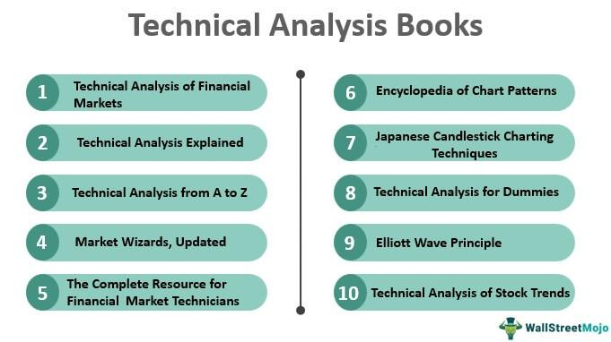

The journey to mastering stock trading and investment is paved with knowledge and strategy. Books offer invaluable insights into the world of finance, demystifying complex concepts and navigating market fluctuations. Over the years, the financial market has shown its complexity, influenced by economic, political, and social factors. To effectively maneuver through these fluctuations, a strong foundational understanding of market dynamics is essential. 

This article presents a comprehensive overview of essential books that cover investment principles, stock trading, technical analysis, and algorithmic trading. Each of these facets plays a critical role in building a diversified understanding of financial markets. Investment principles offer the groundwork for identifying value and potential in various assets, while stock trading focuses on the tactical execution of buying and selling stocks. Technical analysis equips traders with the tools needed to interpret price movements and trends, assisting in making informed trading decisions. Meanwhile, algorithmic trading and quantitative strategies provide an advanced, data-driven approach to automating and optimizing trading processes.



Whether you're a novice aiming to understand the basics or an experienced trader looking to enhance your strategies, these resources will enrich your knowledge and sharpen your skills. For beginners, foundational texts can simplify the initial learning curve, offering clarity and confidence. Experienced traders can benefit from advanced writings that explore innovative strategies and evolving market theories. Engaging with these books is more than a simple reading exercise; it is an investment in one’s financial acumen, potentially unlocking greater opportunities for success in the dynamic field of trading and investment.

## Table of Contents

## Fundamental Investment Books

Start with the basics by exploring books that lay the foundation for financial investing. These books cover core principles that are timeless and crucial for successful investing.

Benjamin Graham's "The Intelligent Investor" is a seminal work that introduces readers to value investing and long-term wealth creation. First published in 1949, the book emphasizes the importance of investing in undervalued stocks with intrinsic value, rather than speculating on high-risk opportunities. Graham's distinction between "investment" and "speculation" provides clarity for investors seeking stable, long-term growth. Concepts such as the "margin of safety" and Mr. Market's metaphor illustrate how investors can mitigate risk and capitalize on market fluctuations. Warren Buffett, one of Graham's most famous students, often cites this book as one of his key influences, reinforcing its lasting relevance (source: Buffett's preface to revised editions of "The Intelligent Investor").

"A Random Walk Down Wall Street" by Burton Malkiel discusses the unpredictability of markets and advocates for index investing. This book is rooted in the Efficient Market Hypothesis (EMH), which suggests that it's impossible to consistently outperform the market through speculation, as asset prices reflect all available information. Malkiel argues for a diversified investment approach, often recommending that investors consider low-cost index funds that mirror the performance of market indices like the S&P 500. He explains various investment strategies in accessible language, providing a compelling case for passive investing in a landscape where active management often fails to deliver higher returns after fees are accounted for.

John Bogle's "The Little Book of Common Sense Investing" emphasizes low-cost funds and the benefits of indexing over time. As the founder of The Vanguard Group, Bogle pioneered the first index mutual fund available to individual investors. His book advocates for simplicity and transparency in investing, encouraging investors to focus on minimizing fees and adhering to a long-term investment horizon. Bogle's mantra, "Don't look for the needle in the haystack, just buy the haystack," underscores the practicality of broad market exposure through index funds. He presents data-driven arguments that investing in a diversified portfolio of stocks at low expense ratios often results in better long-term performance than actively managed funds. 

These foundational texts offer enduring insights and practical advice for individuals seeking to build robust investment portfolios based on sound principles rather than fleeting trends.

## Essential Stock Trading Books

For those concentrating on stock trading, several [books](/wiki/algo-trading-books) offer both foundational strategies and advanced techniques to enhance one's trading prowess. William O'Neil's "How to Make Money in Stocks" is a quintessential guide that provides a systematic method known as the CANSLIM strategy. This approach integrates both fundamental and technical analysis to identify strong investment opportunities. The CANSLIM acronym stands for Current earnings, Annual earnings, New products, Supply and demand, Leader, Institutional support, and Market direction, highlighting the key factors O'Neil emphasizes for selecting stocks.

Van Tharp's "Trade Your Way to Financial Freedom" offers a different perspective by focusing on the psychological and personalized aspects of trading. Tharp presents frameworks for developing individualized trading systems that align with traders' personal objectives and risk tolerance levels. He emphasizes understanding one's psychological makeup as a cornerstone of trading success, and his methodologies encourage flexibility in adapting strategies to suit various market conditions.

"Reminiscences of a Stock Operator" by Edwin Lefèvre, a classic in stock trading literature, provides historical insights through the semi-autobiographical account of Jesse Livermore, one of the most famous traders of the early 20th century. Though it dates back several decades, the lessons in risk management, market psychology, and tactical trading remain relevant, illustrating the timeless nature of human behavior in financial markets.

These books offer a comprehensive arsenal of knowledge necessary for both new and seasoned traders seeking to refine their approaches and achieve consistent profitability.

## Mastering Technical Analysis

Technical analysis is a critical skill for traders aiming to interpret market trends and forecast price movements effectively. A well-rounded understanding of technical analysis involves mastering various techniques and indicators that can inform trading decisions. Several key texts provide extensive knowledge in this domain.

John Murphy's "Technical Analysis of the Financial Markets" is a foundational resource that offers a thorough exploration of charting techniques and market indicators. This book is recognized for its comprehensive approach to the technical aspects of trading, covering topics such as moving averages, oscillators, and the relationship between technical and [fundamental analysis](/wiki/fundamental-analysis). Murphy's work lays the groundwork for understanding how technical analysis can be used to identify market trends and potential reversals, making it an invaluable resource for traders at all levels.

Another essential text is Martin Pring's "Technical Analysis Explained," which is often regarded as the "Bible" of technical analysis. Pring provides an in-depth examination of market mechanics and trading psychology, two crucial components for success in trading. The book emphasizes the importance of understanding the cyclical nature of markets and how psychological factors can influence price movements. Pring's insights into the interrelationship between market sentiment and technical signals help traders refine their analytical skills and develop more nuanced trading strategies.

Steve Nison's "Japanese Candlestick Charting Techniques" is a pioneering work that introduces traders to the world of candlestick charting, a vital tool for market analysis. Nison's book investigates into the history and development of candlestick patterns, explaining how these visual representations of price action can be used to anticipate market movements. Candlestick charting combines elements of visualization and technical analysis, providing traders with an effective method for identifying trends, reversals, and continuation patterns.

To illustrate the application of technical analysis using Python, consider the example of implementing a simple moving average crossover strategy, a common technique used to signal potential buy or sell actions:

```python
import pandas as pd
import numpy as np
import matplotlib.pyplot as plt

# Load your historical stock data
data = pd.read_csv('historical_stock_data.csv', parse_dates=True, index_col='Date')

# Calculate short-term and long-term moving averages
short_window = 40
long_window = 100

data['Short_MA'] = data['Close'].rolling(window=short_window, min_periods=1).mean()
data['Long_MA'] = data['Close'].rolling(window=long_window, min_periods=1).mean()

# Generate signals
data['Signal'] = 0
data['Signal'][short_window:] = np.where(data['Short_MA'][short_window:] > data['Long_MA'][short_window:], 1, 0)
data['Position'] = data['Signal'].diff()

# Plot the data
plt.figure(figsize=(12, 8))
plt.plot(data['Close'], label='Close Price', alpha=0.5)
plt.plot(data['Short_MA'], label=f'Short {short_window}-Day MA', alpha=0.5)
plt.plot(data['Long_MA'], label=f'Long {long_window}-Day MA', alpha=0.5)
plt.scatter(data.index, data['Short_MA'], where=data['Position'] == 1, marker='^', color='g', label='Buy Signal')
plt.scatter(data.index, data['Short_MA'], where=data['Position'] == -1, marker='v', color='r', label='Sell Signal')
plt.title('Moving Average Crossover Strategy')
plt.xlabel('Date')
plt.ylabel('Price')
plt.legend()
plt.show()
```

This example demonstrates how traders can utilize moving averages to generate buy and sell signals, capitalizing on the convergence and divergence of different trend indicators. By integrating technical analysis with computational techniques, traders can enhance their ability to interpret market signals and improve their trading performance.

## Algorithmic Trading and Quantitative Strategies

In today's digital age, the landscape of financial markets has been profoundly influenced by [algorithmic trading](/wiki/algorithmic-trading), a domain where computational techniques are employed to optimize trading strategies and executions. This section highlights some critical resources for those interested in this sophisticated approach to trading.

Ernie Chan's "Algorithmic Trading" is a pivotal resource that offers readers a thorough exploration of strategies and systems necessary for constructing and testing algorithmic trading models. Chan emphasizes the importance of [backtesting](/wiki/backtesting), a process by which strategies are retrospectively tested against historical data to assess their viability before deployment in live market conditions. This resource is crucial for understanding the nuances of model intricacies and performance metrics such as Sharpe ratio, which measures the average return earned in excess of the risk-free rate per unit of [volatility](/wiki/volatility-trading-strategies) or total risk. For example, calculating the Sharpe ratio can be done using:

$$
\text{Sharpe Ratio} = \frac{R_p - R_f}{\sigma_p}
$$

where $R_p$ is the expected portfolio return, $R_f$ is the risk-free rate, and $\sigma_p$ is the standard deviation of the portfolio's excess return.

Another essential text by Chan, "Quantitative Trading," provides a solid introduction to [quantitative trading](/wiki/quantitative-trading) strategies that are suitable for retail traders. This work focuses on strategies that seek statistical [arbitrage](/wiki/arbitrage) opportunities, often leveraging anomalies in market behavior to generate profits. Chan covers the development of mean-reversion strategies, where traders assume that the price of a security will revert to its historical average, and [momentum](/wiki/momentum) strategies, which capitalize on the continuation of existing trends in market prices.

Rishi Narang's "Inside the Black Box" offers invaluable insights into the construction and operation of algorithmic trading systems, detailing the quantitative techniques these systems use. Narang demystifies the concept of "black box" trading, making it accessible to a broader audience. This book explores the technological infrastructure underlying algorithmic trading and addresses common misconceptions about automated trading systems. It highlights the importance of robust risk management and the integration of [machine learning](/wiki/machine-learning) in enhancing trading algorithms. For instance, Python libraries such as NumPy and pandas are frequently used for data manipulation, while Scikit-learn offers tools for implementing machine learning models.

In summary, these resources collectively provide a comprehensive understanding of algorithmic trading and quantitative strategies, equipping readers with the knowledge needed to harness computational power in today's financial markets. Algorithmic trading remains a continually evolving field, requiring a strong foundation in both quantitative analysis and practical implementation skills.

## Advanced Analysis and Quantitative Finance

For investors interested in deeper quantitative analysis and advanced financial strategies, there is a substantial array of literature available that investigates into the intricacies of quantitative finance. This involves the application of mathematical models and computational techniques to assess financial instruments and develop trading strategies.

"Applied Quantitative Methods for Trading and Investment" by Christian L. Dunis et al. is a notable resource that provides practical applications of quantitative methods in trading. It covers a variety of approaches, including statistical arbitrage, machine learning models, and the use of technical indicators in algorithmic strategies. The book emphasizes the implementation of these methods with real-world data, which is crucial for bridging the gap between theory and practice.

"The Elements of Statistical Learning" by Trevor Hastie, Robert Tibshirani, and Jerome Friedman introduces statistical learning theory applicable to finance. This text covers a range of topics including regression, classification, neural networks, and support vector machines. Statistical learning, a subset of machine learning, provides powerful tools for making predictions based on historical data. It makes extensive use of concepts such as overfitting and regularization to ensure that models perform well on unseen data.

Euan Sinclair's "Volatility Trading" offers strategies specifically tailored for trading volatility, an essential aspect of market behavior characterized by fluctuations in asset prices. Sinclair discusses the nature of volatility, strategies for trading volatility products such as options, and how to manage risk effectively. He also explores the practicalities of implementing volatility trades, including understanding implied volatility and utilizing volatility arbitrage.

These resources embody a rigorous approach to finance, merging theoretical foundations with practical insights. For those with a mathematical and statistical inclination, these books offer invaluable guidance in harnessing quantitative tools to navigate the complex financial landscape. Advanced quantitative finance not only enhances one's ability to predict and react to market movements but also equips investors with strategies to optimize portfolios and manage risk effectively.

Practitioners in this field often benefit from programming skills to implement these strategies efficiently. For instance, Python is widely used for data analysis and algorithmic trading due to its extensive libraries such as NumPy for numerical computation and Pandas for data manipulation. Here is a simple example in Python for calculating moving averages, a common technical indicator:

```python
import pandas as pd

# Sample price data
data = {'Date': ['2023-10-01', '2023-10-02', '2023-10-03', '2023-10-04', '2023-10-05'],
        'Close': [100, 102, 101, 105, 107]}

df = pd.DataFrame(data)
df['Date'] = pd.to_datetime(df['Date'])
df.set_index('Date', inplace=True)

# Calculate moving averages
df['SMA_3'] = df['Close'].rolling(window=3).mean()

print(df)
```

This code calculates a 3-day Simple Moving Average (SMA), providing a basic but powerful method to identify trends. Advanced applications involve integrating such indicators with more complex models from the aforementioned books to construct robust trading systems.

## Conclusion and Additional Resources

Investing in your financial education through reading is an essential strategy for expanding your financial knowledge and trading expertise. The recommended books span a broad spectrum of topics and strategies, offering insights that cater to different levels of expertise, from beginners to seasoned investors.

The foundational books discussed provide timeless principles central to successful investing, emphasizing value investing and the merits of low-cost, index-based strategies. As you progress to more specialized stock trading literature, you'll find advanced techniques that incorporate both fundamental and technical analyses. These resources are crucial for developing tailored trading systems and understanding market dynamics.

Technical analysis books are invaluable for those seeking to interpret market trends and price movements through charting techniques and indicators. These resources enhance your ability to predict market behavior and make informed trading decisions.

Algorithmic trading and quantitative strategies books are particularly relevant in today’s technology-driven markets. They guide readers on how to leverage computational techniques and quantitative methods, offering insights into the development and execution of algorithmic trading strategies.

For those interested in deeper quantitative analysis, advanced literature covers practical applications of statistical learning and volatility trading. These books are vital for investors aiming to understand and manage financial risks effectively.

Beyond books, expanding your knowledge through courses, webinars, and seminars hosted by industry professionals can significantly enhance your understanding and practical skills. These educational avenues provide interactive and up-to-date insights, ensuring you stay informed of the latest trends and strategies in the financial industry. Engaging in continuous education equates to investing in your capability to navigate the complexities of trading and investment successfully.

## References & Further Reading

[1]: Graham, B. (1949). ["The Intelligent Investor."](https://en.wikipedia.org/wiki/The_Intelligent_Investor) Harper & Brothers.

[2]: Malkiel, B. G. (1973). ["A Random Walk Down Wall Street."](https://yourknowledgedigest.org/wp-content/uploads/2020/04/a-random-walk-down-wall-street.pdf) W. W. Norton & Company.

[3]: Bogle, J. C. (2007). ["The Little Book of Common Sense Investing."](https://www.amazon.com/Little-Book-Common-Sense-Investing/dp/1119404509) John Wiley & Sons.

[4]: O'Neil, W. J. (1988). ["How to Make Money in Stocks."](https://www.amazon.com/How-Make-Money-Stocks-Winning/dp/0071614133) McGraw-Hill Education.

[5]: Tharp, V. K. (1998). ["Trade Your Way to Financial Freedom."](https://archive.org/details/tradeyourwaytofi0000thar) McGraw-Hill.

[6]: Lefèvre, E. (1923). ["Reminiscences of a Stock Operator."](https://en.wikipedia.org/wiki/Reminiscences_of_a_Stock_Operator) John Wiley & Sons.

[7]: Murphy, J. J. (1999). ["Technical Analysis of the Financial Markets."](https://www.amazon.com/Technical-Analysis-Financial-Markets-Comprehensive/dp/0735200661) New York Institute of Finance.

[8]: Pring, M. J. (2002). ["Technical Analysis Explained."](https://www.amazon.com/Technical-Analysis-Explained-Fifth-Successful/dp/0071825177) McGraw-Hill.

[9]: Nison, S. (1991). ["Japanese Candlestick Charting Techniques."](https://drive.google.com/file/d/0B_CADMk621uLNDEyZTEzZjYtMmZjOS00ZmUyLTlhYmYtN2E1YTViOWRiOTdi/view) New York Institute of Finance.

[10]: Chan, E. (2009). ["Quantitative Trading: How to Build Your Own Algorithmic Trading Business."](https://github.com/ftvision/quant_trading_echan_book) John Wiley & Sons.

[11]: Chan, E. (2013). ["Algorithmic Trading: Winning Strategies and Their Rationale."](https://github.com/ftvision/quant_trading_echan_book) John Wiley & Sons.

[12]: Narang, R. (2013). ["Inside the Black Box: The Simple Truth About Quantitative Trading."](https://onlinelibrary.wiley.com/doi/book/10.1002/9781118267738) John Wiley & Sons.

[13]: Dunnis, C. L., Laws, J., & Hudson, R. (2003). ["Applied Quantitative Methods for Trading and Investment."](https://onlinelibrary.wiley.com/doi/pdf/10.1002/0470013265.fmatter) Wiley.

[14]: Hastie, T., Tibshirani, R., & Friedman, J. (2009). ["The Elements of Statistical Learning."](https://link.springer.com/book/10.1007/978-0-387-84858-7) Springer.

[15]: Sinclair, E. (2008). ["Volatility Trading."](https://onlinelibrary.wiley.com/doi/book/10.1002/9781119197058) Wiley.