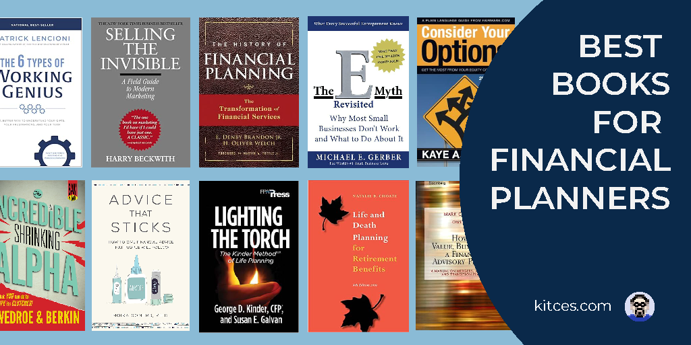

## Table of Contents

## What are the best investment books for beginners?

If you're new to investing, "A Random Walk Down Wall Street" by Burton G. Malkiel is a great book to start with. It explains investing in a way that's easy to understand. The book talks about how the stock market works and gives advice on how to invest your money wisely. It also covers different investment strategies and why some might be better than others. This book is perfect for beginners because it doesn't use complicated financial terms and helps you make smart choices with your money.

Another good book for beginners is "The Intelligent Investor" by Benjamin Graham. This book is considered a classic in the world of investing. It teaches you about the importance of value investing, which means buying stocks that are priced lower than their true worth. Benjamin Graham explains how to analyze companies and make informed decisions. Even though the book was written a long time ago, the lessons in it are still useful today. It's a bit longer and more detailed than "A Random Walk Down Wall Street," but it's worth the read if you want to learn more about investing.

If you want a more modern take on investing, "The Little Book of Common Sense Investing" by John C. Bogle is a good choice. John Bogle, the founder of Vanguard, explains the benefits of investing in index funds. He believes that trying to beat the market is a waste of time and money, and instead, you should focus on low-cost index funds. The book is short and easy to read, making it perfect for beginners who want to start investing without getting overwhelmed by complicated strategies.

## Which books are recommended by financial advisors for understanding basic investment principles?

Financial advisors often recommend "A Random Walk Down Wall Street" by Burton G. Malkiel for beginners looking to understand basic investment principles. This book is great because it explains how the stock market works in a simple way. It talks about different ways to invest your money and why some methods might be better than others. Malkiel also discusses the idea of a "random walk," which means that stock prices move unpredictably, and it's hard to beat the market consistently. This book is perfect for anyone starting out because it doesn't use complicated financial terms and helps you make smart choices with your money.

Another book that financial advisors often suggest is "The Intelligent Investor" by Benjamin Graham. This classic book teaches you about value investing, which means buying stocks that are cheaper than their real value. Benjamin Graham explains how to look at companies and make good decisions about where to put your money. Even though the book is older, the lessons in it are still important today. It's a bit longer and goes into more detail than "A Random Walk Down Wall Street," but it's worth reading if you want to learn more about investing and how to think like a smart investor.

For a more modern approach, financial advisors also recommend "The Little Book of Common Sense Investing" by John C. Bogle. John Bogle, who started Vanguard, believes in the power of index funds. He explains why trying to beat the market is usually a bad idea and why you should focus on low-cost index funds instead. The book is short and easy to understand, making it perfect for beginners who want to start investing without getting overwhelmed by complex strategies. This book is a great choice if you want to learn about a simple and effective way to invest your money.

## What are some must-read books for those starting to invest in stocks?

For anyone starting to invest in stocks, "A Random Walk Down Wall Street" by Burton G. Malkiel is a must-read. This book explains the stock market in a way that's easy to understand. It talks about different ways to invest your money and why some methods might be better than others. Malkiel also explains the idea of a "random walk," which means stock prices move in ways that are hard to predict. This book helps you make smart choices with your money without using complicated financial terms.

Another important book is "The Intelligent Investor" by Benjamin Graham. This book is a classic and teaches you about value investing, which means buying stocks that are cheaper than their real value. Benjamin Graham explains how to look at companies and make good decisions about where to put your money. Even though the book is older, the lessons in it are still useful today. It's a bit longer and goes into more detail than "A Random Walk Down Wall Street," but it's worth reading if you want to learn more about investing and how to think like a smart investor.

For a more modern take on investing, "The Little Book of Common Sense Investing" by John C. Bogle is highly recommended. John Bogle, who started Vanguard, believes in the power of index funds. He explains why trying to beat the market is usually a bad idea and why you should focus on low-cost index funds instead. The book is short and easy to understand, making it perfect for beginners who want to start investing without getting overwhelmed by complex strategies. This book is a great choice if you want to learn about a simple and effective way to invest your money.

## Which books provide guidance on creating a diversified investment portfolio?

"The Intelligent Asset Allocator" by William J. Bernstein is a great book for learning how to create a diversified investment portfolio. Bernstein explains in simple terms how to spread your money across different types of investments like stocks, bonds, and real estate. He talks about why diversification is important and how it can help reduce the risk of losing money. The book also gives you step-by-step advice on how to build your own portfolio, making it easy for beginners to understand and follow.

Another helpful book is "The Bogleheads' Guide to Investing" by Taylor Larimore, Mel Lindauer, and Michael LeBoeuf. This book is based on the ideas of John Bogle and focuses on creating a diversified portfolio using low-cost index funds. The authors explain how to choose the right mix of investments to match your goals and how much risk you're willing to take. They also share practical tips on how to start investing and keep your portfolio balanced over time. This book is perfect for anyone who wants a simple and effective way to diversify their investments.

## What are the top books recommended for learning about mutual funds and ETFs?

"The Little Book of Common Sense Investing" by John C. Bogle is a great book for learning about mutual funds and ETFs. John Bogle, who started Vanguard, talks a lot about index funds, which are a type of mutual fund and ETF. He explains why these funds are a smart choice for investors. Bogle believes that trying to beat the market is hard and often a waste of time. Instead, he says it's better to invest in low-cost index funds that follow the market. This book is easy to read and understand, making it perfect for beginners who want to learn about mutual funds and ETFs.

Another good book is "The Bogleheads' Guide to Investing" by Taylor Larimore, Mel Lindauer, and Michael LeBoeuf. This book also focuses a lot on mutual funds and ETFs, especially index funds. The authors explain how these funds work and why they are important for building a diversified portfolio. They give practical advice on how to choose the right mutual funds and ETFs for your goals and how much risk you're willing to take. The book is written in a way that's easy to follow, making it helpful for anyone starting to learn about investing in mutual funds and ETFs.

## Which investment books focus on risk management strategies?

"Against the Gods: The Remarkable Story of Risk" by Peter L. Bernstein is a great book for learning about risk management in investing. Bernstein explains what risk is and how it has been understood and managed throughout history. He talks about different ways to measure and control risk, which is important for anyone investing money. The book is easy to read and helps you understand why managing risk is so important when you're trying to grow your money.

Another good book is "The Black Swan: The Impact of the Highly Improbable" by Nassim Nicholas Taleb. Taleb talks about rare events that can have a big impact on your investments. He explains how to prepare for these unexpected events and how to manage the risks they bring. The book teaches you to think differently about risk and how to protect your money from big surprises. It's a bit more complex, but it's worth reading if you want to learn more about managing risk in your investments.

## What books do financial advisors suggest for advanced investors looking to refine their strategies?

"The Most Important Thing: Uncommon Sense for the Thoughtful Investor" by Howard Marks is a book that financial advisors often suggest for advanced investors. Marks shares his insights on what really matters in investing. He talks about understanding risk, the importance of being patient, and how to think differently from other investors. The book is full of practical advice that can help you refine your investment strategies. It's written in a way that's easy to understand, but it goes deep into topics that are important for experienced investors.

Another book that advanced investors might find useful is "Security Analysis" by Benjamin Graham and David Dodd. This book is considered a classic in the world of investing. It goes into detail about how to analyze stocks and bonds to find good investments. Graham and Dodd explain different ways to value companies and how to make smart decisions about where to put your money. Even though the book is older, the lessons in it are still important today. It's a bit more complex and detailed, but it's worth reading if you want to learn more about advanced investment strategies.

## Which texts are recommended for understanding the psychological aspects of investing?

"Thinking, Fast and Slow" by Daniel Kahneman is a great book for understanding the psychological aspects of investing. Kahneman, who won a Nobel Prize, explains how our brains work and how we make decisions. He talks about two ways our minds think: one is fast and automatic, and the other is slow and thoughtful. This can affect how we invest our money. For example, we might make quick decisions based on emotions instead of thinking carefully about the facts. Understanding these mental shortcuts can help you avoid common mistakes and make better investment choices.

Another helpful book is "The Psychology of Money" by Morgan Housel. Housel explains how our feelings and experiences shape the way we think about money and investing. He shares stories and examples to show why people behave the way they do with their money. The book talks about things like why some people are more willing to take risks, or why others might be afraid to lose money. By understanding these psychological factors, you can make smarter decisions and manage your investments better.

## What are the best books for investors interested in alternative investments like real estate or commodities?

"The Book on Rental Property Investing" by Brandon Turner is a great book for people who want to learn about investing in real estate. Turner explains in simple terms how to buy rental properties and make money from them. He talks about how to find good deals, how to manage your properties, and how to grow your real estate business. The book also gives practical advice on how to handle the challenges of being a landlord. It's perfect for anyone starting out in real estate investing because it's easy to understand and full of useful tips.

"Hot Commodities: How Anyone Can Invest Profitably in the World's Best Market" by Jim Rogers is a good book for those interested in commodities. Rogers, who is a well-known investor, explains what commodities are and why they can be a good investment. He talks about things like oil, gold, and agricultural products, and how their prices can go up and down. The book also gives advice on how to start investing in commodities and how to manage the risks that come with it. It's written in a way that's easy to follow, making it helpful for anyone who wants to learn about this type of investment.

## Which books provide insights into global investing and international markets?

"The Little Book of Emerging Markets" by Mark Mobius is a great book for anyone interested in global investing. Mobius, who has a lot of experience investing in different countries, explains what emerging markets are and why they can be good places to invest your money. He talks about countries like China, India, and Brazil, and how their economies are growing. The book also gives advice on how to pick the right investments in these markets and how to manage the risks that come with them. It's written in a way that's easy to understand, making it perfect for people who want to learn about investing in other parts of the world.

Another helpful book is "The Intelligent Investor" by Benjamin Graham. While this book is known for its lessons on value investing, it also has a lot to say about investing in international markets. Graham talks about how to look at companies in different countries and how to make smart decisions about where to put your money. He explains why it's important to diversify your investments across different countries to reduce risk. Even though the book is older, the lessons in it are still useful today. It's a bit longer and goes into more detail, but it's worth reading if you want to learn more about global investing.

## What are the recommended readings for investors looking to understand financial statements and valuation techniques?

"Financial Statements: A Step-by-Step Guide to Understanding and Creating Financial Reports" by Thomas R. Ittelson is a great book for investors who want to learn about financial statements. Ittelson explains in simple terms how to read and understand balance sheets, income statements, and cash flow statements. He uses clear examples and breaks down complex ideas into easy-to-understand pieces. This book is perfect for beginners because it doesn't use complicated financial terms and helps you see how a company is doing financially.

Another important book is "The Little Book of Valuation: How to Value a Company, Pick a Stock, and Profit" by Aswath Damodaran. Damodaran is an expert in valuation and he explains different ways to figure out how much a company is worth. He talks about using tools like discounted cash flow and relative valuation to pick good stocks. The book is written in a way that's easy to follow, even if you're new to investing. It helps you understand how to value a company and make smart investment choices based on that value.

## Which books are considered essential for expert investors focusing on quantitative analysis and algorithmic trading?

"Quantitative Trading: How to Build Your Own Algorithmic Trading Business" by Ernie Chan is a great book for expert investors who want to learn about quantitative analysis and algorithmic trading. Chan explains how to use math and computer programs to make investment decisions. He talks about how to build trading models, test them, and use them to trade stocks and other investments. The book also gives advice on how to manage the risks that come with this type of trading. It's written in a way that's easy to understand, but it goes deep into topics that are important for experienced investors.

Another helpful book is "Algorithmic Trading: Winning Strategies and Their Rationale" by Ernie Chan. This book focuses on different strategies that you can use in [algorithmic trading](/wiki/algorithmic-trading). Chan explains how these strategies work and why they can be successful. He also talks about how to use data and math to find good investments and make smart trading decisions. The book is full of practical examples and advice that can help you improve your trading skills. It's a bit more complex, but it's worth reading if you want to learn more about quantitative analysis and algorithmic trading.

## References & Further Reading

[1]: Graham, B. (1949). ["The Intelligent Investor."](https://en.wikipedia.org/wiki/The_Intelligent_Investor) Harper & Brothers.

[2]: Malkiel, B. G. (1973). ["A Random Walk Down Wall Street."](https://en.wikipedia.org/wiki/A_Random_Walk_Down_Wall_Street) W. W. Norton & Company.

[3]: Bogle, J. C. (2007). ["The Little Book of Common Sense Investing."](https://en.wikipedia.org/wiki/The_Little_Book_of_Common_Sense_Investing) John Wiley & Sons.

[4]: Kahneman, D. (2011). ["Thinking, Fast and Slow."](https://link.springer.com/article/10.1007/s00362-013-0533-y) Farrar, Straus and Giroux.

[5]: Chan, E. P. (2009). ["Quantitative Trading: How to Build Your Own Algorithmic Trading Business."](https://github.com/ftvision/quant_trading_echan_book) John Wiley & Sons.

[6]: Chan, E. P. (2013). ["Algorithmic Trading: Winning Strategies and Their Rationale."](https://github.com/ftvision/quant_trading_echan_book) John Wiley & Sons.

[7]: Cartea, Á., Jaimungal, S., & Penalva, J. (2015). ["Algorithmic and High-Frequency Trading."](https://assets.cambridge.org/97811070/91146/frontmatter/9781107091146_frontmatter.pdf) Cambridge University Press.