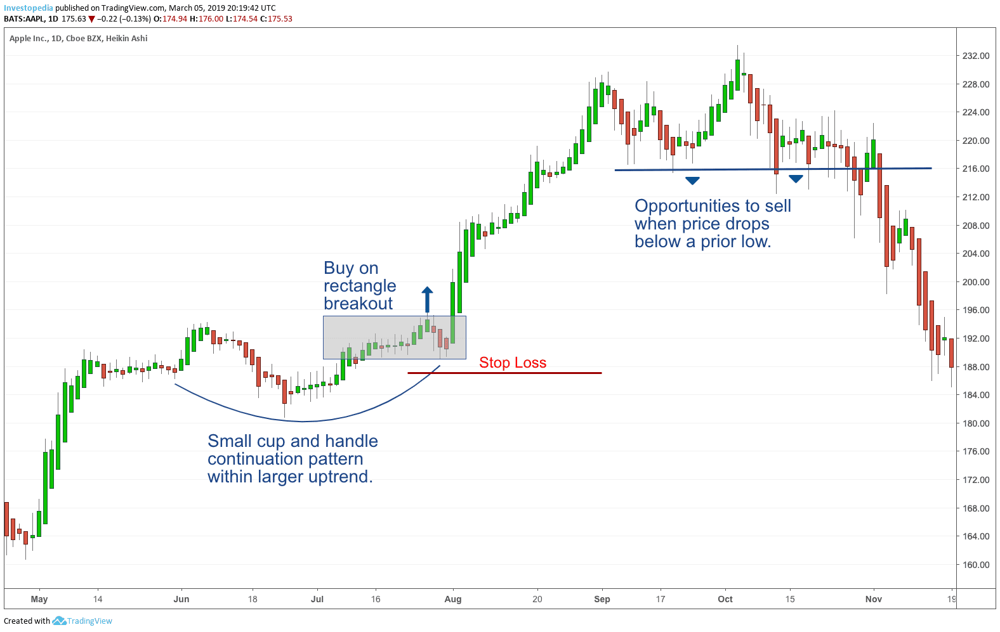

## Table of Contents

## What is swing trading and how does it differ from other trading styles?

Swing trading is a style of trading where people buy and sell stocks or other financial things over a few days to a few weeks. The goal is to make money from the ups and downs in the price of these things. People who do swing trading look at charts and other information to guess where the price might go next. They try to buy low and sell high, or sell high and buy back low if they are betting the price will go down.

Swing trading is different from other trading styles in a few ways. Day trading, for example, is when people buy and sell within the same day, trying to make quick profits. Swing traders, on the other hand, are okay with holding onto their trades for longer. Another style is position trading, where people hold onto their trades for months or even years. Swing trading is in the middle - it's not as fast as day trading, but not as slow as position trading. This makes it a good choice for people who can't watch the markets all day but still want to trade actively.

## Why might swing trading be suitable for beginners?

Swing trading might be good for beginners because it doesn't need you to watch the markets all the time. Unlike day trading, where you have to be quick and always looking at the screen, swing trading lets you take your time. You can look at the charts once a day or even less often and still make good decisions. This makes it easier for someone who is just starting out and might not have the time or the know-how to trade every minute of the day.

Also, swing trading gives beginners a chance to learn as they go. Since you're holding onto your trades for a few days to a few weeks, you have more time to think about what you're doing. You can see how the market moves and learn from your trades without the pressure of making quick decisions. This slower pace can help new traders build their confidence and skills without feeling rushed or overwhelmed.

## What are the key factors to consider when selecting stocks for swing trading?

When [picking](/wiki/asset-class-picking) stocks for swing trading, it's important to look at how much the stock's price moves around. Stocks that move a lot can give you more chances to make money, but they can also be riskier. You should also check the stock's trading [volume](/wiki/volume-trading-strategy). If a lot of people are buying and selling the stock, it's easier to get in and out of your trades without affecting the price too much. Another thing to think about is the stock's trend. If the stock is going up or down in a clear way, it might be easier to predict where it's going next.

You should also look at the company's news and events. Big news like earnings reports or new products can make the stock's price move a lot, which can be good for swing trading. It's also a good idea to use technical analysis, which means looking at charts and patterns to guess where the price might go. This can help you find the best times to buy and sell. Remember, the goal is to find stocks that you think will move enough in a short time to make a profit, but not so much that they're too risky for you.

## How do you identify stocks with high volatility and liquidity for swing trading?

To find stocks with high [volatility](/wiki/volatility-trading-strategies) for swing trading, you need to look at how much the stock's price changes over time. One way to do this is by checking the stock's average true range (ATR), which shows how much the price moves on average. Stocks with a higher ATR are more volatile, which means they have bigger price swings. This can be good for swing trading because you can make more money if you guess right, but it's also riskier. You can find the ATR on many stock charting websites or trading platforms.

For [liquidity](/wiki/liquidity-risk-premium), you want to see how many shares of the stock are traded each day. This is called the trading volume. Stocks with high trading volume are easier to buy and sell without moving the price too much. To check this, look at the average daily volume of the stock. If a stock has a lot of volume, it means a lot of people are interested in it, and it's easier to get in and out of your trades. You can find this information on stock market websites or in your trading platform. A good rule of thumb is to pick stocks that have an average daily volume of at least 500,000 to 1 million shares.

By looking at both volatility and liquidity, you can find stocks that are good for swing trading. High volatility gives you the chance to make bigger profits, while high liquidity makes it easier to trade without big price changes. Always use tools like ATR and average daily volume to help you pick the right stocks. This way, you can feel more confident in your swing trading choices.

## What technical indicators should beginners use to analyze potential swing trading stocks?

For beginners, using simple technical indicators can help in analyzing stocks for swing trading. One good indicator to start with is the Moving Average (MA). There are different types of moving averages, but the most common ones are the Simple Moving Average (SMA) and the Exponential Moving Average (EMA). These lines on a chart show the average price of a stock over a certain period, like 50 days or 200 days. When the stock's price moves above the moving average, it might be a good time to buy because the stock could be starting to go up. If the price moves below the moving average, it might be a time to sell because the stock could be starting to go down.

Another useful indicator is the Relative Strength Index (RSI). The RSI measures how fast and how much a stock's price is changing. It gives you a number between 0 and 100. If the RSI is above 70, it means the stock might be overbought, which means it could be a good time to sell because the price might go down soon. If the RSI is below 30, it means the stock might be oversold, which could be a good time to buy because the price might go up soon. Using the RSI can help you find good times to enter or [exit](/wiki/exit-strategy) a trade.

Lastly, beginners can use the MACD (Moving Average Convergence Divergence) indicator. The MACD shows the relationship between two moving averages of a stock's price. It helps you see if the stock's trend is getting stronger or weaker. When the MACD line crosses above the signal line, it might be a good time to buy because the stock's price could start to go up. When the MACD line crosses below the signal line, it might be a good time to sell because the price could start to go down. Using these three indicators together can give you a better idea of when to buy and sell stocks for swing trading.

## Can you explain the importance of setting stop-loss orders in swing trading?

Setting stop-loss orders is really important in swing trading because it helps you limit how much money you could lose. When you buy a stock, you can set a stop-loss order at a lower price. If the stock's price goes down to that level, the stop-loss order will automatically sell the stock for you. This means you won't lose more money than you planned to. It's like having a safety net that stops you from falling too far.

Using stop-loss orders also helps you stick to your trading plan. Sometimes, emotions can make you want to hold onto a stock even when it's losing money, hoping it will go back up. But a stop-loss order takes the emotion out of it. It makes sure you follow your plan and cut your losses when things don't go your way. This way, you can protect your money and keep trading without big losses hurting you too much.

## How do you manage risk when swing trading as a beginner?

Managing risk when swing trading as a beginner is all about being careful and having a plan. One of the best ways to do this is by using stop-loss orders. A stop-loss order is like a safety net that automatically sells your stock if the price drops too much. This helps you limit how much money you can lose on a single trade. It's important to set your stop-loss at a level where you feel comfortable losing that amount of money, but not so tight that the normal ups and downs of the stock will hit it too often.

Another way to manage risk is by not putting all your money into one stock. Instead, spread your money out over different stocks. This way, if one stock goes down a lot, you won't lose all your money. It's also a good idea to only use money you can afford to lose. Don't use money you need for bills or other important things. By being smart about how much you invest and using stop-loss orders, you can keep your risk low and learn to trade without big losses.

## What are some common mistakes that beginner swing traders make and how can they be avoided?

One common mistake that beginner swing traders make is not having a clear trading plan. They might jump into trades without thinking about why they are buying or selling a stock. This can lead to making decisions based on emotions instead of logic. To avoid this, beginners should write down their trading plan and stick to it. The plan should include what stocks to trade, how much money to risk on each trade, and where to set stop-loss orders. By following a plan, traders can stay disciplined and make better decisions.

Another mistake is not using stop-loss orders or setting them too far away from the current price. Without stop-loss orders, a trader can lose a lot of money if the stock price goes down a lot. Setting stop-loss orders too far away means the trader might lose more money than they planned. To avoid this, beginners should always use stop-loss orders and set them at a level that makes sense for their trading plan. This helps protect their money and keeps their losses small.

Lastly, beginners often trade too much or with too much money. They might think that trading more will make them more money, but it can actually increase their risk. Trading with too much money can lead to big losses if things go wrong. To avoid this, beginners should start small and only trade with money they can afford to lose. They should also be patient and wait for good trading opportunities instead of trading all the time. By being careful and trading less, beginners can learn and improve their skills without risking too much.

## Can you recommend specific stocks that are typically good for swing trading and explain why?

Some stocks that are often good for swing trading are companies like Tesla (TSLA) and Amazon (AMZN). These stocks are popular because they move a lot in price, which is what swing traders like. Tesla, for example, is known for its big price swings because it's a company that people are really interested in. It's always in the news, and that can make the stock go up or down a lot in a short time. Amazon is another stock that can be good for swing trading because it's a big company that a lot of people watch. When Amazon has news about new products or earnings, its stock price can change a lot, which gives swing traders chances to make money.

Another good stock for swing trading is NVIDIA (NVDA). NVIDIA makes computer chips, and its stock can be very volatile. This means the price can go up and down a lot, which is perfect for swing trading. NVIDIA is often in the news because of new products or big deals, and that can make the stock price move a lot. Because NVIDIA has high trading volume, it's also easy to buy and sell the stock without affecting the price too much. This makes it a good choice for beginners who want to try swing trading without worrying about low liquidity.

## How do you develop a swing trading strategy that aligns with your risk tolerance and investment goals?

Developing a swing trading strategy that fits your risk tolerance and investment goals starts with understanding how much risk you're okay with. If you don't like taking big risks, you might want to trade stocks that don't move around as much. You can use stop-loss orders to limit how much money you could lose on each trade. Think about how much money you can afford to lose without it hurting your life. This will help you decide how much to invest in each trade. Also, think about what you want to achieve with your trading. Are you trying to make a little extra money, or do you want to grow your savings over time? Your goals will guide how often you trade and what stocks you pick.

Once you know your risk tolerance and goals, you can start building your strategy. Look for stocks that have the right mix of volatility and liquidity for you. Use technical indicators like moving averages, RSI, and MACD to help you decide when to buy and sell. Make a plan that says exactly when you'll enter and exit trades, and stick to it. This will help you stay disciplined and avoid making emotional decisions. Remember, it's okay to start small and learn as you go. Over time, you can adjust your strategy to better fit your risk tolerance and meet your investment goals.

## What are the advanced techniques that experienced swing traders use to enhance their trading performance?

Experienced swing traders often use advanced techniques like Fibonacci retracement to find good times to buy and sell stocks. Fibonacci retracement uses special numbers to draw lines on a chart that show where the stock's price might stop going down and start going back up. Traders look for these levels because they think the price will bounce off them. Another technique is using multiple time frame analysis. This means looking at the stock's price on different charts, like daily, weekly, and even hourly charts. By doing this, traders can see the bigger picture and make better guesses about where the price is going next.

Another advanced technique is using options to make their trades safer or to make more money. Options let traders bet on a stock going up or down without having to buy the stock itself. They can use options to protect their money if the stock goes the wrong way, or they can use them to make more money if the stock goes the way they think it will. Experienced traders also use more complex indicators like Bollinger Bands. These bands show how much the stock's price is moving around. When the price gets close to the top or bottom band, it might be a good time to sell or buy. By using these advanced techniques, experienced traders can make better decisions and improve their swing trading performance.

## How do you evaluate the performance of your swing trading strategy and make adjustments over time?

To evaluate how well your swing trading strategy is doing, you need to look at how much money you're making or losing over time. Keep track of all your trades in a journal or a spreadsheet. Write down the date you bought and sold each stock, how much you paid, how much you sold it for, and if you made or lost money. Also, look at your win rate, which is how often you make money on your trades. If your win rate is high and you're making more money than you're losing, your strategy is working well. If not, you might need to change something.

Making adjustments to your strategy over time is important because the stock market changes. If you see that you're losing money more often, try to figure out why. Maybe the stocks you're picking aren't moving enough, or maybe you're not setting your stop-loss orders right. You can also try using different technical indicators or changing how much money you risk on each trade. The key is to keep learning and trying new things. By reviewing your trades regularly and making small changes, you can keep improving your swing trading strategy and do better over time.

## References & Further Reading

[1]: ["Advances in Financial Machine Learning"](https://www.amazon.com/Advances-Financial-Machine-Learning-Marcos/dp/1119482089) by Marcos Lopez de Prado

[2]: ["Evidence-Based Technical Analysis: Applying the Scientific Method and Statistical Inference to Trading Signals"](https://www.amazon.com/Evidence-Based-Technical-Analysis-Scientific-Statistical/dp/0470008741) by David Aronson

[3]: ["Machine Learning for Algorithmic Trading"](https://github.com/stefan-jansen/machine-learning-for-trading) by Stefan Jansen

[4]: ["Quantitative Trading: How to Build Your Own Algorithmic Trading Business"](https://www.amazon.com/Quantitative-Trading-Build-Algorithmic-Business/dp/1119800064) by Ernest P. Chan

[5]: Bergstra, J., Bardenet, R., Bengio, Y., & Kégl, B. (2011). ["Algorithms for Hyper-Parameter Optimization."](https://dl.acm.org/doi/10.5555/2986459.2986743) Advances in Neural Information Processing Systems 24.