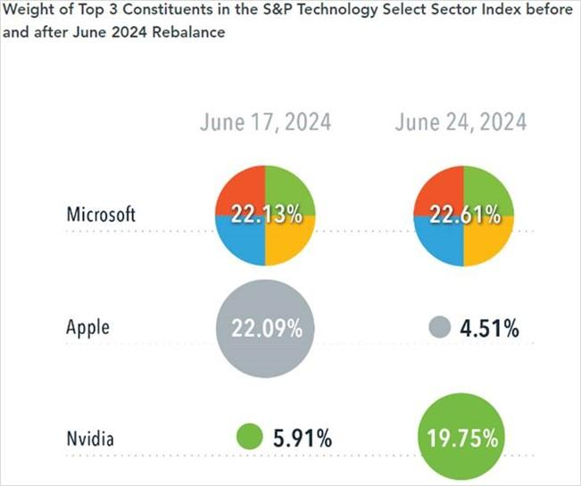

In recent years, the landscape of investing has evolved significantly, driven by the rapid advancement of technology and innovative methodologies. Central to this transformation is the increasing use of algorithmic trading, a sophisticated technique that employs computer algorithms to execute trades at speeds and frequencies that are impossible for a human trader. Algorithmic trading has revolutionized the market by enabling the quick analysis of large datasets, real-time execution of trades, and minimizing the impact of market fluctuations on investment strategies.

A notable factor influencing the dynamics of algorithmic trading is the process of reconstitution. Reconstitution involves the periodic review and adjustment of the composition of market indexes, ensuring they accurately reflect current market conditions and capitalizations. This systemic update is critical for maintaining the relevance of indexes, such as the Russell 3000 and the S&P 500, which serve as benchmarks for a multitude of financial instruments and investment funds. The reconstitution process plays a pivotal role in shaping the investment decisions of market participants, as index funds and portfolios realign their holdings to match the newly defined indexes.



Algorithmic trading is inherently tied to these changes, as the algorithms employed must be capable of recognizing and adapting to the consequences of index reconstitution. This adaptation involves not only rapid response to the addition or removal of stocks but also anticipation of the potential volatility and price shifts that often accompany these periods of adjustment. Consequently, understanding the mechanics of reconstitution and its impact on investment portfolios has become crucial for investors seeking to optimize their trading strategies and enhance returns.

In this article, we explore the concept of reconstitution, its implications for investors, and the evolving role of algorithmic trading in this context. By examining the advantages and challenges associated with modern trading strategies, investors can better position themselves in an ever-changing financial environment.

## Table of Contents

## Understanding Reconstitution

Reconstitution is a critical process in the maintenance of market indexes, vital for ensuring these indexes accurately reflect prevailing market conditions and capitalization. This process involves the periodic review and adjustment of the index's constituent stocks, ensuring alignment with the specific criteria established for the index. These adjustments are not arbitrary; they are determined based on a predefined set of criteria related to the market sector or theme the index is designed to represent. 

### The Mechanics of Reconstitution

Typically, reconstitution involves two primary activities: the addition of new stocks and the removal of existing ones. The criteria for these changes are usually based on factors such as market capitalization, company fundamentals, and sector classification. For instance, a stock may be added to an index if its market capitalization has increased to meet the index's requirements, or conversely, removed if it falls short of these standards.

Indexes like the Russell 3000 and the S&P 500 serve as prime examples of how reconstitution functions in major financial markets. The Russell 3000 Index, which aims to encompass the 3,000 largest U.S. companies, conducts its reconstitution annually to ensure it represents approximately 98% of the investable U.S. equity market. During this annual rebalancing, new companies are evaluated for inclusion based on their current market capitalization and existing companies may be removed if their market capitalization no longer meets the index's thresholds.

Similarly, the S&P 500, an index consisting of 500 large-cap U.S. stocks, undergoes periodic reconstitution to reflect the largest companies by market capitalization. The S&P 500 Index Committee evaluates factors beyond just size, such as [liquidity](/wiki/liquidity-risk-premium) and financial viability, ensuring the index's relevance and effectiveness as a benchmark for large-cap U.S. stocks.

### Importance for Portfolio Managers

For portfolio managers, reconstitution is a crucial task that requires careful planning and execution. The reconstitution of indexes can lead to significant changes in the securities that make up a portfolio, necessitating adjustments to maintain alignment with investment goals. This alignment is particularly important for passive investment strategies that track the performance of market indexes. 

Portfolio managers must be diligent in monitoring the criteria changes that trigger reconstitution. They must ensure their portfolios reflect the updated structure of the underlying indexes to avoid tracking errors. Moreover, reconstitution events often result in notable trading volumes as index funds adjust their holdings, affecting stock prices and market dynamics.

In summary, reconstitution is a vital process in the architecture of market indexes, ensuring they continuously mirror current market realities and sector themes. This process impacts numerous stakeholders, particularly portfolio managers who rely on accurate index representations to guide their investment strategies.

## The Impact of Reconstitution on Investors

Reconstitution significantly impacts investors by causing shifts in stock prices as index funds adjust their holdings to align with newly constituted indexes. This periodic adjustment involves the inclusion and exclusion of stocks from index funds, leading to changes in demand for the affected securities, which can influence their market prices. For example, when a stock is added to a major index, it often experiences a temporary price increase due to the surge in demand from index funds that aim to replicate the index. Conversely, stocks removed from an index may face diminished demand and a subsequent drop in their stock prices.

These changes can lead to increased market [volatility](/wiki/volatility-trading-strategies), as the reconstitution process creates additional trading activity around the stocks being added or removed. This volatility presents both risks and opportunities. Savvy investors can capitalize on these price movements by anticipating which stocks might be added to or removed from significant indexes and adjusting their portfolios accordingly. This strategy, however, requires a deep understanding of the criteria used for index inclusion and a keen sense of timing to execute trades effectively.

One of the key challenges for investors is to comprehend the mechanics behind reconstitution to mitigate risks and optimize returns. Understanding the criteria and timing of index reconstitution can help investors align their strategies to benefit from these adjustments. Additionally, monitoring market trends and investor sentiment around reconstitution periods can provide insights into potential market movements. Such knowledge is crucial because emotional responses to reconstitution-related volatility can often exaggerate price swings, creating opportunities for informed investors to exploit.

For hypothetical analysis, let's consider a Python snippet to analyze potential price impact during reconstitution:

```python
import numpy as np

# Simulate stock prices
np.random.seed(42)
stocks_added = np.random.normal(loc=5, scale=2, size=10)  # Stocks added to the index
stocks_removed = np.random.normal(loc=-3, scale=1.5, size=10)  # Stocks removed from the index

# Calculate impact on an investor's portfolio
portfolio_value = 1000  # Initial portfolio value
impact_added = stocks_added.mean() / 100 * portfolio_value
impact_removed = stocks_removed.mean() / 100 * portfolio_value

total_impact = impact_added + impact_removed
print(f"Estimated impact on portfolio: ${total_impact:.2f}")
```

This script simulates the average price change for stocks added to or removed from an index and calculates the potential impact on an investor's portfolio. Such analysis can help investors quantify potential risks and returns associated with reconstitution.

Ultimately, the impact of reconstitution on investors is multifaceted, influencing stock prices, volatility, and investor sentiment. By understanding these dynamics, investors can strategically adjust their portfolios to benefit from the opportunities while managing the associated risks.

## Algorithmic Trading and Reconstitution

Algorithmic trading employs advanced computer programs to execute trades with high speed and precision. These algorithms analyze vast datasets to identify trading opportunities, often capitalizing on minute price discrepancies that occur due to market volatility or specific events such as index reconstitutions. When market indexes are reconstituted, the composition of these indexes is updated, adding or removing stocks based on specific criteria. This creates opportunities for [algorithmic trading](/wiki/algorithmic-trading) strategies that can quickly react to the changes.

The frequent reconstitutions of indexes, like the Russell 3000 or the S&P 500, necessitate that algorithmic trading strategies be flexible and adaptable. Algorithms are designed to detect patterns and execute trades in milliseconds, which allows firms to capitalize on any temporary inefficiencies caused by reconstitution. With such speed, traders can either benefit from anticipated changes in stock demand or hedge against potential losses due to index adjustments.

One of the primary benefits of algorithmic trading during reconstitution periods is the ability to handle high volumes of trades without the delays inherent in manual trading. This efficiency not only enhances profitability but also reduces the likelihood of human error. Furthermore, the systematic nature of algorithmic trading ensures consistency in executing strategies based on predetermined criteria, thus eliminating emotional decision-making.

However, rapid algorithmic trades during reconstitution periods also present challenges. These include increased market volatility as algorithms from various trading firms react simultaneously, potentially exacerbating price swings. High-frequency trading can lead to liquidity issues, as large volumes of shares are traded within short periods, sometimes impacting smaller stocks more severely. Additionally, the opacity of some algorithmic strategies can raise ethical concerns, as market participants may not fully understand the cause of rapid price movements.

The technological complexity inherent in algorithm development requires robust risk management practices. Algorithms must be rigorously tested under various market conditions to ensure that they respond appropriately to unexpected data points. This includes stress-testing to account for potential market disruptions and incorporating safeguards to prevent excessive trading or erroneous trades.

In conclusion, while algorithmic trading during reconstitution periods provides significant opportunities for trading firms, it also introduces complications that require careful oversight. Traders must balance the speed and efficiency of algorithms with a comprehensive understanding of the evolving market landscape induced by index reconstitutions. This balance is crucial for maintaining both market stability and profitability.

## Challenges and Opportunities in Algorithmic Trading

Algorithmic trading, characterized by its efficiency and precision, leverages complex algorithms to execute trades at speeds and frequencies beyond human capability. However, the benefits of this advanced trading approach come with several challenges, primarily related to data quality, market volatility, and ethical considerations.

Data quality is paramount in algorithmic trading as the accuracy of input data directly influences the effectiveness of trading decisions. Poor data quality can lead to incorrect predictions and consequentially, financial losses. Ensuring high-quality data involves rigorous validation and real-time updating, as delayed or erroneous data may skew performance indicators and decision-making algorithms.

Market volatility adds another layer of complexity. When markets are particularly volatile, the pre-programmed rules of an algorithm might not adapt to sudden and unexpected changes, potentially exacerbating losses. Traders must implement robust risk management strategies, often through [backtesting](/wiki/backtesting) algorithms against historical data, to mitigate these risks. An essential consideration is setting appropriate stop-loss orders and dynamically adjusting exposure to volatile assets to prevent catastrophic failures during sudden market shifts.

Ethical concerns arise in the transparency and fairness of algorithmic systems. Algorithms can inadvertently reinforce market inequalities or engage in unfair trading practices like "front-running," where an entity capitalizes on foreknowledge of pending trades. Addressing these concerns requires rigorous oversight and the development of ethical guidelines, such as ensuring fair access to market data and transparency in algorithmic decision-making processes.

Despite these challenges, the opportunities introduced by [artificial intelligence](/wiki/ai-artificial-intelligence) (AI) and [machine learning](/wiki/machine-learning) (ML) are substantial. AI and ML enable algorithms to learn from data patterns, optimize strategies over time, and predict market trends with higher accuracy. These capabilities can lead to more informed trading decisions and an increased capacity to exploit market inefficiencies. 

Participants in the financial markets can strategically benefit from these advancements by adopting hybrid models that integrate human expertise with algorithmic precision. This combination can enhance the understanding and interpretation of nuanced market signals that algorithms might overlook and ensure ethical considerations are met. Moreover, continuous innovation and adaptation of AI technologies can provide a competitive advantage in an evolving market landscape, enhancing both profitability and market integrity.

Navigating the complexities of algorithmic trading involves balancing technological capabilities with strategic oversight. By addressing data quality, market volatility, and ethical transparency, and embracing AI's potential, investors can better position themselves to capitalize on the rapid advancements in algorithmic trading.

## Conclusion

As the dynamics of the financial markets continue to evolve, understanding the interplay between reconstitution and algorithmic trading becomes increasingly critical. The financial landscape is shaped by rapid technological advancements and evolving market indices, urging investors to remain vigilant and adaptive in their strategies. The adaptation to these changes is not merely a recommendation but a necessity for those aiming to thrive.

Investors who wish to excel in this environment must leverage the power of algorithmic trading while comprehending the intricacies of reconstitution. Algorithmic trading, with its precision and speed, offers a competitive edge by allowing investors to react promptly to market fluctuations caused by index reconstitution. Mastery of these tools can lead to optimized portfolio performance and enhanced return on investments.

Moreover, investors can better navigate shifting market landscapes by appreciating the complexities of reconstitution. This involves staying updated on changes in index compositions and understanding how these alterations impact stock prices and overall market dynamics. Recognizing patterns and trends during reconstitution enables investors to anticipate price movements and tailor their trading strategies accordingly.

To harness these opportunities effectively, a strategic balance between human oversight and technological integration is essential. While algorithms can process vast amounts of data quickly, human judgment is crucial in making informed decisions and managing ethical considerations. By integrating algorithmic capabilities with insightful human analysis, investors can mitigate risks and capitalize on the unique opportunities that modern trading strategies present.

In conclusion, the path to successful investing in today's financial markets lies in a well-rounded approach that combines the benefits of technological advancements in algorithmic trading with a deep understanding of index reconstitution. This balanced strategy offers the means to navigate the complexities of modern markets and achieve sustainable investment growth.

## References & Further Reading

[1]: Aldridge, I. (2013). ["High-Frequency Trading: A Practical Guide to Algorithmic Strategies and Trading Systems."](https://www.amazon.com/High-Frequency-Trading-Practical-Algorithmic-Strategies/dp/1118343506) Wiley Finance.

[2]: Harris, L. (2002). ["Trading and Exchanges: Market Microstructure for Practitioners."](https://academic.oup.com/book/52292) Oxford University Press.

[3]: Lo, A. W., & MacKinlay, A. C. (1999). ["A Non-Random Walk Down Wall Street."](https://www.jstor.org/stable/j.ctt7tccx) Princeton University Press.

[4]: Ramaswamy, S. (2010). ["Market Structures and Systemic Risks of Exchange-Traded Funds."](https://www.bis.org/publ/work343.htm) Bank for International Settlements Working Papers No. 343.

[5]: Schumaker, R. P., & Chen, H. (2009). ["Textual Analysis Within Financial Markets: A Survey"](https://www.researchgate.net/publication/220515646_Textual_analysis_of_stock_market_prediction_using_breaking_financial_news_The_AZFin_text_system). Journal of Organizational Computing & Electronic Commerce.