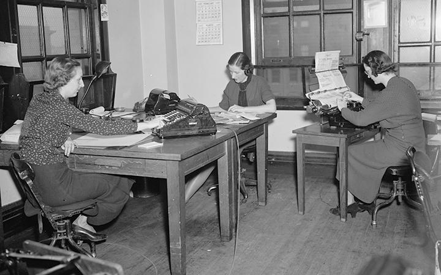

## Table of Contents

## What is the Reconstruction Finance Corporation (RFC)?

The Reconstruction Finance Corporation (RFC) was a government agency set up in the United States in 1932 during the Great Depression. Its main goal was to help banks and businesses that were struggling because of the economic crisis. The RFC provided loans to banks, railroads, and other businesses to help them stay afloat and keep people employed. By doing this, the RFC aimed to stabilize the economy and prevent further collapse.

The RFC was important because it was one of the first big steps the government took to directly help the economy during the Great Depression. It was led by President Herbert Hoover and later expanded by President Franklin D. Roosevelt as part of his New Deal programs. The RFC continued to operate until 1957, playing a role in various economic challenges over the years, including during World War II. Overall, the RFC helped many businesses survive tough times and showed how the government could step in to support the economy.

## When was the RFC established and why?

The Reconstruction Finance Corporation (RFC) was established on January 22, 1932. It was created during the Great Depression, a time when many people lost their jobs and businesses were struggling. The main reason for setting up the RFC was to help these struggling businesses and banks by giving them loans. This was important because it could help prevent more businesses from failing and more people from losing their jobs.

The RFC was started by President Herbert Hoover. He believed that by helping banks and businesses, the economy could start to get better. Later, when Franklin D. Roosevelt became president, he made the RFC even bigger as part of his New Deal programs. The RFC kept working until 1957, helping the economy during different tough times, including World War II. It showed that the government could play a big role in helping the economy when things were really bad.

## What were the primary objectives of the RFC?

The Reconstruction Finance Corporation (RFC) was created to help businesses and banks during the Great Depression. Its main goal was to give loans to these struggling organizations so they could keep running and not go bankrupt. By doing this, the RFC wanted to stop the economy from getting worse and help it start to recover. The RFC focused on helping big businesses like railroads and banks because they were important for the whole economy.

Another important objective of the RFC was to keep people employed. When businesses got loans from the RFC, they could keep paying their workers. This was crucial because many people were out of work during the Great Depression, and having a job meant they could support themselves and their families. The RFC's efforts to support businesses and keep them open helped to reduce the number of people who were unemployed.

## How did the RFC operate during the Great Depression?

During the Great Depression, the RFC worked by giving loans to banks, railroads, and other big businesses that were in trouble. It started in 1932, and its job was to help these businesses keep going so they wouldn't go bankrupt. The RFC would check if a business really needed help and then give them money to pay their bills and keep running. This was important because if too many businesses failed, it would make the economy even worse. So, the RFC tried to stop that from happening by helping businesses stay open.

The RFC also wanted to help people keep their jobs. When businesses got loans from the RFC, they could keep paying their workers. This was a big deal because lots of people were out of work during the Great Depression. If people had jobs, they could take care of themselves and their families. The RFC's work helped to make sure more people stayed employed. Over time, as President Franklin D. Roosevelt made the RFC bigger with his New Deal programs, it played an even bigger role in trying to fix the economy.

## What types of financial assistance did the RFC provide?

The RFC provided loans to different types of businesses that were struggling during the Great Depression. It mainly gave money to banks, railroads, and other big companies. The RFC would check if a business really needed help, and if it did, it would give them a loan to help them pay their bills and keep running. This was important because if too many businesses failed, it would make the economy even worse. So, the RFC tried to stop that from happening by giving businesses the money they needed to stay open.

Another way the RFC helped was by giving loans to smaller businesses and farmers. This was part of the New Deal programs that President Franklin D. Roosevelt started. By helping smaller businesses and farmers, the RFC aimed to keep more people employed. When these businesses and farms got loans, they could keep paying their workers. This was a big deal because lots of people were out of work during the Great Depression. If people had jobs, they could take care of themselves and their families.

The RFC also bought preferred stock in banks and other businesses. This was another way to give them money without giving them a loan. By buying stock, the RFC helped these businesses get the money they needed to keep going. This kind of help was important because it gave businesses different ways to get the financial support they needed during tough times.

## How did the RFC's role evolve over time?

When the RFC started in 1932, its main job was to give loans to big businesses like banks and railroads that were struggling during the Great Depression. It wanted to help these businesses stay open so they wouldn't go bankrupt. This was important because if too many businesses failed, it would make the economy even worse. The RFC checked if a business really needed help and then gave them money to pay their bills and keep running. It also wanted to help people keep their jobs because if businesses stayed open, they could keep paying their workers.

As time went on, the RFC's role changed and grew. When Franklin D. Roosevelt became president, he made the RFC bigger as part of his New Deal programs. The RFC started giving loans to smaller businesses and farmers too. This was important because it helped more people stay employed. The RFC also started buying preferred stock in banks and other businesses, which was another way to give them money without giving them a loan. During World War II, the RFC helped with war production by giving loans to companies that made things for the war. The RFC kept working until 1957, helping the economy during different tough times.

## What were the major achievements of the RFC?

The RFC helped a lot during the Great Depression. It gave loans to big businesses like banks and railroads so they wouldn't go bankrupt. This was important because if these businesses stayed open, they could keep paying their workers. By doing this, the RFC helped to stop the economy from getting even worse. It also checked if a business really needed help before giving them money. This made sure the loans went to the places that needed them the most.

As time went on, the RFC did even more. When President Franklin D. Roosevelt started his New Deal programs, the RFC got bigger. It started giving loans to smaller businesses and farmers too. This helped more people keep their jobs. The RFC also bought stock in banks and other businesses, which was another way to give them money. During World War II, the RFC helped with war production by giving loans to companies that made things for the war. By the time it stopped working in 1957, the RFC had played a big role in helping the economy during many tough times.

## How did the RFC impact the U.S. economy during its operation?

The RFC had a big impact on the U.S. economy during its operation. When it started in 1932, the country was in the middle of the Great Depression. Many businesses were struggling, and people were losing their jobs. The RFC gave loans to big businesses like banks and railroads to help them stay open. By doing this, the RFC helped to stop the economy from getting even worse. It checked if a business really needed help before giving them money, making sure the loans went to the places that needed them the most. This helped businesses keep running and people keep their jobs, which was important for the economy.

As time went on, the RFC did even more to help the economy. When President Franklin D. Roosevelt started his New Deal programs, the RFC got bigger. It started giving loans to smaller businesses and farmers too. This helped more people keep their jobs. The RFC also bought stock in banks and other businesses, which was another way to give them money. During World War II, the RFC helped with war production by giving loans to companies that made things for the war. By the time it stopped working in 1957, the RFC had played a big role in helping the economy during many tough times. Its efforts showed that the government could play a big part in helping the economy when things were really bad.

## What were the criticisms and controversies surrounding the RFC?

Some people didn't like the RFC because they thought it was too secretive. They said the RFC didn't tell the public enough about who got loans and how much money they got. This made people think that the RFC might be helping big businesses more than it should. They worried that the RFC was not being fair and that it was too focused on big banks and railroads instead of helping regular people and smaller businesses.

Another big criticism was that the RFC didn't do enough to help the economy. Some people thought that giving loans to businesses wasn't enough to fix the problems during the Great Depression. They wanted the government to do more to help people directly, like giving them jobs or money. There was also some controversy about whether the RFC's loans were really helping or if they were just keeping bad businesses alive. People argued about whether the RFC was the best way to help the economy get better.

## How was the RFC eventually dissolved and why?

The RFC was finally closed down in 1957. It had been working for a long time, helping the economy during the Great Depression and World War II. But by the mid-1950s, people thought the economy was doing better and didn't need the RFC anymore. So, Congress decided to shut it down. They made a plan to slowly stop the RFC's work and pay back all the money it had borrowed.

The reason for closing the RFC was that the economy had gotten stronger. People felt that the country didn't need the RFC's help as much anymore. There were also some criticisms about how the RFC worked. Some said it was too secretive and focused too much on big businesses. So, when the time came to decide, Congress chose to end the RFC and let other parts of the government handle helping the economy.

## What long-term effects did the RFC have on U.S. financial policy?

The RFC had a big impact on U.S. financial policy in the long run. It showed that the government could step in and help the economy when things were really bad. Before the RFC, people thought the government shouldn't get involved in business too much. But the RFC changed that idea. It made people see that the government could help businesses and banks stay open during tough times. This idea is still important today. Now, the government has more ways to help the economy, like giving money to businesses or helping people who lose their jobs.

The RFC also helped create new ways for the government to help the economy. For example, the idea of giving loans to businesses in trouble became more common. The RFC's work during the Great Depression and World War II showed that this could work. Later, other government programs used similar ideas. Also, the RFC's way of buying stock in businesses to help them became a tool that other parts of the government used. So, the RFC helped shape how the government thinks about helping the economy, and some of its ideas are still used today.

## How does the RFC's model compare to modern economic recovery programs?

The RFC's model is a lot like modern economic recovery programs because it showed that the government could help the economy when things were bad. During the Great Depression, the RFC gave loans to businesses to keep them open and people employed. Today, when there's an economic crisis, the government also steps in to help. For example, during the 2008 financial crisis, the government gave money to banks and businesses to keep them from failing. The RFC's idea of helping businesses directly is still used today, showing that its model was a big step in how the government helps the economy.

But there are also some differences between the RFC and modern programs. The RFC was more focused on giving loans to big businesses like banks and railroads. Today, economic recovery programs often help more kinds of businesses and people directly. For example, during the COVID-19 pandemic, the government gave money to small businesses and people who lost their jobs. Also, modern programs are usually more open about who gets help and how much money they get. This is different from the RFC, which some people criticized for being too secretive. So, while the RFC's basic idea is still used, modern programs have changed and grown to meet new needs.

## References & Further Reading

[1]: Kennedy, Susan Estabrook. ["The Banking Crisis of 1933."](https://archive.org/details/bankingcrisisof10000kenn) University Press of Kentucky, 1973.

[2]: Jesse H. Jones, and Edward Angly. ["Fifty Billion Dollars: My Thirteen Years with the RFC (1932-1945)."](https://archive.org/details/fiftybilliondoll0000jone) The Macmillan Company, 1951.

[3]: Friedman, Milton, and Anna Jacobson Schwartz. ["A Monetary History of the United States, 1867-1960."](https://www.jstor.org/stable/j.ctt7s1vp) Princeton University Press, 1963.

[4]: Ellis W. Hawley. ["Herbert Hoover, the Commerce Secretariat, and the Vision of an ‘Associative State,’ 1921-1928."](https://www.jstor.org/stable/1918256) Journal of Economic History, 1974.

[5]: Carter, Susan B., Gartner, Scott S., Haines, Michael R., Olmstead, Alan L., and Sutch, Richard. ["Historical Statistics of the United States, Earliest Times to the Present: Millennial Edition."](https://hsus.cambridge.org/HSUSWeb/HSUSEntryServlet) Cambridge University Press, 2006. 

[6]: ["High-Frequency Trading: A Practical Guide to Algorithmic Strategies and Trading Systems"](https://www.amazon.com/High-Frequency-Trading-Practical-Algorithmic-Strategies/dp/1118343506) by Irene Aldridge

[7]: Mayer, Thomas. ["The Political Economy of American Monetary Policy."](https://www.cambridge.org/core/books/political-economy-of-american-monetary-policy/CB8D43CE7AF28F5BEE3C93C8B6DACB35) Cambridge University Press, 1990.