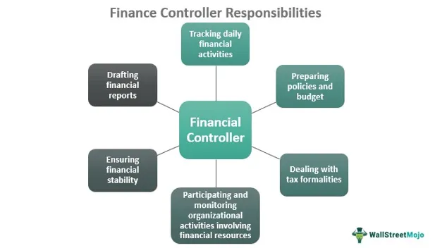

The Reconstruction Finance Corporation (RFC) was a pivotal entity in the United States during the early 20th century, particularly known for its role in stabilizing the economy during the Great Depression. Established in 1932, the RFC provided essential financial support to banks, railroads, mortgage associations, and other businesses during a period of extreme financial distress. Its creation marked a significant shift in federal policy, emphasizing governmental intervention in economic stabilization. The RFC's actions underscored the importance of a lender of last resort, providing a model for future government-led financial assistance programs.

In contrast, algorithmic trading represents a modern advancement in financial markets, leveraging computer algorithms to automate trading decisions. This evolution in trading practices allows for rapid and efficient execution of trades, which has significantly transformed market dynamics. The intersection of algorithmic trading and historical financial rescue efforts like those undertaken by the RFC provides a fascinating study in how financial policies and technologies evolve to address economic challenges.

Understanding the historical significance of the RFC can offer valuable insights into managing contemporary financial crises. During periods of distress, like the 2008 global financial crisis, parallels can be drawn between the RFC’s interventions and modern financial rescue efforts. By exploring the successes and limitations of the RFC, policymakers can glean lessons applicable to current practices, including the management of automated trading environments.

Studying the economic interventions of institutions like the RFC can inform modern financial strategies and policy-making. As financial markets continue to incorporate advanced technologies, such as algorithmic trading, the relevance of historical examples becomes increasingly apparent. These lessons are crucial in designing effective economic policies that ensure stability and growth in an ever-evolving financial landscape.

## Table of Contents

## What Was the Reconstruction Finance Corporation (RFC)?

The Reconstruction Finance Corporation (RFC) was established in 1932 under the Hoover administration as a response to the economic turmoil of the Great Depression. Its primary purpose was to provide financial support to banks, industries, and state and local governments to stimulate economic recovery and restore confidence in the American financial system. Congress intended the RFC to function as an independent agency with substantial financial resources to avert the deepening economic crisis. Initially capitalized with $500 million, the RFC had the authority to borrow up to $1.5 billion, an allocation reflecting the scale of the challenges it aimed to address.

During the Great Depression, the RFC played a pivotal role as a financial stabilizer. Its primary function was to act as a lender of last resort, offering loans to financial institutions, railroads, and businesses struggling to stay afloat. This intervention was crucial in preventing further bankruptcies and unemployment, which were rampant during the period. By providing emergency loans, the RFC helped maintain the liquidity of financial institutions, thus preserving their operations and securing depositors' funds.

As the economic crisis persisted, the role of the RFC expanded under President Franklin D. Roosevelt's New Deal legislation. The Emergency Relief and Construction Act of 1932 intensified the RFC's functions to include support for public works, infrastructure projects, and assistance to state and local governments. This broader mandate was instrumental in fostering economic growth and development, facilitating job creation, and improving public infrastructure.

The RFC's establishment as a lender of last resort marked a significant departure from previous US financial policy, where federal intervention in the economy was minimal. The agency set historical precedents for government involvement in economic stabilization, which would later influence the formation of other financial assistance programs. By proving the efficacy of federal intervention during severe economic challenges, the RFC laid the groundwork for future financial policies designed to address economic crises.

## The Impact of RFC on Financial Industries

The Reconstruction Finance Corporation (RFC) played a critical role in stabilizing key financial sectors during the Great Depression, addressing severe economic challenges and restoring confidence among banks, railroads, and farms. Originally established under President Herbert Hoover in 1932, the RFC's primary mandate was to provide financial support to banks and other financial institutions to prevent insolvencies and maintain the functionality of the financial system.

**Stabilizing Banks**: One of the RFC's main tasks was to bolster the banking sector, which was experiencing widespread failures as a consequence of the economic downturn. By infusing capital into struggling banks, the RFC aimed to restore liquidity and prevent further bank runs. The RFC was authorized to make loans to banks and trust companies that were unable to meet their obligations due to the withdrawal of deposits. This financial intervention was crucial in mitigating the ripple effects of bank failures on the wider economy. The RFC extended approximately $1.5 billion in loans to banks, helping to stabilize the banking industry and rebuild public trust in the financial system.

**Railroads and Infrastructure**: Recognizing the strategic importance of railroads in the national economy, the RFC also extended financial assistance to this sector. Railroads were a backbone of economic infrastructure, responsible for transporting goods and materials across the country. However, many railroads faced insolvency due to decreased demand and financial mismanagement. The RFC provided loans to railroads to maintain operations and ensure that critical transportation networks remained functional, facilitating economic activity and workforce mobility during the depression.

**Support for Farms**: The agricultural sector was deeply affected by the economic depression, with falling prices and reduced demand causing severe financial stress for farmers. The RFC extended aid to farmers directly and through intermediary agricultural banks and cooperatives. By providing these loans, the RFC sought to stabilize farm incomes and sustain agricultural production, which was vital for both domestic food security and economic activity.

**Expansion Under Roosevelt**: The RFC's role expanded under President Franklin D. Roosevelt's New Deal. Roosevelt broadened the RFC's mandate to incorporate new forms of financial assistance aimed at broader economic recovery. This included supporting mortgage lenders and underwriting public works programs, as well as providing capital for industrial and commercial enterprises to stimulate job creation and economic growth.

**Impact on State and Local Governments**: Beyond individual industries, the RFC also extended its financial assistance to state and local governments. During the Great Depression, many of these governmental units faced severe budgetary constraints as tax revenues plummeted. The RFC provided loans to help these governments continue essential services and public projects, addressing both the immediate fiscal challenges and longer-term infrastructure needs. This support was pivotal in helping local governments maintain public services, thus preventing further economic and social deterioration.

The RFC's interventions demonstrated the potential of a federal entity to act decisively in times of economic crisis, providing a model for subsequent financial rescue efforts. The RFC not only addressed short-term [liquidity](/wiki/liquidity-risk-premium) issues but also contributed to broader economic stability by maintaining critical infrastructure and services, laying the groundwork for recovery.

## Algorithmic Trading: An Overview

Algorithmic trading refers to the use of algorithms to automate trading decisions in financial markets. These algorithms, which can vary in complexity from simple rules to sophisticated mathematical models, facilitate the running of trades at speeds and frequencies that a human trader would struggle to achieve. By leveraging computational algorithms, traders and institutions execute orders based on pre-defined criteria, often drawing from a multitude of market variables, including price, timing, and [volume](/wiki/volume-trading-strategy).

**Benefits of Algorithmic Trading**

One of the primary advantages of [algorithmic trading](/wiki/algorithmic-trading) is the increased speed of execution, which is crucial in markets where prices can fluctuate rapidly. Algorithms can process complex calculations and place orders in fractions of a second, enabling traders to capitalize on market opportunities that are time-sensitive. Additionally, these trading systems reduce the impact of human emotions and biases, leading to more consistent and objective decision-making.

Furthermore, algorithmic trading enhances market liquidity by ensuring a steady volume of buy and sell orders, thereby tightening bid-ask spreads and reducing transaction costs. By optimizing trading strategies through [backtesting](/wiki/backtesting) on historical market data, traders can also improve their strategies over time, refining them for better performance in future market conditions.

**Challenges of Algorithmic Trading**

Despite its benefits, algorithmic trading poses significant challenges. One of the most pressing concerns is the risk of market [volatility](/wiki/volatility-trading-strategies) exacerbated by automated systems, which can lead to flash crashes or erratic trading behavior. When multiple algorithmic systems react simultaneously to the same market signals, they can trigger significant price movements. Additionally, programming errors and flaws in algorithm design can result in substantial financial losses.

Regulatory challenges also arise, as algorithmic trading can outpace traditional oversight mechanisms. Ensuring that these automated systems comply with market regulations and ethical standards is an ongoing concern for regulatory bodies worldwide.

**Key Technologies and Strategies in Algorithmic Trading**

Algorithmic trading relies heavily on advanced technologies and computational resources. High-frequency trading ([HFT](/wiki/high-frequency-trading-strategies)), a subset of algorithmic trading, is characterized by high-speed data connections and specialized hardware for minimal latency. Technologies such as co-location, where trading systems are placed in close proximity to exchange servers, further reduce transaction times.

In terms of strategies, algorithmic trading encompasses a variety of techniques. Statistical [arbitrage](/wiki/arbitrage) strategies exploit pricing inefficiencies between related financial instruments, while market-making strategies involve placing simultaneous buy and sell orders to capitalize on price spreads. Other common strategies include [trend following](/wiki/trend-following), which uses historical price patterns to predict future movements, and mean reversion, which assumes that prices will revert to their historical averages over time.

In summary, while algorithmic trading offers substantial benefits in terms of speed, efficiency, and objectivity in trading, it also presents challenges related to market stability and regulatory compliance. As technology advances, the development and refinement of these algorithms will continue to shape the landscape of modern financial markets.

## Connecting RFC's Financial Assistance and Modern Algorithmic Trading

The Reconstruction Finance Corporation (RFC), established during the Great Depression, provided critical financial assistance to stabilize the economy by injecting liquidity into key industries such as banks, railroads, and farms. This intervention was akin to acting as a catalyst, restoring confidence in financial systems by functioning as a lender of last resort. In contemporary financial markets, particularly in the algorithmic trading sector, the presence of a stabilizing force similar to the RFC can have significant implications.

Algorithmic trading, which constitutes a substantial part of modern financial markets, relies on complex algorithms to execute trades at speeds and frequencies impractical for human traders. These systems are sensitive to market volatility and liquidity constraints. If an institution analogous to the RFC were to intervene in today's markets, it could potentially influence the risk models within algorithmic trading systems. For instance, liquidity injections or guarantees might lead algorithms to adjust their trading strategies to accommodate new risk-reward dynamics introduced by increased market liquidity.

The RFC’s historical interventions offer valuable lessons for managing financial crises that impact algorithmic trading. One potential lesson is the importance of timely, targeted liquidity provisions to counteract panic selling and restore market confidence—similar to how the RFC stabilized banks and railroads. In the context of algorithmic trading, such interventions could prevent cascading failures that arise when algorithms react to rapid market movements, a phenomenon observed during events like the Flash Crash of 2010.

Moreover, historical precedents set by the RFC can inform current financial policies affecting automated trading systems. The RFC's role in setting a regulatory framework for stabilization presents a blueprint for modern oversight mechanisms. Policies inspired by RFC-like interventions could include ensuring transparency in algorithmic strategies or requiring stress tests for algorithms to gauge their resilience in liquidity-shocked environments. A potential policy could mandate a "circuit breaker" mechanism, pausing trading under extreme volatility conditions to prevent systemic collapse—a concept aligning with the RFC's stabilizing actions in the past.

In conclusion, the insights derived from the RFC's historical role as a financial stabilizer underscore the need for robust intervention mechanisms in financial markets replete with algorithmic trading. These mechanisms must be adept at managing liquidity crises and ensuring systemic stability, drawing from the successes and lessons of past financial rescue endeavours.

## Economic Review of the Reconstruction Finance Corp.

The Reconstruction Finance Corporation (RFC), established in 1932, played a pivotal role in stabilizing the U.S. economy during the Great Depression. The economic outcomes of its actions are multifaceted, influencing various sectors and sparking debates over its long-term effectiveness.

### Analysis of Economic Outcomes

The RFC allocated over $2 billion within its first year, primarily to banks, railroads, mortgage associations, and local governments. The immediate economic outcome was a decrease in bank failures, which had been rampant at the height of the Great Depression. By providing liquidity to financial institutions, the RFC aimed to restore public confidence in the banking system. This infusion of capital helped stabilize credit markets and facilitated an eventual economic recovery.

The RFC’s intervention extended beyond mere financial support; it also established precedents for government involvement in economic stabilization. By the end of its operations, the RFC had provided approximately $35 billion in loans and investments, underscoring its extensive influence on the U.S. economy.

### Debates on Effectiveness

The effectiveness of the RFC's strategies has been a subject of extensive debate. Critics argue that the RFC's focus on larger banks and industries neglected smaller businesses and agricultural sectors, which were also struggling. Moreover, some economists contend that the RFC’s approach may have delayed necessary economic adjustments by supporting non-viable institutions.

Proponents, however, assert that without the RFC’s interventions, the economic downturn could have been more severe and prolonged. The RFC's model of providing financial aid to critical sectors served as a blueprint for future economic policies, demonstrating the potential of government action in stabilizing financial markets.

### Case Studies on Economic Recovery and Innovation

A notable case study is the RFC's intervention in the banking sector. By mid-1933, the agency had managed to significantly reduce bank failures from the peaks seen in previous years. This stabilization allowed for the reestablishment of credit lines, crucial for business operations and consumer spending, thereby gradually revitalizing economic activity.

In the railroad industry, the RFC's assistance facilitated operational improvements and infrastructure investments. This not only preserved a vital mode of transportation during the economic downturn but also spearheaded innovations that would enhance efficiency and service in the long run.

The RFC's involvement in mortgage associations, particularly the establishment of the Federal Home Loan Bank System, exemplified its impact on home ownership and real estate markets. By providing much-needed liquidity to lenders, the RFC indirectly supported housing market stability and prevented further economic contraction.

In summary, the economic review of the Reconstruction Finance Corporation reveals a complex interplay between immediate financial stabilization and long-term economic policy development. While debates on its effectiveness persist, the RFC's legacy informs contemporary approaches to economic crises, highlighting the critical role of timely and targeted governmental interventions.

## Conclusion

The Reconstruction Finance Corporation (RFC) played an essential role in stabilizing the U.S. financial landscape during periods of economic turbulence such as the Great Depression and World War II. By acting as a lender of last resort, the RFC injected much-needed liquidity into critical sectors like banking, railroads, and agriculture, thereby averting systemic failures. Its ability to provide emergency funding and financial assistance helped restore confidence in the financial system, ultimately contributing to economic recovery and growth.

There are noticeable parallels between the strategies employed by the RFC and contemporary financial interventions. Modern governments and central banks, much like the RFC, seek to stabilize economies during crises through measures such as quantitative easing and fiscal stimulus. Both past and present interventions underscore the importance of strategic financial management to mitigate market disruptions and promote recovery.

Studying historical financial strategies, such as those implemented by the RFC, is crucial in shaping future economic policies. They offer valuable lessons on managing financial distress and illustrate the importance of timely and decisive government action to safeguard economic stability. The RFC's approach highlights the potential benefits of having mechanisms in place to provide targeted financial support during economic downturns, informing current and future policymakers as they design strategies to tackle financial challenges. The legacy of the RFC suggests that while financial systems and technologies evolve, the fundamental need for risk mitigation and strategic intervention remains a constant priority in economic governance.

## References & Further Reading

[1]: Kennedy, Susan Estabrook. ["The Banking Crisis of 1933."](https://archive.org/details/bankingcrisisof10000kenn) University Press of Kentucky, 1973.

[2]: Jesse H. Jones, and Edward Angly. ["Fifty Billion Dollars: My Thirteen Years with the RFC (1932-1945)."](https://archive.org/details/fiftybilliondoll0000jone) The Macmillan Company, 1951.

[3]: Friedman, Milton, and Anna Jacobson Schwartz. ["A Monetary History of the United States, 1867-1960."](https://www.jstor.org/stable/j.ctt7s1vp) Princeton University Press, 1963.

[4]: Ellis W. Hawley. ["Herbert Hoover, the Commerce Secretariat, and the Vision of an ‘Associative State,’ 1921-1928."](https://www.jstor.org/stable/1918256) Journal of Economic History, 1974.

[5]: Carter, Susan B., Gartner, Scott S., Haines, Michael R., Olmstead, Alan L., and Sutch, Richard. ["Historical Statistics of the United States, Earliest Times to the Present: Millennial Edition."](https://hsus.cambridge.org/HSUSWeb/HSUSEntryServlet) Cambridge University Press, 2006. 

[6]: ["High-Frequency Trading: A Practical Guide to Algorithmic Strategies and Trading Systems"](https://www.amazon.com/High-Frequency-Trading-Practical-Algorithmic-Strategies/dp/1118343506) by Irene Aldridge

[7]: Mayer, Thomas. ["The Political Economy of American Monetary Policy."](https://www.cambridge.org/core/books/political-economy-of-american-monetary-policy/CB8D43CE7AF28F5BEE3C93C8B6DACB35) Cambridge University Press, 1990.