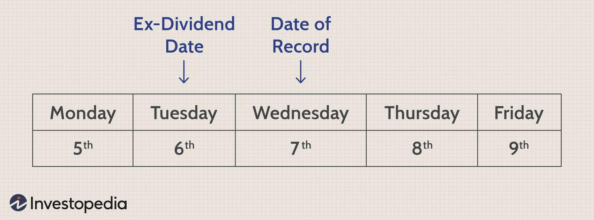

Dividend investing is a popular strategy that centers on generating a steady income stream through the acquisition of stocks that pay regular dividends. Investors who adopt this approach often target companies with a robust track record of dividend payments. Such companies, frequently referred to as blue-chip stocks, offer the dual advantage of providing both the potential for capital appreciation and reliable income through dividends. As dividend investing becomes more nuanced, understanding specific dividend dates, including the record date and ex-dividend date, gains importance for strategizing effectively.

Simultaneously, algorithmic trading has emerged as a cornerstone in the investing world by leveraging technology to automate and optimize trading decisions. By using computer algorithms, traders can execute buy and sell orders based on predefined criteria, such as price, timing, and volume. Algorithmic trading enables market participants to respond quickly to market changes, enhancing efficiency and precision in trade execution.



A crucial aspect of dividend investing involves understanding the timeline for dividend eligibility. The record date, established by the company, determines which shareholders are eligible to receive the dividend. The ex-dividend date, typically set one business day before the record date, signifies when the stock trades without the value of its next dividend payment. Investors must be aware of these dates to ensure they qualify for dividend payouts.

This article examines how the integration of detailed knowledge about dividend dates with algorithmic trading techniques can create advantageous trading strategies. By understanding the mechanics of the record date and ex-dividend date, investors can use algorithmic approaches to optimize the timing of their trades. These insights can be particularly valuable in achieving a harmonic balance of income generation and capital gains in today’s complex financial markets.

## Table of Contents

## What is Dividend Investing?

Dividend investing is a strategy that focuses on acquiring stocks that distribute a portion of their earnings to shareholders in the form of dividends. This approach aims to generate a steady income stream, appealing particularly to investors seeking a combination of stability and cash flow from their investments. One of the hallmarks of dividend investing is its focus on blue-chip companies—established firms with a history of stable and reliable dividend payouts. These companies are often leaders in their respective industries and possess the financial fortitude to continue paying dividends even during economic downturns.

Understanding the fundamentals of dividend investing is crucial for forming any comprehensive trading or investment strategy. This involves analyzing metrics such as the dividend yield, the dividend payout ratio, and the historical stability of dividend payments. The dividend yield, expressed as a percentage, is calculated as:

$$
\text{Dividend Yield} = \left( \frac{\text{Annual Dividends per Share}}{\text{Price per Share}} \right) \times 100
$$

This metric helps investors assess the relative income generated by dividends compared to the stock price.

One of the significant advantages of dividend investing is its potential to act as a hedge against market [volatility](/wiki/volatility-trading-strategies). During periods of market uncertainty or downturns, the consistent returns from dividends can provide a level of stability to an investor's portfolio, offsetting some of the negative impacts caused by declining stock prices. Furthermore, this investment style can be aligned with growth strategies through the reinvestment of dividends. By reinvesting dividends, investors can take advantage of compounding, leading to potentially enhanced overall returns over the long term.

Incorporating dividends into a broader investment strategy can also facilitate a balance between income generation and capital appreciation. As such, dividend investing is not solely the domain of conservative investors but can also serve as a viable strategy for those seeking long-term growth with a reduced risk profile.

## Understanding Record Date and Ex-Dividend Date

The record date is a critical component in the process of dividend distribution by publicly traded companies. It is the specific date set by the company to establish which shareholders are eligible to receive the forthcoming dividend. On the record date, the company reviews its list of shareholders and determines those who will receive the dividend payment. This mandates that a shareholder's name must appear on the company's records as of the record date to qualify for the dividend payout.

Linked closely to the record date is the ex-dividend date, which typically precedes the record date by one business day. The ex-dividend date indicates that shares purchased on or after this date will not [carry](/wiki/carry-trading) the impending dividend payment. Therefore, to be eligible to receive the dividend, investors must purchase the stock at least one business day before the ex-dividend date to ensure their purchase is settled by the record date.

Understanding this timeline of events is crucial for investors, as it directly impacts their ability to receive dividends. The sequence is as follows:

1. **Declaration Date**: The company announces an upcoming dividend, including the amount, record date, and payment date.
2. **Ex-Dividend Date**: The stock begins trading without the value of the next dividend. Purchasers on this date or later will not receive the dividend.
3. **Record Date**: The company checks its records to confirm eligible shareholders based on those settled by the previous day.
4. **Payment Date**: Dividends are paid to the shareholders who are on the record as of the record date.

Stock prices often fluctuate in response to these dividends dates. On the ex-dividend date, the stock price usually decreases by approximately the dividend amount, reflecting the detachment of the upcoming dividend from new shares traded from this date. This adjustment represents the market's anticipation of the reduction in corporate asset value as dividends are paid out.

For algorithmic traders, integrating the knowledge of these dates into trading models can optimize strategies. Algorithms can be programmed to anticipate and react to price adjustments around the ex-dividend date, helping traders in scheduling their purchases and sales to align with optimal price points.

Though the exact timing and impact on stock price may vary, understanding the implications of record and ex-dividend dates can enhance dividend investing strategies and potentially lead to advantageous trading opportunities.

## The Role of Algorithmic Trading in Dividend Investing

Algorithmic trading, often referred to as algo trading, is a method that employs computer algorithms to automate trading decisions in financial markets. It leverages highly advanced mathematical models to solve complex trading equations at high speed, which is particularly beneficial when applied to dividend investing. By accounting for factors such as the timing of dividend dates, algorithms offer a robust framework for optimizing the purchase and sale of dividend-paying stocks.

Traders use algorithms to meticulously account for the timing of dividend dates, including the ex-dividend and record dates, which can affect stock prices and investor eligibility for dividend payouts. Through a data-driven approach, algorithms analyze vast amounts of historical price and dividend data to identify patterns and predict future price movements. This allows traders to anticipate market reactions to dividends and strategically time their trades to maximize returns.

The efficiency and speed associated with algorithmic systems provide investors with the capability to exploit short-term price fluctuations around dividend dates. Stocks often experience predictable price adjustments when they trade ex-dividend, which can be utilized by an algorithm to execute trades in milliseconds. This rapid execution minimizes the impact of transaction costs and slippage, enhancing profitability.

In addition to speed, [algorithmic trading](/wiki/algorithmic-trading) incorporates fundamental and technical analysis to refine investment strategies. Fundamental analysis involves assessing a company's financial health, such as earnings reports and dividend sustainability, while technical analysis examines historical market data to forecast future price movements. Algorithms synthesize these analyses to generate actionable insights, enabling investors to predict stock performance with greater accuracy.

For instance, Python, a preferred language for developing trading algorithms, can be used to handle these tasks efficiently. An algorithm can be designed to track dividend-related announcements and price histories, execute simulated trades to test strategies, and optimize buy and sell thresholds. A basic Python script might use libraries such as pandas for data management, numpy for numerical analysis, and scipy for optimization, along with tools like TA-Lib for technical analysis.

An illustration of a Python-based approach:

```python
import pandas as pd

# Load stock data
data = pd.read_csv('stock_data.csv')

# Calculate moving average
data['30-day MA'] = data['Close'].rolling(window=30).mean()

# Define function to check buy/sell conditions based on dividend timing
def trade_decision(row):
    if row['Dividend Date'] > today and row['30-day MA'] > row['Close']:
        return 'Buy'
    elif row['Dividend Date'] <= today and row['30-day MA'] < row['Close']:
        return 'Sell'
    else:
        return 'Hold'

# Apply the trading decision function
data['Decision'] = data.apply(trade_decision, axis=1)
```

In essence, the integration of algorithmic trading into dividend investing strategies empowers investors to make informed, timely decisions. By combining the power of data analysis and rapid execution technologies, investors can enhance their capacity to generate consistent returns while navigating market dynamics.

## Strategies for Dividend Investing and Algo Trading

Incorporating strategies that harness both dividend investing and algorithmic trading offers potential for optimizing portfolio returns. One effective approach is constructing a portfolio centered on 'dividend growth' stocks—securities from companies with a strong track record or the potential for increasing dividend payouts over time. This strategy not only provides a growing income stream but also positions the investor to benefit from potential capital appreciation as the market recognizes and rewards these companies for their dividend policies.

Algorithmic strategies can exploit historical price adjustments surrounding ex-dividend dates. Stocks often experience price changes due to buyer and seller reactions to dividends, presenting opportunities to capitalize on these fluctuations. Traders can use quantitative methods to identify patterns or inefficiencies in the price adjustments of dividend-paying stocks. By harnessing these historical trends, algorithms can execute trades that aim to profit from predictable price movements.

Predictive analytics further enhance this strategic approach. Traders may integrate [machine learning](/wiki/machine-learning) models to anticipate future changes in dividend yields based on financial metrics, industry trends, or macroeconomic indicators. By aligning trades with these forecasts, investors can potentially gain an edge by positioning themselves advantageously ahead of market reactions.

Risk management remains a cornerstone of any investment strategy. It is essential to rigorously test algorithms across various market conditions to ensure they align with investor goals and risk tolerance. This involves [backtesting](/wiki/backtesting) strategies with historical data, stress-testing in simulated environments, and continuously optimizing based on changing market dynamics.

By aligning algorithmic trading with a robust dividend investment strategy, investors can potentially enhance both income generation and capital appreciation. This integrated approach combines the steady income benefits of dividend investing with the tactical advantages of algorithmic trading, providing a comprehensive framework for navigating the complexities of modern financial markets.

## Challenges and Considerations

Both dividend investing and algorithmic trading present unique challenges that investors must navigate to mitigate risks and optimize potential returns. 

Market volatility is a critical [factor](/wiki/factor-investing) impacting both strategies. Fluctuations in stock prices can affect the reliability of dividend payments, as companies may adjust their dividend policies in response to economic downturns or financial strain. For instance, firms might reduce or suspend dividends to preserve cash, impacting investors who rely on this income stream. A key measure of market volatility is the standard deviation of stock returns, which investors can use to assess potential risks. 

Algorithmic trading systems, while offering speed and efficiency, also come with their own set of considerations. Regulatory frameworks governing algorithmic trading are complex and vary by jurisdiction. Adherence to these regulations is essential to avoid legal repercussions. Additionally, the transaction costs associated with executing high-frequency trades can accumulate significantly, potentially eroding profits. It is crucial to precisely calculate expected costs using formulas such as:

$$
\text{Total Cost} = n \times C
$$

where $n$ is the number of transactions, and $C$ is the cost per transaction.

Technical failures within trading systems pose another substantial risk. Glitches or unexpected system behavior can lead to erroneous trades, causing financial losses. To mitigate this, robust backtesting and fail-safe mechanisms should be integrated into trading algorithms. Implementing a grid search in Python to optimize algorithm parameters could enhance system resilience: 

```python
from sklearn.model_selection import GridSearchCV

# Example configuration
param_grid = {'parameter_name': [value1, value2, value3]}

# Grid search implementation
grid_search = GridSearchCV(estimator=YourModel(), param_grid=param_grid, cv=5)
grid_search.fit(X_train, y_train)
best_parameters = grid_search.best_params_
```

Moreover, investors should stay alert to changes in corporate policies regarding dividends and broader market conditions that might signal a shift in the investment landscape. Monitoring earnings reports and economic indicators can provide insights into potential dividend adjustments or economic downturns. This vigilance helps to strategically adjust portfolios and ensures alignment with long-term investment objectives.

In conclusion, effectively managing the challenges associated with dividend investing and algorithmic trading necessitates a comprehensive understanding of market dynamics, regulatory requirements, and technological capabilities.

## Conclusion

Incorporating an understanding of record dates and ex-dividend dates into trading strategies presents significant advantages for those involved in dividend investing. Knowledge of these dates allows investors to precisely time their transactions to ensure eligibility for dividend receipts, enhancing income generation capabilities. Algorithmic trading, with its ability to process vast amounts of data quickly and execute trades based on predefined conditions, can serve as a powerful tool to optimize returns by leveraging dividend dates. By integrating algorithms that are sensitive to these critical dates, investors can capitalize on short-term stock movements, thereby improving their overall investment performance.

A thorough understanding of dividends and the efficient use of automated systems enable investors to strike a balance between income and growth. Dividend investing, when combined with the speed and efficiency of algorithmic trading, can result in a diversified portfolio that benefits from both steady income through dividends and potential capital appreciation from strategic trading activities.

This multifaceted approach facilitates navigating the market with increased precision and insight, allowing investors to respond dynamically to market conditions and corporate actions. Adapting strategies as conditions change is vital; continuous education is essential for investors to keep up with evolving market dynamics and advances in technology. By consistently updating their knowledge and refining their strategies, investors ensure they remain competitive and capable of optimizing the potential benefits offered by both dividend investing and algorithmic trading.

## References & Further Reading

[1]: Bergstra, J., Bardenet, R., Bengio, Y., & Kégl, B. (2011). ["Algorithms for Hyper-Parameter Optimization."](https://dl.acm.org/doi/10.5555/2986459.2986743) Advances in Neural Information Processing Systems 24.

[2]: ["Advances in Financial Machine Learning"](https://www.amazon.com/Advances-Financial-Machine-Learning-Marcos/dp/1119482089) by Marcos Lopez de Prado

[3]: ["Evidence-Based Technical Analysis: Applying the Scientific Method and Statistical Inference to Trading Signals"](https://www.amazon.com/Evidence-Based-Technical-Analysis-Scientific-Statistical/dp/0470008741) by David Aronson

[4]: ["Machine Learning for Algorithmic Trading"](https://github.com/PacktPublishing/Machine-Learning-for-Algorithmic-Trading-Second-Edition) by Stefan Jansen

[5]: ["Quantitative Trading: How to Build Your Own Algorithmic Trading Business"](https://books.google.com/books/about/Quantitative_Trading.html?id=j70yEAAAQBAJ) by Ernest P. Chan