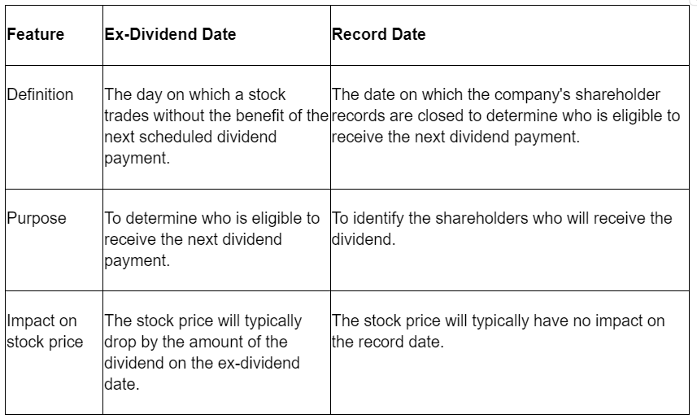

## Table of Contents

## What is a record date?

A record date is a specific date set by a company to determine which shareholders are eligible to receive certain benefits, like dividends or new stock. It is important because it helps the company know exactly who should get these benefits. For example, if a company decides to pay dividends, only the people who own the stock on the record date will get the money.

The record date is usually set a few days before the actual payment or distribution date. This gives the company time to prepare and make sure everything is correct. It is different from the ex-dividend date, which is when the stock starts trading without the value of the upcoming dividend. If you buy the stock on or after the ex-dividend date, you won't get the dividend, even if you own it on the record date.

## What is an ex-dividend date?

The ex-dividend date is when a stock starts trading without the value of its upcoming dividend. If you buy the stock on or after this date, you won't get the next dividend payment. This is because it takes a couple of days for stock trades to settle, so if you buy on the ex-dividend date, you won't be on the company's list of shareholders when they check who gets the dividend.

The ex-dividend date is usually set one business day before the record date. The record date is when the company looks at its list of shareholders to see who gets the dividend. So, if you want to get the dividend, you need to buy the stock before the ex-dividend date. This way, your purchase will settle in time for you to be on the record date list.

## How do these dates affect dividend payments?

The record date and the ex-dividend date are important for getting dividend payments. The record date is when the company checks who owns the stock to see who gets the dividend. If you own the stock on this date, you will get the dividend. The ex-dividend date is a bit earlier. It's the first day the stock trades without the value of the upcoming dividend. If you buy the stock on or after this date, you won't get the next dividend because your purchase won't settle in time to be on the record date list.

These dates work together to make sure the right people get the dividend. The ex-dividend date is usually set one business day before the record date. This gives the company time to update their records. So, if you want to get the dividend, you need to buy the stock before the ex-dividend date. That way, you'll be on the list when the company checks on the record date.

## What happens if I buy a stock on its ex-dividend date?

If you buy a stock on its ex-dividend date, you won't get the next dividend payment. This is because the ex-dividend date is when the stock starts trading without the value of the upcoming dividend. When you buy the stock on this date, your purchase won't settle in time for you to be on the company's list of shareholders who get the dividend.

The company checks its list of shareholders on the record date, which is usually one business day after the ex-dividend date. If you bought the stock on the ex-dividend date, you won't be on that list. So, to get the dividend, you need to buy the stock before the ex-dividend date. That way, your purchase will settle in time for you to be included on the record date list.

## How can I find the record date and ex-dividend date for a specific stock?

To find the record date and ex-dividend date for a specific stock, you can start by checking the company's investor relations section on their website. Many companies post important dates like these there. You can also look at financial news websites and stock market platforms like Yahoo Finance, Bloomberg, or Morningstar. These sites often have a calendar or a section where they list upcoming dividend dates for different stocks.

Another way to find these dates is by using your brokerage account. Most brokerages provide information about upcoming dividends, including the record date and ex-dividend date, for stocks you own or are interested in. If you still can't find the information, you can contact the company's investor relations department directly. They can give you the exact dates you need.

## What is the significance of the settlement period in relation to these dates?

The settlement period is really important when it comes to getting dividends. It's the time it takes for a stock trade to be completed and for the ownership to officially change hands. Usually, this takes two business days. This is why the ex-dividend date is set one business day before the record date. If you buy a stock before the ex-dividend date, your purchase will settle in time for you to be on the company's list of shareholders on the record date, so you'll get the dividend.

If you buy a stock on or after the ex-dividend date, your purchase won't settle in time to be on the record date list. That means you won't get the dividend. So, the settlement period helps make sure that the right people get the dividend. It gives the company time to update their records and make sure everything is correct before they pay out the dividends.

## Can the record date and ex-dividend date be the same?

No, the record date and ex-dividend date can't be the same. The ex-dividend date is when a stock starts trading without the value of its next dividend. If you buy a stock on or after this date, you won't get the next dividend. The record date comes a bit later, usually one business day after the ex-dividend date. This is when the company checks who owns the stock to see who gets the dividend.

The reason they can't be the same is because of the settlement period. It takes two business days for a stock trade to settle, meaning the ownership officially changes hands. If the ex-dividend date and record date were the same, people who bought the stock on that day wouldn't get the dividend because their purchase wouldn't settle in time. So, the ex-dividend date needs to be before the record date to make sure the right people get the dividend.

## How does the timing of these dates impact investment strategies?

The timing of the record date and ex-dividend date can really affect how people plan their investments. If someone wants to get a dividend, they need to buy the stock before the ex-dividend date. This is because if you buy on or after that date, you won't get the next dividend. Investors might decide to buy a stock right before the ex-dividend date to get the dividend and then sell it after. This can be a way to make some extra money, but it also means they might miss out on other chances if the stock's price goes up a lot after they sell.

On the other hand, some investors might choose to wait until after the ex-dividend date to buy a stock. This could be because they think the stock's price might drop right after the ex-dividend date, since the dividend value is no longer included in the price. They might see this as a good time to buy the stock at a lower price. Knowing these dates helps investors make smart choices about when to buy or sell stocks, depending on what they want to achieve with their investments.

## What are the tax implications associated with buying stocks around these dates?

When you buy stocks around the ex-dividend and record dates, it can affect your taxes. If you buy a stock before the ex-dividend date and get the dividend, you have to pay taxes on that dividend. Dividends are usually taxed as income, and the tax rate depends on your overall income and how long you've held the stock. If the stock is a qualified dividend, which means you've held it for more than 60 days during the 121-day period that starts 60 days before the ex-dividend date, the tax rate might be lower.

If you buy a stock right before the ex-dividend date and then sell it soon after, you might also have to pay capital gains tax on any profit you make from selling the stock. If you hold the stock for less than a year, it's considered a short-term capital gain, which is taxed at your regular income tax rate. If you hold it for more than a year, it's a long-term capital gain, which usually has a lower tax rate. So, knowing the timing of these dates can help you plan your investments to manage your tax bill better.

## How do different markets or countries handle record and ex-dividend dates differently?

Different countries and markets might handle record and ex-dividend dates in slightly different ways, but the basic idea is the same everywhere. In the United States, the ex-dividend date is usually set one business day before the record date. This gives time for the stock trade to settle, which takes two business days. In Europe, the settlement period might be different, but they still set the ex-dividend date before the record date to make sure the right people get the dividend. For example, in the UK, the settlement period is also two days, so the ex-dividend date is set one business day before the record date, just like in the US.

Some countries might have different rules about how long you need to own a stock to get the dividend. In Australia, for instance, you need to own the stock at the end of the trading day before the ex-dividend date to get the dividend. This is a bit different from the US, where you need to own it before the ex-dividend date. Also, different countries might have different tax rules for dividends, which can affect how investors plan their buying and selling around these dates. Even though the details might vary, the main goal is always to make sure the dividend goes to the right shareholders.

## What are the historical changes in the rules governing record and ex-dividend dates?

Over time, the rules about record and ex-dividend dates have changed a bit. In the past, the rules were not as clear as they are now. Before the 1970s, the ex-dividend date was often set the same day as the record date. This caused a lot of confusion because people who bought the stock on that day wouldn't get the dividend due to the settlement period. To fix this, in the 1970s, the US started setting the ex-dividend date one business day before the record date. This change made it easier for everyone to know when to buy a stock to get the dividend.

Since then, the basic rules have stayed the same, but small changes have happened. For example, the settlement period used to be longer than it is now. It used to take five business days for a stock trade to settle, but in the late 1990s, it was shortened to three days, and then in 2017, it was reduced to two days. This shorter settlement period helped make the stock market more efficient. Even though the rules might be a bit different in other countries, the main idea of setting the ex-dividend date before the record date has become standard everywhere to make sure the right people get their dividends.

## How do corporate actions like stock splits or mergers affect the record and ex-dividend dates?

Corporate actions like stock splits or mergers can change the record and ex-dividend dates. When a company decides to do a stock split, they might also change when they pay dividends. A stock split means the company gives more shares to shareholders, but each share is worth less. If a stock split happens around the time a dividend is due, the company might set new record and ex-dividend dates to make sure everything is fair. They want to make sure that people who own the stock before the split get the right amount of dividend, even if they end up with more shares after the split.

Mergers can also mess with dividend dates. When two companies merge, they might decide to change how and when they pay dividends. The new company might have different rules about dividends than the old companies did. They might set new record and ex-dividend dates to match their new plans. This can be confusing for shareholders, but the company will usually tell everyone about the new dates so people know when to buy or sell the stock to get the dividend.

## What is Dividend Investing?

Dividend investing is a strategy that focuses on acquiring stocks that distribute a portion of their earnings to shareholders in the form of dividends. This approach aims to generate a steady income stream, appealing particularly to investors seeking a combination of stability and cash flow from their investments. One of the hallmarks of dividend investing is its focus on blue-chip companies—established firms with a history of stable and reliable dividend payouts. These companies are often leaders in their respective industries and possess the financial fortitude to continue paying dividends even during economic downturns.

Understanding the fundamentals of dividend investing is crucial for forming any comprehensive trading or investment strategy. This involves analyzing metrics such as the dividend yield, the dividend payout ratio, and the historical stability of dividend payments. The dividend yield, expressed as a percentage, is calculated as:

$$
\text{Dividend Yield} = \left( \frac{\text{Annual Dividends per Share}}{\text{Price per Share}} \right) \times 100
$$

This metric helps investors assess the relative income generated by dividends compared to the stock price.

One of the significant advantages of dividend investing is its potential to act as a hedge against market [volatility](/wiki/volatility-trading-strategies). During periods of market uncertainty or downturns, the consistent returns from dividends can provide a level of stability to an investor's portfolio, offsetting some of the negative impacts caused by declining stock prices. Furthermore, this investment style can be aligned with growth strategies through the reinvestment of dividends. By reinvesting dividends, investors can take advantage of compounding, leading to potentially enhanced overall returns over the long term.

Incorporating dividends into a broader investment strategy can also facilitate a balance between income generation and capital appreciation. As such, dividend investing is not solely the domain of conservative investors but can also serve as a viable strategy for those seeking long-term growth with a reduced risk profile.

## What are the challenges and considerations?

Both dividend investing and algorithmic trading present unique challenges that investors must navigate to mitigate risks and optimize potential returns. 

Market volatility is a critical [factor](/wiki/factor-investing) impacting both strategies. Fluctuations in stock prices can affect the reliability of dividend payments, as companies may adjust their dividend policies in response to economic downturns or financial strain. For instance, firms might reduce or suspend dividends to preserve cash, impacting investors who rely on this income stream. A key measure of market volatility is the standard deviation of stock returns, which investors can use to assess potential risks. 

Algorithmic trading systems, while offering speed and efficiency, also come with their own set of considerations. Regulatory frameworks governing algorithmic trading are complex and vary by jurisdiction. Adherence to these regulations is essential to avoid legal repercussions. Additionally, the transaction costs associated with executing high-frequency trades can accumulate significantly, potentially eroding profits. It is crucial to precisely calculate expected costs using formulas such as:

$$
\text{Total Cost} = n \times C
$$

where $n$ is the number of transactions, and $C$ is the cost per transaction.

Technical failures within trading systems pose another substantial risk. Glitches or unexpected system behavior can lead to erroneous trades, causing financial losses. To mitigate this, robust backtesting and fail-safe mechanisms should be integrated into trading algorithms. Implementing a grid search in Python to optimize algorithm parameters could enhance system resilience: 

```python
from sklearn.model_selection import GridSearchCV

# Example configuration
param_grid = {'parameter_name': [value1, value2, value3]}

# Grid search implementation
grid_search = GridSearchCV(estimator=YourModel(), param_grid=param_grid, cv=5)
grid_search.fit(X_train, y_train)
best_parameters = grid_search.best_params_
```

Moreover, investors should stay alert to changes in corporate policies regarding dividends and broader market conditions that might signal a shift in the investment landscape. Monitoring earnings reports and economic indicators can provide insights into potential dividend adjustments or economic downturns. This vigilance helps to strategically adjust portfolios and ensures alignment with long-term investment objectives.

In conclusion, effectively managing the challenges associated with dividend investing and algorithmic trading necessitates a comprehensive understanding of market dynamics, regulatory requirements, and technological capabilities.

## References & Further Reading

[1]: Bergstra, J., Bardenet, R., Bengio, Y., & Kégl, B. (2011). ["Algorithms for Hyper-Parameter Optimization."](https://dl.acm.org/doi/10.5555/2986459.2986743) Advances in Neural Information Processing Systems 24.

[2]: ["Advances in Financial Machine Learning"](https://www.amazon.com/Advances-Financial-Machine-Learning-Marcos/dp/1119482089) by Marcos Lopez de Prado

[3]: ["Evidence-Based Technical Analysis: Applying the Scientific Method and Statistical Inference to Trading Signals"](https://www.amazon.com/Evidence-Based-Technical-Analysis-Scientific-Statistical/dp/0470008741) by David Aronson

[4]: ["Machine Learning for Algorithmic Trading"](https://github.com/PacktPublishing/Machine-Learning-for-Algorithmic-Trading-Second-Edition) by Stefan Jansen

[5]: ["Quantitative Trading: How to Build Your Own Algorithmic Trading Business"](https://books.google.com/books/about/Quantitative_Trading.html?id=j70yEAAAQBAJ) by Ernest P. Chan