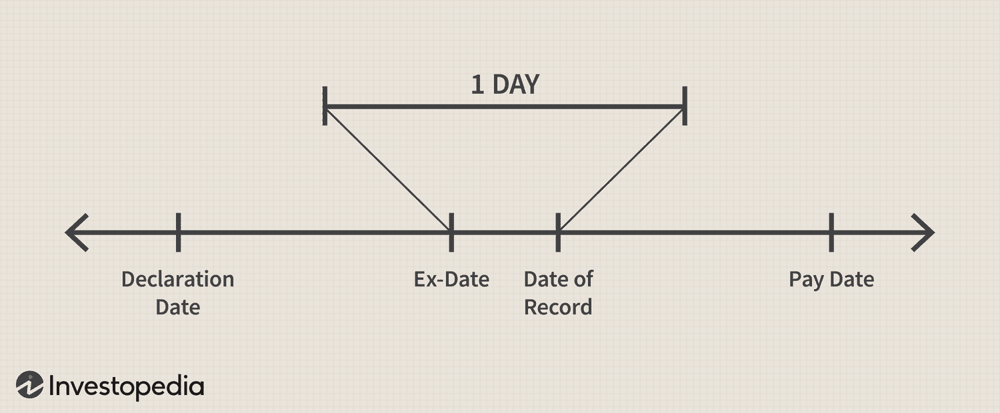

The financial world is intricate, consisting of various elements crucial for informed investment decisions. Among these, understanding the concept of record dates holds particular importance. Record dates are essential in the financial market landscape, especially considering their significance in dividend investing and algorithmic trading strategies.

This article aims to explore the importance of record dates, focusing on how traders and investors can utilize this knowledge to optimize their strategies. Through the examination of real-world examples, we aim to arm investors with the necessary insights to ensure they make the most out of their investment decisions. Record dates not only affect the dividend distribution process but also play a fundamental role in determining when an investor must own shares to qualify for upcoming dividend payments. Understanding this timing is key to any successful dividend investment strategy.



Moreover, record dates hold relevance in the expanding field of algorithmic trading, where high-speed automated systems make trading decisions based on programmed criteria. By leveraging information surrounding record dates, such automated systems can be fine-tuned to enhance decision-making processes and potentially increase financial gains.

In a financial market characterized by rapidly changing dynamics, the integration of record date insights with algorithmic trading strategies presents a significant opportunity for investors. Successful utilization of this information can enhance both the income derived from dividends and the profits achieved from strategic stock movements.

## Table of Contents

## What is a Record Date?

The record date, also referred to as the date of record, is a specific day established by a company to identify which shareholders are eligible to receive dividends or other forms of distribution. This day serves as a cutoff point to list all shareholders entitled to forthcoming benefits, reflecting the dynamic nature of shareholder registries where ownership may frequently change due to trading activities.

Understanding the importance of the record date is crucial because it delineates the shareholders who will benefit from company distributions. As stock ownership can change hands rapidly, the record date provides a snapshot in time to ensure accurate and fair distribution of dividends. This system helps to maintain an orderly and transparent financial process by stipulating that only those listed as shareholders on this key date are entitled to the upcoming payout.

The record date is closely related to another important financial date: the ex-dividend date. The ex-dividend date usually occurs one business day before the record date. It indicates the last day an investor can purchase shares to be considered a shareholder by the record date and thus qualify for the next dividend payment. Transactions must be settled by the record date to affect shareholder status, which generally takes two business days after the trade date. Therefore, acquiring shares one day before the ex-dividend date ensures settlement in time for the record date. Understanding this relationship is vital for investors aiming to optimize their dividend income strategies.

## The Importance of the Record Date

The record date is a pivotal element in the process of dividend distribution, directly affecting investors' strategic decisions. This date determines shareholder eligibility for upcoming payouts by indicating ownership on pertinent corporate records. Only those shareholders who are recorded on or before the record date are considered entitled to dividends or other financial benefits offered by the company.

For investors, understanding the importance of the record date is essential, as trades must be settled by this date. The record date essentially acts as a cut-off, after which any changes in ownership are not recognized for the specific dividend or distribution purpose. This leads to a clear and organized ledger of shareholder entitlements, which is integral for maintaining transparency and trust in financial transactions.

From a strategic point of view, being mindful of the record date can significantly inform investment decisions, especially for those involved in dividend investing. Investors seeking to qualify for dividend payouts must ensure their trades are not only executed but settled before the record date. Typically, this would mean acquiring shares at least two business days prior, considering the standard T+2 (trade date plus two days) settlement period in most financial markets.

Besides dividends, record dates are also crucial for other corporate actions like stock splits and rights issues, thereby reinforcing their significance across a broader spectrum of shareholder activities. By ensuring an organized accounting of shareholder rights and distributions, record dates contribute substantially to the integrity and smooth functioning of financial markets.

## Example of a Record Date in Action

Imagine Company Alpha announces a dividend of $1 with a payment date set for May 1. To distribute this dividend efficiently, the company establishes a record date of April 10. This designation is critical as it determines which shareholders are entitled to the dividend payment.

To qualify for receiving the dividend, investors must own shares of Company Alpha prior to the ex-dividend date, a day set before the record date. This distinction arises because stock trading transactions typically require a two-business-day settlement period. Therefore, in our example, investors need to purchase shares by April 8 to have their ownership recorded by April 10.

This timeline highlights the significance of the settlement process in dividend investing. Settlements in stock trading imply the actual transfer of stock ownership happens within a standard period of two business days after the transaction date, a principle known as T+2. Adhering to this timeline is vital; purchasing shares on or after April 9 would result in the trade settling post-record date, excluding the investor from the dividend payout.

Understanding these timelines is crucial in dividend investing because missing the record date means missing potential dividend income. For traders strategizing around dividend payouts, being aware of the precise timing of purchase and settlement is essential for ensuring entitlement to dividends. This precise coordination necessitates clear knowledge of the interplay between purchase dates, record dates, and settlement timelines.

## Record Date and Ex-Dividend Date Explained

The record date and ex-dividend date are fundamental components of dividend distribution processes in the stock market, helping define shareholder eligibility for receiving dividends. The ex-dividend date is especially important because it is the deadline by which investors must purchase shares if they wish to receive the upcoming dividend. This date is set to be one business day before the record date due to the typical two-business-day settlement period required for stock transactions.

### Importance of Timing
For investors striving to capture dividends, timing purchase transactions relative to these dates is crucial. When a company announces a dividend, it specifies several dates: the declaration date, the ex-dividend date, the record date, and the payment date. The ex-dividend date is essentially the cutoff point:

- **Ex-dividend date (E)**: To be considered a shareholder and thus eligible for the dividend, shares must be purchased before this date. Transactions made on or after the ex-dividend date mean the buyer will not receive the upcoming dividend.

Following this, the record date serves to formalize the list of eligible shareholders who will receive the dividend:

- **Record date (R)**: Occurring one business day after the ex-dividend date, this is when the company identifies and records the shareholders eligible for the dividend payout. 

### Effects on Dividends and Returns
Purchases made on the ex-dividend date or later generally result in not being recognized as a shareholder on the record date, disqualifying those investors from receiving the dividend. This sequence affects financial returns significantly, as missing out on dividends can alter expected yields from investments. To illustrate, consider the following Python code snippet that calculates potential dividend earnings depending on the purchase date:

```python
def dividend_eligibility(purchase_date, ex_dividend_date):
    if purchase_date < ex_dividend_date:
        return "Eligible for dividend"
    else:
        return "Not eligible for dividend"

# Example
purchase_date = "2023-03-15"
ex_dividend_date = "2023-03-16"
status = dividend_eligibility(purchase_date, ex_dividend_date)
print(status)  # Output: Eligible for dividend
```

This straightforward example shows that buying before the ex-dividend date confirms dividend eligibility, impacting total investment returns. Consequently, investors must keenly observe these dates while planning their trades to ensure their strategies align optimally with dividend distribution schedules.

## Algorithmic Trading: Leveraging Record Dates

Algorithmic trading leverages record dates by employing programmed strategies to optimize trade execution. These algorithms are designed to process information about dividends and other corporate actions efficiently, allowing traders to maximize returns by precisely timing their trading actions. When companies announce dividend dates, an algorithm can automatically execute trades based on predetermined criteria, such as purchasing shares before the ex-dividend date and selling them afterward, thereby capitalizing on the expected price movements.

An effective algorithmic strategy for leveraging record dates involves identifying price adjustments that typically occur around these dates. When a company announces a dividend, its stock price usually increases in anticipation of the payout, as investors buy shares to qualify for the dividend. Following the ex-dividend date, the stock price often experiences a decline, reflecting the payout deducted from the stock's value. Algorithms can be designed to predict and act on these trends, enhancing profitability through timely execution.

For example, an algorithm can automatically track the announcement of record dates and ex-dividend dates using publicly available data from stock exchanges. Once a dividend is announced, the algorithm can trigger a buying sequence before the ex-dividend date to capture the dividend payment and then sell the shares afterward, accounting for factors like transaction costs and market [liquidity](/wiki/liquidity-risk-premium). The following Python code snippet demonstrates a simplified version of such an algorithmic strategy:

```python
import datetime
from trading_api import get_stock_data, buy_stock, sell_stock

def dividend_strategy(stock_symbol):
    # Simulate fetching stock data including dividend announcements
    stock_data = get_stock_data(stock_symbol)

    for announcement in stock_data['dividends']:
        record_date = announcement['record_date']
        ex_div_date = announcement['ex_dividend_date']
        dividend_amount = announcement['dividend_amount']

        # Consider buying the stock before the ex-dividend date
        if datetime.date.today() < ex_div_date:
            buy_stock(stock_symbol)

            # Assuming holding until x days after ex-dividend
            sell_date = ex_div_date + datetime.timedelta(days=3)
            if datetime.date.today() >= sell_date:
                sell_stock(stock_symbol)
                print(f"Executed trade for {stock_symbol} around dividend date.")

# Example usage
dividend_strategy('AAPL')
```

This approach allows traders to automate and scale their operations, benefiting from the repetitive, predictable nature of dividend cycles while minimizing human error. By continuously refining these algorithms with real-time data and [backtesting](/wiki/backtesting) strategies, traders can optimize their outcomes and reduce risks associated with manual trading. As financial markets evolve, leveraging [algorithmic trading](/wiki/algorithmic-trading) to incorporate record dates remains an intelligent endeavor for maximizing strategic gains.

## Strategies Combining Record Dates and Algo Trading

Identifying cyclical stock behaviors around dividend dates can significantly enhance algorithmic trading strategies. These patterns often emerge as stocks adjust their prices around the record and ex-dividend dates, driven by investor behavior aiming to capitalize on dividend payouts. By integrating record date information into algorithmic models, traders can optimize timing and execution for improved financial outcomes.

Predictive analytics are instrumental in this context, enabling traders to forecast price movements associated with dividend actions. Advanced [machine learning](/wiki/machine-learning) algorithms, such as recurrent neural networks (RNNs) and [long short](/wiki/equity-long-short)-term memory networks (LSTMs), can be employed to analyze historical stock price data and identify trends indicative of future price fluctuations around key dates. Here's a simplified Python example using an LSTM for price prediction:

```python
import numpy as np
import pandas as pd
from keras.models import Sequential
from keras.layers import LSTM, Dense
from sklearn.preprocessing import MinMaxScaler

# Load and preprocess the data
data = pd.read_csv('stock_prices.csv')
scaler = MinMaxScaler(feature_range=(0, 1))
scaled_data = scaler.fit_transform(data['Close'].values.reshape(-1, 1))

# Prepare the training dataset
def create_dataset(data, time_step=1):
    X, Y = [], []
    for i in range(len(data)-time_step-1):
        a = data[i:(i+time_step), 0]
        X.append(a)
        Y.append(data[i + time_step, 0])
    return np.array(X), np.array(Y)

time_step = 60
X_train, Y_train = create_dataset(scaled_data, time_step)
X_train = X_train.reshape(X_train.shape[0], X_train.shape[1], 1)

# Build the LSTM model
model = Sequential()
model.add(LSTM(units=50, return_sequences=True, input_shape=(X_train.shape[1], 1)))
model.add(LSTM(units=50))
model.add(Dense(units=1))

model.compile(optimizer='adam', loss='mean_squared_error')
model.fit(X_train, Y_train, epochs=100, batch_size=32)

# Make predictions
test_data = scaled_data[-(time_step+1):]
X_test, _ = create_dataset(test_data, time_step)
X_test = X_test.reshape(X_test.shape[0], X_test.shape[1], 1)
predicted_price = model.predict(X_test)
```

While powerful, reliance on predictive analytics and algorithmic trading should be balanced with a diversified portfolio, particularly one that emphasizes dividend-[growth stocks](/wiki/growth-stocks). Such diversification mitigates risks, buffers against unpredictable market shifts, and maximizes potential returns. Investors can achieve this by reallocating assets across varying sectors and geographic regions, thus spreading exposure and reducing reliance on single, potentially volatile, dividend events.

Moreover, some strategies involve leveraging both high-dividend yields and growth potential. This dual approach can cater to investors seeking stable income streams while simultaneously pursuing capital appreciation. To manage such a portfolio effectively, algorithms can be programmed to dynamically adjust asset allocations in response to changes in market conditions or dividend announcements.

In summary, combining record date insights with sophisticated algorithmic trading techniques can create a robust framework for navigating the complexities of financial markets, enhancing both dividend income and strategic stock market gains.

## Challenges and Considerations

Market [volatility](/wiki/volatility-trading-strategies) and regulatory restrictions can significantly impact both dividend and algorithmic investment strategies. Traders and investors need to navigate these challenges to maintain and optimize their portfolios effectively.

### Market Volatility

Market volatility can lead to rapid and unpredictable changes in stock prices, affecting the performance of dividend and algorithmic trading strategies. High volatility may result in increased risk for dividend investors, as fluctuations can influence the expected yield from dividend payouts. For algorithmic traders, market volatility presents both opportunities and challenges. On one hand, increased price movements can create profitable trading scenarios. On the other, they can lead to heightened risk exposure and potential losses if algorithms are not designed to handle volatility efficiently. Algorithms need to be calibrated to adapt to sudden market shifts, often utilizing volatility indicators such as the VIX index to adjust their strategies.

### Regulatory Restrictions

Financial markets are heavily regulated to ensure fairness, transparency, and stability. Compliance with evolving regulations is critical for both dividend and algorithmic trading strategies. Regulatory bodies may impose restrictions on trading practices, such as high-frequency trading, which can affect algorithmic strategies. Additionally, changes in dividend taxation laws can alter the attractiveness of dividend stocks, impacting strategy profitability. Investors must stay informed about regulatory updates to ensure that their strategies remain compliant and effective.

### Transaction Costs and System Failures

Transaction costs, which include broker fees, bid-ask spreads, and taxes, can erode the profitability of trading strategies, particularly for high-frequency trading ([HFT](/wiki/high-frequency-trading-strategies)) algorithms that execute numerous trades over short periods. These costs can be modeled as:

$$
\text{Net Profit} = \text{Gross Profit} - \text{Transaction Costs}
$$

System failures, such as technical glitches or connectivity issues, present another challenge. These can result in missed trading opportunities or unintended trades, potentially leading to financial losses. It is essential for traders to develop robust system architectures with fail-safes like automated error detection and redundancy systems to mitigate these risks.

### Adaptive Algorithms

Investors should continuously refine and adapt their algorithms to address the challenges posed by market volatility and regulatory changes. Machine learning techniques can be employed to enhance algorithm adaptability. For example, [reinforcement learning](/wiki/reinforcement-learning), a type of machine learning, can enable algorithms to learn from past market environments and make more informed decisions. A basic Python pseudocode for an adaptive trading algorithm could be:

```python
import numpy as np

def adaptive_trading_algorithm(data, lookback_period=20):
    model = train_model(data, lookback_period)  # Train model with historical data
    while market_is_open():
        new_data = fetch_market_data()
        prediction = model.predict(new_data)
        make_trade_decision(prediction)

def train_model(data, lookback_period):
    # Implement machine learning model training logic here
    return trained_model

```

In conclusion, successfully navigating the challenges and considerations of dividend and algorithmic investment strategies requires a proactive approach, continuous learning, and the integration of advanced technologies. By staying informed and adaptable, investors can position themselves to capitalize on opportunities while mitigating risks in the financial markets.

## Conclusion

The integration of record date insights and algorithmic trading represents a pivotal strategy for achieving a competitive edge in modern finance. Understanding these mechanisms allows investors not only to optimize dividend income but also to capitalize on strategic stock price movements. By accurately timing acquisitions before ex-dividend dates and leveraging algorithms to anticipate market behaviors, investors can enhance their returns. 

For instance, programmed algorithms can efficiently handle complex calculations and identify optimal trading windows, potentially leading to profitable outcomes. These algorithms can process significant volumes of historical data to identify trends and inform decision-making. Python libraries, such as Pandas and NumPy, are often employed for data analysis and can be integrated into trading strategies to generate adaptive models. 

In the rapidly evolving landscape of finance, continuous knowledge updating and tactic refinement are essential for maintaining profitability. With advancements in machine learning and data analytics, investors can develop more sophisticated strategies that account for market volatility and regulatory changes. Regularly updating algorithms to incorporate new data and insights ensures strategies remain effective and compliant with financial regulations. 

In conclusion, as the financial environment continues to shift, leveraging the synergy between record date insights and algorithmic trading can empower investors to maximize both dividend yields and capital gains, promoting sustained financial success.

## References & Further Reading

[1]: Bergstra, J., Bardenet, R., Bengio, Y., & Kégl, B. (2011). ["Algorithms for Hyper-Parameter Optimization."](https://dl.acm.org/doi/10.5555/2986459.2986743) Advances in Neural Information Processing Systems 24.

[2]: ["Advances in Financial Machine Learning"](https://www.amazon.com/Advances-Financial-Machine-Learning-Marcos/dp/1119482089) by Marcos Lopez de Prado

[3]: ["Evidence-Based Technical Analysis: Applying the Scientific Method and Statistical Inference to Trading Signals"](https://www.amazon.com/Evidence-Based-Technical-Analysis-Scientific-Statistical/dp/0470008741) by David Aronson

[4]: ["Machine Learning for Algorithmic Trading"](https://github.com/stefan-jansen/machine-learning-for-trading) by Stefan Jansen

[5]: ["Quantitative Trading: How to Build Your Own Algorithmic Trading Business"](https://www.amazon.com/Quantitative-Trading-Build-Algorithmic-Business/dp/1119800064) by Ernest P. Chan