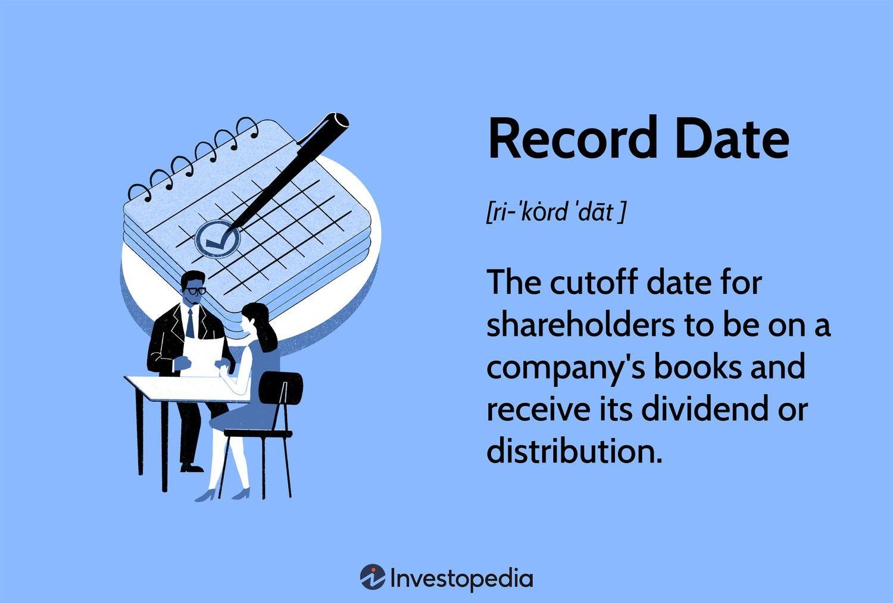

## Table of Contents

## What is a record date?

A record date is a specific date set by a company to determine which shareholders are eligible to receive certain benefits, like dividends or bonus shares. It's important because only the shareholders who own the stock on this date will get these benefits. Companies announce the record date in advance so shareholders know when they need to own the stock.

The record date is different from the ex-dividend date. The ex-dividend date is usually set one business day before the record date. If you buy the stock on or after the ex-dividend date, you won't get the upcoming dividend. So, it's important to know both dates if you want to receive dividends or other benefits from the company.

## Why is the record date important?

The record date is important because it tells a company who gets to receive things like dividends or bonus shares. When a company decides to give out these benefits, they need to know exactly who owns their stock on a specific day. That's what the record date does. It's like a cut-off point. If you own the stock on the record date, you get the benefits. If you don't, you miss out.

Knowing the record date is also helpful for people who want to buy or sell the stock. If someone wants to get the next dividend, they need to buy the stock before the record date. If they buy it after, they won't get that dividend. This date helps everyone plan their buying and selling better. It makes things clear and fair for everyone involved.

## How is the record date determined?

The record date is chosen by the company's board of directors. They pick a date that works well for their plans to give out dividends or other benefits. Usually, they announce this date ahead of time so everyone knows when it is. This helps shareholders plan if they want to buy or sell the stock to get the benefits.

The record date is important because it tells the company who owns the stock on that specific day. Only those people will get the dividends or other benefits. The company needs to know this to make sure they give the benefits to the right people. It's like a snapshot of who owns the stock at that moment.

## Can you explain the difference between record date and ex-dividend date?

The record date and the ex-dividend date are two important dates for shareholders, but they serve different purposes. The record date is the day a company uses to figure out who gets to receive dividends or other benefits. If you own the stock on the record date, you get the dividend. It's like a cut-off point that the company uses to take a snapshot of who owns the stock at that moment.

The ex-dividend date is different. It's usually set one business day before the record date. If you buy the stock on or after the ex-dividend date, you won't get the upcoming dividend. This is because it takes a couple of days for stock transactions to settle, so if you buy the stock on the ex-dividend date, the transaction won't be complete by the record date. Knowing both dates is important if you want to make sure you get the dividends or other benefits from the company.

## What happens if I buy a stock on the record date?

If you buy a stock on the record date, you will get the dividend or other benefits that the company is giving out. The record date is the day the company checks who owns the stock to see who gets the benefits. So, if you own the stock on that day, you are on the list to receive the dividend.

It's important to know that buying on the record date is different from buying on the ex-dividend date. The ex-dividend date is usually one business day before the record date. If you buy the stock on or after the ex-dividend date, you won't get the upcoming dividend because the transaction won't be settled by the record date. So, buying on the record date means you'll get the benefits, but you need to be careful about the timing.

## How does the record date affect dividend payments?

The record date is a key day that tells a company who gets to receive the dividend. If you own the stock on the record date, you will get the dividend. It's like a snapshot that the company takes to see who owns the stock at that moment. If you're on that list, you get the money.

The record date is different from the ex-dividend date. The ex-dividend date is usually one business day before the record date. If you buy the stock on or after the ex-dividend date, you won't get the dividend because the transaction won't be settled by the record date. So, it's important to know both dates if you want to make sure you get the dividend.

## What are the implications of missing the record date for shareholders?

If you miss the record date, you won't get the dividend or other benefits that the company is giving out. The record date is when the company checks who owns the stock to see who gets the money. If you don't own the stock on that day, you won't be on the list to receive the dividend.

Missing the record date can be disappointing because you might have been planning to get that extra money. It's important to know when the record date is so you can make sure you own the stock on time. If you buy the stock after the record date, you'll have to wait for the next dividend, which could be months away.

## How can investors use the record date to their advantage?

Investors can use the record date to their advantage by making sure they own the stock on that day to get the dividend. If you know when the record date is, you can buy the stock before it and then sell it after you get the dividend. This way, you can make some extra money from the dividend without keeping the stock for a long time.

Another way to use the record date is to plan your buying and selling around it. If you want to get the dividend, you need to buy the stock before the ex-dividend date, which is usually one business day before the record date. If you don't care about the dividend, you might wait until after the ex-dividend date to buy the stock, because the price might drop a little after the dividend is paid out. Knowing these dates can help you make better decisions about when to buy and sell.

## Are there different types of record dates for different financial instruments?

Yes, there can be different types of record dates for different financial instruments. For stocks, the record date is used to determine who gets dividends or other benefits like bonus shares. If you own the stock on the record date, you get the dividend. For bonds, the record date might be used to see who gets the interest payment. If you own the bond on the record date, you get the interest.

Mutual funds also have a record date, but it's used differently. For mutual funds, the record date is when they check who owns the shares to see who gets the dividend or capital gains distribution. If you own the mutual fund shares on the record date, you get the money. Each type of financial instrument might have its own rules about how the record date works, but the main idea is the same: it's a way to figure out who gets the money or benefits.

## How do companies announce the record date?

Companies usually announce the record date by sending out a press release or making a public announcement. They might post it on their website, send an email to shareholders, or use a financial news service to spread the word. This way, everyone who might be interested knows when the record date is.

It's important for companies to let people know about the record date early. This gives shareholders enough time to buy the stock if they want to get the dividend. Knowing the record date helps investors plan their buying and selling better, so it's good for everyone when companies share this information clearly and in time.

## What are the legal and regulatory considerations regarding the record date?

Companies need to follow rules about setting and announcing the record date. These rules come from places like the Securities and Exchange Commission (SEC) in the United States or other financial regulators around the world. The rules make sure that companies tell everyone about the record date in a clear way and give enough time for people to know about it. This helps keep things fair for everyone who might want to buy or sell the stock.

The record date is important because it helps companies know who to give the dividends or other benefits to. If a company doesn't follow the rules about the record date, it could get in trouble with the regulators. They might have to pay fines or face other penalties. So, it's important for companies to get it right and follow the rules to avoid problems.

## Can you provide a real-world example of how the record date impacted a company's shareholders?

In 2020, Apple Inc. announced a dividend payment of $0.82 per share. They set the record date for May 11, 2020. This meant that if you owned Apple stock on that day, you would get the dividend. Many investors made sure they bought the stock before the record date so they could get the money. If someone bought the stock on or after May 12, which was the ex-dividend date, they wouldn't get that dividend.

This had a big impact on shareholders. Those who owned the stock on the record date got the extra money, which could be important for their investment plans. But people who missed the record date had to wait until the next dividend, which might be months away. Knowing the record date helped investors decide when to buy or sell Apple stock to make the most of the dividend.

## What are the challenges and considerations?

Market [volatility](/wiki/volatility-trading-strategies) and regulatory restrictions can significantly impact both dividend and algorithmic investment strategies. Traders and investors need to navigate these challenges to maintain and optimize their portfolios effectively.

### Market Volatility

Market volatility can lead to rapid and unpredictable changes in stock prices, affecting the performance of dividend and [algorithmic trading](/wiki/algorithmic-trading) strategies. High volatility may result in increased risk for dividend investors, as fluctuations can influence the expected yield from dividend payouts. For algorithmic traders, market volatility presents both opportunities and challenges. On one hand, increased price movements can create profitable trading scenarios. On the other, they can lead to heightened risk exposure and potential losses if algorithms are not designed to handle volatility efficiently. Algorithms need to be calibrated to adapt to sudden market shifts, often utilizing volatility indicators such as the VIX index to adjust their strategies.

### Regulatory Restrictions

Financial markets are heavily regulated to ensure fairness, transparency, and stability. Compliance with evolving regulations is critical for both dividend and algorithmic trading strategies. Regulatory bodies may impose restrictions on trading practices, such as high-frequency trading, which can affect algorithmic strategies. Additionally, changes in dividend taxation laws can alter the attractiveness of dividend stocks, impacting strategy profitability. Investors must stay informed about regulatory updates to ensure that their strategies remain compliant and effective.

### Transaction Costs and System Failures

Transaction costs, which include broker fees, bid-ask spreads, and taxes, can erode the profitability of trading strategies, particularly for high-frequency trading ([HFT](/wiki/high-frequency-trading-strategies)) algorithms that execute numerous trades over short periods. These costs can be modeled as:

$$
\text{Net Profit} = \text{Gross Profit} - \text{Transaction Costs}
$$

System failures, such as technical glitches or connectivity issues, present another challenge. These can result in missed trading opportunities or unintended trades, potentially leading to financial losses. It is essential for traders to develop robust system architectures with fail-safes like automated error detection and redundancy systems to mitigate these risks.

### Adaptive Algorithms

Investors should continuously refine and adapt their algorithms to address the challenges posed by market volatility and regulatory changes. Machine learning techniques can be employed to enhance algorithm adaptability. For example, [reinforcement learning](/wiki/reinforcement-learning), a type of [machine learning](/wiki/machine-learning), can enable algorithms to learn from past market environments and make more informed decisions. A basic Python pseudocode for an adaptive trading algorithm could be:

```python
import numpy as np

def adaptive_trading_algorithm(data, lookback_period=20):
    model = train_model(data, lookback_period)  # Train model with historical data
    while market_is_open():
        new_data = fetch_market_data()
        prediction = model.predict(new_data)
        make_trade_decision(prediction)

def train_model(data, lookback_period):
    # Implement machine learning model training logic here
    return trained_model

```

In conclusion, successfully navigating the challenges and considerations of dividend and algorithmic investment strategies requires a proactive approach, continuous learning, and the integration of advanced technologies. By staying informed and adaptable, investors can position themselves to capitalize on opportunities while mitigating risks in the financial markets.

## References & Further Reading

[1]: Bergstra, J., Bardenet, R., Bengio, Y., & Kégl, B. (2011). ["Algorithms for Hyper-Parameter Optimization."](https://dl.acm.org/doi/10.5555/2986459.2986743) Advances in Neural Information Processing Systems 24.

[2]: ["Advances in Financial Machine Learning"](https://www.amazon.com/Advances-Financial-Machine-Learning-Marcos/dp/1119482089) by Marcos Lopez de Prado

[3]: ["Evidence-Based Technical Analysis: Applying the Scientific Method and Statistical Inference to Trading Signals"](https://www.amazon.com/Evidence-Based-Technical-Analysis-Scientific-Statistical/dp/0470008741) by David Aronson

[4]: ["Machine Learning for Algorithmic Trading"](https://github.com/stefan-jansen/machine-learning-for-trading) by Stefan Jansen

[5]: ["Quantitative Trading: How to Build Your Own Algorithmic Trading Business"](https://www.amazon.com/Quantitative-Trading-Build-Algorithmic-Business/dp/1119800064) by Ernest P. Chan