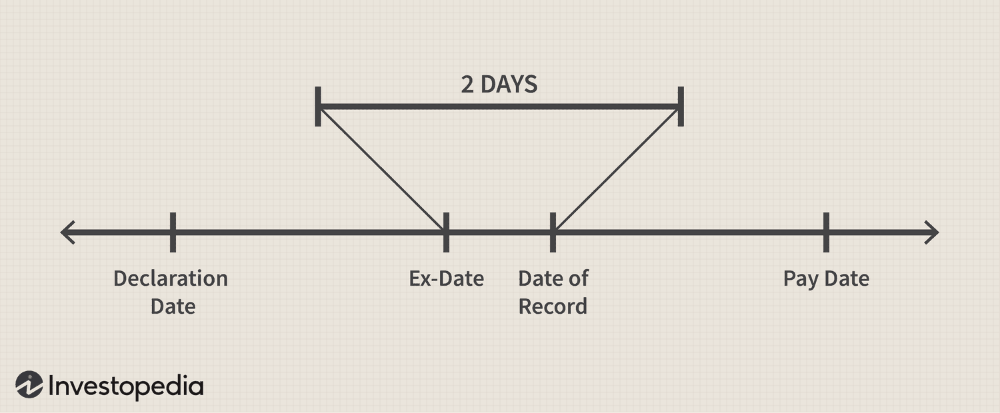

## Table of Contents

## What is a record date?

A record date is a specific date set by a company to determine which shareholders are eligible to receive certain benefits, like dividends or bonus shares. When a company decides to give out dividends, it picks a record date. If you own the company's stock on that date, you will get the dividend.

The record date is important because it helps the company know exactly who should get the dividends. It makes sure that only the people who own the stock on that specific date get the benefits. This date is usually set a few weeks before the actual payment date to give the company time to prepare.

## What is a payable date?

A payable date is the day when a company actually sends out the dividends to its shareholders. It's the date when the money or other benefits promised by the company are given to the people who own the stock.

The payable date comes after the record date. The record date is when the company checks who owns the stock to see who gets the dividends. After that, they take some time to get everything ready, and then on the payable date, they send out the dividends. This way, everyone knows exactly when they will get their money.

## How do record date and payable date differ?

The record date and the payable date are two important dates for shareholders when a company gives out dividends. The record date is when the company checks who owns the stock. If you own the stock on this date, you will get the dividend. It's like a snapshot of who the shareholders are at that moment.

The payable date comes after the record date. This is the day when the company actually sends out the dividends to the shareholders. It's the day you get your money or other benefits. The company needs some time between the record date and the payable date to get everything ready, so the payable date is usually a bit later.

## Why is the record date important for shareholders?

The record date is really important for shareholders because it decides who gets the dividends. If you own the stock on the record date, you will get the dividend. It's like a special day that the company picks to take a picture of who owns the stock. If you're on that list, you get the money.

This date helps keep things fair and clear. It makes sure that only the people who own the stock on that specific day get the dividends. This way, everyone knows the rules and can plan when to buy or sell the stock. It's a key part of how companies share their profits with shareholders.

## What happens if I buy stocks after the record date?

If you buy stocks after the record date, you won't get the dividend that was announced for that period. The record date is when the company checks who owns the stock to see who gets the dividend. If you buy the stock after that date, your name won't be on the list of people who get the dividend.

This can be disappointing if you were hoping to get the dividend. But it's important to know the dates so you can plan your buying and selling. If you miss one dividend, you can still get the next one if you buy the stock before the next record date.

## Can the record date and payable date be the same?

The record date and the payable date are usually different because they do different things. The record date is when the company checks who owns the stock to see who gets the dividend. It's like taking a picture of who the shareholders are on that day. If you own the stock on the record date, you get the dividend.

The payable date is when the company actually sends out the dividends to those shareholders. It's the day you get your money. The company needs time between the record date and the payable date to get everything ready, so these dates are usually not the same. But in some very rare cases, if the company can do everything quickly, the record date and payable date might be the same day.

## How are record and payable dates determined by companies?

Companies decide on the record and payable dates when they want to give out dividends. The record date is picked first. This is the day the company checks who owns the stock. If you own the stock on this day, you will get the dividend. The company needs to know who the shareholders are on a specific day to make sure the right people get the money. So, they choose a record date that gives them enough time to prepare everything.

After setting the record date, the company then picks the payable date. This is the day when the company actually sends out the dividends to the shareholders. The payable date comes after the record date because the company needs time to get everything ready. They need to make sure all the paperwork is done and the money is ready to be sent out. Usually, there are a few weeks between the record date and the payable date to give the company enough time to do this.

## What are the legal implications of missing the record date?

If you miss the record date, you won't get the dividend that the company promised. The record date is when the company looks at who owns the stock to decide who gets the money. If you buy the stock after this date, your name won't be on the list of people who get the dividend. This means you have to wait until the next time the company gives out dividends, and you need to own the stock before the next record date.

There are no big legal problems if you miss the record date. It's just a rule that companies use to make sure they give the money to the right people. But if you're hoping to get dividends, you need to know the record date and buy the stock before that day. If you don't, you miss out on the money for that round of dividends.

## How does the timing of record and payable dates affect investment strategies?

The timing of record and payable dates can really change how people plan their investments. If you want to get dividends, you need to buy the stock before the record date. If you buy it after, you won't get the money. So, smart investors watch these dates closely. They might buy the stock just before the record date to get the dividend and then sell it after. This way, they can make some extra money from the dividends.

On the other hand, some investors might not care about the dividends and just want to buy the stock for other reasons, like if they think the stock price will go up. For these people, the record and payable dates might not matter as much. But even they need to know about these dates because the stock price can change around them. Sometimes, the price goes down right after the record date because people who bought the stock just for the dividend might sell it. Knowing this can help investors decide the best time to buy or sell.

## What are the tax implications associated with record and payable dates?

When you get dividends, you have to pay taxes on them. The record date is important because it decides who gets the dividends. If you own the stock on the record date, you will get the dividend and have to pay taxes on it. The payable date is when you actually get the money, but it doesn't change how much tax you owe. The tax you pay is based on the amount of the dividend, not when you get it.

The tax rules can be different depending on where you live. In some places, dividends are taxed at a special rate that might be lower than the regular income tax rate. But you still need to report the dividends on your tax return. If you buy the stock after the record date, you won't get the dividend and won't have to pay taxes on it for that period. Knowing the record and payable dates can help you plan your investments and understand your tax situation better.

## How do record and payable dates impact dividend reinvestment plans (DRIPs)?

When you are part of a Dividend Reinvestment Plan (DRIP), the record and payable dates are important. A DRIP lets you use your dividends to buy more shares of the company instead of getting the money. If you own the stock on the record date, you will get the dividend. With a DRIP, that dividend is used to buy more shares. So, you need to own the stock before the record date to take part in the DRIP for that round of dividends.

The payable date is when the company actually gives out the dividends. For people in a DRIP, this is when the company uses your dividend to buy more shares for you. The timing between the record date and the payable date can affect how many shares you get because the stock price might change. If the stock price goes down between these dates, you might get more shares for the same amount of dividend. Knowing these dates helps you plan better with your DRIP.

## What are the international variations in handling record and payable dates?

Different countries might handle record and payable dates in different ways. In the United States, the record date is usually set a few weeks before the payable date. This gives the company time to figure out who owns the stock and get everything ready to send out the dividends. In the UK, the process is similar, but the exact timing can be different. Companies there might also set the record date a bit earlier to make sure everything is sorted out before the dividends are paid.

In some other countries, like Australia, the rules can be a bit different. They might use a different term like "ex-dividend date" instead of record date. The ex-dividend date is when the stock starts trading without the value of the next dividend. If you buy the stock on or after this date, you won't get the dividend. The payable date in Australia follows the same idea as in the US and UK, but the timing might be adjusted based on local rules and practices. Knowing these differences can help investors plan better if they are investing in companies from different countries.

## References & Further Reading

1. Lintner, J. (1956). "Distribution of Incomes of Corporations Among Dividends, Retained Earnings, and Taxes," *The American Economic Review*, 46(2), 97-113. This foundational paper discusses the factors influencing dividend policy decisions within corporations.

2. Graham, B., & Dodd, D. (1934). *Security Analysis*. McGraw-Hill Professional. A comprehensive guide to evaluating investments, including dividend-paying stocks.

3. Bhattacharyya, N. (2007). "Dividend Policy: A Review", *Managerial Finance*, 33(1), 4-13. This article provides an overview of various theories and models related to corporate dividend policy and its implications for investors.

4. Chan, K., & Lakonishok, J. (1993). "Institutional Trades and Intraday Stock Price Behavior," *Journal of Financial Economics*, 33(2), 173-199. This paper investigates how institutional trading impacts stock prices around dividend announcements.

5. Haldane, A. G., & Robert, C. T. (2010). "The Short Long", *Bank of England*. This report explores the impacts of algorithmic trading on financial markets, providing insights into trading strategies aligned with dividend key dates.

6. Aldridge, I. (2013). *High-Frequency Trading: A Practical Guide to Algorithmic Strategies and Trading Systems*. Wiley. This book provides practical advice on developing algorithmic trading systems, including strategies focused on dividend capture.

7. Fabozzi, F. J., & Grant, J. L. (2000). *Equity Valuation and Portfolio Management*. Wiley. A resource for investors interested in understanding the valuation of dividend-paying equities as part of a diversified portfolio.

8. Dichev, I. D. (2007). "What Are Stock Investors' Actual Historical Returns?", *The American Economic Review*, 97(1), 386-401. This article evaluates historical stock returns, offering insights into the performance of dividend-paying stocks.

9. Bodie, Z., Kane, A., & Marcus, A. J. (2014). *Investments*. McGraw-Hill Education. This textbook covers modern investment theory and practice, including the role of dividends in portfolio management.

10. Lease, R. C., John, K., Kalay, A., Loewenstein, U., & Sarig, O. (2000). *Dividend Policy: Its Impact on Firm Value*. Harvard Business Review Press. This publication explores how different dividend policies can influence a company's market value.

For those interested in [machine learning](/wiki/machine-learning) applications in [algorithmic trading](/wiki/algorithmic-trading), incorporating dividend data may benefit from exploring sources such as Pärsson, S. (2013), "Algorithmic Trading Using Machine Learning," available via university repositories or industry-specific publications. Additionally, data-driven platforms like QuantConnect or [backtesting](/wiki/backtesting) frameworks such as Zipline in Python are valuable for refining algorithmic strategies involving dividend dates.

