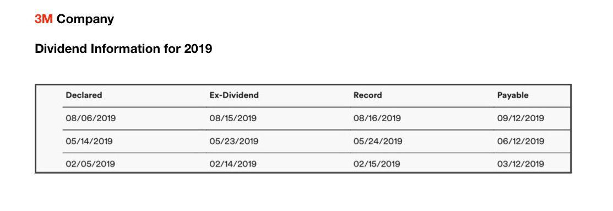

Dividends are a vital component of the investment landscape, offering investors a consistent source of income. As companies generate profits, they may choose to distribute a portion of these earnings to shareholders in the form of dividends. This distribution not only rewards shareholders but also reflects a company's financial health and commitment to its investors.

For investors to effectively benefit from dividends, understanding key dividend dates is crucial. Among these dates, the record date and payable date are particularly significant. The record date determines which shareholders are entitled to receive the dividend, while the payable date is when the dividend is distributed to shareholders. Navigating these timelines ensures that investors do not miss opportunities to earn on their investments.



With advancements in financial technology, algorithmic trading has emerged as a powerful tool to enhance trading strategies. By employing algorithms, investors can execute trades with increased precision and speed, leveraging market data to optimize their investment returns. In this context, key dividend dates serve as critical triggers for algorithmic trading strategies aimed at maximizing returns. By systematically analyzing these dates, algorithms can be designed to capitalize on predictable market movements surrounding dividend distributions.

This article examines how the strategic integration of dividend distribution dates with algorithmic trading can empower investors to achieve superior portfolio returns. By understanding the interplay between these elements, investors can better position themselves to harness the potential benefits of both dividends and advanced trading technologies.

## Table of Contents

## Understanding Dividends and Their Key Dates

Dividends are a mechanism for companies to distribute a portion of their earnings to shareholders, providing them with a regular income stream in addition to any potential capital gains from stock price appreciation. Understanding the structure and timing of dividend payouts is crucial for investors who wish to optimize their investment strategies and ensure timely receipt of these payments.

There are several key dates associated with dividends that every investor should be familiar with:

1. **Declaration Date**: This is the date on which a company's board of directors announces its intention to pay a dividend. The declaration includes details such as the dividend amount and payment date, officially setting the stage for the dividend distribution process.

2. **Ex-Dividend Date**: This date is critical as it determines which shareholders are eligible to receive the upcoming dividend. Investors must own the stock before this date to qualify for the dividend payment. The ex-dividend date usually precedes the record date by one business day. On the ex-dividend date, the stock price typically adjusts downward by the dividend amount to reflect the outgoing distribution.

3. **Record Date**: This is the date set by the company to determine the list of shareholders entitled to receive the dividend. Investors who hold the stock as of this date will be recorded in the company's books and will subsequently receive the dividend. Since trades settle after two business days (T+2), an investor must purchase shares before the ex-dividend date to appear on the record date as a shareholder.

4. **Payment Date**: On this date, the dividend is actually paid out to shareholders. This is the day when either cash or additional shares, in the case of a stock dividend, are distributed to investors.

Among these dates, the ex-dividend date holds particular significance because it is the cutoff point for purchasing shares to receive the declared dividend. This date often sees increased trading activity as investors execute strategies to capture dividends, affecting both trading [volume](/wiki/volume-trading-strategy) and stock price [volatility](/wiki/volatility-trading-strategies) on and around this period.

Overall, understanding these key dates allows investors to make informed decisions about when to purchase or sell shares to optimize their returns from dividend-paying stocks.

## The Ex-Dividend Date: A Closer Look

The ex-dividend date holds significant importance in the dividend distribution process as it determines which investors are eligible to receive declared dividends. Typically set two business days before the record date, the ex-dividend date is the day when a stock begins trading without the value of its next dividend payment. Investors who purchase the stock on or after the ex-dividend date will not receive the upcoming dividend; instead, the seller retains this entitlement.

On the ex-dividend date, the stock price usually undergoes an automatic adjustment, typically decreasing by approximately the amount of the dividend. This adjustment aligns the stock's value with its diminished forthcoming income stream. For example, if a stock is valued at $50 with an anticipated dividend of $2, the price might decrease to $48 on the ex-dividend date, reflecting the dividend deduction.

Grasping the implications of the ex-dividend date is crucial for investors keen on optimizing returns. Recognizing this date allows investors to strategize around potential price adjustments and leverage actions such as the dividend capture strategy. This strategy involves purchasing a stock just before it goes ex-dividend and selling it soon after receiving the dividend. By understanding the typical price behavior associated with ex-dividend dates, investors can capitalize on short-term price movements to bolster returns while managing risks associated with market volatility and transaction costs.

In conclusion, the ex-dividend date is a vital concept for investors focusing on dividend income. It directly affects trading strategies aimed at optimizing dividend-related profits and necessitates careful planning and awareness of timing in trades to exploit market opportunities effectively.

## Algorithmic Trading and Dividend Strategies

Algorithmic trading employs advanced technologies to execute trades at high speed and efficiency according to set criteria. This approach can be particularly advantageous when trading around dividend announcements and key dates, such as the ex-dividend date, which play a crucial role in influencing stock prices.

One effective strategy implemented through [algorithmic trading](/wiki/algorithmic-trading) is the dividend capture strategy. This strategy aims to exploit fluctuations in stock prices that surround the ex-dividend date to secure dividend payouts while minimizing the risk of holding the stock long-term. Algorithms can be programmed to identify stocks with upcoming ex-dividend dates, assess the stock's historical price behavior, and execute trades to capture dividend gains. By analyzing patterns associated with ex-dividend dates, algorithms can determine optimal entry and [exit](/wiki/exit-strategy) points, considering expected price adjustments due to dividend payments.

A typical algorithm for dividend capture will involve searching for stocks that meet certain criteria, such as a minimum dividend yield and a historical pattern of positive price recovery post-dividend. Here’s a simplified example of a Python algorithm conceptualizing a dividend capture strategy:

```python
import yfinance as yf  # For more datasets, visit: https://paperswithbacktest.com/datasets
import pandas as pd

def dividend_capture_strategy(ticker, min_yield):
    stock = yf.Ticker(ticker)
    calendar = stock.history(period="1y")

    if 'Dividends' in calendar.columns:
        for date, row in calendar.iterrows():
            if row['Dividends'] > 0:
                ex_dividend_date = date
                if (calendar['Close'].loc[ex_dividend_date] - calendar['Close'].loc[ex_dividend_date - pd.Timedelta(days=1)]) / calendar['Close'].loc[ex_dividend_date - pd.Timedelta(days=1)] >= min_yield:
                    print(f"Consider entering {ticker} before {ex_dividend_date} to capture dividend.")

# Example usage
dividend_capture_strategy('AAPL', 0.005)
```

This sample searches for stocks that exhibit a minimum yield around their ex-dividend dates and recommends positions based on previous year data. In practice, incorporating [machine learning](/wiki/machine-learning) models can improve the predictive accuracy of the strategy, enhancing the likelihood of capturing positive returns.

Executing such strategies through algorithmic trading provides a strategic advantage by automating decisions based on real-time data, minimizing human error, and increasing market opportunities. This also allows the deployment of complex strategies in diverse market conditions while optimizing transaction costs through precise timing and execution. By integrating meticulous analysis of ex-dividend dates and leveraging computational power, algorithmic trading empowers investors to enhance their dividend trading strategies, thus potentially increasing their overall portfolio performance.

## Integrating Dividend Key Dates with Algorithmic Trading

Integrating dividend key dates with algorithmic trading involves a systematic approach to leveraging time-sensitive information for optimized trading strategies. A successful strategy requires meticulous data collection on dividend dates and analysis of historical price movements to identify profitable patterns.

To begin with, a comprehensive database of dividend dates, including declaration, ex-dividend, record, and payment dates, must be established. This can be achieved by collaborating with financial data providers or utilizing web scraping techniques to gather this information from reliable sources.

The next step involves developing algorithms that can strategically execute trades around ex-dividend dates. These algorithms must be designed to minimize risks while taking advantage of short-term price fluctuations typically associated with dividend distributions. A common strategy is the dividend capture strategy, which aims to purchase stocks just before the ex-dividend date and sell them shortly after, capitalizing on the dividend payout while accounting for the typical price drop post-dividend distribution.

An example of a Python-based algorithm for a simple dividend capture strategy might look like this:

```python
import pandas as pd
import numpy as np

# Load historical stock data
data = pd.read_csv('historical_data.csv')

# Function to simulate the dividend capture strategy
def dividend_capture(data, ex_dividend_dates):
    portfolio_value = 10000  # Initial capital
    shares_owned = 0

    for index, row in data.iterrows():
        date = row['date']
        price = row['close_price']

        if date in ex_dividend_dates and shares_owned == 0:
            # Buy shares just before the ex-dividend date
            shares_owned = portfolio_value // price
            portfolio_value -= shares_owned * price

        elif date > ex_dividend_dates.get(max(ex_dividend_dates.keys()), '') and shares_owned > 0:
            # Sell shares shortly after claim date
            portfolio_value += shares_owned * price
            shares_owned = 0

    return portfolio_value

# Example dividend dates and simulation
ex_dividend_dates = {'2023-03-10': '2023-03-11', '2023-06-10': '2023-06-11'}
final_value = dividend_capture(data, ex_dividend_dates)
print(f"Final portfolio value: ${final_value:.2f}")
```

Backtesting these algorithms is vital to ensure their effectiveness and accuracy. Backtesting involves running the algorithm on historical data to evaluate how it would have performed in past market conditions. This practice helps to identify potential weaknesses and fine-tune the strategy before live trading.

Several platforms, like QuantConnect or Alpaca, offer tools and environments for developing and [backtesting](/wiki/backtesting) trading algorithms. These platforms provide historical market data, trading APIs, and community forums to support the development process. Leveraging these resources allows traders to refine their algorithms for better consistency and accuracy, ensuring strategies are robust and adaptable to market changes.

Consistent analysis, adaptation, and refinement of these algorithms are crucial. By continuing to explore new data-driven insights and adjusting strategies accordingly, traders can enhance their algorithmic trading effectiveness when integrating dividend key dates into their trading models.

## Conclusion

Combining an understanding of dividend dates with algorithmic trading can substantially enhance investment returns by allowing investors to capitalize on predictable patterns in the stock market related to dividend distributions. By identifying and acting on pivotal dates such as the ex-dividend date, algorithmic trading systems can execute precise and timely trades intended to exploit short-term price movements typically associated with dividend announcements and distributions. 

This integration requires investors to leverage algorithmic tools designed to analyze historical and real-time data, providing insights into patterns and anomalies which can be systematically exploited. For example, a dividend capture strategy can be implemented to buy stocks just before the ex-dividend date and sell them shortly after, capturing the dividend while also aiming to mitigate potential price drops.

Moreover, the competitive nature of the trading environment dictates that investors continuously educate themselves about new methodologies and technological advancements. Staying informed on updated financial regulations, dividend policy changes, and algorithmic enhancements ensures that the developed strategies remain effective and resilient against market volatility.

Ongoing adaptation involves backtesting trading models using historical data, which can help refine assumptions and improve the algorithms' predictive capabilities. Consistently updating and optimizing these algorithms can address changing market conditions and trends, further improving their performance.

Investors looking to maintain a competitive edge should be proactive in adopting such strategies, while also being mindful of risks associated with algorithmic trading, such as execution risk, technology failures, and market impact costs. Leveraging these combined insights allows for more informed decision-making, ultimately leading to better investment outcomes and sustainable long-term growth.

## References & Further Reading

1. Lintner, J. (1956). "Distribution of Incomes of Corporations Among Dividends, Retained Earnings, and Taxes," *The American Economic Review*, 46(2), 97-113. This foundational paper discusses the factors influencing dividend policy decisions within corporations.

2. Graham, B., & Dodd, D. (1934). *Security Analysis*. McGraw-Hill Professional. A comprehensive guide to evaluating investments, including dividend-paying stocks.

3. Bhattacharyya, N. (2007). "Dividend Policy: A Review", *Managerial Finance*, 33(1), 4-13. This article provides an overview of various theories and models related to corporate dividend policy and its implications for investors.

4. Chan, K., & Lakonishok, J. (1993). "Institutional Trades and Intraday Stock Price Behavior," *Journal of Financial Economics*, 33(2), 173-199. This paper investigates how institutional trading impacts stock prices around dividend announcements.

5. Haldane, A. G., & Robert, C. T. (2010). "The Short Long", *Bank of England*. This report explores the impacts of algorithmic trading on financial markets, providing insights into trading strategies aligned with dividend key dates.

6. Aldridge, I. (2013). *High-Frequency Trading: A Practical Guide to Algorithmic Strategies and Trading Systems*. Wiley. This book provides practical advice on developing algorithmic trading systems, including strategies focused on dividend capture.

7. Fabozzi, F. J., & Grant, J. L. (2000). *Equity Valuation and Portfolio Management*. Wiley. A resource for investors interested in understanding the valuation of dividend-paying equities as part of a diversified portfolio.

8. Dichev, I. D. (2007). "What Are Stock Investors' Actual Historical Returns?", *The American Economic Review*, 97(1), 386-401. This article evaluates historical stock returns, offering insights into the performance of dividend-paying stocks.

9. Bodie, Z., Kane, A., & Marcus, A. J. (2014). *Investments*. McGraw-Hill Education. This textbook covers modern investment theory and practice, including the role of dividends in portfolio management.

10. Lease, R. C., John, K., Kalay, A., Loewenstein, U., & Sarig, O. (2000). *Dividend Policy: Its Impact on Firm Value*. Harvard Business Review Press. This publication explores how different dividend policies can influence a company's market value.

For those interested in machine learning applications in algorithmic trading, incorporating dividend data may benefit from exploring sources such as Pärsson, S. (2013), "Algorithmic Trading Using Machine Learning," available via university repositories or industry-specific publications. Additionally, data-driven platforms like QuantConnect or backtesting frameworks such as Zipline in Python are valuable for refining algorithmic strategies involving dividend dates.