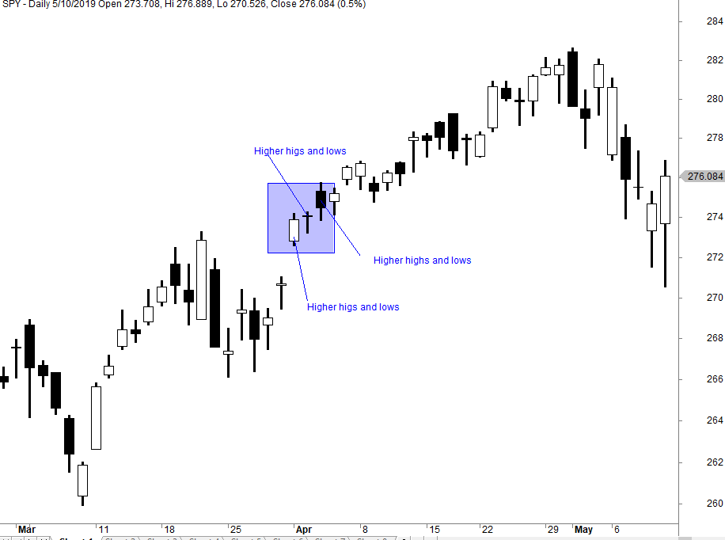

In today's digitized financial markets, algorithmic trading has transformed the trading landscape, enabling traders to execute orders at unprecedented speeds. This technological shift allows market participants to respond to market changes and opportunities more swiftly than ever before. A prominent feature of modern markets is the occurrence of record highs, where stock prices or indices reach historical peaks, often spurring significant interest and activity among investors.

Algorithmic trading plays a critical role in navigating these record highs, offering tools and strategies that can enhance trading outcomes and maximize profits. This article provides an overview of the functionalities and advantages of algorithmic trading, with a focus on how it interacts with market dynamics during such high-pressure periods. Furthermore, it considers the psychological ramifications that record highs can impose on market participants, such as increased risk of irrational decision-making, and how algorithmic strategies can mitigate these effects.



The technology behind algorithmic trading involves complex algorithms programmed to analyze vast sets of market data, identify trends, and make trading decisions based on quantitative analysis rather than emotional impulse. This approach not only increases trade execution speeds but also provides a more systematic and unbiased framework for making investment decisions. Understanding the influence of algorithmic trading in contexts of market highs is essential for traders aiming to maintain strategic agility and optimize their trading portfolios in continually evolving financial markets.

## Table of Contents

## Understanding Record Highs in Financial Markets

A record high in financial markets refers to the peak price level that a security, commodity, or index attains during trading. Typically, these highs are viewed as significant indicators of market performance. When a stock, for instance, reaches an all-time high, it suggests strong demand and investor confidence in the underlying asset or the broader market. Investors often perceive such peaks as a signal of continued growth potential, which can influence their trading decisions.

The significance of record highs extends beyond mere psychological satisfaction for investors. They can represent critical resistance levels in technical analysis—price points beyond which an asset struggles to rise. Once broken, these levels might indicate a new trajectory for price movements, prompting investors to adjust their strategies accordingly. For instance, if the S&P 500 index hits a record high, it may suggest underlying economic strength, pushing more investors to buy into the market, hoping for even higher returns.

Despite the optimistic interpretations, record highs can also introduce psychological barriers. Some investors might fear that prices have peaked and a downturn is imminent, thereby adopting contrarian strategies. In such cases, they may choose to sell off their securities, anticipating a correction. This behavior is grounded in the principle of mean reversion, where asset prices are expected to return to their historical averages over time. An example of this might be an investor who purchases stocks when they are undervalued and sells them as they reach or exceed their fair value, capitalizing on potential market corrections post record highs.

The anticipation of downward corrections can be exacerbated by cognitive biases such as the anchoring effect, where traders place disproportionate weight on the most recent highs as a basis for future price estimations. Such biases might cause reluctance in making new investments, as the perceived risk of a correction overshadows potential gains.

In summary, record highs in financial markets are crucial indicators that can heavily influence investor psychology and trading strategies. They often serve as benchmarks for market performance, yet also [carry](/wiki/carry-trading) the potential for psychological resistance and contrarian behavior based on expectations of market corrections.

## The Functionality of Algorithmic Trading

Algorithmic trading, often referred to as algo trading, employs advanced technological systems to automate financial market transactions. This modern trading approach utilizes pre-programmed trading instructions which are designed to execute orders with speed and efficiency, thereby minimizing manual intervention.

One of its primary functionalities lies in its ability to handle and analyze vast quantities of data at speeds far beyond the capacity of human traders. This comprehensive data analysis is achieved through sophisticated algorithms capable of identifying market trends and patterns. By leveraging these algorithms, traders can execute trades in milliseconds, which is crucial in markets where prices can change rapidly.

Trend recognition is a cornerstone of [algorithmic trading](/wiki/algorithmic-trading) functionality. Algorithms use statistical models and [machine learning](/wiki/machine-learning) techniques to detect price movements and trends across diverse markets. For instance, moving averages, mean reversion, and [momentum](/wiki/momentum) strategies are frequently used to identify trading signals. These strategies rely on historical data to predict future price movements, enabling traders to make informed decisions.

The elimination of human biases is another significant advantage of algorithmic trading. Human traders are often influenced by emotions such as fear and greed, which can lead to irrational decision-making. Algorithms, on the other hand, operate purely on data-driven insights, ensuring consistent implementation of trading strategies without the hinderance of emotional interference.

Algo trading also boosts trading scalability by allowing traders to manage numerous trades and assets simultaneously. This scalability is especially beneficial in high-frequency trading environments where the execution of multiple transactions in quick succession is key to capitalizing on short-lived market opportunities. 

Additionally, algorithmic trading facilitates the efficient [backtesting](/wiki/backtesting) of trading strategies. Backtesting involves applying trading rules to historical data to determine the viability and performance of a strategy before actual market deployment. This process allows traders to evaluate the potential risks and returns, optimizing strategies for improved outcomes. In Python, for instance, libraries such as `pandas` and `[backtrader](/wiki/backtrader)` can be used effectively for backtesting purposes.

Overall, the functionality of algorithmic trading empowers traders by providing precise, speedy, and unbiased trading solutions that are essential in today's fast-paced financial markets.

## Advantages of Algorithmic Trading Amid Record Highs

Algorithmic trading offers significant advantages during periods when financial markets reach record highs. This type of trading employs sophisticated algorithms that effectively scan market conditions and identify fleeting opportunities that human traders may miss due to slower reaction times. The agility of algorithmic trading systems allows them to rapidly execute trades, outperforming human decision-making in speed and efficiency.

One of the core advantages of using algorithmic trading is its ability to reduce emotional bias in trading decisions. Human traders are susceptible to emotional reactions, especially during market highs, which can lead to irrational buying or panic selling. Algorithmic trading systems, on the other hand, rely on quantitative analysis to make decisions based on up-to-the-minute data and statistical probabilities. This objective approach helps traders make more rational and data-driven decisions, minimizing the risk associated with human error.

Algorithmic trading also supports diversification by enabling traders to manage multiple assets simultaneously. The technology allows for the continuous monitoring and execution of trades across various markets, ensuring that traders can maintain optimal risk levels even when individual assets reach unprecedented price levels. By efficiently distributing investments across a wide array of assets, algorithmic trading can mitigate risk and capitalize on growth opportunities across different market sectors.

Furthermore, the backtesting capabilities of algorithmic trading systems allow traders to assess their strategies against historical market data. This ensures that the algorithms are fine-tuned to secure consistent performance, even during market anomalies such as record highs. By simulating different market scenarios, traders can evaluate the efficacy of their strategies and adjust them to optimize returns.

In conclusion, algorithmic trading provides the necessary tools and techniques to navigate the complexities of record highs in financial markets. Its ability to respond swiftly to market changes, coupled with its objective decision-making framework, makes it an invaluable asset for traders seeking to maximize their profit potential while maintaining balanced risk exposure.

## Psychological Impact and the Role of Algorithmic Trading

Record highs in financial markets can significantly influence investor behavior, often acting as psychological barriers. When prices reach unprecedented levels, investors may hesitate to make new investments, fearing that the market has peaked and anticipating a possible decline. This phenomenon, frequently referred to as the "fear of heights" in investing, can lead to market stagnation as potential buyers stay on the sidelines. Such psychological traps can ultimately lead to missed opportunities for profit as investors are driven by fear rather than market fundamentals.

Algorithmic trading offers a compelling solution to these psychological challenges. Its reliance on data-driven strategies allows traders to bypass emotional responses and make more rational decisions. By using pre-programmed algorithms, traders can set criteria for buying and selling that adhere strictly to quantitative analysis, devoid of fear or greed that often clouds human judgment. This objectivity helps prevent panic selling or irrational buying, particularly when markets are at or near record highs.

For instance, algorithmic trading systems can employ statistical models to assess market conditions objectively. An example might involve using a moving average crossover strategy, where buy and sell signals are generated based on the intersection of short-term and long-term moving averages. This method enables the algorithm to execute trades based on trend confirmations, rather than relying on emotional interpretation of market peaks.

```python
# Sample Python code for a moving average crossover strategy
import numpy as np
import pandas as pd

# Assume df is a pandas DataFrame with 'Close' prices of a stock
df['Short_MA'] = df['Close'].rolling(window=50).mean()
df['Long_MA'] = df['Close'].rolling(window=200).mean()

# Buy signal: Short-term MA crosses above long-term MA
df['Signal'] = np.where(df['Short_MA'] > df['Long_MA'], 1, 0)

# Sell signal: Short-term MA crosses below long-term MA
df['Signal'] = np.where(df['Short_MA'] < df['Long_MA'], -1, df['Signal'])
```

This automation not only aids in making consistent trading decisions but also helps manage multiple assets or large volumes of trade without the performance degradation seen in human traders. By focusing on systematic rule-based operations, algorithmic trading reduces the overall impact of psychological biases in the investment decision-making process.

Additionally, algorithmic trading can incorporate machine learning algorithms, enabling them to adapt to new information and evolving market conditions. Such systems can continuously learn from data, refining strategies to optimize performance. For instance, algorithms might use [reinforcement learning](/wiki/reinforcement-learning) to adjust trading approaches based on historical success, further reducing susceptibility to human emotions like fear and hesitation.

In conclusion, by removing emotional biases and implementing disciplined trading strategies, algorithmic trading plays a crucial role in helping traders navigate psychological barriers associated with record highs. Its emphasis on data and analytics enables more stable and profitable investment outcomes, providing a distinct advantage under challenging market conditions.

## Conclusion

Incorporating algorithmic trading into investment strategies is crucial for adapting to the rapidly changing dynamics of financial markets. Algorithmic trading offers the advantage of speed and precision, capitalizing on momentary market inefficiencies and executing trades at optimal times. As technological advancements continue to reshape market landscapes, the ability to harness such technologies effectively can differentiate successful trading approaches from less profitable ones.

Understanding how to leverage algorithmic trading amid record highs is essential for maintaining profitability and ensuring stability in trading portfolios. Record highs may present opportunities and challenges, requiring strategic adjustments to minimize risks and maximize gains. Algorithms can be programmed to recognize patterns that signal potential market corrections or further upward trends, thereby providing traders with valuable insights and actionable strategies.

Moreover, algorithmic trading frameworks facilitate the anticipation of market corrections or future highs by analyzing historical data and statistical trends. This data-driven approach reduces reliance on intuition, which can be influenced by emotions, thereby promoting more objective decision-making. For example, algorithms can be designed to incorporate machine learning models to continually improve trading strategies based on new data elements and market conditions.

In summary, as the complexity and velocity of financial markets continue to increase, the integration of algorithmic trading systems ensures that traders remain competitive. By employing these sophisticated tools, traders are better equipped to navigate the intricate, fast-paced environment of modern markets, achieving sustained profitability and resilience against market [volatility](/wiki/volatility-trading-strategies).

## References & Further Reading

[1]: Lindstrom, D. (2018). ["Algorithmic Trading: Winning Strategies and Their Rationale"](https://www.wiley.com/en-us/Algorithmic+Trading%3A+Winning+Strategies+and+Their+Rationale-p-9781118460146). Wiley.

[2]: Aldridge, I. (2013). ["High-Frequency Trading: A Practical Guide to Algorithmic Strategies and Trading Systems"](https://www.amazon.com/High-Frequency-Trading-Practical-Algorithmic-Strategies/dp/1118343506). Wiley.

[3]: MacLean, L. C., Zhao, Y., & Li, D. (2022). ["Handbook of High-Frequency Trading"](http://www.ziembainvestments.com/publications.html). Springer International Publishing.

[4]: Chan, E. P. (2009). ["Quantitative Trading: How to Build Your Own Algorithmic Trading Business"](https://github.com/egorpe/EPChan-QuantitativeTrading/blob/master/example7_6.m). Wiley.

[5]: Lopez de Prado, M. (2018). ["Advances in Financial Machine Learning"](https://www.amazon.com/Advances-Financial-Machine-Learning-Marcos/dp/1119482089). Wiley.