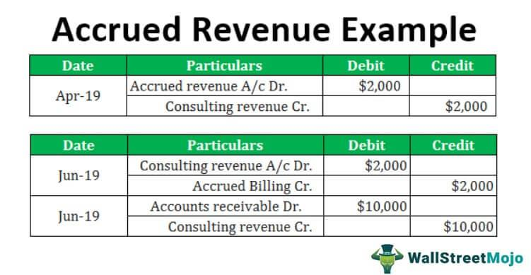

## Table of Contents

## What is accrued revenue?

Accrued revenue is money that a business has earned but hasn't received yet. It's like when you do a job but don't get paid right away. This often happens when a company provides a service or product, but the payment comes later. For example, a company might finish a project in December but not get paid until January. The money they are owed for December work is accrued revenue.

In accounting, accrued revenue is important because it helps show a true picture of a company's finances. Even though the money hasn't come in yet, it's still considered part of the company's earnings for that period. This is recorded on the company's balance sheet as an asset, under accounts receivable. By recognizing this revenue, the company can better understand its financial health and plan for the future.

## Why is it important to record accrued revenue?

Recording accrued revenue is important because it helps a business keep track of all the money it has earned, even if it hasn't received it yet. Imagine you did some work for someone, but they won't pay you until next month. If you don't write down that you are owed that money, you might forget about it or not realize how much money you are supposed to get. By recording accrued revenue, a business can make sure it knows exactly how much money it has coming in, which is crucial for planning and making decisions.

Accrued revenue also helps give a true picture of a company's financial health. If a company only counts the money it has already received, it might look like it's doing worse than it really is. For example, if a company did a lot of work in December but won't get paid until January, its December financial statements would look bad if it didn't include the money it's owed. By including accrued revenue, the company can show that it is actually doing well, which is important for things like getting loans or attracting investors.

## How does accrued revenue differ from unearned revenue?

Accrued revenue and unearned revenue are two different things, even though they both deal with money that hasn't been received yet. Accrued revenue is money that a business has earned by doing work or providing a service, but it hasn't been paid yet. For example, if you mowed someone's lawn in December but they won't pay you until January, that money is accrued revenue. It's money you've earned, but you're waiting to get it.

On the other hand, unearned revenue is money that a business has received from a customer before it has done the work or provided the service. Imagine someone pays you in advance to mow their lawn next month. You have the money now, but you haven't earned it yet because you haven't done the work. Unearned revenue is like a promise to do something in the future, and it's recorded as a liability on the company's balance sheet until the work is done.

## What are the steps to record an adjustment for accrued revenue?

When you need to record an adjustment for accrued revenue, the first step is to figure out how much money you've earned but haven't received yet. This could be from services you've provided or products you've delivered but haven't been paid for. Once you know the amount, you need to make an entry in your accounting records. You do this by increasing an asset account called "Accounts Receivable" by the amount of the accrued revenue. This shows that you are owed money.

The second step is to increase your revenue account by the same amount. This shows that you've earned that money, even if you haven't gotten it yet. For example, if you did $1,000 worth of work in December but won't get paid until January, you would increase your Accounts Receivable by $1,000 and also increase your Revenue account by $1,000. This way, your financial statements for December will show the true amount of money you've earned during that period, giving a more accurate picture of your business's financial health.

## Can you provide an example of a journal entry for accrued revenue?

Let's say you run a small business that does painting jobs. You finished painting a house in December, but the homeowner won't pay you until January. The job was worth $500. To record this as accrued revenue, you need to make a journal entry. You would increase your Accounts Receivable account by $500 because that's the money you are owed. At the same time, you would increase your Revenue account by $500 because that's the money you earned by doing the painting job.

This journal entry would look like this in your accounting records: On the left side, you would write "Accounts Receivable $500" to show that you are owed $500. On the right side, you would write "Revenue $500" to show that you earned $500. This way, your financial statements for December will show that you earned $500 even though you haven't received the money yet. It helps give a true picture of your business's earnings for that month.

## How often should accrued revenue be recorded?

Accrued revenue should be recorded at the end of each accounting period, which is usually at the end of each month or each quarter, depending on how a business chooses to do its accounting. This helps make sure that the business's financial statements show all the money it has earned during that time, even if it hasn't received it yet. By doing this regularly, the business can keep its financial records accurate and up to date.

For example, if a business finishes a project in the middle of the month but won't get paid until the next month, it should record that money as accrued revenue at the end of the current month. This way, when the business looks at its financial statements for that month, it will see the true amount of money it earned, which can help with planning and making decisions about the business's future.

## What are the common accounts affected by accrued revenue adjustments?

When you record accrued revenue, it usually affects two main accounts: Accounts Receivable and Revenue. Accounts Receivable is an asset account that goes up when you record accrued revenue. This account shows the money that people owe you for the work you've already done. For example, if you finished a job but haven't been paid yet, you would add that amount to your Accounts Receivable.

The other account that changes is Revenue. This account goes up to show the money you've earned, even if you haven't received it yet. When you record accrued revenue, you increase your Revenue account by the same amount you added to Accounts Receivable. This way, your financial statements show all the money you've earned during that period, giving a more accurate picture of your business's performance.

## How does recording accrued revenue impact financial statements?

Recording accrued revenue helps show the true amount of money a business has earned, even if it hasn't received it yet. When you record accrued revenue, you increase the Accounts Receivable account, which is an asset on the balance sheet. This shows that the business is owed money for work it has already done. At the same time, you increase the Revenue account on the income statement, which shows how much money the business has earned during that period. By doing this, the financial statements give a more accurate picture of the business's financial health.

For example, if a business finishes a job in December but won't get paid until January, recording the money as accrued revenue means the December financial statements will show that the business earned that money in December. Without recording it, the statements might look like the business earned less money than it actually did. This can affect how the business plans for the future and how investors or lenders see the business's performance. By including accrued revenue, the business can make better decisions and show a truer picture of its earnings.

## What are the potential pitfalls of not recording accrued revenue correctly?

If a business doesn't record accrued revenue correctly, it can cause big problems. Imagine you did a job but didn't write down that you're supposed to get paid for it. Your financial records would show you earned less money than you really did. This can make it look like your business is doing worse than it actually is. If you're trying to get a loan or attract investors, they might think your business isn't doing well and decide not to give you money.

Also, not recording accrued revenue can mess up your planning. If you don't know how much money you've really earned, it's hard to make good decisions about the future. You might think you have less money coming in than you do, and that could lead you to cut back on important things or miss out on opportunities. Keeping track of all your earnings, even the money you haven't gotten yet, helps you run your business better and make smarter choices.

## How can businesses ensure accurate recording of accrued revenue?

To make sure they record accrued revenue right, businesses need to keep good track of the work they've done but haven't been paid for yet. This means they should have a system where they write down every job they finish and how much money they are owed for it. By checking these records at the end of each month or quarter, they can add up all the money they've earned but haven't received, and then put that into their accounts. Using accounting software can help a lot because it can remind them to record this money and do the math for them.

It's also important for businesses to train their staff well so everyone knows how to record accrued revenue correctly. Regular checks and audits can help catch any mistakes early. If a business is unsure, they can hire an accountant who knows all about recording money in the right way. By being careful and checking their work, businesses can make sure their financial records show the true amount of money they've earned, which helps them plan better and show others that they're doing well.

## What are the advanced considerations when dealing with complex accrued revenue scenarios?

In more complex situations, businesses might have to deal with accrued revenue that comes from long-term projects or contracts that span multiple accounting periods. For example, a construction company working on a big project might finish different parts of the job over several months or even years. They need to figure out how much money they've earned for each part of the project and record that as accrued revenue at the end of each accounting period. This can be tricky because they have to estimate the value of the work done and make sure they're following the rules of their accounting method, like the percentage-of-completion method, which looks at how much of the project is done to figure out how much revenue to record.

Another thing to think about is when a business has to deal with different currencies or international contracts. If a company does work in another country and gets paid in a different currency, they need to keep track of how much money they've earned in that currency and then convert it to their own currency for their financial records. This can get complicated because the exchange rates can change, and they need to make sure they're using the right rate at the right time. Also, they have to follow the accounting rules of both their own country and the country where they're doing the work, which can be different and add more steps to recording accrued revenue correctly.

## How do different accounting standards (e.g., GAAP, IFRS) treat accrued revenue?

Under Generally Accepted Accounting Principles (GAAP), which is used mainly in the United States, accrued revenue is recorded when a business has earned money but hasn't received it yet. GAAP follows the accrual basis of accounting, which means businesses have to record revenue when they earn it, not when they get paid. This helps show a true picture of the business's earnings for each period. For example, if a company finishes a job in December but won't get paid until January, they would record that money as accrued revenue in December's financial statements.

International Financial Reporting Standards (IFRS), used in many countries around the world, also use the accrual basis of accounting, so they treat accrued revenue in a similar way to GAAP. Under IFRS, businesses record revenue when it's earned, even if they haven't been paid yet. This means if a company does work in one period but gets paid later, they would still record that money as accrued revenue in the period they did the work. Both GAAP and IFRS want to make sure financial statements show a clear and accurate picture of a business's earnings, but there might be small differences in how they handle specific situations or the details of recording accrued revenue.

## References & Further Reading

[1]: ["Advances in Financial Machine Learning"](https://www.amazon.com/Advances-Financial-Machine-Learning-Marcos/dp/1119482089) by Marcos Lopez de Prado

[2]: ["Financial Statement Analysis and Security Valuation"](https://www.mheducation.com/highered/product/Financial-Statement-Analysis-and-Security-Valuation-Penman.html) by Stephen Penman

[3]: ["Evidence-Based Technical Analysis: Applying the Scientific Method and Statistical Inference to Trading Signals"](https://www.amazon.com/Evidence-Based-Technical-Analysis-Scientific-Statistical/dp/0470008741) by David Aronson

[4]: ["Machine Learning for Algorithmic Trading"](https://github.com/stefan-jansen/machine-learning-for-trading) by Stefan Jansen

[5]: ["Quantitative Trading: How to Build Your Own Algorithmic Trading Business"](https://www.amazon.com/Quantitative-Trading-Build-Algorithmic-Business/dp/1119800064) by Ernest P. Chan

[6]: ["Accounting for Non-Accountants: A Manual for Managers and Students"](https://books.google.com/books/about/Accounting_for_Non_accountants.html?id=GE1lHiU1ZCwC) by Wayne Label

[7]: ["International Financial Statement Analysis"](https://www.amazon.com/International-Financial-Statement-Institute-Investment/dp/1119628059) by Thomas Robinson, Elaine Henry, Wendy Pirie, and Michael Broihahn