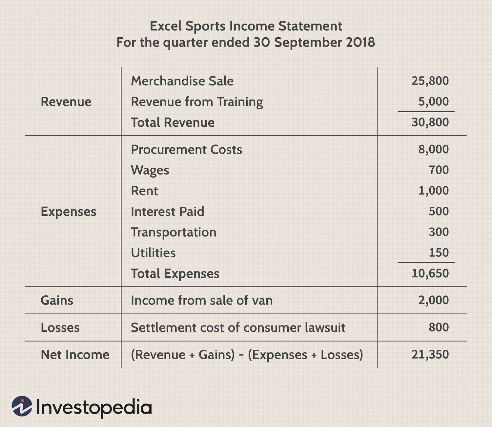

Financial recording and algorithmic trading both play pivotal roles in the financial industry, providing essential frameworks and tools for managing and optimizing financial activities. Financial recording encompasses the systematic documentation of financial transactions, ensuring that every purchase, sale, and movement of funds is accurately captured. This process involves meticulous record-keeping through various accounting practices, which are crucial for assessing the financial health and performance of an organization.

Algorithmic trading, on the other hand, employs sophisticated algorithms to automate trading decisions, leveraging speed, accuracy, and data analysis to outpace traditional trading methods. The synergy between accounting and algorithmic trading lies in their shared reliance on data. Accurate financial records provide the foundational data necessary for developing algorithms that detect trading opportunities, assess risk, and make decisions based on predefined criteria. Such precision in trading algorithms is contingent upon the quality and reliability of the financial data used, underscoring the importance of robust accounting practices.



Moreover, financial records serve as a critical input in the backtesting of trading algorithms. Historical data, derived from detailed financial statements, enables traders to evaluate the effectiveness of algorithms under past market conditions, thus refining trading strategies for future deployment. The comprehensive nature of financial recording—encompassing everything from income statements to balance sheets—enables a thorough analysis of financial data, ensuring that trading algorithms are grounded in reality and aligned with business goals.

The integration of financial recording with algorithmic trading not only enhances the accuracy and efficiency of trading strategies but also contributes to a transparent financial ecosystem. This transparency is vital for regulatory compliance and for fostering trust with investors and stakeholders. As financial markets continue to evolve, the role of precise financial records in shaping advanced algorithmic trading systems will increasingly underscore their significance in the global financial landscape.

## Table of Contents

## Understanding Cash Purchases in Financial Statements

Cash purchases are a fundamental part of financial accounting, significantly influencing how organizations record transactions. Different financial statements have distinct roles in documenting these purchases, providing insights into a company's financial health and operational activities.

### Documentation of Cash Purchases in Financial Statements

Cash purchases are primarily recorded in two key financial statements: the income statement and the cash flow statement. Each serves a unique purpose, offering different perspectives on the financial activities of a business.

**Income Statement**

The income statement, also known as the profit and loss statement, is designed to summarize a company's revenues, expenses, and profits over a specific period. In this context, cash purchases typically appear as part of operating expenses. Operating expenses encompass the costs necessary to maintain normal business operations, including items such as rent, utilities, and raw materials paid for in cash.

The income statement follows the equation:

$$
\text{Net Income} = \text{Total Revenues} - \text{Total Expenses}
$$

Here, cash purchases reduce the net income as they increase the total expenses. By providing a snapshot of earnings and expenditures, the income statement helps stakeholders assess the efficiency and profitability of a company's core operations.

**Cash Flow Statement**

The cash flow statement, on the other hand, specifically tracks the ingress and egress of cash within a business. It comprises three sections: operating activities, investing activities, and financing activities. Cash purchases fall under the operating activities section, reflecting the cash used in day-to-day operations.

The cash flow statement adjusts the net income from the income statement by adding back non-cash expenses and accounting for changes in working capital. This ensures that only cash transactions are reported. The formula can be outlined as:

$$
\text{Cash Flow from Operating Activities} = \text{Net Income} + \text{Non-Cash Expenses} + \Delta \text{Working Capital}
$$

### Difference between Cash Flow and Income Statements

The primary difference lies in their treatment of cash and accrual transactions. While the income statement records revenues and expenses when they are earned or incurred (regardless of cash movement), the cash flow statement focuses solely on actual cash transactions. This distinction is crucial:

- **Accrual vs. Cash Basis**: The income statement may report expenses for items not yet paid for in cash (accrual basis), whereas the cash flow statement only includes transactions where cash has been exchanged.
- **Timeliness**: The cash flow statement provides immediate insights into cash availability, important for liquidity management, while the income statement offers broader insights into profitability over a longer horizon.

### Importance for Financial Analysis

Understanding how cash purchases are documented across these statements is vital for comprehensive financial analysis. The income statement reveals the company's ability to generate profit, while the cash flow statement demonstrates the real-time cash position, crucial for assessing operational [liquidity](/wiki/liquidity-risk-premium). Accurate documentation ensures that investors and managers can make well-informed decisions based on both profitability and cash flow availability.

## Role of Algorithmic Trading in Modern Finance

Algorithmic trading has revolutionized modern finance by significantly impacting traditional trading methods. It employs complex algorithms to make trading decisions at speeds and volumes that far surpass human capability. By utilizing advanced mathematical models and computational techniques, [algorithmic trading](/wiki/algorithmic-trading) systems can scan for market opportunities across multiple markets and execute trades with precision.

The primary advantage of algorithmic trading lies in its combination of speed and precision. With the ability to analyze large volumes of data in real-time, algorithms can identify patterns and execute trades within milliseconds, minimizing the lag between decision-making and trade execution. This reduces the risk of human error and emotion-driven trading, leading to more consistent and profitable trading outcomes. Algorithms also enable high-frequency trading ([HFT](/wiki/high-frequency-trading-strategies)), where trades are executed at extremely high speeds, capitalizing on minute price movements that are typically imperceptible to human traders.

Algorithmic trading involves several key components essential for its operation and success:

1. **Data Analysis**: The foundation of algorithmic trading systems is robust data analysis. Systems are designed to process and analyze vast datasets, including historical price data, news sentiment, and real-time quotes. Tools such as Python libraries like Pandas and NumPy are commonly used to handle this data efficiently, allowing traders to spot trends and patterns that inform algorithmic strategies.

   ```python
   import pandas as pd
   import numpy as np

   # Example: Load historical price data
   data = pd.read_csv('historical_prices.csv')
   # Analyze data to find patterns
   moving_average = data['Close'].rolling(window=20).mean()
   ```

2. **Model Creation**: Based on data analysis, traders develop mathematical models that predict price movements or signal trading opportunities. These models often rely on statistical indicators and machine learning algorithms to improve accuracy. The development of such models requires a deep understanding of financial markets and statistical techniques.

3. **Execution**: Once a trading signal is generated, the algorithm must execute the trade efficiently. This involves interfacing with trading platforms or exchanges, using FIX (Financial Information Exchange) protocols or APIs provided by brokers. Ensuring minimal latency during execution is crucial for capturing intended market timing and prices.

The shift towards algorithmic trading has redefined trading desks worldwide, enabling traders to handle complex and voluminous trades effortlessly. However, this evolution comes with challenges such as ensuring algorithmic robustness and managing technological risks, emphasizing the critical need for sophisticated technological infrastructure and expert oversight in modern financial markets.

Algorithmic trading continues to push the boundaries of what is possible in finance, setting a precedent for further innovations such as the integration of [artificial intelligence](/wiki/ai-artificial-intelligence) and blockchain technologies, which promise to bring additional efficiency and transparency to financial markets.

## Integration of Financial Recording with Algorithmic Trading

Accurate financial recording is fundamental in developing and refining algorithmic trading strategies. The reliability of trading algorithms heavily depends on the quality and precision of the datasets derived from financial records. Financial recordings encapsulate a broad spectrum of data, including transactions, cash flows, and assets, which serve as the primary inputs for algorithmic analysis and decision-making.

T-Accounts play a pivotal role in providing structured and reliable datasets for algorithmic trading systems. These accounts offer a double-entry bookkeeping method, ensuring all financial transactions are recorded with a corresponding credit and debit entry. This structure promotes accuracy and reduces the probability of errors, leading to cleaner, more dependable data for algorithmic processing.

```python
class TAccount:
    def __init__(self):
        self.debits = []
        self.credits = []

    def add_debit(self, amount):
        self.debits.append(amount)

    def add_credit(self, amount):
        self.credits.append(amount)

    def balance(self):
        return sum(self.debits) - sum(self.credits)

cash_account = TAccount()
cash_account.add_debit(100)
cash_account.add_credit(50)

print("Balance in the cash account:", cash_account.balance())
```

In this Python code snippet, a simple T-Account class captures debits and credits, providing a computational basis for understanding the financial position of an entity. The accurate capture and balancing of cash flows are crucial for informing the logic and thresholds underlying algorithmic trading models.

The meticulous record-keeping inherent to T-Accounts and other accounting methods contributes directly to the success of trading strategies. By maintaining precise financial records, investors and traders ensure that the input data for their algorithms reflect true economic activities. This precision enhances the algorithms’ ability to identify trends, predict market movements, and execute trades efficiently and effectively.

Moreover, the integration of robust accounting practices with algorithmic models forms a feedback loop that further enhances trading accuracy. As trading algorithms leverage historical financial data to make predictions and place trades, they concurrently generate new data entries. This continuous process necessitates diligent record-keeping to accommodate evolving market conditions and ensure the adaptability of trading algorithms to new financial landscapes.

Overall, the convergence of detailed financial recording and algorithmic trading highlights the critical need for finance professionals to emphasize precision and rigor in data handling. This synergy maximizes the potential of algorithmic trading by enabling more informed, data-driven investment strategies.

## Case Studies: Real-World Applications

Goldman Sachs and Renaissance Technologies are two prominent examples of firms that have effectively integrated financial recording systems with algorithmic trading. Both companies have leveraged precise financial data to gain competitive advantages in the financial markets.

Goldman Sachs has long been at the forefront of adopting technology for financial operations. With its robust infrastructure, the firm collects large volumes of financial data, which feed into sophisticated algorithmic trading systems. By harnessing this data, Goldman Sachs enhances its predictive modeling and risk management capabilities. The continuous update and accuracy of financial records allow the firm to refine its trading algorithms, ensuring they operate based on the most reliable information. This integration provides a significant edge in decision-making processes, manifesting in both speed and profitability.

The implementation of precise financial data for algorithmic trading at Goldman Sachs has not been without its challenges. The shift from traditional trading methodologies required significant investments in technology and talent. Additionally, integrating financial records with trading algorithms necessitated a restructuring of internal practices, emphasizing the need for real-time data processing and stringent data governance. Despite these challenges, the benefits have been profound, resulting in improved trading efficiency and enhanced strategic capabilities in volatile market environments.

Renaissance Technologies, founded by James Simons, is renowned for its [quantitative trading](/wiki/quantitative-trading) strategies built upon detailed and accurate financial data. The firm utilizes a mathematically-driven approach where financial recording plays a critical role. The success of Renaissance Technologies primarily stems from its ability to transform comprehensive financial datasets into actionable trading insights. By employing advanced statistical models and [machine learning](/wiki/machine-learning) techniques, Renaissance Technologies extracts patterns and anomalies from financial records which inform their algorithmic trading strategies.

The benefits experienced by Renaissance Technologies through this integration include exceptional returns on its funds, significantly outperforming traditional trading methods. However, similar to Goldman Sachs, the firm faces challenges in maintaining the precision and security of its data. The dynamic nature of financial markets demands constant updates to algorithms and the underlying data feeds, posing challenges in scalability and the need for continuous technological advancements.

Both Goldman Sachs and Renaissance Technologies demonstrate the symbiosis between accurate financial recording and algorithmic trading, highlighting the importance of precise data for successful trading strategies. Their experiences underscore the challenges associated with data integration but also showcase its transformative potential, offering vital lessons for other firms aiming to align traditional practices with modern trading strategies.

## Conclusion and Future Trends

The interplay between accounting and algorithmic trading represents a foundational aspect of modern financial markets. Accounting provides the essential framework for accurately recording and reporting financial transactions, a prerequisite for reliable data input into algorithmic trading systems. The convergence of detailed financial recording and state-of-the-art trading algorithms allows for enhanced decision-making, risk management, and performance optimization in trading activities. The precision of accounting records ensures that algorithmic models operate on trustworthy datasets, ultimately driving the success of trading strategies.

Looking forward, the ever-evolving landscape of financial markets promises further integration of cutting-edge technologies such as blockchain and artificial intelligence (AI) into trading systems. Blockchain, with its immutable and transparent ledger capabilities, offers the potential to revolutionize the way financial transactions are recorded and verified. This technology could enhance the reliability and security of data used in algorithmic trading, thereby reducing fraud and errors. Meanwhile, AI presents opportunities to develop sophisticated predictive models that analyze vast datasets for deeper market insights and more accurate forecasts. The ability of AI to learn and adapt over time positions it as an invaluable tool for developing more advanced and responsive trading algorithms.

For finance professionals, keeping pace with these technological advancements is crucial. As the field continues to change rapidly, there is a growing need for professionals to cultivate skills in both finance and technology. Understanding how to leverage blockchain's decentralization and security, alongside AI's analytical capabilities, will be key to maintaining competitiveness and maximizing the impact of trading strategies.

In summary, the synergy between accounting and algorithmic trading underscores the importance of precise financial recording in facilitating effective, data-driven trading operations. Looking ahead, emerging technologies like blockchain and AI promise to further innovate the sector. It is imperative that finance professionals remain agile and informed about these advancements to harness their full potential and ensure continued success in modern financial environments.

## References & Further Reading

[1]: ["Advances in Financial Machine Learning"](https://www.amazon.com/Advances-Financial-Machine-Learning-Marcos/dp/1119482089) by Marcos Lopez de Prado

[2]: ["Evidence-Based Technical Analysis: Applying the Scientific Method and Statistical Inference to Trading Signals"](https://www.amazon.com/Evidence-Based-Technical-Analysis-Scientific-Statistical/dp/0470008741) by David Aronson

[3]: ["Machine Learning for Algorithmic Trading"](https://github.com/stefan-jansen/machine-learning-for-trading) by Stefan Jansen

[4]: ["Quantitative Trading: How to Build Your Own Algorithmic Trading Business"](https://www.amazon.com/Quantitative-Trading-Build-Algorithmic-Business/dp/1119800064) by Ernest P. Chan

[5]: Bergstra, J., Bardenet, R., Bengio, Y., & Kégl, B. (2011). ["Algorithms for Hyper-Parameter Optimization."](https://dl.acm.org/doi/10.5555/2986459.2986743) Advances in Neural Information Processing Systems 24.