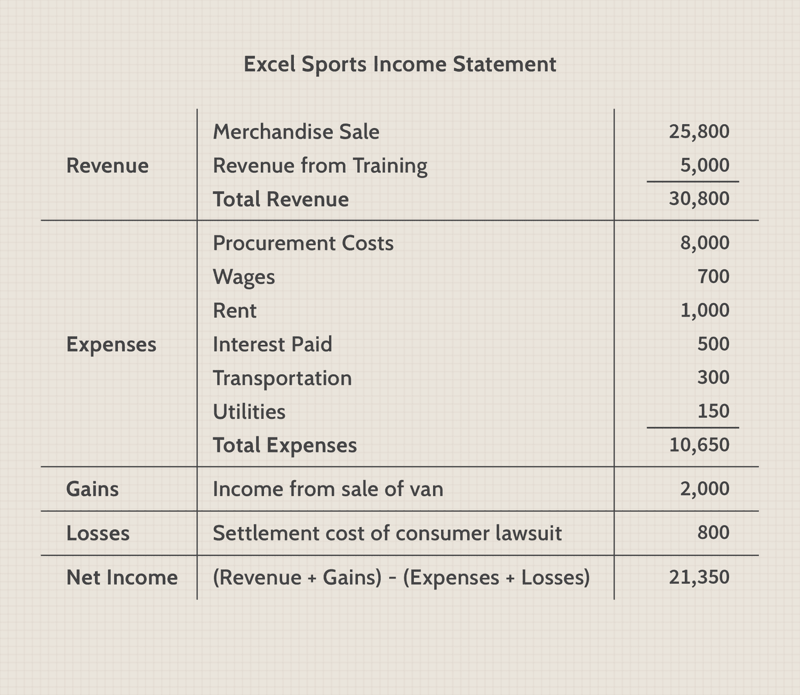

## Table of Contents

## What is a cash purchase in the context of a company?

A cash purchase in the context of a company happens when a business buys something and pays for it right away with money they have on hand. This could be for things like office supplies, equipment, or even another business. When a company makes a cash purchase, it means they are not borrowing money or using credit. This can be good because it helps the company avoid debt and interest payments.

However, using cash for purchases can also mean the company might not have enough money left for other important things, like emergencies or future investments. Companies need to be careful and plan their cash purchases well. They should make sure they have enough money to cover all their needs and still have some left over for unexpected situations.

## How does a cash purchase affect a company's financial statements?

When a company makes a cash purchase, it affects its financial statements in a few ways. First, it reduces the amount of cash the company has on hand. This change is shown on the balance sheet, which is a snapshot of what the company owns and owes at a specific time. When the company spends cash to buy something, the cash account goes down, and the asset or expense account goes up. For example, if the company buys a new computer, the cash account decreases, and the equipment account increases.

Second, the cash purchase can also affect the income statement, which shows how much money the company made or lost over a period of time. If the purchase is an expense, like office supplies, it will increase the expenses on the income statement, which can lower the company's profit. However, if the purchase is an asset, like a piece of machinery, it might not affect the income statement right away. Instead, the cost of the asset will be spread out over time as depreciation, which is an expense that shows up on the income statement gradually.

Overall, cash purchases can have a big impact on a company's financial health. It's important for the company to keep track of these purchases and make sure they are not spending too much cash at once. This helps the company stay financially stable and ready for future needs.

## What is an income statement and what does it show?

An income statement is a financial report that shows how much money a company made or lost over a certain period of time, like a month or a year. It's also called a profit and loss statement. The income statement helps people see if the company is making more money than it's spending, which is called a profit, or if it's spending more than it's making, which is called a loss.

The income statement has three main parts: revenue, expenses, and net income. Revenue is the money the company gets from selling its products or services. Expenses are the costs the company has to pay to run its business, like rent, salaries, and supplies. Net income is what's left after you subtract the expenses from the revenue. If the net income is positive, the company made a profit. If it's negative, the company had a loss. This statement is really important because it shows how well the company is doing financially.

## Where should cash purchases be recorded on the income statement?

Cash purchases are recorded on the income statement based on what the company bought. If the purchase is an expense, like office supplies or utilities, it will be listed under the expenses section of the income statement. This means the company paid for these things with cash, and it increases the total expenses, which can lower the company's profit.

If the purchase is an asset, like a piece of equipment or a vehicle, it won't show up directly on the income statement as an expense. Instead, the cost of the asset will be spread out over time through depreciation. Depreciation is an expense that appears on the income statement gradually, reflecting the asset's use over its useful life. So, while the cash purchase itself isn't immediately shown on the income statement, its impact is felt over time as depreciation is recorded.

## How do you differentiate between cash purchases and credit purchases on financial statements?

Cash purchases and credit purchases show up differently on financial statements. When a company makes a cash purchase, it means they pay for something right away with the money they have. This reduces the cash on the balance sheet and increases either an expense or an asset account, depending on what was bought. If it's an expense, like office supplies, it goes directly on the income statement and lowers the company's profit. If it's an asset, like a new computer, it doesn't affect the income statement right away but will show up as depreciation over time.

Credit purchases are different because the company doesn't pay right away. Instead, they get the item now and agree to pay later. This means the company has a new liability, or debt, on the balance sheet called accounts payable. The expense or asset from the credit purchase is recorded the same way as a cash purchase on the income statement. The big difference is that the cash doesn't leave the company's bank account until later, when they pay off the credit. This can help the company manage its cash flow better but also means they have to keep track of when payments are due.

## What are the typical accounts affected by recording cash purchases?

When a company makes a cash purchase, it affects a few different accounts on its financial statements. The main account that changes is the cash account on the balance sheet. When the company pays for something with cash, the amount of cash they have goes down. This is shown by reducing the cash account. At the same time, another account goes up. If the company bought something that they will use up quickly, like office supplies, the office supplies expense account on the income statement increases. This means the company's expenses go up, which can lower their profit.

If the company bought something that will last a long time, like a new computer or a piece of machinery, the equipment or machinery account on the balance sheet increases. This is because the company now owns a new asset. The cost of this asset won't show up on the income statement right away. Instead, it will be spread out over time as depreciation, which is an expense that appears on the income statement gradually. So, the accounts affected by cash purchases depend on what the company bought, but the cash account always goes down.

## Can you explain the process of recording a cash purchase in the general ledger?

When a company makes a cash purchase, they need to record it in their general ledger. The general ledger is like a big notebook where the company keeps track of all its money coming in and going out. When they buy something with cash, they write down that they spent money in the cash account. This means they subtract the amount they spent from their cash balance. At the same time, they need to show what they bought. If they bought something they will use up quickly, like office supplies, they add the amount to the office supplies expense account. This shows that their expenses went up.

If the company bought something that will last a long time, like a new computer or a piece of machinery, they add the amount to the equipment or machinery account. This shows that they now own a new asset. The cost of this asset won't show up as an expense right away. Instead, over time, they will record depreciation, which is a way to spread out the cost of the asset over its useful life. This depreciation will then show up as an expense on the income statement. So, when recording a cash purchase in the general ledger, the cash account always goes down, and either an expense or an asset account goes up, depending on what was bought.

## How does the recording of cash purchases impact the company's cash flow statement?

When a company makes a cash purchase, it directly affects the cash flow statement. This statement shows how much money is coming in and going out of the company. When the company pays for something with cash, the amount of cash they have goes down. This is shown in the cash flow from operating activities section of the cash flow statement. If the purchase is something they use up quickly, like office supplies, it's considered an operating expense and is recorded as a cash outflow in this section.

If the company bought something that will last a long time, like a new computer or a piece of machinery, it affects the cash flow statement differently. The cash spent on these long-lasting items is shown in the cash flow from investing activities section. This is because buying long-term assets is considered an investment in the company's future. So, the cash purchase reduces the company's cash balance, but where it shows up on the cash flow statement depends on what was bought.

## What are the tax implications of recording cash purchases on the income statement?

When a company makes a cash purchase and records it on the income statement, it can affect how much tax they have to pay. If the purchase is something they use up quickly, like office supplies, it's considered an expense. This means it lowers the company's profit on the income statement. When a company's profit goes down, they might have to pay less in taxes because they are taxed on their profit. So, recording these cash purchases as expenses can help the company save on taxes.

If the company buys something that will last a long time, like a new computer or machinery, it's treated differently for tax purposes. The cost of these items isn't recorded as an expense right away on the income statement. Instead, the company can spread out the cost over time through something called depreciation. This means they can claim a smaller amount as an expense each year, which also lowers their profit and can reduce their tax bill over time. So, the tax implications of cash purchases depend on what the company bought and how it's recorded on the income statement.

## How can errors in recording cash purchases affect the accuracy of financial reporting?

Errors in recording cash purchases can mess up a company's financial reports. If a company doesn't record a cash purchase correctly, it can make their cash balance look wrong. For example, if they forget to write down that they spent money on office supplies, their cash balance will look higher than it really is. This can make it seem like the company has more money than it actually does, which can lead to bad decisions about spending or investing.

Also, mistakes in recording cash purchases can affect how much profit the company shows. If they don't record an expense like office supplies, their expenses will look lower, and their profit will look higher than it should. This can cause the company to pay more taxes than they need to because taxes are based on profit. If they record a long-term asset like a computer as an expense right away instead of spreading it out over time, it can make their profit look lower in the short term, which might not be accurate. Keeping accurate records of cash purchases is really important for making sure the financial reports are correct and helpful for making good business decisions.

## What internal controls should be in place to ensure accurate recording of cash purchases?

To make sure cash purchases are recorded correctly, a company should have good internal controls. One important control is having different people handle different parts of the process. For example, one person should buy the items, another person should record the purchase in the books, and a third person should check that everything was done right. This way, if one person makes a mistake or tries to do something wrong, the other people can catch it.

Another key control is keeping good records and checking them often. The company should have a system where all cash purchases are written down right away, and these records should be compared to the actual cash on hand regularly. This helps make sure that what's written down matches what really happened. Also, the company should use software that helps track and record purchases easily and accurately, and train their employees on how to use it correctly. By doing these things, the company can make sure their financial reports are correct and trustworthy.

## How do advanced accounting software systems facilitate the recording and tracking of cash purchases?

Advanced accounting software systems make it easier for companies to record and track cash purchases by automating a lot of the work. When a company buys something with cash, they can enter the details into the software, and it automatically updates the right accounts. For example, if they buy office supplies, the software will reduce the cash account and increase the office supplies expense account. This helps make sure that every purchase is recorded correctly and quickly, without the company having to do a lot of manual work. The software also keeps a clear record of all transactions, which makes it easier to check and correct any mistakes.

These systems also help with tracking cash purchases over time. They can generate reports that show how much money the company has spent on different things, which helps with budgeting and planning. For instance, if a company wants to see how much they've spent on office supplies in the last year, the software can pull up that information quickly. It also makes it easier to see trends and patterns in spending, which can help the company make better decisions about where to spend their money. By using advanced accounting software, companies can keep their financial records accurate and up-to-date, which is really important for running a successful business.

## What is the understanding of cash purchases in financial statements?

Cash purchases are a fundamental part of financial accounting, significantly influencing how organizations record transactions. Different financial statements have distinct roles in documenting these purchases, providing insights into a company's financial health and operational activities.

### Documentation of Cash Purchases in Financial Statements

Cash purchases are primarily recorded in two key financial statements: the income statement and the cash flow statement. Each serves a unique purpose, offering different perspectives on the financial activities of a business.

**Income Statement**

The income statement, also known as the profit and loss statement, is designed to summarize a company's revenues, expenses, and profits over a specific period. In this context, cash purchases typically appear as part of operating expenses. Operating expenses encompass the costs necessary to maintain normal business operations, including items such as rent, utilities, and raw materials paid for in cash.

The income statement follows the equation:

$$
\text{Net Income} = \text{Total Revenues} - \text{Total Expenses}
$$

Here, cash purchases reduce the net income as they increase the total expenses. By providing a snapshot of earnings and expenditures, the income statement helps stakeholders assess the efficiency and profitability of a company's core operations.

**Cash Flow Statement**

The cash flow statement, on the other hand, specifically tracks the ingress and egress of cash within a business. It comprises three sections: operating activities, investing activities, and financing activities. Cash purchases fall under the operating activities section, reflecting the cash used in day-to-day operations.

The cash flow statement adjusts the net income from the income statement by adding back non-cash expenses and accounting for changes in working capital. This ensures that only cash transactions are reported. The formula can be outlined as:

$$
\text{Cash Flow from Operating Activities} = \text{Net Income} + \text{Non-Cash Expenses} + \Delta \text{Working Capital}
$$

### Difference between Cash Flow and Income Statements

The primary difference lies in their treatment of cash and accrual transactions. While the income statement records revenues and expenses when they are earned or incurred (regardless of cash movement), the cash flow statement focuses solely on actual cash transactions. This distinction is crucial:

- **Accrual vs. Cash Basis**: The income statement may report expenses for items not yet paid for in cash (accrual basis), whereas the cash flow statement only includes transactions where cash has been exchanged.
- **Timeliness**: The cash flow statement provides immediate insights into cash availability, important for liquidity management, while the income statement offers broader insights into profitability over a longer horizon.

### Importance for Financial Analysis

Understanding how cash purchases are documented across these statements is vital for comprehensive financial analysis. The income statement reveals the company's ability to generate profit, while the cash flow statement demonstrates the real-time cash position, crucial for assessing operational [liquidity](/wiki/liquidity-risk-premium). Accurate documentation ensures that investors and managers can make well-informed decisions based on both profitability and cash flow availability.

## References & Further Reading

[1]: ["Advances in Financial Machine Learning"](https://www.amazon.com/Advances-Financial-Machine-Learning-Marcos/dp/1119482089) by Marcos Lopez de Prado

[2]: ["Evidence-Based Technical Analysis: Applying the Scientific Method and Statistical Inference to Trading Signals"](https://www.amazon.com/Evidence-Based-Technical-Analysis-Scientific-Statistical/dp/0470008741) by David Aronson

[3]: ["Machine Learning for Algorithmic Trading"](https://github.com/stefan-jansen/machine-learning-for-trading) by Stefan Jansen

[4]: ["Quantitative Trading: How to Build Your Own Algorithmic Trading Business"](https://www.amazon.com/Quantitative-Trading-Build-Algorithmic-Business/dp/1119800064) by Ernest P. Chan

[5]: Bergstra, J., Bardenet, R., Bengio, Y., & Kégl, B. (2011). ["Algorithms for Hyper-Parameter Optimization."](https://dl.acm.org/doi/10.5555/2986459.2986743) Advances in Neural Information Processing Systems 24.