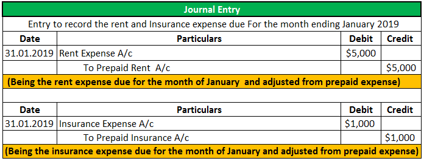

## Table of Contents

## What are prepaid expenses?

Prepaid expenses are costs that a business pays for in advance but will use or benefit from over time. For example, if a company pays for a year-long insurance policy upfront, the entire amount is a prepaid expense at first. Instead of recording this as an expense right away, the company lists it as an asset on its balance sheet because the payment provides future benefits.

As time passes, the company gradually recognizes the prepaid expense as an actual expense. This process is called amortization. Using the insurance example, each month, the company would move a portion of the prepaid amount from the asset account to an expense account. This reflects the fact that the company is using up the insurance coverage over the year. By doing this, the financial statements accurately show the company's expenses and assets over time.

## Why are prepaid expenses important to record?

Recording prepaid expenses is important because it helps a business keep track of its money accurately. When a company pays for something like insurance or rent ahead of time, it's not really an expense right away. Instead, it's like the company is buying something it will use later. By recording it as a prepaid expense, the company can show on its balance sheet that it has paid for something that will be useful in the future.

Over time, as the company uses what it paid for, it can then record those amounts as actual expenses. This is called spreading out the cost. Doing this makes the company's financial reports more accurate. It shows the real cost of doing business each month or year, instead of all at once when the payment was made. This helps everyone who looks at the financial reports, like investors or the company's leaders, understand the company's financial health better.

## How do prepaid expenses appear on the income statement?

Prepaid expenses do not appear directly on the income statement when they are first paid. Instead, they start as assets on the balance sheet. When a company pays for something like insurance in advance, it records that payment as a prepaid expense, which is an asset. This shows that the company has paid for something it will use in the future.

As time goes by, the company uses up what it paid for. For example, if the company paid for a year of insurance, each month it uses one month of that insurance. When this happens, the company moves a little bit of the prepaid expense from the balance sheet to the income statement as an expense. This way, the income statement shows the cost of the insurance for that month, making the financial report more accurate.

## What is the difference between prepaid expenses and other types of expenses?

Prepaid expenses are different from other types of expenses because they are paid for before the company uses them. When a company pays for something like insurance or rent in advance, it doesn't count as an expense right away. Instead, it's recorded as an asset on the balance sheet. This shows that the company has paid for something it will use in the future. Other expenses, like salaries or utilities, are recorded as expenses right when they are paid or when they happen, because the company gets the benefit from them right away.

As time goes on, the company starts to use what it paid for with prepaid expenses. For example, if a company paid for a year of insurance, each month it uses one month of that insurance. At that point, the company moves a little bit of the prepaid expense from the asset on the balance sheet to an expense on the income statement. This way, the financial reports show the real cost of doing business each month or year. Other expenses, like buying supplies or paying for services, are recorded as expenses immediately because they are used up right away.

## Can you explain the process of recording prepaid expenses?

When a company pays for something like insurance or rent before it uses it, that's called a prepaid expense. At first, the company doesn't count it as an expense. Instead, it writes it down as an asset on the balance sheet. This shows that the company has paid for something it will use later. For example, if a company pays for a year of insurance all at once, it records that payment as a prepaid expense, which is an asset.

As time goes by, the company starts to use what it paid for. If the company paid for a year of insurance, each month it uses one month of that insurance. When this happens, the company moves a little bit of the prepaid expense from the asset on the balance sheet to an expense on the income statement. This way, the financial reports show the real cost of doing business each month or year. By doing this, the company makes sure its financial reports are accurate and show how much it's spending over time.

## What is the impact of prepaid expenses on financial statements?

When a company pays for something like insurance or rent before it uses it, that's called a prepaid expense. At first, this payment is recorded as an asset on the balance sheet, not as an expense on the income statement. This means the company's assets go up right away, but its expenses stay the same. This is important because it shows that the company has paid for something it will use in the future, making the financial statements more accurate.

Over time, as the company uses what it paid for, a little bit of the prepaid expense is moved from the asset on the balance sheet to an expense on the income statement. For example, if a company paid for a year of insurance, each month it uses one month of that insurance. By doing this, the company's expenses go up a little each month, and its assets go down. This helps show the real cost of doing business each month or year, making the financial statements reflect the company's actual financial situation more accurately.

## How should prepaid expenses be adjusted at the end of an accounting period?

At the end of an accounting period, a company needs to adjust its prepaid expenses to make sure its financial statements are correct. If a company paid for something like insurance or rent in advance, it recorded that payment as an asset on the balance sheet. But over time, the company uses what it paid for. So, at the end of the accounting period, the company needs to figure out how much of the prepaid expense it used during that time.

To adjust the prepaid expenses, the company moves the part it used from the asset on the balance sheet to an expense on the income statement. For example, if the company paid for a year of insurance and the accounting period is a month, it would move one month's worth of the insurance cost to the income statement. This way, the financial statements show the real cost of doing business for that period and keep the company's assets and expenses accurate.

## What are common examples of prepaid expenses?

Prepaid expenses are costs that businesses pay for before they use them. Some common examples include insurance, rent, and subscriptions. For instance, a company might pay for a year of insurance at the start of the year. This payment is a prepaid expense because the company gets the benefit of the insurance over the whole year, not just when they pay for it.

Another example is rent. If a business pays for six months of rent upfront, that's a prepaid expense. The company uses the office or store space over those six months, so the cost is spread out over time. Subscriptions are also common prepaid expenses. A company might pay for a year-long subscription to a software service or a magazine. The payment is made at the beginning, but the company uses the service or reads the magazine throughout the year.

## How do accounting standards like GAAP and IFRS treat prepaid expenses?

Both GAAP (Generally Accepted Accounting Principles) and IFRS (International Financial Reporting Standards) treat prepaid expenses in a similar way. They say that when a company pays for something like insurance or rent before it uses it, it should record that payment as an asset on the balance sheet. This shows that the company has paid for something it will use later. Both sets of standards want financial reports to be accurate, so they agree that the payment should not be an expense right away.

Over time, as the company uses what it paid for, both GAAP and IFRS say the company should move a little bit of the prepaid expense from the asset on the balance sheet to an expense on the income statement. For example, if a company paid for a year of insurance, each month it uses one month of that insurance. By moving the cost to the income statement each month, the financial reports show the real cost of doing business for that period. This helps everyone who looks at the financial reports understand the company's financial situation better.

## What are the potential pitfalls or errors in recording prepaid expenses?

One common mistake when recording prepaid expenses is not moving the cost from the balance sheet to the income statement at the right time. If a company forgets to do this, its financial reports will not show the real cost of doing business for that period. For example, if a company paid for a year of insurance but doesn't record any of it as an expense each month, the income statement will look like the company spent less than it really did.

Another pitfall is recording the whole prepaid expense as an expense right away instead of as an asset. This makes the financial reports less accurate because it shows a big expense all at once, even though the company will use what it paid for over time. For example, if a company pays for a year of rent and records it all as an expense in the first month, the financial reports for that month will look like the company spent a lot more than it really did for that period.

## How can software tools assist in managing and recording prepaid expenses?

Software tools can help a lot when it comes to managing and recording prepaid expenses. They make it easier for a company to keep track of when it pays for things like insurance or rent in advance. The software can automatically set up the payment as an asset on the balance sheet right away. This means the company doesn't have to remember to do it themselves, which can help prevent mistakes.

Over time, as the company uses what it paid for, the software can also move a little bit of the prepaid expense to the income statement each month. For example, if the company paid for a year of insurance, the software can automatically record one month's worth of the insurance cost as an expense each month. This makes the financial reports more accurate and helps the company keep its books in order without having to do everything by hand.

## What advanced strategies can be used for optimizing the management of prepaid expenses in large organizations?

In large organizations, one advanced strategy for managing prepaid expenses is to use a centralized system. This means having one place where all the information about prepaid expenses is kept. This system can automatically track when payments are made and how much of the prepaid expense should be moved to the income statement each month. By doing this, the company can make sure that everyone is using the same information and that the financial reports are accurate. It also helps save time because employees don't have to do the same work over and over in different parts of the company.

Another strategy is to use predictive analytics to plan when to make payments for things like insurance or rent. By looking at past data, the company can figure out the best times to pay for these things. This can help the company save money by taking advantage of discounts for paying early or avoiding higher costs for paying late. It also helps the company manage its cash flow better, making sure it has enough money to cover other expenses while still getting the benefits of paying for things in advance.

## References & Further Reading

[1]: Goldstein, M. A., Kwan, A. W., & Philip, H. H. (2014). ["Trading Algorithm and Stock Volatility"](https://pubsonline.informs.org/doi/10.1287/mnsc.2022.4539). The Journal of Finance, 69(3), 1041-1073.

[2]: ["Understanding Financial Statements: A Primer of Financial Analysis"](https://online.hbs.edu/blog/post/how-to-read-financial-statements) by Lyn M. Fraser and Aileen Ormiston

[3]: Foley, S., Karlsen, J. R., & Putniņš, T. J. (2019). ["Algorithmic Trading and Market Quality: A Review and Implication"](https://papers.ssrn.com/sol3/papers.cfm?abstract_id=3102645). Journal of Financial Markets, 42, 20-27.

[4]: ["Accounting for Non-Accountants: The Fast and Easy Way to Learn the Basics"](https://archive.org/details/accountingfornon0003labe) by Wayne A. Label

[5]: Hasbrouck, J. (2018). ["Securities Trading: Principles and Procedures"](https://pages.stern.nyu.edu/~jhasbrou/STPP/STPPindex.html) by Joel Hasbrouck

[6]: Katz, J. O., & McCormick, D. L. (2000). ["The Encyclopedia of Trading Strategies"](https://archive.org/details/encyclopediaoftr0000katz) by Jeffrey Owen Katz and Donna L. McCormick