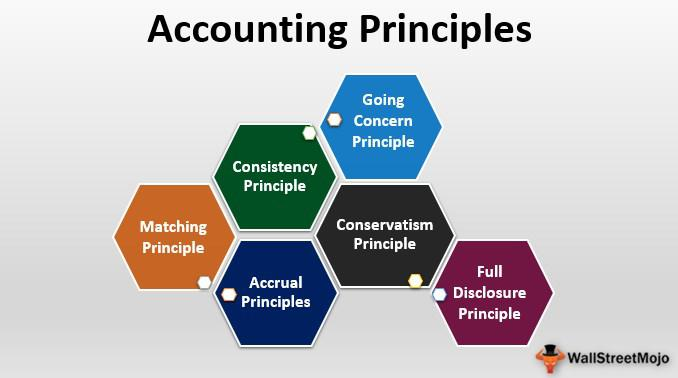

Understanding key accounting practices and emerging technologies is crucial in today’s fast-paced financial environment. This article explores financial reporting, accounting changes, accounting principles, and the role of algorithmic trading, highlighting their interplay and impact on corporate transparency and market dynamics.

Financial reporting serves as a cornerstone for stakeholders seeking an authentic snapshot of a company's health. By providing a comprehensive overview of financial performance and position through standardized documents like income statements, balance sheets, and cash flow statements, financial reporting enables investors, regulators, and the public to make informed assessments. However, this transparency can be undermined by creative accounting practices. These practices involve maneuvering within the boundaries of regulation to present a more favorable company performance, often obscuring the true financial status and leading to significant implications for market transparency. A company's financial health might appear robust, but creative accounting can conceal underlying issues that could affect stakeholder trust and lead to market volatility.



The rise of algorithmic trading further underscores the technological advancements reshaping the financial sector, emphasizing the need for transparent reporting standards. Algorithmic trading harnesses sophisticated algorithms to automate trading decisions at speeds and volumes unachievable by human traders. These algorithms rely heavily on accurate and timely financial data to function effectively. Therefore, transparent and accurate financial reporting is more critical than ever, ensuring that the feeding data into these automated systems is as reliable and precise as possible. As trading operations become increasingly data-driven, the integrity of financial information underpins the smooth functioning of markets and helps maintain investor confidence.

In summary, the integration of robust financial reporting and the adoption of transparent accounting practices play a vital role in sustaining market dynamics. Combined with the emergence of algorithmic trading, these elements necessitate a balanced approach where technological innovation is matched by rigorous ethical standards, ensuring that the financial ecosystem remains stable and transparent.

## Table of Contents

## Financial Reporting and Accounting Changes

Financial reporting serves as the cornerstone of a company's transparency and operational integrity. Through comprehensive financial statements, stakeholders, including investors, creditors, and regulators, are provided with vital insights into a company's financial status and performance. This transparency is crucial for informed decision-making and fostering trust within financial markets.

Accounting changes, particularly shifts in accounting principles, necessitate significant adjustments in how companies prepare and report their financial information. These changes can impact the comparability of financial data across different periods, posing challenges for stakeholders attempting to evaluate a company’s financial trajectory. According to widely accepted accounting frameworks, such as Generally Accepted Accounting Principles (GAAP) and International Financial Reporting Standards (IFRS), it is mandated that these changes are applied retroactively whenever feasible. This ensures that financial statements remain consistent and comparable over time.

The application of accounting changes involves adjusting prior period financial statements as if the new accounting principle had always been in use. This process enhances the relevance and reliability of financial reporting, allowing stakeholders to accurately assess historical performance and trends. For instance, if a company changes its method of inventory valuation from First-In, First-Out (FIFO) to Last-In, First-Out (LIFO), it must restate its previous financial statements to reflect this shift. This adjustment ensures that comparisons across periods remain valid and meaningful.

Moreover, it is crucial to distinguish between a change in accounting principles and a change in accounting estimates. While changes in principles necessitate retrospective application, changes in estimates are treated prospectively. An example of a change in estimate would be revising the useful life of an asset due to new information. Such changes are reflected in the financial statements of the current and future periods without altering past reports.

Ultimately, the integrity of financial reporting relies on the consistent application of accounting changes in accordance with established guidelines. Through adherence to GAAP or IFRS, companies uphold the comparability and transparency of financial data, thereby maintaining stakeholder confidence and facilitating robust market dynamics.

## Understanding Accounting Principles and Estimates

Accounting principles such as Generally Accepted Accounting Principles (GAAP) and International Financial Reporting Standards (IFRS) are essential in creating a standardized framework for preparing financial statements. These principles ensure consistency and accountability across financial reporting by providing guidelines that companies must follow, thereby enabling comparability between different entities. By adhering to these principles, companies help maintain the integrity of financial reporting, which is crucial for the confidence of investors and stakeholders.

A pivotal aspect of accounting is understanding the distinction between a change in accounting principles and accounting estimates. A change in accounting principles typically involves modifying the rules or methods used to prepare financial reports. For instance, a company might switch from a first-in, first-out (FIFO) inventory valuation method to a last-in, first-out (LIFO) method. Such changes must be justified and adequately disclosed, as they can significantly affect financial outcomes and, thus, the stakeholders' understanding of a company's financial status.

In contrast, accounting estimates involve recalculations based on new or updated information rather than fundamental changes to accounting methods. These involve judgments that are often essential due to uncertainties in accounting. For example, estimating the useful life of an asset for depreciation purposes or calculating the allowance for doubtful accounts. Unlike changes in principles, changes in estimates are updates driven by better or more reliable information, reflecting adjustments to reflect reality more accurately.

Ultimately, both principles and estimates are crucial for accurate financial reporting. Accuracy in financial reporting ensures stakeholders receive reliable information, allowing them to make informed decisions. Reliable reports help uphold market confidence, contributing to a more stable and transparent financial environment. By providing a comprehensive and standardized view of financial data, stakeholders, such as investors, creditors, and regulators, can evaluate a company's financial health and make decisions grounded in transparency and trust. Compliance with GAAP or IFRS is non-negotiable for publicly traded companies, as it underpins the trust required for efficient financial markets.

## Creative Accounting: Techniques and Risks

Creative accounting involves the strategic manipulation of financial data within the boundaries of existing regulations to portray a more favorable company performance. This practice, while technically legal, can obscure the true financial health of an organization, posing risks to investors and stakeholders who rely on accurate financial information for decision-making.

Techniques employed in creative accounting often exploit the flexibility afforded by accounting standards, allowing companies to manipulate various elements of financial statements. One notable method is premature revenue recognition, where a company records revenue before it is actually earned. This can inflate earnings in the short term, misleading stakeholders about the company's financial performance. For instance, recording revenue for a long-term contract at the point of sale rather than on a percentage-of-completion basis can make a company's financial health appear more robust than it actually is, as illustrated by the following simple Python snippet:

```python
def recognize_revenue(sales_price, completion_percent):
    # Correct revenue recognition method based on percentage completion
    return sales_price * completion_percent

# Example
sales_price = 1000000  # Total contract value
completion_percent = 0.5  # 50% of project complete
correct_revenue = recognize_revenue(sales_price, completion_percent)
# Premature revenue recognition could involve recognizing the full sales price upfront, thus overstating revenue.
```

Another common strategy is altering depreciation methods. By switching from a declining balance method to a straight-line method, a company can reduce expenses and artificially inflate profits in the short term. While such adjustments are within legal boundaries, they can mislead stakeholders about underlying business trends and future performance.

The risks associated with creative accounting have been starkly illustrated by historical corporate scandals, such as those involving Enron and WorldCom. These companies used aggressive accounting practices to hide debt and inflate profits, ultimately leading to significant financial losses for shareholders and a loss of confidence in the market. The collapse of these corporations not only resulted in enormous financial and reputational damage but also prompted stricter regulatory oversight and the establishment of more stringent ethical standards within the accounting profession.

In essence, creative accounting highlights the need for robust ethical frameworks and rigorous regulatory oversight to ensure the integrity and transparency of financial reporting. This is vital for protecting investor interests and maintaining trust in financial markets.

## The Role of Algorithmic Trading in Modern Finance

Algorithmic trading leverages the capabilities of computers and mathematical models to facilitate automated trade execution, vastly improving the efficiency and speed of financial markets. This automation depends critically on the availability of precise and up-to-date financial data, highlighting the necessity for transparent and accurate financial reporting. Algorithmic trading systems analyze large datasets, executing trades in fractions of a second based on pre-defined criteria, thus eliminating the delays and subjective biases associated with human trading.

Incorporating financial accounting principles into [algorithmic trading](/wiki/algorithmic-trading) strategies serves to enhance their operational efficacy. By integrating both fundamental and technical analyses, these strategies create a more comprehensive approach that combines qualitative financial data with quantitative market metrics. Fundamental analysis might involve evaluating financial statements such as income statements, balance sheets, and cash flow statements to gauge a company’s intrinsic value. Conversely, technical analysis focuses on price movements and patterns through statistical and mathematical indicators like moving averages and [momentum](/wiki/momentum) oscillators. The fusion of these two methods allows algorithmic systems to execute trades based on a holistic understanding of market conditions.

Advanced algorithms increasingly use [machine learning](/wiki/machine-learning) techniques to enhance decision-making capabilities further. Machine learning models, such as regression models, decision trees, and neural networks, process historical data to uncover hidden patterns and correlations. This capability allows systems to adapt to new information dynamically, improving their predictive accuracy and response to market changes. For instance, a machine learning algorithm can identify trends or anomalies in financial data that human analysts might overlook, thereby optimizing trading strategies in real-time.

Through the sophisticated interface of technology, finance, and data, algorithmic trading has reshaped how financial markets operate. It underscores the interconnected nature of financial transparency, technological advancement, and effective market operations, making it a cornerstone of modern financial ecosystems.

## Ethical Considerations and Regulation

Financial regulations, such as the Sarbanes-Oxley Act of 2002, play a pivotal role in ensuring the integrity of financial reporting and market operations. Enacted in response to accounting scandals like Enron and WorldCom, the Sarbanes-Oxley Act established stringent rules to protect investors by enhancing the accuracy and reliability of corporate disclosures. Key provisions include the requirement for top management to certify financial statements, imposition of stringent internal controls, and increased penalties for fraudulent financial activity. These regulations have been instrumental in restoring investor trust and enhancing the overall transparency of financial markets ([U.S. Securities and Exchange Commission](https://www.sec.gov)).

Ethical accounting practices are crucial for providing transparent and honest financial information, which is vital for sustaining investor confidence and market trust. Accountants and financial professionals are expected to adhere to ethical standards that prioritize accuracy and honesty in financial reporting. By doing so, they help maintain a level playing field, ensuring that all stakeholders have access to the same reliable information. This transparency is crucial not only for individual companies but for the stability of the financial system as a whole.

Ongoing education and adherence to ethical standards are necessary to prevent the manipulation of financial data. Continuous professional development through certifications and ethics training helps accountants stay informed about the latest standards and practices. By remaining vigilant and committed to ethical integrity, financial professionals can help ensure the accuracy and transparency of financial data. This commitment is essential in preventing the types of corporate malfeasance that have historically undermined market confidence.

In summary, regulations like the Sarbanes-Oxley Act and a steadfast commitment to ethical accounting practices are both essential in fostering a stable and transparent financial ecosystem. These mechanisms protect investors from fraudulent activity and ensure that financial markets can function efficiently and equitably.

## Conclusion

As financial markets continue to evolve and grow in complexity, it becomes increasingly essential for both investors and professionals to possess a thorough understanding of creative accounting practices and technological advancements, such as algorithmic trading. These elements play pivotal roles in shaping the dynamics of modern finance, and a comprehensive grasp of their intricacies enables market participants to navigate potential pitfalls effectively.

Ethical accounting practices and strict compliance with established regulations are cornerstones in maintaining transparency and integrity within financial markets. Regulations like the Sarbanes-Oxley Act, among others, serve as vital instruments in protecting investors and ensuring that financial disclosures remain truthful and accurate. By adhering to these frameworks, businesses can foster trust and uphold ethical standards, which are critical for sustaining confidence in market operations.

The intersection between technological innovation and ethical responsibility is a fundamental aspect of developing a robust financial ecosystem. A balance between these elements encourages sustainable growth and stability within the marketplace. Algorithmic trading, which relies extensively on precise and transparent financial data, exemplifies the potential for synergy between technology and finance. This balanced approach not only facilitates informed decision-making but also helps in mitigating risks associated with financial misreporting and market [volatility](/wiki/volatility-trading-strategies).

In conclusion, as the financial landscape becomes more intricate, the importance of understanding the dual impact of creative accounting and technological advancements cannot be overstated. Ethical practices and regulatory compliance are vital pillars that support market transparency and contribute to investor trust. By embracing innovation while upholding ethical standards, the financial industry can ensure a more stable and reliable environment, ultimately securing a sustainable future for all market participants.

## References & Further Reading

[1]: Armstrong, C. S., Barth, M. E., Jagolinzer, A. D., & Riedl, E. J. (2010). ["Market Reaction to the Adoption of IFRS in Europe."](https://www.jstor.org/stable/27784261) The Accounting Review.

[2]: Financial Accounting Standards Board (FASB). ["Accounting Standards Codification."](https://asc.fasb.org/)

[3]: ["Advances in Financial Machine Learning"](https://www.amazon.com/Advances-Financial-Machine-Learning-Marcos/dp/1119482089) by Marcos Lopez de Prado.

[4]: ["CRYPTOGRAPHIC ASSETS AND RELATED TRANSACTIONS: Accounting Considerations Under FASB ASC Standards"](https://fasb.org/page/PageContent?pageId=/projects/recentlycompleted/accounting-for-and-disclosure-of-crypto-assets.html) by PwC.

[5]: Securities and Exchange Commission (SEC). ["Sarbanes-Oxley Act of 2002."](https://www.sec.gov/news/speech/spch020503psa.htm)

[6]: Dechow, P., Ge, W., & Schrand, C. (2010). ["Understanding Earnings Quality: A Review of the Proxies, Their Determinants and Their Consequences."](https://www.sciencedirect.com/science/article/pii/S0165410110000339) Journal of Accounting and Economics.