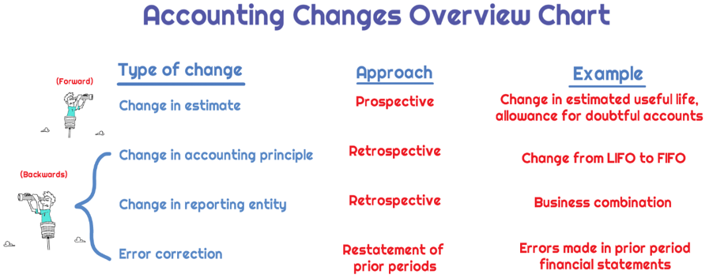

## Table of Contents

## What is a change in accounting principle?

A change in accounting principle happens when a business decides to use a different way of recording its financial information. This might mean switching from one accepted accounting method to another. For example, a company might change how it calculates the value of its inventory or how it records its revenue. It's important because it can affect how the company's financial health is shown in its financial statements.

When a company makes this kind of change, it needs to follow certain rules set by accounting standards. The company must explain why it made the change and show how it impacts the financial statements. This helps people who use the financial statements, like investors or lenders, understand the change and see the company's true financial position. It's all about making sure the financial information stays clear and trustworthy.

## Why is it important to record changes in accounting principles?

Recording changes in accounting principles is important because it helps everyone understand a company's financial situation accurately. When a company switches how it records its money, it can change how the business looks on paper. If these changes aren't written down, people like investors or banks might get confused or make wrong decisions based on old information. By keeping track of these changes, a company makes sure its financial reports are clear and honest.

Also, recording these changes follows the rules set by accounting standards. These rules are there to make sure all companies play by the same guidelines. When a company explains why it changed its accounting method and shows how it affects the numbers, it builds trust. People can see that the company is trying to be open and fair. This openness is key for keeping good relationships with everyone who cares about the company's financial health.

## How do changes in accounting principles affect financial statements?

When a company changes its accounting principles, it can make a big difference in how its financial statements look. For example, if a company switches how it counts its inventory, the value of the inventory on the balance sheet might go up or down. This change can also affect the income statement because the cost of goods sold might be different, which can change the company's profit. So, the numbers on the financial statements can change a lot, which can make the company look more or less profitable or financially stable.

It's important for the company to explain these changes clearly. When they do, they help everyone who looks at the financial statements understand why the numbers might look different from before. This is important for investors, lenders, and other people who make decisions based on these statements. By showing how the change affects the numbers, the company keeps its financial reporting honest and clear, which helps build trust with everyone who cares about the company's financial health.

## What are the common types of changes in accounting principles?

There are a few common types of changes in accounting principles that companies might make. One type is a change in the method used to value inventory. For example, a company might switch from using the First-In, First-Out (FIFO) method to the Last-In, First-Out (LIFO) method. This change can affect how much the company says its inventory is worth and how much it reports as the cost of goods sold, which in turn can change the profit shown on the income statement.

Another type of change is in the way a company recognizes revenue. A company might decide to change from recognizing revenue when a product is delivered to recognizing it when the customer pays. This can make a big difference in when and how much revenue is reported, which can affect the company's financial statements and how it looks to investors.

Lastly, changes in depreciation methods are also common. A company might switch from using the straight-line method to an accelerated method like the double-declining balance method. This can change how much depreciation expense the company reports each year, which impacts the net income on the income statement and the value of assets on the balance sheet.

## What is the difference between a change in accounting principle and a change in accounting estimate?

A change in accounting principle happens when a company decides to use a different method for recording its financial information. This could be switching from one accepted way of counting inventory, like FIFO, to another way, like LIFO. When this happens, the company has to explain why it made the change and show how it affects the financial statements. It's important because it can make the company look different on paper, which can affect how investors and others see the company's financial health.

A change in accounting estimate, on the other hand, is when a company updates its guesses about things like how long an asset will last or how much money it might get from a customer. For example, if a company originally thought a machine would last 10 years but now thinks it will only last 8 years, it changes the estimate. This change affects the financial statements too, but it's about adjusting numbers based on new information, not switching methods. Both types of changes need to be clearly explained so that the financial statements remain trustworthy and clear.

## How should a change in accounting principle be reported in the financial statements?

When a company changes its accounting principle, it needs to report this change in its financial statements. The company should include a note in the financial statements that explains why the change was made and how it affects the numbers. This note helps everyone who reads the financial statements understand the change and see how it impacts the company's financial health. For example, if a company switches from the FIFO method to the LIFO method for inventory, it should show the difference in inventory value and how it changes the profit on the income statement.

The company also needs to adjust the financial statements for the current year and any previous years that are shown for comparison. This is called restating the financial statements. By doing this, the company makes sure that all the numbers are consistent and that the change in accounting principle is clearly shown. This helps investors and other people who use the financial statements to make decisions based on accurate and clear information.

## What is the retrospective application method for accounting changes?

The retrospective application method is a way companies use to show changes in their accounting principles. When a company decides to change how it records its money, it needs to go back and redo the numbers for past years as if it had always used the new method. This makes the financial statements for different years easier to compare because they all use the same accounting rules. For example, if a company switches from FIFO to LIFO for inventory, it will change the inventory numbers for past years to match the new LIFO method.

This method helps keep the financial statements honest and clear. By redoing the past numbers, the company shows everyone how the change affects its money. This way, people like investors and banks can see the true financial health of the company over time. It's important because it builds trust and makes sure everyone has the right information to make good decisions.

## What is the prospective application method for accounting changes and when is it used?

The prospective application method is another way companies can handle changes in their accounting principles. Instead of going back and changing the numbers for past years, the company starts using the new accounting method from the date of the change and only applies it to future events. This means the financial statements for past years stay the same, but the new method is used for all transactions that happen after the change.

This method is used when it's not possible or practical to go back and redo the numbers for past years. For example, if a company starts using a new way to estimate how long its machines will last, it might be too hard to change all the past numbers. So, the company just uses the new estimate for the remaining life of the machines starting from the date of the change. This way, the financial statements stay clear and honest, and everyone can see how the new method affects the company's money going forward.

## How do you disclose a change in accounting principle in the notes to the financial statements?

When a company changes its accounting principle, it needs to explain this change in the notes to the financial statements. The company should write a clear note that tells everyone why it made the change and how it affects the numbers on the financial statements. For example, if the company switches from the FIFO method to the LIFO method for inventory, the note should say why the switch happened and show how the value of the inventory and the profit on the income statement have changed because of it.

This note helps people who read the financial statements, like investors and banks, understand the change better. By explaining the change clearly, the company makes sure that everyone has the right information to make good decisions. The note should also say if the company used the retrospective method, where it changed the numbers for past years, or the prospective method, where it only changes the numbers going forward. This way, the financial statements stay honest and clear, helping to build trust with everyone who cares about the company's financial health.

## What are the impacts of changes in accounting principles on comparative financial statements?

When a company changes its accounting principles, it can really change how its financial statements look when you compare them from one year to the next. If the company uses the retrospective method, it goes back and changes the numbers for past years to match the new way of doing things. This makes all the years' financial statements look like they were always done the new way. So, when someone looks at the financial statements side by side, they can see a clear and fair comparison because all the numbers are based on the same rules.

If the company uses the prospective method instead, it only changes the numbers going forward from the date of the change. This means the past years' numbers stay the same, but the new way of doing things starts from the change date. This can make the financial statements look different from one year to the next because the old numbers and the new numbers are based on different rules. People need to know about this change to understand why the numbers might look different and to make good decisions based on the financial statements.

## How do regulatory bodies like the FASB and IASB influence changes in accounting principles?

Regulatory bodies like the Financial Accounting Standards Board (FASB) and the International Accounting Standards Board (IASB) play a big role in deciding how companies can change their accounting principles. These organizations make the rules that companies have to follow when they record their money. When a company wants to change its accounting method, it has to make sure the new method follows the rules set by the FASB or IASB. These rules help keep financial statements clear and honest so everyone can trust the numbers.

FASB and IASB also work to make sure that accounting changes are done in a way that helps people understand the company's financial health. If a company changes its accounting principle, it has to explain why and show how it affects the numbers. This way, investors and others can see the true picture of the company's money over time. By setting these standards, the FASB and IASB help make sure that financial statements are useful and reliable for everyone who looks at them.

## What are some real-world examples of companies that have changed their accounting principles and the effects of those changes?

One real-world example is when General Motors (GM) changed its accounting principle for recognizing revenue in 2009. GM used to recognize revenue when cars were shipped to dealers, but they switched to recognizing revenue when the dealers sold the cars to customers. This change made GM's revenue numbers look lower at first because it took longer for the money to come in. But it also made the financial statements more accurate because it showed when the money was actually received. This change helped investors see a clearer picture of how well GM was doing.

Another example is when Apple changed its depreciation method for its retail stores in 2013. Apple used to use the straight-line method, where the cost of the store was spread evenly over its life. They switched to an accelerated method, which meant they recorded more depreciation expense in the early years. This change lowered Apple's reported profits in the short term because the expenses were higher. But it also made the financial statements more reflective of how quickly the stores were losing value. This helped investors understand the true costs and value of Apple's retail operations.

## References & Further Reading

[1]: Armstrong, C. S., Barth, M. E., Jagolinzer, A. D., & Riedl, E. J. (2010). ["Market Reaction to the Adoption of IFRS in Europe."](https://www.jstor.org/stable/27784261) The Accounting Review.

[2]: Financial Accounting Standards Board (FASB). ["Accounting Standards Codification."](https://asc.fasb.org/)

[3]: ["Advances in Financial Machine Learning"](https://www.amazon.com/Advances-Financial-Machine-Learning-Marcos/dp/1119482089) by Marcos Lopez de Prado.

[4]: ["CRYPTOGRAPHIC ASSETS AND RELATED TRANSACTIONS: Accounting Considerations Under FASB ASC Standards"](https://fasb.org/page/PageContent?pageId=/projects/recentlycompleted/accounting-for-and-disclosure-of-crypto-assets.html) by PwC.

[5]: Securities and Exchange Commission (SEC). ["Sarbanes-Oxley Act of 2002."](https://www.sec.gov/news/speech/spch020503psa.htm)

[6]: Dechow, P., Ge, W., & Schrand, C. (2010). ["Understanding Earnings Quality: A Review of the Proxies, Their Determinants and Their Consequences."](https://www.sciencedirect.com/science/article/pii/S0165410110000339) Journal of Accounting and Economics.