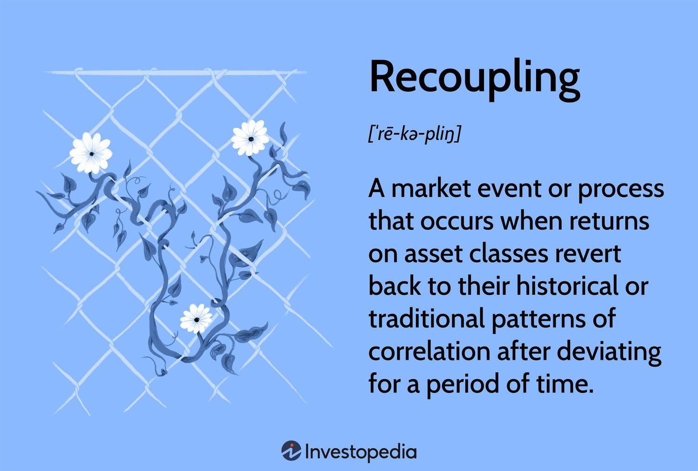

The convergence of economics and technology has led to innovative developments in trading and investment strategies. A prominent example of this integration is algorithmic trading, which employs predefined rules and algorithms to execute trades automatically. This method represents a significant shift in how transactions are conducted in financial markets, as it allows traders to leverage computational power and advanced algorithms to optimize trade execution and enhance decision-making processes. 

This article examines the intricate relationship between mechanism economics, recoupling, and algorithmic trading. Mechanism economics addresses the structural dynamics and interactions within economic systems, emphasizing the effects of rules and policies. Understanding these mechanisms is crucial for interpreting how markets respond to technological advancements and altering regulations. 



Recoupling, on the other hand, refers to the phenomena where asset returns revert to historical correlation patterns after a period of divergence. This concept is essential for understanding the complexities of asset correlations and the impact of economic shifts on market stability. Recognizing recoupling trends provides investors with key insights for optimizing their strategic investments.

Algorithmic trading plays a critical role in these complex interactions by providing tools that enhance market liquidity, ensure systematic trading, and aim to eliminate emotional biases often associated with human traders. The ability to execute trades with speed, precision, and efficiency is increasingly vital in today's fast-paced financial environment. 

By examining these concepts, investors and traders can better understand and respond to market complexities, improving the effectiveness of their strategies. The interplay between mechanism economics, recoupling, and algorithmic trading highlights the significance of these elements in modern financial markets and underscores the need for investors to remain technologically adept in their approach to investing.

## Table of Contents

## Understanding Mechanism Economics

Mechanism economics focuses on analyzing the structural dynamics and interactions within economic systems. It emphasizes the role that policies, strategies, and rules play in governing economic activities, offering a framework to evaluate the effects that external factors have on economic stability and growth. The fundamental premise is that economies are complex systems influenced by numerous internal and external variables.

An essential aspect of mechanism economics is understanding the institutional frameworks and rules that guide economic transactions. These rules can include monetary policies, regulatory practices, and fiscal strategies set by governments and financial institutions. For instance, [interest rate](/wiki/interest-rate-trading-strategies) decisions made by central banks influence borrowing and spending, which in turn affect economic growth and inflation rates.

Mechanism economics also explores how economic systems respond to policy changes and technological advancements. Economic models often incorporate these dynamics to predict how alterations in monetary policy or the introduction of new technologies might impact economic growth, unemployment, and market stability.

For example, consider an economic system described by a simplified model:

$$

Y = C + I + G + (X - M) 
$$

where $Y$ represents the total economic output (GDP), $C$ is consumer spending, $I$ is investment, $G$ is government spending, and $(X - M)$ is net exports. Changes in fiscal policy, such as increased government spending ($G$), can directly influence the total output ($Y$), illustrating the importance of policy-driven economic interactions.

Understanding these mechanisms provides crucial insights into how markets adapt to these changes. For example, technological advancements often lead to shifts in labor market dynamics and productivity levels, which can alter competitive advantages across industries and countries. Companies may need to adapt strategies to maintain competitiveness, while policymakers might adjust regulations to ensure fair market practices.

Overall, mechanism economics offers valuable tools for comprehending the intricate variables that drive market behaviors and economic performance. By emphasizing the interactions among policies, strategies, and rules, it allows stakeholders to anticipate how changes can ripple through economic systems, thereby guiding strategic decisions and fostering economic resilience.

## The Concept of Recoupling in Economic Contexts

Recoupling refers to the phenomenon where asset returns realign with historical correlation patterns after a period of divergence. This concept is pivotal in understanding market dynamics, particularly in response to economic changes. Recoupling is best understood in contrast to decoupling, which represents a temporary breakdown in the correlation between different asset classes. Such divergences typically arise due to external economic shifts, geopolitical events, or significant policy changes. 

Decoupling manifests when assets, traditionally correlated, begin to move independently. For instance, during financial crises, safe-haven assets like gold may inversely correlate with equities more strongly, as investors seek refuge from volatile markets. This period of decoupling can create opportunities and challenges for investors and traders as traditional diversification strategies may no longer apply.

Economic shifts, such as changes in interest rates or economic policies, can stimulate decoupling. However, as markets begin to stabilize post-shock, recoupling occurs. This process involves assets gradually moving back towards their usual correlation paths. Understanding this transition is crucial for effective strategic investment since it signals the re-establishment of familiar market conditions.

Recognizing recoupling trends can significantly enhance investment decisions. When assets begin to recouple, it may indicate the potential for predictably leveraging historical data to forecast future market moves. Investors proficient in identifying these signals can adjust their portfolios accordingly, optimizing asset allocations and hedging strategies to maximize returns while mitigating risk.

In essence, recoupling reflects a return to normalcy in asset behavior, allowing informed investors to anticipate shifts and adjust strategies based on historical data and patterns. Recognizing these trends before they are fully apparent can provide strategic advantages in maintaining or enhancing portfolio performance.

## Algorithmic Trading: An Overview

Algorithmic trading leverages advanced computer programs to execute trading decisions based on predefined instructions. This form of trading has transformed financial markets by enhancing [liquidity](/wiki/liquidity-risk-premium) and maintaining a systematic approach to trading activities. At its core, [algorithmic trading](/wiki/algorithmic-trading) aims to minimize the emotional biases that often influence human traders, promoting objective and precise decision-making in the rapidly changing market environment.

Key features of algorithmic trading include speed, precision, and efficiency. Algorithms execute trades at a velocity unattainable by humans, which is crucial in today's fast-paced markets where timely execution can significantly impact profitability. The precision with which algorithms can process data and execute trades ensures minimal slippage and optimal price acquisition. Efficiency is achieved through the ability to handle large volumes of data, analyze it in real time, and make decisions that align with the set criteria without delay.

Several strategies are commonly employed in algorithmic trading. Trend-following strategies capitalize on the [momentum](/wiki/momentum) of price movements, identifying trends early and executing trades to maximize profit from these trends. These strategies often disregard long-term forecasts and focus on current market dynamics.

Arbitrage opportunities are another focal point of algorithmic trading. They exploit price discrepancies of the same asset across different markets or in various forms, allowing traders to capitalize on these inefficiencies. For example, if the price of a stock differs between two exchanges, an algorithm can simultaneously buy the stock on the cheaper exchange and sell it on the more expensive one, profiting from the price difference.

Index fund rebalancing is a periodic adjustment strategy used by funds to realign the weights of assets in their portfolios to maintain a specified target allocation. Algorithms can effectively manage these adjustments by calculating the required trades and executing them with minimal market impact, ensuring that the fund remains aligned with its investment strategy.

These strategies, powered by the computational capabilities of algorithms, underline the critical role of algorithmic trading in modern financial markets. They transform trade execution and market participation, offering traders and investors tools to navigate complexities with greater confidence and effectiveness.

## The Role of Algorithmic Trading in Market Recoupling

Algorithmic trading plays a significant role in the process of market recoupling by providing advanced tools that adapt to evolving market correlations. The use of automated trading systems enables the rapid identification and exploitation of emerging trends, thus enhancing market efficiency. Such systems are designed to process vast amounts of market data in real time, facilitating timely and informed trading decisions that align with shifting asset correlations.

Automated trading systems rely on algorithms capable of performing real-time analysis of asset correlations, which is crucial for understanding recoupling dynamics. By leveraging [machine learning](/wiki/machine-learning) techniques and sophisticated statistical models, these systems can continually assess correlation matrices and identify potential recoupling opportunities. For instance, a sudden increase in the correlation between two asset classes might signal the onset of recoupling, prompting algorithms to adjust trading strategies accordingly.

Investors benefit from algorithmic trading by achieving optimal timing and execution during recoupling periods. Speed and precision, inherent characteristics of algorithmic trading, enable traders to capitalize on fleeting opportunities that may arise as correlations revert to historical norms. This allows for the execution of trades at advantageous prices, reducing slippage and transaction costs.

Python, widely used in algorithmic trading, offers libraries such as NumPy and pandas for data manipulation and analysis, and scikit-learn for implementing machine learning models. A simple Python script, for instance, could compute the correlation matrix of asset returns and detect significant changes:

```python
import numpy as np
import pandas as pd

# Load historical return data
data = pd.read_csv('asset_returns.csv')

# Compute correlation matrix
correlation_matrix = data.corr()

# Identify significant changes in correlations
threshold = 0.2  # Define a threshold for significant change
significant_changes = np.abs(correlation_matrix.diff()).gt(threshold)

print("Significant Correlation Changes:\n", significant_changes)
```

Through the use of such automated systems, traders are positioned to react swiftly to recoupling phenomena, aligning their strategies with the rapidly changing financial landscape, thus improving their chances of profitability and risk management.

## Challenges and Considerations

Despite the numerous advantages of algorithmic trading, including increased efficiency and precision, several challenges and considerations demand attention. One significant challenge is the dependency on technology. Algorithmic trading systems rely heavily on state-of-the-art hardware and software to function effectively. These systems must consistently perform at high speeds to outpace market participants and capitalize on fleeting opportunities. Therefore, any technological failure, such as server downtime or software glitches, can result in significant financial losses.

Furthermore, market [volatility](/wiki/volatility-trading-strategies) presents another critical challenge. Algorithmic systems are designed to respond to market movements, but extreme volatility can lead to unexpected outcomes, particularly during black swan events—highly improbable and unforeseen occurrences that can cause substantial market disruptions. These events can result in algorithms behaving unpredictably, potentially leading to significant losses. For instance, during the flash crash of May 6, 2010, algorithmic trading was partially blamed for exacerbating the rapid market decline.

The complexity of trading algorithms also necessitates rigorous [backtesting](/wiki/backtesting) and continuous monitoring. Backtesting involves simulating a trading strategy using historical data to ensure its viability before deploying it in live markets. However, past performance is not always indicative of future results, and strategies can underperform under changing market conditions. Therefore, continuous monitoring is crucial to adjust algorithms promptly in response to evolving market dynamics.

Regulations pose another layer of complexity. Financial authorities across the globe have established various regulatory frameworks to ensure market stability and protect market participants. These regulations often impose restrictions on specific algorithmic strategies or require detailed records of algorithmic trading activity. Adherence to these regulations is mandatory to avoid legal repercussions.

Ethical considerations must also be addressed. Algorithmic trading can lead to market manipulation when algorithms are designed or inadvertently effectuate actions that disrupt fair market practices. Ensuring that trading strategies adhere to ethical standards is essential for maintaining trust and integrity in financial markets.

In conclusion, while algorithmic trading can enhance trading efficiency and strategy execution, a comprehensive understanding of its challenges is vital. Traders and investors must be equipped to manage technological dependencies, navigate market volatility, and comply with regulatory and ethical standards to harness the full potential of algorithmic trading.

## Conclusion

Mechanism economics, recoupling, and algorithmic trading collectively shape the framework for understanding and navigating modern financial markets. Grasping the concept of recoupling is crucial for traders as it provides a clearer perspective on the dynamic and often complex relationships between asset correlations. These correlations, after periods of divergence, often revert to historical norms, and recognizing when and how this recoupling occurs can significantly enhance strategic investment decisions.

Algorithmic trading capitalizes on these insights by offering automated solutions that analyze and execute trades with remarkable precision and speed. Through sophisticated algorithms, traders can systematically exploit recoupling trends, thereby optimizing trade timing and execution. The ability to process vast amounts of market data in real-time enables these systems to respond swiftly to shifts in market conditions, making them an indispensable tool in an investor's arsenal.

Yet, as market dynamics evolve, vigilance remains imperative for investors. The rapid pace of technological advancements continuously reshapes the financial landscape, presenting both opportunities and challenges. Continuous monitoring and adaptation of strategies are essential to maintain competitive advantage and manage risks effectively. As technology progresses, so too must the methodologies and strategies employed to ensure they remain aligned with changing market paradigms.

## References & Further Reading

[1]: Bergstra, J., Bardenet, R., Bengio, Y., & Kégl, B. (2011). ["Algorithms for Hyper-Parameter Optimization."](https://dl.acm.org/doi/10.5555/2986459.2986743) Advances in Neural Information Processing Systems 24.

[2]: ["Advances in Financial Machine Learning"](https://www.amazon.com/Advances-Financial-Machine-Learning-Marcos/dp/1119482089) by Marcos Lopez de Prado

[3]: ["Evidence-Based Technical Analysis: Applying the Scientific Method and Statistical Inference to Trading Signals"](https://www.amazon.com/Evidence-Based-Technical-Analysis-Scientific-Statistical/dp/0470008741) by David Aronson

[4]: ["Machine Learning for Algorithmic Trading"](https://github.com/stefan-jansen/machine-learning-for-trading) by Stefan Jansen

[5]: ["Quantitative Trading: How to Build Your Own Algorithmic Trading Business"](https://github.com/LucindaYa/quant-resources/blob/master/Quantitative%20Trading%20How%20to%20Build%20Your%20Own%20Algorithmic%20Trading%20Business.pdf) by Ernest P. Chan