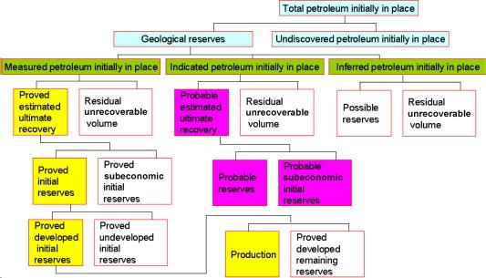

## Table of Contents

## What are recoverable reserves?

Recoverable reserves are the amounts of oil, gas, or other resources that can be taken out of the ground and used. These reserves are important because they help people know how much of a resource they can use in the future. Companies and governments estimate recoverable reserves by looking at how much of the resource is in the ground and how easy it is to get it out.

The estimate of recoverable reserves can change over time. New technology can make it easier to get resources out of the ground, so more of it becomes recoverable. Also, the price of the resource can affect how much is considered recoverable. If the price is high, it might be worth spending more money to get the resource out, so the recoverable reserves go up. If the price is low, it might not be worth the cost, so the recoverable reserves go down.

## How are recoverable reserves different from total reserves?

Recoverable reserves are the part of total reserves that we can actually get out of the ground and use. Total reserves include all the oil, gas, or other resources that are in the ground, even if we can't get them out easily. So, recoverable reserves are always smaller than total reserves because they only count what we can reach and use.

The difference between recoverable and total reserves can change over time. If we get better technology, we might be able to reach more of the total reserves, so the recoverable reserves grow. Also, if the price of the resource goes up, it might make sense to spend more money to get it out, which can turn some of the total reserves into recoverable reserves.

## What types of resources are typically considered as recoverable reserves?

Recoverable reserves usually include things like oil and natural gas. These are resources that are found deep in the ground. People use special tools and methods to bring them up to the surface. When we talk about recoverable reserves, we mean the part of these resources that we can actually get out and use. This is important because it helps us know how much oil or gas we can use in the future.

Other resources like coal and certain minerals can also be part of recoverable reserves. Coal is dug out of the ground in mines, and minerals like copper or gold are found in specific places. Just like with oil and gas, recoverable reserves for these resources are the amounts that we can mine or extract and then use. The amount that is considered recoverable can change if we get better at mining or if the price of the resource goes up or down.

Sometimes, even water can be thought of as a recoverable reserve. In places where water is hard to get, like underground aquifers, the water that can be pumped up and used is considered a recoverable reserve. This helps people plan for how much water they can use, especially in dry areas.

## What is the process for estimating recoverable reserves?

Estimating recoverable reserves starts with figuring out how much of a resource, like oil or gas, is in the ground. People use special tools like seismic surveys to look deep into the earth and see where the resources are. They also look at old data and sometimes drill test wells to get more information. Once they know how much is there, they need to figure out how much they can actually get out. This depends on the technology they have and how easy it is to reach the resource.

Next, they think about how much it will cost to get the resource out of the ground. If the price of the resource is high, it might be worth spending more money to get it, so more of it becomes recoverable. But if the price is low, it might not be worth the cost, so less of it is considered recoverable. They also look at how the technology might change in the future. New technology can make it easier to get resources out, so they might count more of it as recoverable. All these things together help them make a good guess about how much of the resource they can use.

Sometimes, they need to update their estimates. If they find new ways to get the resource out or if the price changes a lot, they might need to change how much they think is recoverable. This is why estimates of recoverable reserves can go up or down over time. It's all about making the best guess with the information they have at the moment.

## How do technological advancements affect the estimation of recoverable reserves?

Technological advancements can make a big difference in how much oil, gas, or other resources we think we can get out of the ground. When new technology comes along, it can help us reach resources that were hard to get before. For example, better drilling tools can go deeper into the earth or reach places that were too hard to get to before. This means that the amount of resources we thought we could use goes up because we can now get to more of it.

Also, new technology can make it cheaper to get resources out. If it costs less to drill or mine, then it makes sense to go after resources that were too expensive before. This can turn some of the resources that we thought were too hard to get into ones that we can now use. So, when technology gets better, the estimates of recoverable reserves can go up because we can reach more of the resource and it costs less to do so.

## What role do economic factors play in determining recoverable reserves?

Economic factors are really important when we try to figure out how much oil, gas, or other resources we can use. The price of the resource is a big deal. If the price is high, it can make sense to spend more money to get the resource out of the ground. This means that more of the resource becomes recoverable because it's worth the cost. But if the price is low, it might not be worth spending a lot of money to get it, so less of it is considered recoverable.

Another economic [factor](/wiki/factor-investing) is how much it costs to get the resource out. If new technology or methods make it cheaper to drill or mine, then more of the resource can be counted as recoverable. But if costs go up, like if there are new rules or taxes, it might make it too expensive to get the resource out, so the amount of recoverable reserves could go down. So, economic factors like price and cost can change how much of a resource we think we can use.

## Can you explain the concept of 'proved' versus 'probable' recoverable reserves?

Proved recoverable reserves are the amounts of oil, gas, or other resources that we are pretty sure we can get out of the ground and use. We know they are there because we have done a lot of tests and studies. These reserves are like the sure thing, the resources we can count on using because we have good proof that they are there and we can get them.

Probable recoverable reserves are the amounts of resources that we think are there, but we are not as sure about them as we are with proved reserves. We have some evidence that they exist, but not as much as we need to be totally sure. These reserves are like a good guess; we think we can get them out and use them, but there's a bit more risk involved because we don't have all the proof yet.

## How do regulatory policies impact the classification and extraction of recoverable reserves?

Regulatory policies can change how we think about and get recoverable reserves. These rules can make it harder or easier to get resources out of the ground. For example, if the government makes new rules that say you have to be very careful about the environment, it might cost more money to drill or mine. This could mean that some resources that we thought we could use are now too expensive to get, so they are not counted as recoverable reserves anymore. On the other hand, if the government gives tax breaks or other help to companies that get resources out, it might make it cheaper to do so, and more resources could be counted as recoverable.

These policies can also affect how we classify reserves. If the rules change about what counts as a proved or probable reserve, it can change the numbers we use. For example, if the government says you need more proof to call something a proved reserve, then some resources might move from the proved category to the probable one. This can make it seem like we have less of the resource that we can count on using. So, regulatory policies can have a big impact on both how much we think we can get out of the ground and how sure we are about it.

## What are some common methods used to extract recoverable reserves?

One common way to get oil and gas out of the ground is by drilling. People use big machines to dig deep holes into the earth where they think the oil or gas is. Once they reach it, they use pumps to bring it up to the surface. Sometimes, they use a method called hydraulic fracturing, or "fracking," where they pump water, sand, and chemicals into the rock to break it open and let the oil or gas flow out. This can help get resources that are hard to reach.

Another way to get resources is by mining. This is often used for coal and minerals like copper or gold. Miners dig big holes in the ground or tunnels into mountains to reach the resources. They use tools to break the rock and then take out the coal or minerals. This can be done in open pits on the surface or deep underground, depending on where the resource is. Mining can be tough work, but it helps us get resources we need.

Sometimes, people use other methods to get resources out. For example, for water in underground aquifers, they might use wells to pump it up to the surface. This is important in places where water is hard to find. Each method has its own challenges and costs, but they all help us use the resources we have in the ground.

## How do environmental considerations influence the management of recoverable reserves?

Environmental considerations play a big role in how we manage recoverable reserves. When we try to get oil, gas, or other resources out of the ground, we need to think about how it might hurt the environment. For example, drilling or mining can cause pollution or harm wildlife. Because of this, there are rules that say how we can do these things in a way that is less harmful. These rules can make it more expensive or harder to get resources out, so they change how much we think we can use.

Also, people are trying to find ways to use resources that are better for the environment. This can mean using new technology to get oil or gas out with less harm, or finding other ways to get energy, like using the sun or wind. These changes can affect how we think about recoverable reserves. If we can use new, cleaner ways to get resources, it might mean we can count more of them as recoverable. But if the environmental cost is too high, it might mean we can use less.

## Can you provide examples of recoverable reserves in the oil and gas industry?

In the oil and gas industry, one example of recoverable reserves is the oil found in the Permian Basin in the United States. This area has a lot of oil underground, and people use drilling to get it out. They use special tools to reach the oil and then pump it up to the surface. The amount of oil they can get from the Permian Basin is considered recoverable because they know it's there and they can use the technology to reach it.

Another example is the natural gas in the Marcellus Shale in the northeastern United States. This gas is trapped in rock deep underground. To get it out, people use a method called fracking, where they pump water, sand, and chemicals into the rock to break it open. This lets the gas flow out so they can use it. The gas in the Marcellus Shale is counted as recoverable because they have the technology to get it and it's worth the cost to do so.

## What future trends are expected to influence the recoverable reserves of renewable resources?

In the future, new technology will play a big role in how much we can use renewable resources like wind, solar, and geothermal energy. As technology gets better, we might be able to build bigger and better wind turbines or more efficient solar panels. This can make it easier and cheaper to get energy from these sources. For example, if we can make solar panels that work better in cloudy weather, more places could use solar power, so the amount of recoverable solar energy would go up. Also, new ways to store energy, like better batteries, can help us use renewable energy even when the sun isn't shining or the wind isn't blowing.

Economic factors will also change how much we can use renewable resources. If the cost of using renewable energy goes down, it might make sense to use more of it. For example, if solar panels become cheaper, more people might put them on their roofs, so more solar energy becomes recoverable. On the other hand, if the price of fossil fuels goes up a lot, it could make renewable energy look more attractive. Governments can also help by making rules that encourage the use of renewable energy, like giving tax breaks for using solar or wind power. These trends can make a big difference in how much renewable energy we think we can use in the future.

## References & Further Reading

BP Statistical Review of World Energy: The BP Statistical Review of World Energy provides a comprehensive overview of global energy production and consumption trends. It includes data on oil, natural gas, coal, nuclear energy, and renewables, making it an essential resource for understanding the dynamics of energy markets and evaluating recoverable reserves.

Yergin, D. (2011). *The Quest: Energy, Security, and the Remaking of the Modern World*: This book by Daniel Yergin explores the changing landscape of global energy resources. It examines the significance of oil and gas recoverable reserves in the context of geopolitics and energy security, providing valuable insights into the strategic importance of these resources.

U.S. Energy Information Administration (EIA) Reports: The EIA provides detailed reports and analyses on energy market trends, including data on oil and gas production, consumption, pricing, and recoverable reserves. These reports are crucial for understanding the economic and technological factors influencing energy industries.

The Markets in Financial Instruments Directive II (MiFID II): MiFID II is a legislative framework established by the European Union to regulate financial markets and improve their transparency. It sets out requirements for [algorithmic trading](/wiki/algorithmic-trading) practices, aiming to ensure market integrity and protect investors. This directive is particularly relevant for stakeholders engaging in the energy sector through algorithmic trading.

