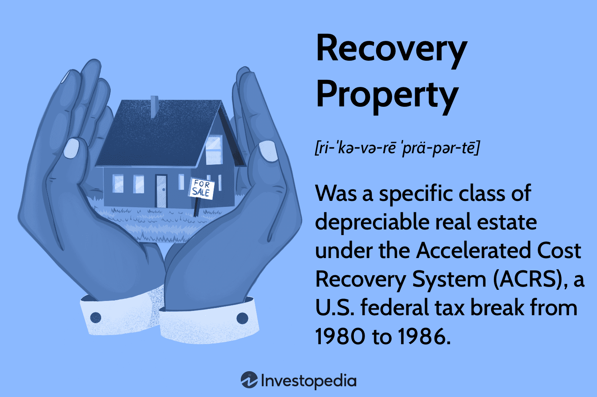

## Table of Contents

## What is the recovery property in the context of data management?

The recovery property in data management refers to the ability of a system to restore data to a correct state after a failure or error. This is important because it helps to keep data safe and accurate, even if something goes wrong. Imagine you are working on a document and your computer crashes. The recovery property ensures that you can get your document back to how it was before the crash, without losing any important information.

Recovery can happen in different ways, depending on the system. Some systems use backups, which are copies of data saved at different times. If something goes wrong, the system can use the most recent backup to restore the data. Other systems use logs, which are records of all the changes made to the data. By looking at the logs, the system can undo or redo changes to fix any errors. Both methods help to make sure that the data remains reliable and usable, even after a problem occurs.

## Why is the recovery property important for database systems?

The recovery property is really important for database systems because it helps keep the data safe and correct. Imagine a database is like a big library with lots of books. If something bad happens, like a power outage or a computer error, the recovery property makes sure that the library can fix itself and all the books (data) are back in the right place. This means that even if there's a problem, people can still trust the information in the database.

Another reason the recovery property is important is that it helps businesses and organizations keep running smoothly. If a database goes down and can't recover, it might stop important work from getting done. For example, a store might not be able to process sales or a hospital might not be able to access patient records. By having a good recovery system, databases can quickly get back to normal and keep everything working as it should.

## How does the recovery property relate to the ACID properties in databases?

The recovery property is closely related to the ACID properties in databases. ACID stands for Atomicity, Consistency, Isolation, and Durability. These properties help make sure that database transactions are handled correctly and safely. The recovery property is especially important for the Durability part of ACID. Durability means that once a transaction is done, it stays done, even if there's a problem like a power outage. The recovery property helps make sure that the database can bring back the data to its correct state after such problems, which keeps the transactions durable.

The recovery property also helps with the Atomicity part of ACID. Atomicity means that a transaction is treated as a single unit that either fully happens or doesn't happen at all. If something goes wrong during a transaction, the recovery property helps the database roll back the changes to make sure the transaction is completely undone. This way, the database stays in a consistent state, which is another important part of ACID. So, the recovery property works hand-in-hand with the ACID properties to keep the database reliable and trustworthy.

## What are the basic mechanisms used to implement the recovery property?

The basic mechanisms used to implement the recovery property in databases include logging and checkpointing. Logging involves keeping a record of all the changes made to the database. This log can be used to redo or undo transactions if something goes wrong. If a system fails, the database can look at the log to see what changes were made and fix any problems. This helps make sure that the data stays correct and that transactions are completed properly, even after a failure.

Checkpointing is another important mechanism. It involves taking a snapshot of the database at certain times. This snapshot, or checkpoint, saves the state of the database at that moment. If there's a failure, the database can quickly go back to the last checkpoint and then use the log to apply any changes that happened after the checkpoint. This makes the recovery process faster because the database doesn't have to go through the entire log from the start.

Both logging and checkpointing work together to make sure the database can recover from failures. They help keep the data safe and make sure that the database stays reliable. By using these mechanisms, databases can ensure that transactions are durable and that the system can get back to a correct state after any problems.

## Can you explain the difference between physical and logical recovery?

Physical recovery and logical recovery are two ways to fix a database after a problem. Physical recovery is all about getting the actual data back. It's like if you spilled water on your favorite book and needed to dry it out and fix the pages. In a database, physical recovery means fixing the files and storage where the data is kept. If there's a crash, the database might use backups or logs to put the data back where it should be, making sure everything is in the right place again.

Logical recovery, on the other hand, is about making sure the data makes sense and is correct. It's like if you found a book where the pages were mixed up, and you needed to put them in the right order. In a database, logical recovery means going through the data and making sure all the transactions are complete and the data follows the rules of the database. If a transaction was halfway done when the system crashed, logical recovery would finish or undo it to keep the data consistent. Both types of recovery are important to keep the database working well.

## What role do transaction logs play in the recovery process?

Transaction logs are like a diary for a database. They keep a record of all the changes made to the data. When something goes wrong, like a power outage, the database can look at the transaction logs to see what changes were made. This helps the database fix any problems by either redoing or undoing the changes. It's like having a backup plan that makes sure the data stays correct and safe.

Using transaction logs in the recovery process is really important. They help make sure that if a transaction was halfway done when the system crashed, it can be finished or undone properly. This keeps the data consistent and reliable. Without transaction logs, it would be much harder for the database to recover from failures and keep the data in the right state.

## How does checkpointing contribute to efficient recovery?

Checkpointing helps make the recovery process faster and easier. It's like taking a quick picture of the database at certain times. This picture, or checkpoint, saves the state of the database at that moment. If the database crashes, it can quickly go back to the last checkpoint instead of starting from scratch. This saves a lot of time because the database doesn't have to go through all the old logs from the beginning.

After going back to the last checkpoint, the database can then use the transaction logs to apply any changes that happened after the checkpoint. This way, the database can get back to the correct state quickly. Checkpointing and transaction logs work together to make sure the recovery process is efficient and the database stays reliable even after a problem.

## What are the common types of failures that the recovery property addresses?

The recovery property in databases helps fix different kinds of problems that can happen. One common type of failure is a system crash, where the computer suddenly stops working. This can happen because of a power outage or a software error. When the system crashes, the database might not finish what it was doing, leaving the data in a wrong state. The recovery property makes sure the database can go back to how it was before the crash and finish any unfinished work.

Another type of failure is a media failure, where the storage device, like a hard drive, gets damaged or stops working. This can cause the data to be lost or corrupted. The recovery property helps by using backups or logs to bring back the lost or damaged data. This way, even if the storage device fails, the database can still recover the important information and keep working correctly.

There are also failures caused by software bugs or human errors, like accidentally deleting important data. The recovery property helps fix these problems by using logs to undo the mistakes or by restoring data from backups. By addressing these common types of failures, the recovery property keeps the database reliable and trustworthy, making sure that users can always depend on the data being correct and safe.

## How do recovery algorithms like ARIES work to ensure data integrity?

ARIES, which stands for Algorithms for Recovery and Isolation Exploiting Semantics, is a recovery method that helps databases fix problems and keep data correct. It uses three main steps: analysis, redo, and undo. When a database crashes, ARIES first looks at the logs to see what was happening before the crash. This is the analysis step. It figures out which transactions were done and which ones were still in progress. This helps the database know what needs to be fixed.

After the analysis, ARIES goes through the logs again in the redo step. It reapplies all the changes that were logged, even if they were already done before the crash. This makes sure that any changes that were supposed to happen are actually in the database. Finally, in the undo step, ARIES goes back and undoes any changes from transactions that were not finished when the crash happened. This keeps the database in a good state, making sure that only complete transactions are kept. By using these steps, ARIES helps make sure the data stays correct and safe, even after a problem.

## What are the challenges in implementing recovery in distributed database systems?

Implementing recovery in distributed database systems can be tricky because the data is spread out across different places. If one part of the system fails, it can be hard to figure out how to fix everything without messing up the other parts. The recovery process needs to make sure that all the different parts of the database stay in sync. This means that if a transaction was happening across multiple places when a failure happened, the recovery system has to make sure that the changes are either all done or all undone everywhere. This can be really complicated and needs careful planning to keep the data correct and safe.

Another challenge is dealing with network problems. In a distributed system, the different parts of the database talk to each other over a network. If the network has issues, like being slow or going down, it can make recovery even harder. The recovery system has to be smart enough to handle these network problems and still make sure the data stays consistent. It's like trying to fix a puzzle when some of the pieces are in different rooms and the doors keep closing. By using smart recovery methods and keeping good logs, distributed databases can overcome these challenges and keep the data reliable.

## How can the recovery property be optimized for performance in large-scale systems?

To make the recovery property work better in big systems, it's important to use smart ways of taking checkpoints and keeping logs. Checkpoints are like quick snapshots of the database that help it recover faster. By taking checkpoints more often, the database doesn't have to go through as many logs to fix things after a problem. But, taking too many checkpoints can slow down the system because it takes time to save these snapshots. So, finding the right balance is key. Also, using special ways to write logs, like grouping changes together before saving them, can make the recovery process quicker and use less space.

Another way to improve recovery in large systems is by using more than one computer to handle the recovery work. This is called parallel recovery. When a problem happens, different parts of the recovery process can be done at the same time on different computers. This can make the whole recovery much faster. But, it's important to make sure these computers are working together correctly so that the data stays in the right state. By using these smart methods, big systems can recover from problems faster and keep the data safe and correct.

## What are the latest advancements in recovery mechanisms for modern database technologies?

Modern database technologies have made big steps forward in recovery mechanisms, making them faster and more reliable. One cool new thing is called "incremental checkpointing." Instead of taking big snapshots of the whole database at once, incremental checkpointing saves small changes as they happen. This way, if something goes wrong, the database can quickly go back to the last saved point without having to redo a lot of work. It's like saving your game often so you don't lose much progress if you have to restart. Another advancement is the use of "cloud-based recovery solutions." These use the power of the internet to store backups and logs in the cloud, making it easier to recover data from anywhere and at any time. This is really helpful for big companies that have lots of data spread out in different places.

Also, there's something called "[machine learning](/wiki/machine-learning) for failure prediction" that's becoming popular. This uses smart computer programs to look at how the database is working and guess when a problem might happen. By knowing when a failure might occur, the database can take steps to prevent it or get ready to recover quickly if it does happen. It's like having a doctor check your health often to catch any problems early. These new recovery methods are making databases stronger and more dependable, helping to keep data safe and correct even in tough situations.

## References & Further Reading

[1]: Baum, A., & Crosby, N. (2008). ["Property Investment Appraisal."](https://archive.org/details/propertyinvestme0000baum_b7t9) Blackwell Publishing.

[2]: Wheaton, W. C. (1999). ["Real Estate Cycles: Some Fundamentals."](https://onlinelibrary.wiley.com/doi/abs/10.1111/1540-6229.00772) Real Estate Economics, 27(2).

[3]: Frankel, R., Gorton, G., & Reber, G. L. (1995). ["The Stock Market and Real Estate Extrapolation Characteristic"](https://users.ssc.wisc.edu/~cengel/IMF/FrankelRose1995.pdf) The Economic Journal, 105(431).

[4]: Lopez de Prado, M. (2018). ["Advances in Financial Machine Learning."](https://www.amazon.com/Advances-Financial-Machine-Learning-Marcos/dp/1119482089) Wiley.

[5]: Geltner, D., Miller, N. G., Clayton, J., & Eichholtz, P. (2013). ["Commercial Real Estate Analysis & Investments."](https://www.researchgate.net/publication/245702364_Commercial_Real_Estate_Analysis_and_Investments) OnCourse Learning.