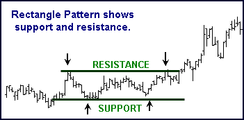

## Table of Contents

## What is a Rectangle Chart Pattern?

A Rectangle Chart Pattern is a type of chart pattern that you can see in the price movements of stocks, currencies, or other financial assets. It looks like a rectangle because the price moves between two horizontal lines. One line is the resistance level, where the price stops going up, and the other is the support level, where the price stops going down. Traders watch these patterns because they can help predict what might happen next with the price.

When you see a Rectangle Chart Pattern, it means the price is stuck between these two levels for a while. This can happen when buyers and sellers are unsure about the next move. If the price eventually breaks out above the resistance line, it might mean the price will keep going up. If it breaks below the support line, it might mean the price will keep going down. Traders use this information to decide when to buy or sell.

## How does a Rectangle Chart Pattern form?

A Rectangle Chart Pattern forms when the price of an asset moves between two clear levels over time. These levels are called support and resistance. The support level is where the price stops falling because buyers step in and start buying, pushing the price back up. The resistance level is where the price stops rising because sellers step in and start selling, pushing the price back down. This back-and-forth movement creates a rectangle shape on the chart as the price bounces between these two levels.

This pattern can last for a while because neither buyers nor sellers are strong enough to break through these levels. It shows that the market is in a state of balance, with neither side taking control. Eventually, if the price breaks out above the resistance level, it might mean that buyers have taken control and the price could continue to rise. If the price breaks below the support level, it might mean that sellers have taken control and the price could continue to fall. Traders watch for these breakouts to make decisions about buying or selling the asset.

## What are the key components of a Rectangle Chart Pattern?

The key components of a Rectangle Chart Pattern are the support level and the resistance level. The support level is the bottom line of the rectangle. It's where the price stops going down because enough people want to buy the asset, pushing the price back up. The resistance level is the top line of the rectangle. It's where the price stops going up because enough people want to sell the asset, pushing the price back down.

These two levels create the rectangle shape on the chart as the price moves back and forth between them. This shows that buyers and sellers are in a tug-of-war, with neither side strong enough to take control. When the price finally breaks out of this rectangle, it can signal a big move. If it breaks above the resistance level, it might mean the price will keep going up. If it breaks below the support level, it might mean the price will keep going down.

## How can a beginner identify a Rectangle Chart Pattern on a chart?

To identify a Rectangle Chart Pattern on a chart, a beginner should look for a clear rectangle shape formed by the price movements of an asset. This shape is created when the price keeps moving between two horizontal lines over time. The top line is called the resistance level, and it's where the price stops going up because sellers step in. The bottom line is called the support level, and it's where the price stops going down because buyers step in. If you see the price bouncing back and forth between these two lines for a while, you might be looking at a Rectangle Chart Pattern.

Once you spot these two lines, watch how the price behaves. The price should touch the resistance line several times without breaking through it and then fall back to the support line, where it touches several times without breaking through it either. This back-and-forth movement can last for a while. When the price finally breaks out of this rectangle, either above the resistance or below the support, it can signal a big move. If it breaks above the resistance, the price might keep going up. If it breaks below the support, the price might keep going down. By keeping an eye on these patterns, beginners can start to understand and predict market movements.

## What does a Rectangle Chart Pattern indicate about market sentiment?

A Rectangle Chart Pattern shows that the market is unsure about what will happen next. It means that buyers and sellers are in a tug-of-war. The price keeps moving between a high point, called the resistance, and a low point, called the support. This back-and-forth shows that neither the buyers nor the sellers are strong enough to take control of the market. It's like they are both waiting to see what will happen before making a big move.

When the price finally breaks out of the rectangle, it can tell us more about market sentiment. If the price breaks above the resistance, it might mean that buyers have become more confident and think the price will go up. On the other hand, if the price breaks below the support, it might mean that sellers have become more confident and think the price will go down. So, the Rectangle Chart Pattern helps us see that the market is waiting for a clear sign before deciding which way to go.

## What are the common entry points when trading a Rectangle Chart Pattern?

When trading a Rectangle Chart Pattern, a common entry point is when the price breaks out of the rectangle. If the price breaks above the resistance level, it's a signal to buy. This breakout suggests that buyers are taking control and the price might keep going up. Traders often wait for the price to close above the resistance before entering a buy order to make sure it's a real breakout and not just a fake move.

Another common entry point is when the price breaks below the support level. This breakout suggests that sellers are taking control and the price might keep going down. Traders will look for the price to close below the support before entering a sell order. This helps them avoid entering a trade too early and getting caught in a false breakout.

Some traders also use a more conservative approach by waiting for the price to retest the breakout level. After the price breaks out, it might come back to the resistance or support level before continuing in the breakout direction. If the price holds above the resistance or below the support during this retest, it can be another good entry point for a trade.

## How do you set stop-loss orders when trading Rectangle Chart Patterns?

When trading a Rectangle Chart Pattern, setting a stop-loss order is important to limit your risk. If you are buying because the price broke above the resistance level, you should place your stop-loss just below the resistance level. This way, if the price goes back into the rectangle, your stop-loss will trigger, and you won't lose too much money. It's a good idea to set the stop-loss a little bit below the resistance, maybe at the lowest point the price reached inside the rectangle, to give the trade some room to move.

If you are selling because the price broke below the support level, you should place your stop-loss just above the support level. This means if the price goes back into the rectangle, your stop-loss will trigger, and you can limit your losses. Again, it's smart to set the stop-loss a little bit above the support, maybe at the highest point the price reached inside the rectangle, to give the trade some breathing space. By setting stop-loss orders this way, you can protect your money while trading Rectangle Chart Patterns.

## What are the typical profit targets for a Rectangle Chart Pattern trade?

When trading a Rectangle Chart Pattern, a common way to set a profit target is to measure the height of the rectangle. The height is the distance between the support level and the resistance level. Once you know the height, you can add it to the breakout point. If the price breaks above the resistance, you add the height to the resistance level to find your profit target. If the price breaks below the support, you subtract the height from the support level to find your profit target. This method helps traders guess how far the price might move after breaking out.

Another way to set a profit target is to look at other important levels on the chart, like past highs or lows, or other support and resistance levels. These levels can act as targets because the price might stop or change direction when it reaches them. Traders often use these levels to decide where to take their profits. By combining the height of the rectangle with these other levels, traders can make more informed decisions about when to exit their trades and lock in their gains.

## How does volume play a role in confirming a Rectangle Chart Pattern?

Volume can help confirm if a Rectangle Chart Pattern is real and if the price breakout is strong. When the price is moving inside the rectangle, the volume is usually low. This shows that not many people are trading, and the market is unsure. But when the price breaks out of the rectangle, either above the resistance or below the support, you want to see a big jump in volume. A big increase in volume during the breakout means that more people are trading and they believe the price will keep moving in that direction.

If the volume doesn't go up much during the breakout, it might mean the breakout isn't strong and could be a fake move. Traders watch the volume to make sure the breakout is real before they decide to buy or sell. So, volume is a big help in making sure the Rectangle Chart Pattern is telling the truth about where the price might go next.

## What are the differences between a Rectangle Chart Pattern and other continuation patterns?

A Rectangle Chart Pattern is one type of continuation pattern that shows the price moving between two horizontal levels, called support and resistance, for a while before breaking out. This pattern is different from other continuation patterns like the Bull Flag or the Pennant. A Bull Flag looks like a small rectangle or a parallelogram that slopes against the main trend, while a Rectangle is always horizontal. A Pennant looks like a small triangle and usually forms over a shorter time than a Rectangle. Both the Bull Flag and the Pennant tend to have a faster breakout than the Rectangle, which can take longer to form and break out.

Another difference is how the price moves inside these patterns. In a Rectangle, the price moves back and forth between the same two levels until it breaks out. In a Bull Flag, the price usually moves down in a small channel after a big move up, and in a Pennant, the price moves within converging trend lines. The Rectangle shows a clear balance between buyers and sellers, while the Bull Flag and Pennant show a pause in the trend before it continues. So, while all these patterns suggest that the price will keep moving in the same direction after the breakout, the way they form and the time they take to form are different.

## How can advanced traders use multiple timeframes to enhance their Rectangle Chart Pattern strategy?

Advanced traders can use multiple timeframes to get a better view of the market when trading Rectangle Chart Patterns. They might start by looking at a longer timeframe, like a daily chart, to spot the rectangle and see the overall trend. If they see a Rectangle Chart Pattern on the daily chart, they can then switch to a shorter timeframe, like a 1-hour or 15-minute chart, to find the best entry points. On the shorter timeframe, they can watch for the price to break out of the rectangle and use that as a signal to enter a trade. By looking at different timeframes, traders can make sure the pattern is strong and increase their chances of making a good trade.

Using multiple timeframes also helps traders set better stop-loss and profit targets. For example, if a trader sees a breakout on a shorter timeframe, they might set their stop-loss just outside the rectangle on that same timeframe. But if they also look at a longer timeframe, they can set a wider stop-loss to give the trade more room to move, which can be helpful if the price pulls back a bit after breaking out. For profit targets, traders can use the height of the rectangle from the longer timeframe to set a more realistic goal for how far the price might go. By combining information from different timeframes, advanced traders can make more informed decisions and manage their trades better.

## What are some advanced techniques for managing risk and maximizing returns with Rectangle Chart Patterns?

Advanced traders can manage risk and maximize returns with Rectangle Chart Patterns by using a technique called position sizing. This means they decide how much money to put into each trade based on how risky it is. If they see a strong breakout with high volume on a Rectangle Chart Pattern, they might put more money into that trade because it seems less risky. But if the breakout looks weak or the volume is low, they might put less money in to limit their risk. By adjusting their position size, traders can protect their money and make the most of good trading opportunities.

Another advanced technique is to use trailing stop-loss orders. After entering a trade based on a Rectangle Chart Pattern breakout, traders can set a stop-loss that moves up or down with the price. If the price keeps going in their favor, the stop-loss follows it, locking in more profit. But if the price starts to fall back, the trailing stop-loss can close the trade before too much profit is lost. This way, traders can let their winning trades run longer and cut their losses short. By combining these techniques, advanced traders can manage their risk better and aim for bigger returns when trading Rectangle Chart Patterns.

## References & Further Reading

[1]: Bulkowski, T. N. (2005). ["Encyclopedia of Chart Patterns"](https://www.amazon.com/Encyclopedia-Chart-Patterns-Thomas-Bulkowski/dp/0471668265). Wiley. 

[2]: Martin J. Pring (1991). ["Technical Analysis Explained: The Successful Investor's Guide to Spotting Investment Trends and Turning Points."](https://www.amazon.com/Technical-Analysis-Explained-Successful-Investment/dp/0071381937) McGraw-Hill Education.

[3]: Kirkpatrick, C. D., & Dahlquist, J. R. (2010). ["Technical Analysis: The Complete Resource for Financial Market Technicians,"](https://ptgmedia.pearsoncmg.com/images/9780134137049/samplepages/9780134137049.pdf) (2nd ed.). FT Press.

[4]: Schwager, J. D. (1995). ["The New Market Wizards: Conversations with America's Top Traders."](https://www.amazon.com/New-Market-Wizards-Conversations-Americas/dp/0887306675) HarperBusiness.

[5]: Murphy, J. J. (1999). ["Technical Analysis of the Financial Markets: A Comprehensive Guide to Trading Methods and Applications."](https://archive.org/details/technicalanalysi0000murp) New York Institute of Finance.

[6]: Bashir, B., & El-Hassan, A. (2017). ["Performance of candlestick technical trading strategies in the emerging equity markets of Africa."](https://en.wikipedia.org/wiki/Al-Duhail_SC) Munich Personal RePEc Archive.