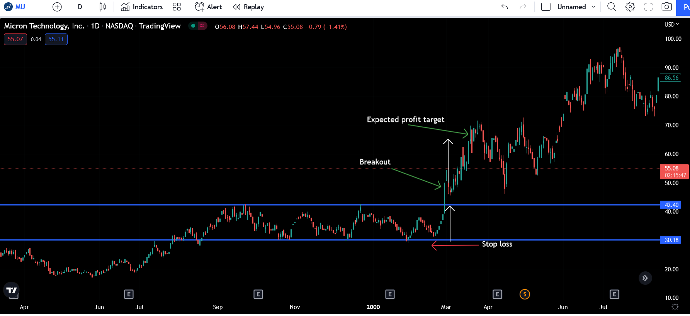

Algorithmic trading is a field that significantly benefits from the use of technical analysis tools designed to enhance trading precision and profitability. Among these tools, the rectangle chart pattern is a widely recognized strategy utilized in identifying potential continuation or reversal trends within the market. This pattern becomes a cornerstone for traders seeking to decode the myriad fluctuations of market prices. By learning to recognize and apply the rectangle chart pattern effectively, traders can substantially improve their ability to predict market movements, which in turn can lead to more profitable trading outcomes.

The rectangle chart pattern serves as a guide for traders to anticipate where a market, after a period of consolidation, might move next. This article investigates into the characteristics of the rectangle chart pattern—exploring its formation, identification techniques, and strategic application within trading. By understanding how prices fluctuate within the boundaries of the pattern, traders can better position themselves to capitalize on future movements, especially as these patterns are known to frequently signal substantial breakthroughs or trend reversals upon completion. Understanding and deploying this pattern with precision not only simplifies complex market signals but also provides a structured methodology to aid in profitable decision-making.



## Table of Contents

## What is a Rectangle Chart Pattern?

A rectangle chart pattern is a type of price action formation characterized by the movement of an asset's price between two parallel horizontal lines, representing levels of support and resistance. During this phase, price action tends to oscillate within a defined range, with the upper boundary typically acting as a resistance level, and the lower boundary serving as a support level. This behavior reflects a period of market consolidation.

The formation of a rectangle pattern can be identified when the price bounces between these horizontal support and resistance lines multiple times without any significant progression in either direction. Each time the price approaches the resistance level, it encounters selling pressure that prevents further upward movement, thus defining the upper boundary. Conversely, when the price nears the support level, buying interest emerges, preventing further decline and establishing the lower boundary.

A crucial aspect of the rectangle pattern is its ability to suggest potential breakout opportunities. Once the price breaches either the resistance or the support level, it typically indicates a continuation or reversal of the prevailing trend. For example, if a breakout occurs above the resistance line, it may signal the continuation of an upward trend. Likewise, if the price falls below the support line, it could indicate a reversal or continuation of a downward trend.

The rectangle pattern does not prescribe a fixed duration for which the price should remain within the range. The key [factor](/wiki/factor-investing) is the repeated testing of the defined support and resistance levels. Traders often look for additional indicators to confirm the strength of the breakout when the price exits the rectangle formation. Incorporating volume analysis, for instance, can be beneficial, as an increase in volume can validate the likelihood of a breakout being sustainable.

In summary, a rectangle chart pattern offers traders insights into potential consolidations and [breakout](/wiki/breakout-trading) points, helping them prepare for possible future price movements. This formation serves as a foundational concept in technical analysis, with its straightforward structure and dual possibilities of continuation or reversal making it a versatile tool for traders.

## How to Identify a Rectangle Chart Pattern

A rectangle chart pattern is discernible by establishing two horizontal lines that encapsulate at least two swing highs, which act as resistance, and two swing lows, serving as support. These lines essentially form a "box" or "rectangle" through which the price action oscillates during a period of consolidation. 

The swing highs and lows within this pattern should exhibit relative similarity, though they do not need to be precise. This means that while the peaks and troughs might not be at the exact same price levels each time, they should be close enough to each other to form a distinct horizontal channel. This horizontal movement is conducive to a clear and sustained range, making the pattern identifiable. 

A crucial aspect of the rectangle chart pattern is its flexibility in signaling either a bullish or bearish outcome. The bullish nature of a rectangle pattern is indicated when the price breaks above the resistance line after the consolidation phase, suggesting a continuation or initiation of an upward trend. Conversely, if the price breaks below the support line, it signals a bearish implication, pointing towards a downward trend. 

For visual clarity and enhanced identification, algorithms can be used to detect these patterns programmatically. Here's a basic example of how one might code the identification process using Python and a hypothetical price dataset:

```python
def identify_rectangle_pattern(prices):
    highs, lows = [], []
    for i in range(1, len(prices)-1):
        if prices[i] > prices[i-1] and prices[i] > prices[i+1]:
            highs.append((i, prices[i]))
        elif prices[i] < prices[i-1] and prices[i] < prices[i+1]:
            lows.append((i, prices[i]))

    if len(highs) < 2 or len(lows) < 2:
        return "Rectangle pattern not identified."

    # Sort highs and lows by price level to establish resistance and support
    resistance = sorted(highs, key=lambda x: x[1], reverse=True)[:2]
    support = sorted(lows, key=lambda x: x[1])[:2]

    return resistance, support

prices = [100, 105, 102, 108, 103, 107, 101, 109, 105]
result = identify_rectangle_pattern(prices)
print(result)
```

This simplistic approach scans through a series of price points to determine local maxima and minima that correspond with the pattern's fundamental characteristics. Once identified, traders can monitor these levels to anticipate potential breakout points, which indicate forthcoming directional movements. Employing this systematic method aids in delineating clear actionable signals from the market, thereby enhancing trading strategy efficacy.

## Trading Strategies Using the Rectangle Pattern

Traders can utilize the rectangle chart pattern through breakout or range-bound strategies. Each strategy offers distinct opportunities based on the price's interaction with established support and resistance levels.

In breakout strategies, traders wait for a definitive price movement beyond the rectangle's confines. A breakout occurs when the price surpasses the resistance or falls below the support line, signaling a potential trend continuation or reversal. When a breakout happens, it is essential to confirm the breakout with increased trading [volume](/wiki/volume-trading-strategy), as this can signify the strength of the move. Traders often set entry points slightly above the resistance for an upward breakout or below the support for a downward breakout. Stop-loss orders are typically placed just inside the rectangle's range to minimize risk from false breakouts.

For range-bound strategies, traders focus on the predictable oscillation of prices within the established horizontal levels of support and resistance. This strategy involves initiating long positions at or near the support line, where the price is expected to bounce back upwards. Conversely, short positions are taken near the resistance line, anticipating a price reversal back toward the support level. The profit target for these trades is generally set near the opposite boundary of the rectangle, with stop-loss orders placed outside the pattern to protect against adverse price movements.

In both strategies, careful monitoring of market conditions and volume is crucial. Integrating additional technical indicators, such as the Moving Average Convergence Divergence (MACD) or Relative Strength Index (RSI), can further enhance the decision-making process by providing confirmation signals for breakouts or reversals. Ultimately, whether employing a breakout or range-bound strategy, traders should remain disciplined, adhering to their predefined rules and risk management protocols to optimize the profitability of their trades.

## Pros and Cons of the Rectangle Strategy

The rectangle chart pattern strategy offers several advantages for traders seeking to optimize their market entry and [exit](/wiki/exit-strategy) points. One of the primary benefits is the ability to clearly define these points within the pattern. Entry and exit levels can be determined by the support and resistance lines that form the boundaries of the rectangle. Because the price action oscillates within these lines during the consolidation phase, traders can pinpoint where to place their buy and sell orders with a high degree of precision.

Moreover, the potential profit from a trade initiated by a rectangle pattern can be calculated by measuring the height of the rectangle. This measurement represents the price range that the pattern spans, and when a breakout occurs, traders often use this range as a guide to estimate the potential price movement in the direction of the breakout. For instance, if the height of the rectangle is $H$, and a breakout occurs, traders might anticipate a price movement of approximately $H$ in the breakout's direction, allowing for objective profit targeting.

The strategy's adaptability across various timeframes is another distinct advantage, facilitating its use by different trading styles, from [day trading](/wiki/day-trading-spy) to swing trading. This flexibility enables traders to apply the rectangle strategy to short-term intra-day charts or longer-term daily and weekly charts, accommodating differing risk appetites and investment horizons.

Despite these advantages, the rectangle pattern strategy is not without its drawbacks. One notable challenge is the potential for false breakouts. These occur when the price momentarily moves beyond the support or resistance level but then quickly reverses back into the rectangle. Such false moves can lead to losses if trades are initiated based solely on these initial breakouts. 

Another significant challenge relates to stop-loss placement. Given the nature of false breakouts, determining an appropriate stop-loss level that balances risk and reward can be difficult. If set too tight, there's a heightened risk of being stopped out prematurely during market noise, whereas a stop-loss that's too loose might expose the trader to undue risk.

Overall, while the rectangle chart pattern strategy presents clear methodologies for targeting entry and exit points, traders must navigate the issues of false breakouts and judicious stop-loss placements to execute effectively. Combining this strategy with additional indicators or analysis techniques can help mitigate these drawbacks and enhance trading outcomes.

## Historical Performance and Backtesting

The rectangle chart pattern has been studied extensively to determine its effectiveness in predicting market breakouts. Research shows that rectangle patterns often signal high probability breakouts, making them a valuable tool for traders. The success rate of breakouts from this pattern can vary based on several factors, including market conditions and the underlying asset. Historical analyses have generally reported a favorable success rate when trading breakouts from rectangle patterns, bolstering the confidence of traders who rely on technical analysis.

The successful application of the rectangle strategy often requires consideration of additional factors such as trading volume. Volume can act as a critical indicator of breakout strength; a breakout accompanied by a significant increase in volume tends to suggest a more sustained movement in the breakout direction. Conversely, breakouts occurring on low volume might indicate a higher risk of a false breakout, where the price returns to the range of the rectangle instead of continuing in the breakout direction.

Backtesting forms an essential part of confirming the reliability of rectangle chart patterns. By evaluating historical data, traders can develop insights into the effectiveness of the rectangle pattern under various market conditions. Backtesting involves applying the strategy to past market data to see how it would have performed without risking real capital. This process can be automated and carried out using programming languages like Python. For instance, traders can use Python libraries such as Pandas for data manipulation and Matplotlib for plotting, alongside NumPy for numerical calculations, to test their strategies:

```python
import pandas as pd
import numpy as np
import matplotlib.pyplot as plt

# Assume 'df' is a DataFrame containing historical price data with columns 'Date', 'High', 'Low', 'Close', and 'Volume'

def detect_rectangle_pattern(df):
    # Simplified logic to detect rectangle patterns
    # Not representative of real-world complexity
    resistance = df['High'].rolling(window=10).max()
    support = df['Low'].rolling(window=10).min()

    # Identify potential pattern sections
    rectangles = (df['High'] <= resistance) & (df['Low'] >= support)
    return rectangles

def backtest_strategy(df, rectangles):
    success = 0
    total = 0
    for i in range(len(rectangles)):
        if rectangles[i]:
            # Simplified breakout strategy logic
            if df['Close'][i] > df['High'][i-1]:
                total += 1
                if df['Close'][i+1] > df['Close'][i]:  # Check if breakout is successful (simplistic)
                    success += 1
    return success / total if total > 0 else 0

rectangles = detect_rectangle_pattern(df)
success_rate = backtest_strategy(df, rectangles)
print(f"Rectangle pattern success rate: {success_rate:.2f}")
```

Gaining insights through [backtesting](/wiki/backtesting) can substantially enhance the trader’s confidence and decision-making accuracy. Moreover, combining rectangle patterns with other technical indicators and fundamental analyses can provide more robust trading strategies, thereby optimizing the effectiveness of [algorithmic trading](/wiki/algorithmic-trading) systems.

## Conclusion

Rectangle chart patterns are versatile tools in algorithmic trading, providing numerous opportunities for recognizing both continuation and reversal trades. These patterns appear during periods of price consolidation, which offer a critical moment where market sentiment may either resume its prior trend or pivot, signaling a shift. When effectively harnessed, rectangle chart patterns can substantially enhance a trader's ability to predict market movements and fine-tune their trading strategies to capitalize on these insights.

The proper application of rectangle chart patterns requires a disciplined approach, considering both the inherent strengths and potential pitfalls associated with their use. Traders can significantly benefit by employing these patterns to accurately identify entry and exit points, enhancing the precision of their trades. Furthermore, the ability to apply rectangle chart patterns across various timeframes imparts a valuable flexibility that caters to different trading styles and preferences. This adaptability is particularly advantageous in algorithmic trading, where automated systems can be programmed to recognize these patterns and execute trades accordingly, thus optimizing the trading process.

However, it is critical to underscore the importance of integrating rectangle chart patterns with other technical indicators and broader market analysis tools. Relying solely on a single pattern—while potentially effective—may not provide a comprehensive picture of the market dynamics. Hybrid strategies that combine multiple indicators can offer more robust signals and better manage the risk of false breakouts, which are a common challenge associated with using rectangle patterns.

In conclusion, while rectangle chart patterns are potent instruments in the toolkit of algorithmic traders, their efficacy is maximized when used as part of a holistic trading approach. By coupling these patterns with supplementary analysis and indicators, traders can achieve a more balanced view of market conditions, thereby improving their trading decisions and outcomes.

## References & Further Reading

[1]: Bulkowski, T. N. (2005). ["Encyclopedia of Chart Patterns"](https://www.amazon.com/Encyclopedia-Chart-Patterns-Thomas-Bulkowski/dp/0471668265). Wiley. 

[2]: Martin J. Pring (1991). ["Technical Analysis Explained: The Successful Investor's Guide to Spotting Investment Trends and Turning Points."](https://www.amazon.com/Technical-Analysis-Explained-Successful-Investment/dp/0071381937) McGraw-Hill Education.

[3]: Kirkpatrick, C. D., & Dahlquist, J. R. (2010). ["Technical Analysis: The Complete Resource for Financial Market Technicians,"](https://ptgmedia.pearsoncmg.com/images/9780134137049/samplepages/9780134137049.pdf) (2nd ed.). FT Press.

[4]: Schwager, J. D. (1995). ["The New Market Wizards: Conversations with America's Top Traders."](https://www.amazon.com/New-Market-Wizards-Conversations-Americas/dp/0887306675) HarperBusiness.

[5]: Murphy, J. J. (1999). ["Technical Analysis of the Financial Markets: A Comprehensive Guide to Trading Methods and Applications."](https://archive.org/details/technicalanalysi0000murp) New York Institute of Finance.

[6]: Bashir, B., & El-Hassan, A. (2017). ["Performance of candlestick technical trading strategies in the emerging equity markets of Africa."](https://en.wikipedia.org/wiki/Al-Duhail_SC) Munich Personal RePEc Archive.