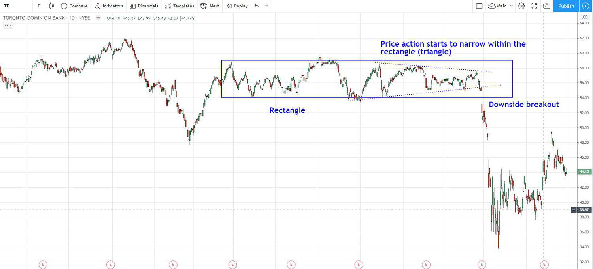

Mathematics plays a vital role in diverse fields, spanning from geometry to finance and algorithmic trading. In the context of trading, geometric concepts such as the rectangle pattern have practical applications that help traders identify and capitalize on market trends. The rectangle pattern, characterized by periods of consolidation within horizontal support and resistance levels, provides significant insights for traders aiming to predict market movements and make informed decisions.

Algorithmic trading, powered by sophisticated mathematical models, is transforming the landscape of financial markets. By automating trading decisions, these models enhance efficiency, allowing traders to respond swiftly to market changes. The integration of mathematical frameworks within this realm facilitates the development of algorithms capable of processing and analyzing large datasets, ensuring precise execution of trades and effective risk management.



This article examines the interplay between rectangle geometry and mathematical principles in algorithmic trading. By exploring how these elements intersect, traders can leverage an analytical edge in navigating the complexities of financial markets. Understanding this synergy equips traders with strategic tools to optimize their trading activities, exploiting market inefficiencies for improved outcomes. As technology evolves, these mathematical concepts are poised to play an increasingly significant role, offering traders novel applications and opportunities for sustained success.

## Table of Contents

## Understanding Rectangle Geometry in Trading

Rectangles on price charts manifest when asset prices oscillate between well-defined horizontal support and resistance levels over a period, typically signaling a phase of market consolidation devoid of decisive trends. This distinctive geometric pattern appears as a bounded range, with the price movement forming a rectangle-like shape, which is composed of two horizontal lines representing support and resistance levels. 

During the consolidation phase, traders observe this pattern as the market's indecision or equilibrium between buying and selling pressures. The horizontal support line indicates the price level at which buying interest is strong enough to prevent the price from declining further, while the horizontal resistance line symbolizes the price level at which selling pressure is sufficient to curb further increases in price. The length of time and the number of times prices touch the support and resistance lines can contribute to the rectangle's validity and the potential strength of the breakout.

An important aspect of the rectangle pattern is its eventual breakout, which occurs when the price convincingly exits the rectangle's boundary, either above the resistance or below the support line. This breakout is typically interpreted as a trading signal signifying the resumption of the previous market trend or the commencement of a new trend direction. Traders often capitalize on this movement by entering a position in the direction of the breakout, with the expectation of capturing significant price movement. The height of the rectangle, measured from the support to the resistance level, can offer an estimate of the potential price target following a breakout.

Traders use rectangles strategically to determine entry and [exit](/wiki/exit-strategy) points for positions based on prevailing market behavior. For example, should prices breach the resistance level, traders might employ buy stop orders slightly above this level to trigger market entry. Conversely, if the support level is broken, sell stop orders positioned below the support may be executed. By interpreting these geometric patterns, traders can align their strategies with market psychology and anticipate future price movements, making rectangles a valuable tool in technical analysis within trading strategies.

## Mathematics in Algorithmic Trading

Algorithmic trading relies heavily on advanced mathematical models to automate trading decisions. The foundational elements of these models include descriptive [statistics](/wiki/bayesian-statistics), probability, and linear algebra, each serving a critical role in the development and functionality of trading algorithms.

Descriptive statistics provides a way to summarize and understand market data, allowing traders to compute mean, median, mode, variance, and standard deviation. These metrics help determine market trends and [volatility](/wiki/volatility-trading-strategies). For instance, standard deviation can be used to measure the risk associated with a particular asset or strategy.

Probability theory is fundamental for predicting price movements and assessing the likelihood of certain market conditions. By calculating probabilities, traders can evaluate potential outcomes and make informed decisions. For example, probability distributions can be used to model future price movements based on historical data, thus enabling prediction of bullish or bearish trends.

Linear algebra is instrumental in the construction and optimization of trading strategies. It is particularly useful in modeling and solving systems involving multiple variables, such as the correlation matrix of asset returns. This mathematical approach allows for the development of strategies like portfolio optimization, which seeks to maximize returns for a given level of risk.

Algorithms use these mathematical insights to efficiently process and analyze large volumes of market data. They leverage statistical models and computational techniques to identify patterns, track market dynamics, and execute trades based on pre-set criteria. For instance, a simple Python implementation of a moving average crossover strategy might be:

```python
import numpy as np
import pandas as pd

# Load historical market data
data = pd.read_csv('market_data.csv')
data['SMA_50'] = data['Close'].rolling(window=50).mean()
data['SMA_200'] = data['Close'].rolling(window=200).mean()

# Determine trading signals
data['Signal'] = 0
data.loc[data['SMA_50'] > data['SMA_200'], 'Signal'] = 1
data.loc[data['SMA_50'] < data['SMA_200'], 'Signal'] = -1

# Calculate potential profits
profit = data['Signal'].shift(1) * data['Close'].pct_change()
cumulative_profit = (1 + profit).cumprod() - 1
print(f"Cumulative Profit: {cumulative_profit[-1]:.2%}")
```

Trading algorithms aim to exploit market inefficiencies to achieve optimal execution of trades. By assessing the price anomalies and executing trades faster and more accurately than human traders, these algorithms can capitalize on short-lived market opportunities. The key is to identify and exploit inefficiencies before they become apparent to the broader market, ensuring a competitive edge in the financial landscape.

## Analyzing Rectangles with Mathematical Models

Rectangles are essential patterns in technical analysis and can be effectively examined through mathematical modeling. In technical trading, rectangles represent periods of price consolidation, where market prices oscillate between defined support and resistance levels without a prevailing trend. Traders utilize these formations to anticipate future price movements, particularly focusing on [breakout](/wiki/breakout-trading) points where the price decisively exits the established range. This anticipation relies heavily on both visual identification of patterns and quantitative analysis.

Mathematical models provide additional layers of precision in predicting potential breakouts by analyzing historical data trends within the rectangle. These models often begin with the collection and analysis of historical price data, employing statistical methods to discern patterns. For instance, using statistical tools such as the moving average can help smooth out price fluctuations, helping traders identify consolidating ranges.

Quantitative methods are invaluable in determining optimal entry and exit points within rectangle patterns. Techniques like regression analysis or the application of Bollinger Bands can add further insight. A linear regression analysis, for example, might be employed to model the relationship between time (as an independent variable) and price movements (as a dependent variable), thereby forecasting future movements based on past data trends. 

Moreover, predictive models frequently rely on statistical measures, incorporating elements such as standard deviation and variance to capture and quantify market behaviors. These models use historical price data as input to simulate various scenarios, providing traders with a probabilistic assessment of potential price movements. Additionally, [machine learning](/wiki/machine-learning) algorithms, like logistic regression or neural networks, can be implemented to enhance predictive accuracy by learning from past price behaviors within rectangles and general market conditions.

Here's a basic implementation in Python to illustrate how a simple moving average might be calculated to monitor price trends within a rectangle:

```python
import pandas as pd

# Sample price data
price_data = {
    'Date': ['2021-01-01','2021-01-02','2021-01-03', '2021-01-04', '2021-01-05'],
    'Price': [100, 102, 101, 103, 104]
}

df = pd.DataFrame(price_data)

# Calculate moving average
df['Moving_Average'] = df['Price'].rolling(window=3).mean()

print(df)
```

This code takes a simple DataFrame of dates and prices, calculates a moving average over a specified window (e.g., 3 days), and prints the results. This moving average can aid in smoothing and identifying the broader trend within the rectangle, aiding in confirming breakouts when price moves significantly above or below this average. Integrating these mathematical models with technical analysis offers traders robust, data-driven strategies for navigating financial markets.

## Real-World Application of Rectangle Patterns in Algo Trading

Algorithmic traders increasingly use rectangle patterns to automate trading processes, effectively reducing the influence of emotional decision-making. This is accomplished by programming algorithms to identify these patterns on price charts in real-time, allowing for consistent market analysis and strategy execution.

### Identification and Prediction

Rectangle patterns are periods of price movement that occur between parallel support and resistance levels, forming a range-bound structure. By programming algorithms to detect such patterns, traders can systematically analyze market behavior. Algorithms search for instances where prices hover within a defined range, signaling potential consolidation phases in the market.

Once a rectangle pattern is identified, algorithms leverage it to predict potential breakouts. This prediction is based on historical data analysis and empirical market behavior. By analyzing past price movements, algorithms estimate the likelihood of price breaking out of the rectangle in either direction, facilitating strategic positioning for either scenario.

### Simulation and Optimization

Within the confines of a rectangle, trading algorithms may simulate multiple scenarios to identify opportunities for optimizing profitability. For example, algorithms can adjust strategy parameters, such as stop-loss and take-profit levels, based on the rectangle's dimensions and prior market behavior. By continuously assessing different potential outcomes, algorithms prepare for various market shifts, allowing them to capture potential gains effectively.

In practical terms, consider a Python-based algorithm that uses the numpy and pandas libraries to analyze historical data and identify rectangle patterns. Here is a simplified illustration:

```python
import numpy as np
import pandas as pd

def identify_rectangles(price_data, window_size=20):
    rectangles = []
    for i in range(len(price_data) - window_size):
        window = price_data[i:i + window_size]
        support_level = window.min()
        resistance_level = window.max()

        # If the price remains within the support and resistance levels, mark as a rectangle
        if np.all((window >= support_level) & (window <= resistance_level)):
            rectangles.append((i, support_level, resistance_level))

    return rectangles

# Example usage with historical price data
historical_prices = pd.Series([...])  # Replace with actual historical price data
rectangle_patterns = identify_rectangles(historical_prices)
```

### Backtesting and Implementation

Practical applications of rectangle patterns also involve [backtesting](/wiki/backtesting) strategies using historical data. This process refines trading strategies by simulating them against previous market conditions to evaluate their performance. Backtesting provides insights into strategy effectiveness, offering a metrics-driven basis for refining algorithmic decision-making. For instance, traders can use backtesting results to adjust the sensitivity of rectangle detection or revise risk management parameters.

In summary, deploying rectangle patterns in [algorithmic trading](/wiki/algorithmic-trading) systems enables automated, data-driven decision-making, optimizing the profitability and efficiency of trading operations while minimizing emotional biases. This methodology represents a sophisticated approach to systematically exploiting market patterns, enhancing both predictive accuracy and strategic execution.

## Conclusion

Rectangle geometry and mathematical principles provide vital insights into the world of algorithmic trading. The integration of these disciplines allows traders to craft sophisticated strategies tailored to enhance trading outcomes. By understanding how patterns such as rectangles interact with trading algorithms, traders can enhance their market competence, allowing them to navigate complex market dynamics more effectively.

With the continuous advancement of technology, the application of mathematics and geometry in trading continues to evolve. Machine learning and [artificial intelligence](/wiki/ai-artificial-intelligence) further capitalize on these mathematical concepts, leading to the development of more robust trading algorithms. These advancements enable traders to identify and exploit new trading opportunities that were previously overlooked, thus predicting price movements with higher accuracy.

For example, the use of predictive modeling and technical indicators within algorithmic frameworks can be represented mathematically. Suppose a trader uses Python to automate the detection of rectangle patterns and execute trades based on breakout signals. The code snippet below outlines a basic representation of such an algorithm:

```python
import pandas as pd
import numpy as np

def detect_rectangle(data, window=20):
    """Detect rectangular patterns in price data."""
    data['RollingMax'] = data['Close'].rolling(window).max()
    data['RollingMin'] = data['Close'].rolling(window).min()

    # Consider a rectangle pattern if the range is within a certain threshold
    data['Rectangle'] = np.where((data['Close'] >= data['RollingMin']) & (data['Close'] <= data['RollingMax']), True, False)

    return data

# Simulate trading decisions
def trade_on_breakout(data):
    """Execute trades based on breakout from rectangles."""
    for i in range(1, len(data)):
        if data['Rectangle'].iloc[i-1] and not data['Rectangle'].iloc[i]:  # Breakout detected
            if data['Close'].iloc[i] > data['RollingMax'].iloc[i-1]:
                print(f"Buy signal at: {data['Date'].iloc[i]}")
            elif data['Close'].iloc[i] < data['RollingMin'].iloc[i-1]:
                print(f"Sell signal at: {data['Date'].iloc[i]}")
```

It is imperative that traders and analysts focus on these evolving mathematical frameworks to achieve sustained success in trading. The ability to adapt to new mathematical approaches and integrate them into existing trading models will become invaluable as markets grow in complexity and competition. This ongoing evolution will not only empower traders to optimize their strategies but also position them to capitalize on breakthroughs in mathematical finance. As a result, continuous education and adaptation in mathematical modeling and algorithmic design are essential for maintaining a competitive edge in trading.

## References & Further Reading

[1]: Bergstra, J., Bardenet, R., Bengio, Y., & Kégl, B. (2011). ["Algorithms for Hyper-Parameter Optimization."](https://dl.acm.org/doi/10.5555/2986459.2986743) Advances in Neural Information Processing Systems 24.

[2]: ["Advances in Financial Machine Learning"](https://www.amazon.com/Advances-Financial-Machine-Learning-Marcos/dp/1119482089) by Marcos Lopez de Prado

[3]: ["Evidence-Based Technical Analysis: Applying the Scientific Method and Statistical Inference to Trading Signals"](https://www.amazon.com/Evidence-Based-Technical-Analysis-Scientific-Statistical/dp/0470008741) by David Aronson

[4]: ["Machine Learning for Algorithmic Trading"](https://github.com/stefan-jansen/machine-learning-for-trading) by Stefan Jansen

[5]: ["Quantitative Trading: How to Build Your Own Algorithmic Trading Business"](https://www.amazon.com/Quantitative-Trading-Build-Algorithmic-Business/dp/1119800064) by Ernest P. Chan