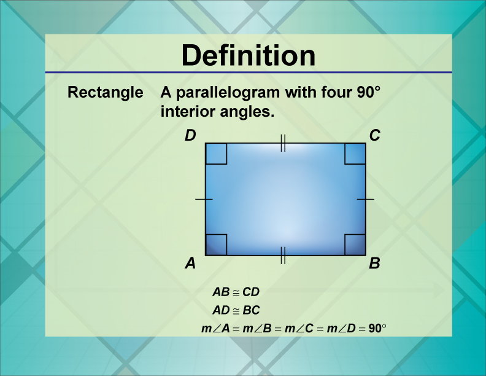

## Table of Contents

## What is a rectangle?

A rectangle is a shape with four sides and four corners. It is a special type of shape called a quadrilateral. The opposite sides of a rectangle are the same length, and all the corners are right angles, which means they form a perfect L shape.

You can find rectangles in many places around you. For example, a sheet of paper, a book, or a door are all shaped like rectangles. If you measure the sides of these objects, you will see that the opposite sides are equal in length. This makes rectangles useful for building and designing things because they fit together well and are easy to work with.

## What are the basic properties of a rectangle?

A rectangle has four sides and four corners. The opposite sides of a rectangle are the same length. This means if one side is long, the side across from it is also long. If one side is short, the side across from it is also short. The sides of a rectangle are straight and they meet at the corners to form right angles. A right angle looks like the corner of a square or the corner of a piece of paper.

All the corners of a rectangle are right angles. This means that if you put a square in each corner of the rectangle, it would fit perfectly. The right angles make the rectangle a special kind of shape because it is easy to stack and line up rectangles. Rectangles are used a lot in building things like houses and making things like [books](/wiki/algo-trading-books) and tables because they fit together well and are easy to work with.

## How do you calculate the area of a rectangle?

To find the area of a rectangle, you need to know the length and the width of the rectangle. The area is how much space is inside the rectangle. You can find the area by multiplying the length by the width. For example, if a rectangle has a length of 5 units and a width of 3 units, you multiply 5 times 3 to get an area of 15 square units.

This way of finding the area works because the rectangle can be thought of as being made up of rows and columns of squares. If the length is 5 units, there are 5 rows of squares. If the width is 3 units, there are 3 columns of squares. When you multiply the number of rows by the number of columns, you get the total number of squares, which is the area of the rectangle.

## How do you calculate the perimeter of a rectangle?

To find the perimeter of a rectangle, you need to know the length and the width of the rectangle. The perimeter is the distance around the outside of the rectangle. You can find the perimeter by adding up all the sides. Since a rectangle has two long sides and two short sides, you can add the length twice and the width twice. For example, if a rectangle has a length of 5 units and a width of 3 units, you add 5 plus 5 plus 3 plus 3 to get a perimeter of 16 units.

This way of finding the perimeter works because you are measuring all the way around the rectangle. If you walk around the outside of the rectangle, you will walk along one long side, then one short side, then the other long side, and finally the other short side. Adding up these four sides gives you the total distance around the rectangle, which is the perimeter.

## What is the difference between a square and a rectangle?

A square and a rectangle are both shapes with four sides and four corners. The main difference is that in a square, all four sides are the same length. In a rectangle, the opposite sides are the same length, but the long sides and the short sides can be different lengths. This means a square is a special type of rectangle where all the sides are equal.

Another difference is that squares are more limited in their shape than rectangles. Because all sides of a square are the same, you can only change the size of a square by making it bigger or smaller, but it will always look like a square. With a rectangle, you can change the length and the width separately, so you can make many different shapes that are still rectangles. This makes rectangles more flexible for different uses, like in building or design.

## Can a rectangle have all sides of different lengths?

A rectangle cannot have all sides of different lengths. In a rectangle, the opposite sides are always the same length. This means if one side is long, the side across from it is also long. If one side is short, the side across from it is also short. So, a rectangle can have two long sides and two short sides, but it cannot have all four sides different lengths.

If a shape has all four sides different lengths, it is not a rectangle. It would be a different kind of quadrilateral, like a trapezoid or an irregular quadrilateral. Rectangles are special because their opposite sides are equal and all their corners are right angles, which makes them useful for many things like building and designing.

## What are some real-world applications of rectangles?

Rectangles are used a lot in everyday life. You see them in buildings like houses and offices. The walls, doors, and windows are often rectangles because they fit together well and are easy to build. Furniture like tables, desks, and bookshelves are also usually rectangles. This shape makes them stable and easy to use. Even the screens of TVs, computers, and phones are rectangles, which helps us see things clearly and fit more information on them.

In daily life, rectangles are also found in many objects we use. Books and sheets of paper are rectangles, which makes them easy to stack and store. Boxes and packaging are often rectangles too, which helps them fit together and save space. In sports, fields like soccer fields and basketball courts are rectangles, making it fair and easy to play games. Rectangles are everywhere because they are simple, useful, and easy to work with.

## How are rectangles used in geometry and mathematics beyond basic calculations?

In geometry and mathematics, rectangles are used in many ways beyond just finding their area and perimeter. One way is in coordinate geometry, where rectangles help us understand and work with the positions of points on a graph. For example, if you know the coordinates of the four corners of a rectangle, you can use them to find the lengths of the sides and even the diagonals. This helps in solving problems about shapes and their positions on a grid.

Rectangles also play a big role in understanding concepts like symmetry and transformations. For instance, a rectangle has two lines of symmetry, which means you can fold it in half along these lines and both halves will match perfectly. This helps us learn about how shapes can be mirrored or flipped. Additionally, rectangles can be used to explore transformations like translations, rotations, and reflections. By moving a rectangle around on a grid or turning it, we can see how these changes affect its position and shape, which is important in many areas of math and science.

## What is the golden rectangle and its significance in design?

The golden rectangle is a special type of rectangle where the ratio of the length to the width is about 1.618. This ratio is called the golden ratio, and it is thought to be very pleasing to look at. In a golden rectangle, if you cut off a square from one end, the shape that is left is another golden rectangle. This can keep happening, making smaller and smaller golden rectangles inside the big one. People use golden rectangles in design because they think it makes things look more balanced and attractive.

In design, the golden rectangle is used a lot in art, architecture, and even in everyday things like books and posters. Artists and designers believe that using the golden ratio can make their work more appealing to the eye. For example, famous buildings like the Parthenon in Greece and paintings like the Mona Lisa by Leonardo da Vinci are said to use the golden ratio. By using golden rectangles, designers hope to create a sense of harmony and beauty in their work, making it more enjoyable for people to look at.

## How do rectangles play a role in computer graphics and user interface design?

In computer graphics, rectangles are used a lot because they are simple shapes that computers can handle easily. When you see things on your computer screen, like windows, buttons, and images, many of them are made up of rectangles. These shapes help the computer know where to draw lines and fill in colors. For example, when you open a program, the window that pops up is usually a rectangle. This makes it easy for the computer to organize and display information in a way that is clear and easy to understand.

In user interface design, rectangles are important because they help create a layout that is easy for people to use. When designers make apps or websites, they often use rectangles to organize buttons, text, and other parts of the screen. This helps users know where to click or tap to do things like opening a menu or saving a file. Rectangles also make it easier to line up different parts of the interface, which makes everything look neat and organized. This way, people can use the computer or app more easily because everything is in a clear and simple layout.

## What are the advanced geometric properties of a rectangle, such as diagonal length?

One advanced geometric property of a rectangle is the length of its diagonals. The diagonal of a rectangle is a straight line that goes from one corner to the opposite corner. To find the length of a diagonal, you can use the Pythagorean theorem. This theorem says that if you have a right triangle, the square of the length of the longest side (the hypotenuse) is equal to the sum of the squares of the other two sides. In a rectangle, the diagonal forms the hypotenuse of a right triangle made by the length and width of the rectangle. So, if you know the length and width, you can find the diagonal by taking the square root of the length squared plus the width squared.

Another important property of a rectangle is that its diagonals are equal in length. This means that no matter which two opposite corners you connect, the diagonal will be the same length. This property comes from the fact that the opposite sides of a rectangle are equal and all the corners are right angles. Because of this, if you draw both diagonals of a rectangle, they will cross each other exactly in the middle, dividing the rectangle into four smaller right triangles that are all the same size and shape. This symmetry and equal length of the diagonals make rectangles useful in many areas of geometry and design.

## How are rectangles utilized in advanced engineering and architectural designs?

In advanced engineering, rectangles are used a lot because they are strong and easy to work with. Engineers use rectangles to design things like buildings, bridges, and machines. For example, when they are designing a building, they use rectangles for the shape of the walls and floors. This makes the building stable and strong. In machines, parts like pistons and frames are often rectangles because they fit together well and can handle a lot of force. Engineers also use computer programs to draw and test their designs, and these programs use rectangles to make the drawings and calculations easier.

In architecture, rectangles are important because they help create balanced and pleasing designs. Architects use rectangles to plan out the layout of a building, deciding where to put rooms, windows, and doors. This helps make the building functional and easy to use. Rectangles are also used in the design of the building's outside, making it look neat and organized. Famous buildings like skyscrapers and modern homes often use rectangles in their design because they look clean and simple. By using rectangles, architects can create buildings that are not only strong but also beautiful to look at.

## References & Further Reading

[1]: Bergstra, J., Bardenet, R., Bengio, Y., & Kégl, B. (2011). ["Algorithms for Hyper-Parameter Optimization."](https://dl.acm.org/doi/10.5555/2986459.2986743) Advances in Neural Information Processing Systems 24.

[2]: ["Advances in Financial Machine Learning"](https://www.amazon.com/Advances-Financial-Machine-Learning-Marcos/dp/1119482089) by Marcos Lopez de Prado

[3]: ["Evidence-Based Technical Analysis: Applying the Scientific Method and Statistical Inference to Trading Signals"](https://www.amazon.com/Evidence-Based-Technical-Analysis-Scientific-Statistical/dp/0470008741) by David Aronson

[4]: ["Machine Learning for Algorithmic Trading"](https://github.com/stefan-jansen/machine-learning-for-trading) by Stefan Jansen

[5]: ["Quantitative Trading: How to Build Your Own Algorithmic Trading Business"](https://www.amazon.com/Quantitative-Trading-Build-Algorithmic-Business/dp/1119800064) by Ernest P. Chan