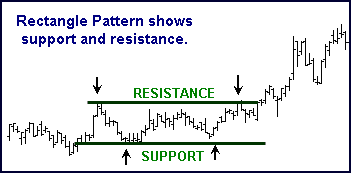

## Table of Contents

## What is a rectangle formation?

A rectangle formation is a pattern that you can see on a chart, like the ones used in stock trading. It looks like a rectangle because the price of the stock moves up and down between two horizontal lines. These lines are called support and resistance. The price keeps bouncing off these lines, trying to break out. When it finally does break out, it usually means the price will keep going in that direction for a while.

This pattern is important because it can help people decide when to buy or sell a stock. If the price breaks out above the resistance line, it might be a good time to buy because the price could go up more. If it breaks below the support line, it might be a good time to sell because the price could go down more. Traders watch these patterns closely to make smart choices about their investments.

## How is a rectangle formation identified on a chart?

To spot a rectangle formation on a chart, you need to look for a pattern where the price of a stock moves up and down between two straight lines. These lines are called support and resistance. The support line is the bottom line where the price stops going down and starts to go up again. The resistance line is the top line where the price stops going up and starts to go down again. The price keeps bouncing between these two lines, making the shape of a rectangle.

You can tell it's a rectangle formation if this pattern lasts for a while and the lines stay pretty much horizontal. The more times the price touches these lines without breaking them, the stronger the rectangle formation is. Once you see this pattern, keep an eye on it because the price might soon break out of the rectangle. If it breaks above the resistance line, it might keep going up. If it breaks below the support line, it might keep going down.

## What are the key characteristics of a rectangle formation?

A rectangle formation is a pattern on a chart that looks like a rectangle. It happens when the price of a stock goes up and down between two straight lines. The bottom line is called the support line, and the top line is called the resistance line. The price keeps bouncing off these lines, trying to break out. The more times the price touches these lines without breaking them, the stronger the rectangle formation is.

This pattern is important because it can help people decide when to buy or sell a stock. When the price finally breaks out of the rectangle, it usually keeps going in that direction for a while. If the price breaks above the resistance line, it might be a good time to buy because the price could go up more. If it breaks below the support line, it might be a good time to sell because the price could go down more. Traders watch these patterns closely to make smart choices about their investments.

## How does a rectangle formation differ from other chart patterns?

A rectangle formation is different from other chart patterns because it has two straight, horizontal lines that the price bounces between. These lines are called support and resistance. In other patterns, like a triangle or a wedge, the lines might be slanted or come together at a point. In a rectangle, the price goes up and down between these two lines for a while, making a clear rectangle shape. This pattern shows that the price is stuck between two levels and can't break out yet.

Other patterns, like a head and shoulders or a double top, have different shapes and meanings. For example, a head and shoulders pattern looks like a head with two shoulders and can signal that the price is going to go down. A double top looks like two peaks and can also mean the price will go down. But a rectangle formation doesn't have these shapes. It just shows that the price is in a holding pattern, waiting to break out either up or down. When it does break out, it usually keeps going in that direction for a while, which is different from other patterns where the direction after the breakout can be less clear.

## What are the typical time frames for a rectangle formation to develop?

A rectangle formation can take different amounts of time to develop. It might happen over a few weeks or even a few months. The time it takes depends on how long the price keeps bouncing between the support and resistance lines without breaking out. If the price stays in the rectangle for a longer time, it means the pattern is stronger and more important to watch.

The time frame can also depend on what kind of chart you're looking at. For example, on a daily chart, a rectangle might take a few weeks to a few months to form. On a weekly chart, it might take several months to a year. Traders need to pay attention to the time frame of the chart they're using because it can affect how they see and react to the rectangle formation.

## What trading strategies can be applied when a rectangle formation is identified?

When you spot a rectangle formation on a chart, one good strategy is to wait for the price to break out of the rectangle. If the price breaks above the top line, called the resistance line, it might be a good time to buy the stock. You can set a buy order just above the resistance line. The idea is that once the price breaks out, it will keep going up for a while. You can also set a target price for how high you think the price will go, which is usually about the same distance as the height of the rectangle added to the breakout point.

Another strategy is to wait for the price to break below the bottom line, called the support line. If this happens, it might be a good time to sell the stock or even short sell it. You can set a sell order just below the support line. The idea here is that once the price breaks out, it will keep going down for a while. You can set a target price for how low you think the price will go, which is usually about the same distance as the height of the rectangle subtracted from the breakdown point.

Both strategies need you to be patient and watch the price closely. It's important to use stop-loss orders to limit your risk. A stop-loss order is like a safety net that automatically sells your stock if the price goes against your prediction. This way, you don't lose too much money if the price doesn't go the way you thought it would after breaking out of the rectangle.

## How reliable is a rectangle formation as a predictor of future price movements?

A rectangle formation can be a pretty good sign of what might happen to a stock's price in the future, but it's not perfect. When you see a rectangle on a chart, it means the price has been going up and down between two lines for a while. If the price finally breaks out above the top line, it often keeps going up for a bit. If it breaks below the bottom line, it usually keeps going down. The more times the price touches those lines without breaking them, the stronger the signal is. But, like with any pattern, there's no guarantee it will work every time.

The reliability of a rectangle formation can also depend on other things, like how long the pattern lasts and what's happening in the market overall. If the rectangle takes a long time to form, it might be a stronger sign. But even then, things like news about the company or changes in the economy can make the price do something unexpected. So, while a rectangle formation can give you a good idea of what might happen next, it's smart to use it along with other tools and information to make the best trading decisions.

## What are the psychological factors that contribute to the formation of a rectangle?

The rectangle formation happens because of what people think and feel about a stock. When the price of a stock keeps going up and down between two lines, it shows that people are not sure about it. Some people think the stock is a good buy and keep buying it when the price goes down to the bottom line. This makes the price go up again. But then, other people think the stock is too expensive and start selling it when the price goes up to the top line. This makes the price go down again. So, the price keeps bouncing between these two lines because of what people think and feel.

These feelings can change over time. If more people start to think the stock is a good buy, the price might break out above the top line. If more people start to think the stock is not worth it, the price might break below the bottom line. The longer the price stays in the rectangle, the more people are watching it and waiting for it to break out. When it finally does, a lot of people might start buying or selling at the same time, which can make the price move a lot in one direction. So, the rectangle shows how people's thoughts and feelings can affect the stock's price.

## Can a rectangle formation occur in both bullish and bearish markets?

Yes, a rectangle formation can happen in both bullish and bearish markets. A bullish market is when people think the stock prices will go up, and a bearish market is when people think the stock prices will go down. In a bullish market, the rectangle might form as the stock price goes up and down between two lines, but more people are buying than selling. In a bearish market, the rectangle might form as the stock price goes up and down between two lines, but more people are selling than buying. The rectangle shows that even though the market is going one way, there's still some fighting between buyers and sellers.

The key thing about a rectangle is that it shows a balance between what people think. In a bullish market, the bottom line of the rectangle might be where people think the stock is a good buy, so they start buying and push the price up. The top line might be where people think the stock is too expensive, so they start selling and push the price down. In a bearish market, the bottom line might be where people think the stock is still too expensive to buy, so they keep selling and push the price down. The top line might be where people think the stock is a good sell, so they start selling and push the price up. So, the rectangle can form in any kind of market, showing that people's feelings can make the price go up and down even when the market is going one way.

## How do volume patterns typically behave during the formation of a rectangle?

During the formation of a rectangle, the volume of trading usually goes up and down in a certain way. When the price is going up to the top line of the rectangle, the volume might be higher because more people are buying the stock. They think it's a good time to buy before the price goes up even more. But when the price is going down to the bottom line, the volume might be lower because fewer people are buying. They are waiting for the price to go down more before they buy.

When the price finally breaks out of the rectangle, the volume usually changes a lot. If the price breaks above the top line, the volume often goes up a lot because a lot of people start buying at the same time. They think the price will keep going up, so they want to buy before it gets too high. If the price breaks below the bottom line, the volume might also go up a lot because a lot of people start selling at the same time. They think the price will keep going down, so they want to sell before it gets too low. So, the volume can tell you a lot about what people are thinking and doing during a rectangle formation.

## What are the common pitfalls and mistakes traders make when trading rectangle formations?

One common mistake traders make when trading rectangle formations is jumping into a trade too early. They might see the price getting close to the top or bottom line and think it's going to break out right away. But the price can bounce off those lines many times before it finally breaks out. If traders buy or sell too soon, they might lose money if the price goes the other way. It's better to wait for the price to actually break out of the rectangle before making a move.

Another pitfall is not using stop-loss orders. A stop-loss order is like a safety net that automatically sells your stock if the price goes against you. Without one, traders can lose a lot of money if the price doesn't go the way they thought it would after breaking out. It's important to set a stop-loss just below the breakout point if you're buying, or just above if you're selling, to limit your risk. 

Traders also sometimes forget to consider the bigger picture. They might focus too much on the rectangle and not pay attention to what's happening in the market overall. Things like news about the company or changes in the economy can affect the stock's price. So, it's smart to use the rectangle formation along with other tools and information to make the best trading decisions.

## How can advanced technical indicators enhance the analysis of a rectangle formation?

Using advanced technical indicators can make it easier to understand and trade a rectangle formation. One helpful indicator is the Relative Strength Index (RSI). The RSI can show if a stock is overbought or oversold. If the RSI is high when the price is near the top of the rectangle, it might mean the price will go back down to the bottom line soon. If the RSI is low when the price is near the bottom of the rectangle, it might mean the price will go back up to the top line soon. This can help traders decide when to buy or sell.

Another useful indicator is the Moving Average Convergence Divergence (MACD). The MACD can show when the price is about to break out of the rectangle. If the MACD line crosses above the signal line when the price is near the top of the rectangle, it might mean the price will break out upwards. If the MACD line crosses below the signal line when the price is near the bottom of the rectangle, it might mean the price will break out downwards. By using these indicators, traders can get a better idea of when the price might move and make smarter trading choices.

## References & Further Reading

[1]: Schabacker, R. W. (1937). ["Technical Analysis and Stock Market Profits."](https://books.google.com/books/about/Technical_Analysis_and_Stock_Market_Prof.html?id=5x6rOEagkt8C) Traders Press.

[2]: Edwards, R. D., Magee, J., & Bassetti, W. H. C. (2007). ["Technical Analysis of Stock Trends, 9th Edition."](https://www.taylorfrancis.com/books/mono/10.4324/9781315115719/technical-analysis-stock-trends-bassetti-robert-edwards-john-magee) AMACOM.

[3]: Pring, M. J. (2014). ["Technical Analysis Explained: The Successful Investor's Guide to Spotting Investment Trends and Turning Points."](https://www.amazon.com/Technical-Analysis-Explained-Fifth-Successful/dp/0071825177) McGraw-Hill Education.

[4]: Murphy, J. J. (1999). ["Technical Analysis of the Financial Markets: A Comprehensive Guide to Trading Methods and Applications."](https://archive.org/details/technicalanalysi0000murp) New York Institute of Finance.

[5]: Chan, E. P. (2008). ["Algorithmic Trading: Winning Strategies and Their Rationale."](https://github.com/ftvision/quant_trading_echan_book) Wiley.