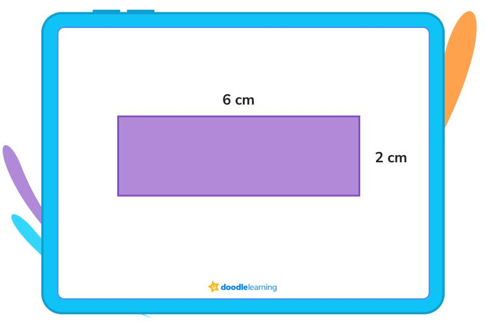

## Table of Contents

## What is a rectangle?

A rectangle is a shape with four sides and four corners. Two of its sides are longer, and two are shorter. The long sides are the same length as each other, and the short sides are the same length as each other. The corners of a rectangle are always square, which means they form right angles, like the corners of a sheet of paper.

Rectangles are very common in everyday life. You can see them in windows, doors, books, and many other things. They are useful because they can fit together well without gaps, which makes them good for building and organizing spaces.

## How is a rectangle different from a square?

A rectangle and a square are both shapes with four sides and four corners. The main difference is that in a square, all four sides are the same length. In a rectangle, the sides come in pairs: two sides are long and two sides are short. So, a square is a special kind of rectangle where all the sides are equal.

Another difference is how we use these shapes. Squares are often used when we need equal space on all sides, like in tiles or game boards. Rectangles are used more often in things like doors, windows, and [books](/wiki/algo-trading-books), where the length and width can be different. Both shapes are useful, but they fit different needs because of their side lengths.

## What are the basic properties of a rectangle?

A rectangle has four sides and four corners. Two of its sides are long and two are short. The long sides are the same length as each other, and the short sides are the same length as each other. This means opposite sides of a rectangle are equal. The corners of a rectangle are always square, which means they form right angles, like the corners of a sheet of paper.

Another property of a rectangle is that its diagonals are the same length. A diagonal is a line that goes from one corner to the opposite corner. If you draw both diagonals in a rectangle, they will cross each other exactly in the middle and be the same length. This helps to make sure the shape is balanced and even.

Rectangles are very useful because they can fit together well without gaps. This makes them good for building things like walls, floors, and many other objects. You can see rectangles in windows, doors, books, and many other places in everyday life.

## How do you calculate the area of a rectangle?

To calculate the area of a rectangle, you need to know the length and the width of the rectangle. The area is how much space the rectangle covers. You find the area by multiplying the length by the width. If a rectangle has a length of 5 units and a width of 3 units, you would multiply 5 times 3 to get an area of 15 square units.

This formula works because the area is the number of square units that fit inside the rectangle. When you multiply the length by the width, you are counting how many squares of a certain size can fit inside the shape. This is useful for figuring out how much material you need for things like carpeting a room or painting a wall.

## How do you calculate the perimeter of a rectangle?

To calculate the perimeter of a rectangle, you need to add up the lengths of all four sides. The perimeter is the total distance around the outside of the rectangle. Since a rectangle has two long sides and two short sides, you can find the perimeter by adding the length of one long side, the length of one short side, the length of the other long side, and the length of the other short side.

But there's an easier way to do this. Because the opposite sides of a rectangle are the same length, you can just multiply the length of one long side by 2, and the length of one short side by 2, then add those two numbers together. For example, if a rectangle has a length of 5 units and a width of 3 units, you would do 2 times 5 plus 2 times 3. That would be 10 plus 6, which equals 16 units for the perimeter. This way helps you find the total distance around the rectangle quickly.

## What are the diagonals of a rectangle and their properties?

The diagonals of a rectangle are lines that go from one corner to the opposite corner. If you draw both diagonals in a rectangle, they will cross each other right in the middle. This crossing point is called the center of the rectangle. Both diagonals in a rectangle are the same length. This means if you measure one diagonal, the other one will be just as long.

The diagonals of a rectangle have some special properties. They split the rectangle into two equal parts. Each part is a right triangle, which means it has one angle that is a right angle, like the corner of a square. The diagonals also help to make sure the rectangle stays balanced and even. If you know the length and width of a rectangle, you can use the Pythagorean theorem to find the length of the diagonals. The Pythagorean theorem says that if you square the length and the width, then add them together, and then take the square root of that sum, you will get the length of the diagonal.

## Can you explain the relationship between the sides and angles of a rectangle?

A rectangle has four sides and four corners. Two sides are long and two sides are short. The long sides are the same length as each other, and the short sides are the same length as each other. This means the opposite sides of a rectangle are equal. The corners of a rectangle are always square, which means they form right angles, like the corners of a sheet of paper. So, if you have one corner that is a right angle, all the other corners will be right angles too.

The relationship between the sides and angles of a rectangle is important because it helps keep the shape balanced and even. If you change the length of one side or the angle of one corner, it won't be a rectangle anymore. The right angles make sure that the opposite sides stay straight and parallel to each other. This is why rectangles are good for building things like walls and floors, where you need straight lines and even spaces.

## How are rectangles used in real life?

Rectangles are very common in everyday life because they are simple and useful shapes. You can see them in things like windows and doors. These shapes are good for building because they fit together without gaps. This makes them great for making walls, floors, and even ceilings. When you walk into a room, you might notice that the walls and the floor are often made of rectangles. This helps to make the space feel organized and easy to use.

Rectangles are also used in things we use every day, like books and sheets of paper. Books are usually rectangles because it's easy to hold them and turn the pages. Sheets of paper are rectangles too, which makes them good for writing and drawing. Even the screens of phones and computers are often rectangles. This shape is good for showing information clearly and fitting well in our hands or on our desks.

## What are some common formulas involving rectangles in geometry?

In geometry, one common formula for rectangles is the formula for finding the area. The area of a rectangle is how much space it covers. To find the area, you multiply the length by the width. For example, if a rectangle has a length of 5 units and a width of 3 units, you would multiply 5 times 3 to get an area of 15 square units. This formula is useful for figuring out how much material you need for things like carpeting a room or painting a wall.

Another common formula is for finding the perimeter of a rectangle. The perimeter is the total distance around the outside of the rectangle. To find the perimeter, you add up the lengths of all four sides. But since the opposite sides of a rectangle are the same length, you can just multiply the length by 2, and the width by 2, then add those two numbers together. For example, if a rectangle has a length of 5 units and a width of 3 units, you would do 2 times 5 plus 2 times 3. That would be 10 plus 6, which equals 16 units for the perimeter. This formula helps you find the total distance around the rectangle quickly.

A third formula involves the diagonals of a rectangle. The diagonals are lines that go from one corner to the opposite corner. Both diagonals in a rectangle are the same length. If you know the length and width of a rectangle, you can use the Pythagorean theorem to find the length of the diagonals. The Pythagorean theorem says that if you square the length and the width, then add them together, and then take the square root of that sum, you will get the length of the diagonal. For example, if a rectangle has a length of 5 units and a width of 3 units, you would do the square root of 5 squared plus 3 squared. That would be the square root of 25 plus 9, which is the square root of 34, or about 5.83 units.

## How do you construct a rectangle using a compass and straightedge?

To construct a rectangle using a compass and straightedge, start by drawing a straight line with your straightedge. This will be one of the long sides of your rectangle. Choose a point on this line as one corner of your rectangle. From this corner, use your compass to measure out the length you want for the short side of your rectangle. Draw an arc above the line with your compass set to this length.

Next, move your compass to the other end of your first line and draw another arc that intersects the first arc you drew. The point where these two arcs meet will be another corner of your rectangle. Use your straightedge to draw a line from the first corner you chose to this new corner. This line will be one of the short sides of your rectangle. Now, use your compass to measure the length of your first long side. From the new corner, draw an arc to the right of your short side. Then, move your compass to the top of your short side and draw another arc that intersects the first arc. The point where these two arcs meet will be the third corner of your rectangle. Draw a line from the second corner to this third corner to complete the second long side of your rectangle. Finally, use your straightedge to connect the third corner to the first corner you chose to complete the fourth side of your rectangle.

## What are the advanced theorems related to rectangles in Euclidean geometry?

One important theorem about rectangles in Euclidean geometry is the Pythagorean theorem. This theorem helps us find the length of the diagonals of a rectangle. If you know the length and the width of a rectangle, you can use the Pythagorean theorem to figure out the length of the diagonals. The theorem says that if you square the length and the width, then add them together, and then take the square root of that sum, you will get the length of the diagonal. This is useful because it helps us understand how the sides and diagonals of a rectangle work together.

Another theorem related to rectangles is the theorem about the properties of the diagonals. In a rectangle, the diagonals are the same length and they cross each other in the middle. This means that if you draw both diagonals, they will meet at a point that is exactly halfway along each diagonal. This point is called the center of the rectangle. The diagonals also split the rectangle into four right triangles. Each of these triangles has one angle that is a right angle, like the corner of a square. These properties help us see how balanced and even a rectangle is.

## How do rectangles relate to other quadrilaterals in terms of classification and properties?

Rectangles are a type of quadrilateral, which means they are shapes with four sides and four corners. In the family of quadrilaterals, rectangles are special because all their corners are right angles, like the corners of a sheet of paper. This makes them different from other quadrilaterals like parallelograms, which also have opposite sides that are the same length but don't always have right angles. Squares are a special kind of rectangle where all four sides are the same length, so squares fit into the rectangle group but also have their own unique properties.

Another way rectangles relate to other quadrilaterals is through their properties. Like all quadrilaterals, rectangles have four sides, but they also have some extra rules. The opposite sides of a rectangle are the same length, and the diagonals are the same length too. This makes rectangles different from trapezoids, which have at least one pair of parallel sides but not necessarily equal sides or right angles. Rhombuses are another type of quadrilateral that are like squares but don't have to have right angles, so they are different from rectangles in that way. Understanding these differences helps us see how rectangles fit into the bigger picture of quadrilaterals.

## What is the Geometry of Rectangles?

Rectangles are fundamental shapes in geometry, characterized as quadrilaterals where opposing sides are both equal in length and parallel, and each interior angle is a right angle, measuring $90^\circ$. This straightforward structure results in several noteworthy properties that greatly contribute to their analytical simplicity and symmetry. Their formulaic nature permits easy calculation of area and perimeter, essential aspects in geometry and practical applications.

Mathematically, the area $A$ of a rectangle is determined using the formula:

$$
A = l \times w
$$

where $l$ is the length and $w$ is the width. Similarly, the perimeter $P$ is expressed as:

$$
P = 2(l + w)
$$

These properties highlight the rectangle's utility across various fields. In mathematics, the predictable and regular nature of rectangles facilitates analysis and calculations, prompting their use in mathematical proofs and problem-solving.

Beyond pure mathematics, rectangles find practical application in fields such as computer graphics, architecture, and industrial design, where their geometric properties are leveraged to model objects or spaces efficiently. Their symmetrical properties permit straightforward partitioning and scaling, making them invaluable in design processes and manufacturing.

Furthermore, the characteristics of rectangles extend into the analysis of patterns and structures, especially in financial market analysis. Here, the simplicity of rectangles is used metaphorically to describe certain price action patterns. The way in which rectangles form in charts can indicate consolidation phases and potential areas of support and resistance, translating geometric understanding into practical trading strategies. This cross-disciplinary relevance underscores the rectangle's significance in both theoretical and applied mathematics.

## References & Further Reading

[1]: Murphy, J. J. (1999). ["Technical Analysis of the Financial Markets: A Comprehensive Guide to Trading Methods and Applications."](https://archive.org/details/technicalanalysi0000murp) New York Institute of Finance.

[2]: Bulkowski, T. N. (2005). ["Encyclopedia of Chart Patterns"](https://www.amazon.com/Encyclopedia-Chart-Patterns-Thomas-Bulkowski/dp/0471668265). Wiley Trading.

[3]: Pring, M. J. (2002). ["Technical Analysis Explained: The Successful Investor's Guide to Spotting Investment Trends and Turning Points."](https://www.amazon.com/Technical-Analysis-Explained-Fifth-Successful/dp/0071825177) McGraw-Hill.

[4]: Chan, E. P. (2009). ["Quantitative Trading: How to Build Your Own Algorithmic Trading Business."](https://github.com/ftvision/quant_trading_echan_book) Wiley.

[5]: Jansen, S. (2020). ["Machine Learning for Algorithmic Trading: Predictive models to extract signals from market and alternative data for systematic trading strategies with Python."](https://www.amazon.com/Machine-Learning-Algorithmic-Trading-alternative/dp/1839217715) Packt Publishing.