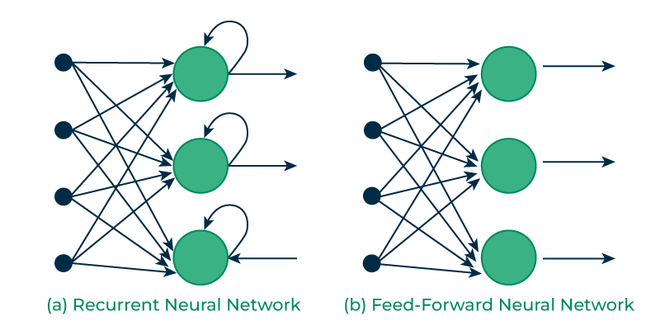

## Table of Contents

## What is a Recurrent Neural Network (RNN) and how does it differ from other neural networks?

A Recurrent Neural Network (RNN) is a type of neural network designed to work with sequences of data, like text or time series. Unlike traditional feedforward neural networks, which process inputs independently, RNNs have a special kind of memory that allows them to keep track of information from previous inputs. This memory is achieved through a loop within the network that allows information to persist over time. In practical terms, when an RNN processes a sequence, it can use information from earlier in the sequence to influence its understanding of later parts, making it particularly useful for tasks like language translation, speech recognition, and predicting stock prices.

The main difference between RNNs and other neural networks, such as Convolutional Neural Networks (CNNs) or feedforward networks, lies in their ability to handle sequential data. While CNNs are excellent at processing grid-like data, such as images, and feedforward networks are great for static inputs, RNNs shine with data where the order matters. For example, in language, the meaning of a sentence can change based on the order of words. RNNs can capture these dependencies by maintaining a 'state' or 'memory' that updates as new data comes in. This feature makes RNNs more suitable for applications where context and sequence are important.

## How does the basic architecture of an RNN work?

The basic architecture of an RNN involves a chain-like structure where the output from one step is fed back into the network as input for the next step. Imagine a loop that allows information to flow from one part of the network to another. This loop is what gives RNNs their 'memory'. At each time step, the RNN takes in an input and combines it with the information from the previous step. This combination happens through a simple mathematical operation, often using weights and activation functions, to produce an output and update the internal state or 'memory' of the network.

Let's break this down further. Suppose we have an input sequence $$x_1, x_2, x_3, ...$$ at different time steps. At time step t, the RNN processes the input $$x_t$$ along with the hidden state from the previous time step $$h_{t-1}$$ to produce a new hidden state $$h_t$$ and an output $$y_t$$. The hidden state $$h_t$$ is calculated using a formula like $$h_t = f(W_{xh}x_t + W_{hh}h_{t-1} + b_h)$$, where $$f$$ is an activation function (like tanh or ReLU), $$W_{xh}$$ and $$W_{hh}$$ are weight matrices, and $$b_h$$ is a bias term. The output $$y_t$$ is then computed from $$h_t$$ using another set of weights and possibly another activation function. This process repeats for each time step, allowing the network to process the entire sequence while keeping track of past information.

## What are the main challenges faced by traditional RNNs, such as the vanishing gradient problem?

One of the main challenges faced by traditional RNNs is the vanishing gradient problem. This happens when the network tries to learn from long sequences. As the network processes more steps, the gradients used to update the weights become very small. This makes it hard for the network to remember information from earlier in the sequence. Imagine trying to remember a word from the start of a long story; it becomes difficult as more words are added. Mathematically, if the weights are less than 1, the gradients get smaller with each step, making it tough for the network to learn long-term dependencies.

Another issue is the exploding gradient problem, which is the opposite of vanishing gradients. Here, the gradients can grow too large, causing the weights to change drastically and making the training unstable. This can be managed with techniques like gradient clipping, where large gradients are reduced to a maximum value. Both vanishing and exploding gradients make it challenging for traditional RNNs to handle long sequences effectively. That's why more advanced versions like Long Short-Term Memory (LSTM) and Gated Recurrent Units (GRU) were developed to address these problems.

## What is Long Short-Term Memory (LSTM) and how does it address the limitations of traditional RNNs?

Long Short-Term Memory (LSTM) is a special type of RNN designed to solve the problem of vanishing gradients in traditional RNNs. LSTMs have a more complex structure that allows them to remember information for longer periods. They do this by using something called a 'cell state' and 'gates.' The cell state acts like a conveyor belt, carrying information across many time steps. Gates are like doors that control what information gets added to or removed from the cell state. This setup helps LSTMs keep important information over long sequences, making them better at understanding and working with long texts or data streams.

In an LSTM, there are three main gates: the forget gate, the input gate, and the output gate. The forget gate decides what information from the past should be forgotten. It looks at the current input and the previous hidden state, and uses a sigmoid function to decide what to keep or throw away. The input gate decides what new information should be stored in the cell state. It uses both a sigmoid function and a tanh function to create a candidate value that could be added to the cell state. Finally, the output gate decides what parts of the cell state should be used to create the output. By carefully managing the flow of information through these gates, LSTMs can handle the challenges that traditional RNNs struggle with, making them much more effective for tasks involving long sequences.

## How does Gated Recurrent Unit (GRU) work and in what ways is it different from LSTM?

A Gated Recurrent Unit (GRU) is a type of RNN that, like LSTM, helps solve the vanishing gradient problem but with a simpler structure. GRUs have two gates: the update gate and the reset gate. The update gate decides how much of the past information should be passed along to the future, while the reset gate determines how much of the past information to forget. This setup allows GRUs to keep important information over long sequences but with fewer parameters than LSTMs, making them easier to train and faster to run.

The main difference between GRUs and LSTMs is the number of gates and the way they handle information. LSTMs have three gates (forget, input, and output) and a separate cell state that acts like a conveyor belt for information. In contrast, GRUs combine the forget and input gates into one update gate and do not have a separate cell state. Instead, they directly modify the hidden state. This simpler structure can sometimes lead to similar performance to LSTMs but with less computational cost. For example, the update gate in a GRU can be represented as $$z_t = \sigma(W_z \cdot [h_{t-1}, x_t] + b_z)$$, where $$z_t$$ is the update gate, $$\sigma$$ is the sigmoid function, $$W_z$$ and $$b_z$$ are weights and bias, $$h_{t-1}$$ is the previous hidden state, and $$x_t$$ is the current input.

## What are some advanced RNN architectures like ConvLSTM and how do they improve upon standard LSTMs?

ConvLSTM is an advanced type of RNN that combines the power of Convolutional Neural Networks (CNNs) with the memory of Long Short-Term Memory (LSTM) units. It was designed to better handle data with spatial structures, like images or videos, where the relationships between nearby elements are important. In a ConvLSTM, instead of using regular matrix multiplications like in standard LSTMs, it uses convolutional operations. This means that when the network processes data, it looks at nearby parts of the data at the same time, capturing patterns that are spread out over space. This is helpful for tasks like predicting the next frame in a video or forecasting weather patterns, where understanding how things change over both time and space is key.

The main way ConvLSTM improves upon standard LSTMs is by better handling spatial data. In a standard LSTM, the input at each time step is processed without considering the spatial arrangement of the data. But in a ConvLSTM, the gates (like the forget gate, input gate, and output gate) use convolutional operations to process the data. For example, the formula for the input gate in a ConvLSTM might look like $$i_t = \sigma(W_{xi} * x_t + W_{hi} * h_{t-1} + b_i)$$, where $$*$$ represents a convolution operation, $$i_t$$ is the input gate activation, $$\sigma$$ is the sigmoid function, $$W_{xi}$$ and $$W_{hi}$$ are convolutional kernels, and $$b_i$$ is the bias. By using convolutions, ConvLSTMs can capture spatial dependencies and improve performance on tasks where spatial information is important.

## How do Bidirectional RNNs (BiRNN) like BiGRU enhance the performance of sequence processing tasks?

Bidirectional RNNs, like BiGRU, improve sequence processing tasks by looking at the data in two directions: forward and backward. Imagine reading a sentence. A regular RNN reads it from left to right, but a BiRNN reads it both ways. This means it can understand the context better because it sees what comes before and after each word. For example, in the sentence "He went to the store after he finished work," a BiRNN can use "after he finished work" to better understand "He went to the store." This helps in tasks like language translation, speech recognition, and sentiment analysis where understanding the whole context is important.

In a BiGRU, there are two GRU layers working together. One processes the sequence from start to end, and the other goes from end to start. At each time step, the output is a combination of what both layers learn. The formula for the output at time step t might look like $$h_t = \text{concat}(h_t^f, h_t^b)$$, where $$h_t^f$$ is the forward hidden state and $$h_t^b$$ is the backward hidden state. By combining these, the BiGRU can capture dependencies in both directions, leading to better performance in understanding and processing sequences.

## What is the role of attention mechanisms in RNNs and how are they implemented in models like Pointer Networks?

Attention mechanisms help RNNs focus on the most important parts of the input data when making predictions. Imagine you're reading a long article and need to answer a question about it. Instead of trying to remember every word, you'd focus on the parts that are most relevant to the question. Attention mechanisms work the same way, allowing the network to weigh different parts of the input differently based on their importance. This is especially useful in tasks like machine translation, where understanding the key parts of a sentence in one language can help translate it more accurately into another language.

In Pointer Networks, attention mechanisms are used to select a specific item from the input sequence as the output. For example, if you're trying to solve a problem where you need to find the next city in a route, a Pointer Network can use attention to focus on the relevant cities from the list you've given it. The attention mechanism calculates a score for each item in the input sequence, and the item with the highest score is chosen as the output. The formula for the attention score might look like $$a_i = \text{softmax}(s^T \cdot h_i)$$, where $$s$$ is the current state of the network, $$h_i$$ is the hidden state of the i-th input item, and $$a_i$$ is the attention score for that item. This way, Pointer Networks can dynamically choose the best answer from the input, making them very useful for tasks like sorting or routing.

## How do specialized RNN architectures like Neural Turing Machines and Memory Networks expand the capabilities of RNNs?

Neural Turing Machines (NTMs) and Memory Networks expand the capabilities of RNNs by adding external memory that the network can read from and write to. This is like giving the RNN a notebook where it can store and retrieve information. NTMs have a controller, which is like a regular RNN, and a memory matrix. The controller can interact with the memory to solve problems that require remembering and using information over long periods. For example, an NTM could learn to copy a sequence of numbers or solve simple arithmetic problems by storing intermediate results in its memory. This makes NTMs more powerful than regular RNNs because they can handle tasks that need more than just short-term memory.

Memory Networks take this idea further by having a memory component that can be accessed using attention mechanisms. They are designed to read, process, and write to a memory bank, making them good at tasks that require understanding and using large amounts of information. For example, in a question-answering task, a Memory Network can look at a story, store important facts in its memory, and then use attention to find the right information to answer a question. This ability to focus on relevant parts of the memory helps Memory Networks perform well on tasks that involve reasoning and understanding context over long sequences.

## What are some recent innovations in RNN design, such as Mogrifier LSTM and SRU++, and their specific applications?

Mogrifier LSTM is a new type of LSTM that tries to improve how the network processes information. It does this by letting the input and the hidden state talk to each other more before they are used in the LSTM gates. Imagine you're trying to understand a sentence better by thinking about each word more before deciding what it means. Mogrifier LSTM does something similar by using a series of simple steps to mix the input and hidden state together. This helps the network capture more complex patterns in the data. For example, Mogrifier LSTM can be used in tasks like language translation, where understanding the context deeply is important.

SRU++, or Simple Recurrent Unit++, is another recent innovation that aims to make RNNs faster and easier to use. It simplifies the structure of the network to make it run quickly on computers, which is important for real-time applications like speech recognition or live translation. SRU++ uses a special way of updating the hidden state that doesn't need as much memory as traditional RNNs. This makes it good for tasks where you need to process data quickly and efficiently. For instance, SRU++ could be used in voice assistants to understand and respond to spoken commands faster.

## How can RNNs be combined with other architectures like CNNs, as seen in CNN BiLSTM models, to enhance performance in specific tasks?

RNNs can be combined with CNNs to create powerful models like CNN BiLSTM, which are particularly good at tasks involving both spatial and sequential data. For example, in image captioning, a CNN can first analyze an image to understand its content, turning the image into a series of features. Then, a BiLSTM can take these features and generate a description by considering the context and order of the words. The CNN part helps the model understand the image, while the BiLSTM part helps it create a meaningful sentence. This combination allows the model to perform better than using either a CNN or an RNN alone.

In a CNN BiLSTM model, the CNN processes the input data, like an image, to extract important features. These features are then passed to the BiLSTM, which processes them in both forward and backward directions. The formula for the output at time step t in a BiLSTM might look like $$h_t = \text{concat}(h_t^f, h_t^b)$$, where $$h_t^f$$ is the forward hidden state and $$h_t^b$$ is the backward hidden state. By combining these, the BiLSTM can capture dependencies in both directions, leading to better performance in understanding and processing sequences. This makes CNN BiLSTM models very useful for tasks like video analysis or sentiment analysis of text with images.

## What are the current trends and future directions in the development of RNNs and their applications in machine learning?

Recent trends in RNN development focus on making them faster, more efficient, and better at handling long sequences. One big trend is the move towards simpler and faster architectures like SRU++ and Mogrifier LSTM. These new designs help RNNs work better on tasks that need quick processing, like real-time speech recognition or live translation. Another trend is combining RNNs with other types of networks, like CNNs, to handle both spatial and sequential data. For example, CNN BiLSTM models are becoming popular for tasks like image captioning or video analysis, where understanding both the image and the context of the text is important.

Looking to the future, RNNs are likely to keep evolving to solve more complex problems. One exciting direction is the integration of RNNs with memory mechanisms, like Neural Turing Machines and Memory Networks, to enhance their ability to remember and use information over long periods. This could lead to breakthroughs in areas like natural language understanding and reasoning. Additionally, the use of attention mechanisms, as seen in models like Pointer Networks, is expected to grow, allowing RNNs to focus on the most relevant parts of the data for better performance. Overall, the future of RNNs seems to be about making them more versatile and capable of handling a wider range of tasks in [machine learning](/wiki/machine-learning).