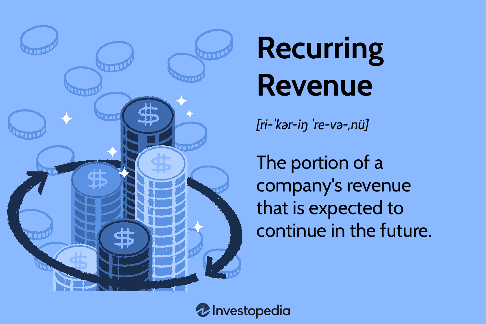

## Table of Contents

## What is recurring revenue and why is it important for businesses?

Recurring revenue is the money a business earns regularly from the same customers over time. This can come from subscriptions, monthly fees, or other regular payments. For example, if you pay for a streaming service every month, that's recurring revenue for the company that provides the service.

Recurring revenue is important for businesses because it helps them predict how much money they will make in the future. When a business knows it will get money every month from its customers, it can plan better. This makes the business more stable and helps it grow. It's like having a steady paycheck instead of waiting for one big sale that might not happen.

## What are the different types of recurring revenue models?

There are several types of recurring revenue models that businesses use. One common model is the subscription model, where customers pay a regular fee, usually monthly or yearly, to access a product or service. This is popular with streaming services like Netflix or software services like Microsoft 365. Another model is the usage-based model, where customers pay based on how much they use the service. This is common with utilities like electricity or cloud services like Amazon Web Services, where you pay for the amount of data you use.

Another type is the tiered model, where customers can choose different levels of service at different price points. For example, a basic plan might offer limited features, while a premium plan offers more. This is often used by companies like Spotify, where you can choose between a free version with ads or a paid version without ads. Lastly, there's the licensing model, where businesses pay to use a product or software for a set period. This is common in software companies where businesses buy licenses to use specific software.

These models help businesses create a steady stream of income. They also allow companies to offer different options to meet the needs of different customers. By understanding these models, businesses can choose the best way to earn recurring revenue and grow their company.

## How does subscription-based revenue work and what are its benefits?

Subscription-based revenue is when customers pay a regular fee, like every month or every year, to use a product or service. This is common with things like streaming services, where you pay to watch movies and shows, or with software, where you pay to use programs like Microsoft Word. The company gets money regularly from the same customers, so it knows how much money it will make each month. This makes it easier for the company to plan and budget.

The benefits of subscription-based revenue are big for businesses. First, it gives them a steady income, which makes the business more stable. They don't have to wait for big sales that might not happen. This steady money helps them plan better and grow their business. Second, it helps build a closer relationship with customers. When customers pay regularly, they are more likely to stay with the company and use its services more. This can make customers happier and more loyal.

## Can you explain usage-based recurring revenue and its applications?

Usage-based recurring revenue is when customers pay for a service based on how much they use it. Instead of paying a fixed amount every month, they pay more if they use the service a lot and less if they use it a little. This is common with utilities like electricity or water, where you pay for the amount you use each month. It's also used by cloud services like Amazon Web Services, where businesses pay for the amount of data they store or the computing power they use.

This model has a few benefits. First, it's fair to customers because they only pay for what they use. If they use less, they pay less. This can make customers happier and more likely to stay with the service. Second, it can help businesses make more money if their customers use the service a lot. But it can also be less predictable than a subscription model because the amount of money coming in can change a lot from month to month. So, businesses need to plan carefully to make sure they can still make enough money.

## What is license-based recurring revenue and in which industries is it common?

License-based recurring revenue is when customers pay to use a product or software for a certain time. They might pay every year or every few years to keep using it. This is different from buying the product once because the customer has to keep paying to use it. It's like renting the product instead of owning it. This helps companies make money regularly and plan better because they know when customers will pay again.

This type of revenue is common in the software industry. Many companies sell software licenses that businesses or people need to renew to keep using the software. For example, Adobe sells licenses for its creative software like Photoshop. It's also used in the technology industry for things like operating systems or specialized tools. Companies like Microsoft use this model for their Windows operating system and other software products. This helps them make steady money and keep customers using their products.

## How do tiered pricing models affect recurring revenue?

Tiered pricing models can help businesses make more recurring revenue by offering different levels of service at different prices. This means customers can choose a basic plan that costs less if they don't need many features, or they can pay more for a premium plan with extra features. This can attract more customers because they can pick the plan that fits their needs and budget. When more customers sign up, the business gets more regular payments, which means more recurring revenue.

Another way tiered pricing affects recurring revenue is by encouraging customers to upgrade to higher tiers. If a customer starts with a basic plan and later decides they need more features, they might switch to a more expensive plan. This can increase the amount of money the business makes from each customer. Plus, offering different tiers can make customers feel like they are getting good value, which can keep them happy and loyal, leading to more steady income for the business.

## What are the key considerations for implementing a recurring revenue model?

When a business wants to start using a recurring revenue model, it needs to think about a few important things. First, the business should understand what its customers want and need. This helps decide which type of recurring revenue model to use, like subscriptions, usage-based, tiered, or licensing. The business also needs to make sure the price is right. If the price is too high, customers might not sign up. If it's too low, the business might not make enough money. It's also important to think about how to make it easy for customers to pay regularly, like setting up automatic payments.

Another key thing to consider is how to keep customers happy and coming back. This means providing good customer service and making sure the product or service is always good. The business should also think about how to get new customers and keep the ones it already has. This can be done by offering special deals or adding new features. Lastly, the business needs to keep an eye on how much money it's making and make changes if needed. This helps make sure the recurring revenue model keeps working well and helps the business grow.

## How can businesses measure the success of their recurring revenue strategy?

Businesses can measure the success of their recurring revenue strategy by looking at a few important numbers. One key number is the monthly recurring revenue (MRR), which shows how much money the business makes from its customers every month. If this number keeps going up, it's a good sign that the strategy is working. Another important number is the customer churn rate, which shows how many customers stop using the service. If fewer customers are leaving, it means more are happy and the business is doing well. The business should also look at the lifetime value of a customer (LTV), which is how much money a customer will bring in over time. If this number is going up, it means the strategy is helping keep customers longer and making more money.

Another way to measure success is by looking at how many new customers the business is getting and how many are choosing higher-priced plans. If more people are signing up and [picking](/wiki/asset-class-picking) pricier options, it's a good sign that the business is doing well. The business can also check the cost to acquire a new customer (CAC) and see if it's going down. If it costs less to get new customers, the strategy is working better. By keeping an eye on these numbers, a business can see if its recurring revenue strategy is successful and make changes if needed to keep growing.

## What are the challenges associated with managing recurring revenue?

Managing recurring revenue can be hard because businesses need to keep their customers happy all the time. If customers are not happy, they might stop paying and leave. This means the business has to keep making their product or service better and fix any problems quickly. It's also important to keep good customer service so people feel taken care of. If the business doesn't do these things well, it might lose customers and make less money.

Another challenge is figuring out the right price for the service. If the price is too high, not many people will sign up. If it's too low, the business might not make enough money to keep going. The business also needs to watch how much it costs to get new customers and make sure it's not spending too much. Keeping track of all these things can be tricky, but it's important for the business to keep making money from its recurring revenue model.

## How does customer retention impact recurring revenue and what strategies can improve it?

Customer retention is really important for recurring revenue. When customers keep coming back and paying every month, the business gets a steady flow of money. If a lot of customers leave, the business makes less money and it's harder to plan for the future. Keeping customers happy means they are more likely to stay and keep paying, which helps the business grow. If a business can keep its customers for a long time, it can make more money from them over the years.

There are a few ways to make customer retention better. One way is to always make the product or service better and fix any problems quickly. This shows customers that the business cares about them. Another way is to have really good customer service, so people feel looked after when they have questions or need help. Giving special deals or rewards to loyal customers can also help. When customers feel valued, they are more likely to stick around and keep paying, which is good for the business's recurring revenue.

## What role does technology play in managing and optimizing recurring revenue?

Technology is really helpful for businesses that use recurring revenue models. It can make things like setting up payments and keeping track of them easier. For example, businesses can use special software to automatically charge customers every month or year. This means less work for the business and makes sure they get paid on time. Technology also helps keep all the information about customers in one place, so the business can see who is paying and who might need a reminder. This helps the business keep more customers and make more money.

Another way technology helps is by giving businesses information about how well they are doing. With tools like data analytics, a business can see how many customers are staying and how many are leaving. They can also find out which plans or services customers like the most. This information helps the business make smart choices about what to change or improve. By using technology, businesses can make their recurring revenue model work better and keep growing.

## How can advanced analytics be used to predict and enhance recurring revenue streams?

Advanced analytics can help businesses guess how much money they will make from recurring revenue in the future. By looking at data about how customers behave, like how often they use the service and how long they stay, businesses can find patterns. These patterns can show if a customer is likely to keep paying or if they might leave soon. With this information, the business can make plans to keep more customers happy and stop them from leaving. For example, if the data shows that customers often leave after a certain time, the business might offer a special deal right before that time to keep them.

Using advanced analytics also helps businesses make their recurring revenue better. They can see which services or plans are the most popular and make more of those. They can also find out what makes customers happy and use that to make their service even better. For example, if the data shows that customers who get good customer service are more likely to stay, the business can focus on making customer service better. By using advanced analytics, businesses can make smart choices that help them keep more customers and make more money over time.

## What is the relationship between Algorithmic Trading and Recurring Revenue?

Algorithmic trading employs sophisticated computer algorithms to automate trading activities based on predefined criteria. This technological advancement has revolutionized the financial markets by providing unmatched precision and speed, significantly enhancing the opportunities for consistent revenue generation. Algorithms can assess multiple market variables within fractions of a second, allowing traders to capitalize on minute price discrepancies that would be difficult for human traders to detect. This capability is pivotal in generating predictable income streams, as it minimizes human error and emotional decision-making, leading to more stable and systematic trading practices.

The foundational elements of [algorithmic trading](/wiki/algorithmic-trading) involve mathematical models and historical data analyses. By analyzing historical price patterns and utilizing statistical techniques, traders can develop algorithms capable of forecasting future market moves. For example, a simple moving average (SMA) can be calculated using the formula:

$$
\text{SMA} = \frac{1}{n} \sum_{i=0}^{n-1} P_i
$$

where $P_i$ represents the price at day $i$, and $n$ is the number of days in the moving average. This model helps in identifying trends and market momentum, which are crucial for timing trades effectively.

Python, a widely used programming language in algorithmic trading, offers libraries such as NumPy and pandas for numerical and data analysis. Example Python code for calculating a simple moving average might look like this:

```python
import pandas as pd

def simple_moving_average(data, period):
    return data.rolling(window=period).mean()

# Example usage:
prices = pd.Series([100, 102, 104, 103, 105])
sma = simple_moving_average(prices, 3)
print(sma)
```

While the potential for automated and precise trades presents significant rewards, risks accompany algorithmic trading, particularly when integrated with recurring revenue models. These risks include model overfitting, where algorithms perform well on historical data but fail in real-time trading. Moreover, market anomalies and unforeseen economic events can affect algorithmic forecasts, highlighting the need for continuous monitoring and adjustment of algorithms.

The integration of algorithmic trading with recurring revenue strategies presents both challenges and opportunities. On one hand, algorithmic trading systems can facilitate stable income flows by executing trades continuously and efficiently, aligning with the objectives of recurring revenue structures. On the other hand, reliance on algorithms introduces challenges such as technology risks, regulatory concerns, and the need for advanced technical expertise.

In summary, the effective combination of algorithmic trading and recurring revenue models can foster stable and sustainable financial outcomes, yet it requires careful design, robust risk management strategies, and ongoing adaptation to market changes.

## References & Further Reading

[1]: Bergstra, J., Bardenet, R., Bengio, Y., & Kégl, B. (2011). ["Algorithms for Hyper-Parameter Optimization."](https://dl.acm.org/doi/10.5555/2986459.2986743) Advances in Neural Information Processing Systems 24.

[2]: ["Advances in Financial Machine Learning"](https://www.amazon.com/Advances-Financial-Machine-Learning-Marcos/dp/1119482089) by Marcos Lopez de Prado

[3]: ["Evidence-Based Technical Analysis: Applying the Scientific Method and Statistical Inference to Trading Signals"](https://www.amazon.com/Evidence-Based-Technical-Analysis-Scientific-Statistical/dp/0470008741) by David Aronson

[4]: ["Machine Learning for Algorithmic Trading"](https://github.com/stefan-jansen/machine-learning-for-trading) by Stefan Jansen

[5]: ["Quantitative Trading: How to Build Your Own Algorithmic Trading Business"](https://www.amazon.com/Quantitative-Trading-Build-Algorithmic-Business/dp/1119800064) by Ernest P. Chan