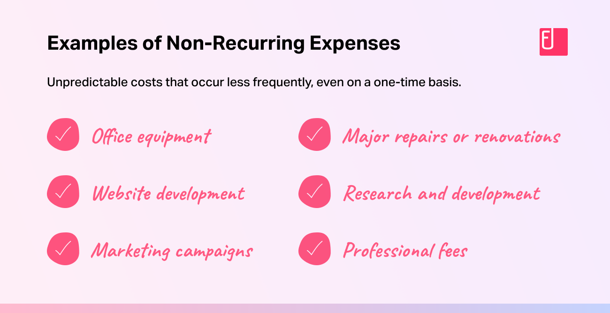

## Table of Contents

## What are recurring expenses?

Recurring expenses are costs that happen regularly, like every month or every year. These are things you have to pay for over and over again. Examples include rent, utility bills, and subscription services. They are important to keep track of because they can add up and affect your budget.

Knowing your recurring expenses helps you plan your money better. If you know how much you need to pay each month, you can make sure you have enough money saved. This can stop you from being surprised by bills and help you save for other things you want or need. Keeping an eye on these expenses is a good way to stay in control of your finances.

## What are non-recurring expenses?

Non-recurring expenses are costs that you don't have to pay regularly. They happen just once or very rarely. Examples include buying a new washing machine, paying for a big trip, or fixing a car after an accident. These expenses can be big and might need you to save up money ahead of time.

It's important to plan for non-recurring expenses because they can affect your budget a lot. Even though they don't happen often, they can still be expensive. By setting aside some money each month, you can be ready when these costs come up. This way, you won't have to worry about finding the money all at once when something unexpected happens.

## Can you give examples of common recurring expenses?

Recurring expenses are costs that you have to pay over and over again. Some common ones are rent or mortgage payments. Every month, you need to pay to live in your home. Another big recurring expense is utilities, like electricity, water, and gas. You use these every day, so you have to pay for them regularly.

Subscription services are also common recurring expenses. Things like Netflix, Spotify, or a gym membership cost money every month. You might also have to pay for insurance, like health or car insurance, which usually comes due every month or every year. These expenses are important to keep track of because they can add up and affect your budget.

## Can you give examples of common non-recurring expenses?

Non-recurring expenses are costs that you don't have to pay all the time. They happen just once or very rarely. Some common non-recurring expenses include buying a new washing machine or refrigerator. These appliances can break down and need to be replaced, but you don't buy them every month. Another example is a big trip or vacation. You might save up for a special trip, but you don't go on a big vacation every year.

Another common non-recurring expense is home repairs or renovations. If your roof leaks or you want to add a new room, these are big costs that don't happen regularly. Car repairs can also be non-recurring expenses. If your car breaks down or gets in an accident, you might have to pay a lot to fix it, but it's not something that happens all the time. Keeping some money saved up for these kinds of expenses can help you be ready when they come up.

## How do recurring and non-recurring expenses impact personal budgeting?

Recurring expenses are the costs you have to pay over and over again, like rent, utilities, and subscriptions. They are important for your budget because you need to make sure you have enough money to cover them every month. If you know how much you need to pay for these things, you can plan your money better. It helps you avoid surprises and keeps your finances stable. For example, if you know your rent is $1000 a month, you can set that money aside before you spend on anything else.

Non-recurring expenses are costs that happen just once or very rarely, like buying a new washing machine or going on a big trip. These can be big expenses, so they can really affect your budget. You need to save up money for them because they can be expensive and you might not have the money right away when they come up. By putting some money aside each month, you can be ready for these costs without messing up your budget. For example, if you save $50 a month, you'll have $600 at the end of the year, which could cover a big expense like a new appliance.

## What strategies can be used to manage recurring expenses effectively?

One good way to manage recurring expenses is to make a budget. Write down all the things you have to pay for every month, like rent, utilities, and subscriptions. Then, see how much money you get each month. Make sure the money you have can cover all your recurring expenses. If it doesn't, you might need to cut back on some things or find ways to make more money. By knowing exactly what you need to pay each month, you can plan your money better and avoid surprises.

Another strategy is to set up automatic payments for your recurring expenses. Many bills, like utilities or subscriptions, let you pay automatically from your bank account. This way, you don't have to remember to pay them every month, and you won't miss any payments. It can also help you avoid late fees. Just make sure you always have enough money in your account to cover these automatic payments. If you keep track of your budget, you can make sure you have the money ready when the bills come due.

## How should one plan financially for non-recurring expenses?

Planning for non-recurring expenses means saving up money little by little. These expenses, like buying a new washing machine or going on a big trip, can be big and come when you least expect them. To be ready, you can set aside a small amount of money each month into a special savings account. For example, if you save $50 a month, you'll have $600 at the end of the year. That could be enough to cover a big expense. By saving regularly, you won't have to worry about finding a lot of money all at once when something unexpected happens.

Another way to plan for non-recurring expenses is to keep track of when they might happen. Some non-recurring expenses, like a big trip, can be planned ahead of time. You know when you want to go, so you can start saving for it early. Other expenses, like car repairs, can be harder to predict. But if your car is old, you might guess it will need repairs soon. By thinking about these possibilities, you can save more money when you think a big expense is coming up. This way, you can be ready for both the planned and the unexpected costs without messing up your budget.

## What are the tax implications of recurring versus non-recurring expenses?

Recurring expenses like rent, utilities, and subscriptions usually don't change your taxes much. You pay them all the time, so they are part of your regular spending. But some recurring expenses, like mortgage interest or certain types of insurance, might be tax-deductible. This means you can subtract them from your income when you file your taxes, which could lower how much tax you owe. It's a good idea to keep track of these expenses and talk to a tax professional to see if you can get any tax benefits from them.

Non-recurring expenses can affect your taxes in different ways. If you spend a lot of money on something like a new washing machine or a big trip, you might be able to claim some of that money back on your taxes if it's related to your job or a business. For example, if you need a new computer for work, that could be a tax-deductible expense. But if it's just for personal use, you can't claim it. It's important to keep receipts and records of big, one-time expenses, and to talk to a tax advisor to understand what you can and can't claim on your taxes.

## How do businesses account for recurring and non-recurring expenses differently?

Businesses keep track of recurring and non-recurring expenses in different ways. Recurring expenses, like rent, utilities, and salaries, happen every month or year. These are easy for businesses to plan for because they know they will come up regularly. So, they include these costs in their regular budget and financial plans. They might set up automatic payments or make sure they have enough money in their accounts to cover these costs every time they are due. This helps businesses keep their finances stable and predictable.

Non-recurring expenses are different because they happen just once or very rarely. Examples include buying new equipment, paying for a big project, or fixing something that broke. Because these costs don't happen all the time, businesses need to plan for them differently. They might save up money over time in a special account just for these big, unexpected costs. Or, they might take out a loan to cover a big expense. Businesses also keep careful records of these expenses because they can affect their taxes and financial reports in special ways. By planning and saving for both types of expenses, businesses can manage their money better and avoid big surprises.

## What role do recurring and non-recurring expenses play in financial forecasting?

Recurring expenses are important for financial forecasting because they happen all the time. Things like rent, utilities, and salaries are easy to predict because they come up every month or year. When businesses make their financial plans, they can count on these costs being there. This helps them know how much money they need to keep running smoothly. By including recurring expenses in their forecasts, businesses can make sure they have enough money to cover these regular costs and plan for the future.

Non-recurring expenses are trickier for financial forecasting because they don't happen all the time. Things like buying new equipment or fixing something that broke can be hard to predict. But businesses still need to plan for these costs. They might save a little money each month in a special account just for these big, unexpected expenses. This way, when a non-recurring expense comes up, they can use the money they saved without messing up their regular budget. By thinking about both recurring and non-recurring expenses, businesses can make better financial forecasts and be ready for whatever comes their way.

## How can technology help in tracking and managing both types of expenses?

Technology can make it easier to keep track of recurring expenses like rent, utilities, and subscriptions. You can use apps and software to set up reminders for when these bills are due. Some apps even let you pay these bills automatically from your bank account, so you don't forget. This can help you avoid late fees and keep your budget on track. You can also use budgeting apps to see all your recurring expenses in one place, which makes it easier to plan your money and make sure you have enough to cover everything each month.

For non-recurring expenses, technology can help you save up and be ready for big, unexpected costs. You can use savings apps to set aside a little money each month for things like a new washing machine or a big trip. These apps can show you how much you've saved and how much more you need. Some apps also let you keep track of receipts and records, which can be helpful for taxes. By using technology, you can plan better for both the regular costs and the big, one-time expenses, making it easier to manage your money.

## What are the advanced financial models used to analyze the impact of recurring and non-recurring expenses on long-term financial health?

Advanced financial models help businesses and individuals understand how recurring and non-recurring expenses affect their long-term financial health. One common model is the cash flow analysis, which looks at the money coming in and going out over time. This model helps you see if you have enough money to cover your recurring expenses like rent and utilities every month. It also helps you plan for big, non-recurring expenses like buying new equipment or going on a big trip. By using cash flow analysis, you can make sure you're saving enough money to stay financially healthy in the long run.

Another useful model is the scenario analysis, which lets you see what might happen if certain things change. For example, if your rent goes up or you need to buy a new car, scenario analysis can show you how these changes might affect your finances. This model helps you plan for different possibilities and be ready for unexpected costs. By using scenario analysis, you can make smarter decisions about saving and spending, which can help you stay financially stable over time.

## What is the Role of Expense Classification in Algo Trading?

In [algorithmic trading](/wiki/algorithmic-trading), the distinction between recurring and non-recurring expenses significantly affects trading strategies and risk management. Recurring expenses, such as data subscription fees, server hosting charges, and regular software licensing, are predictable and regularly impact cash flow. These costs are integral when forecasting the financial viability of trading strategies over time. For instance, a trading strategy must generate enough revenue to not only cover these predictable expenses but also ensure a healthy profit margin. 

Conversely, non-recurring expenses might include substantial one-off investments such as purchasing specialized hardware, implementing a new trading algorithm, or unforeseen legal fees. These costs can cause abrupt variations in cash flow and must be accounted for when evaluating the long-term sustainability of a trading strategy. Misclassification of non-recurring expenses as recurring can lead to inaccurate financial forecasting and misaligned budget allocations, thereby endangering the strategy's success.

Algorithmic traders must implement accurate expense classification in their trading models to maintain profitability. For instance, let us consider a basic model where total expenses are defined as:

$$
\text{Total Expenses} = \text{Recurring Expenses} + \text{Non-Recurring Expenses}
$$

Profitability can then be calculated as:

$$
\text{Profit} = \text{Revenue} - \text{Total Expenses}
$$

Understanding how each expense category influences this equation is vital for risk management and ensuring a consistent positive cash flow. Accurate expense forecasts allow traders to address potential cash shortfalls or allocate funds appropriately for unexpected expenses — crucial elements for adjusting trade [volume](/wiki/volume-trading-strategy) or tweaking algorithms in response to financial pressures.

Moreover, the automation inherent in algorithmic trading can be leveraged to handle these expenses efficiently. Using Python, one can automate the tracking and recording of expenses:

```python
def calculate_profit(revenue, recurring_expenses, non_recurring_expenses):
    total_expenses = recurring_expenses + non_recurring_expenses
    return revenue - total_expenses

# Example usage
revenue = 100000  # example revenue
recurring_expenses = 20000  # example recurring expenses
non_recurring_expenses = 5000  # example non-recurring expenses

profit = calculate_profit(revenue, recurring_expenses, non_recurring_expenses)
print(f"Profit: ${profit}")
```

Through rigorous classification and management of expenses, algorithmic traders can more accurately gauge the performance of their trading strategies, adapt to changing financial landscapes, and enhance their overall risk management framework. This process is fundamental to crafting a resilient and profitable trading operation.

## References & Further Reading

[1]: Bergstra, J., Bardenet, R., Bengio, Y., & Kégl, B. (2011). ["Algorithms for Hyper-Parameter Optimization."](https://papers.nips.cc/paper/4443-algorithms-for-hyper-parameter-optimization) Advances in Neural Information Processing Systems 24.

[2]: ["Advances in Financial Machine Learning"](https://www.amazon.com/Advances-Financial-Machine-Learning-Marcos/dp/1119482089) by Marcos Lopez de Prado

[3]: ["Evidence-Based Technical Analysis: Applying the Scientific Method and Statistical Inference to Trading Signals"](https://www.amazon.com/Evidence-Based-Technical-Analysis-Scientific-Statistical/dp/0470008741) by David Aronson

[4]: ["Machine Learning for Algorithmic Trading"](https://github.com/stefan-jansen/machine-learning-for-trading) by Stefan Jansen

[5]: ["Quantitative Trading: How to Build Your Own Algorithmic Trading Business"](https://www.amazon.com/Quantitative-Trading-Build-Algorithmic-Business/dp/1119800064) by Ernest P. Chan