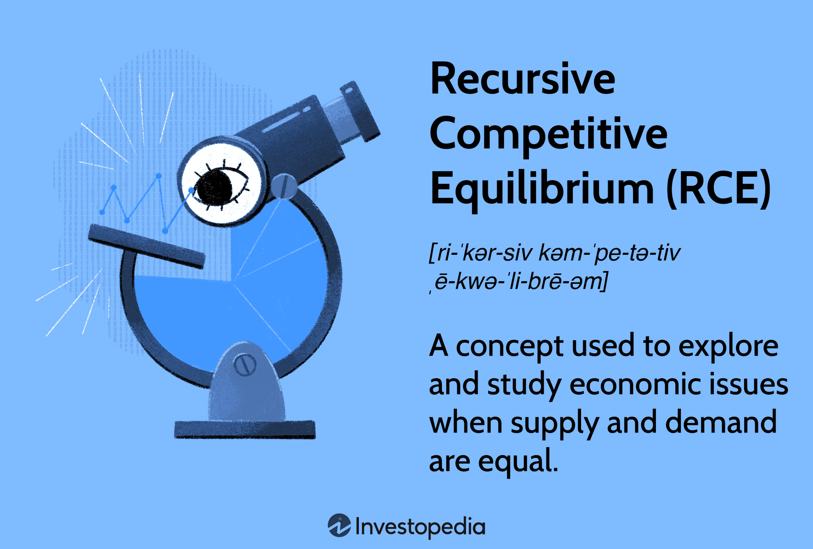

In finance, understanding how economies operate and evolve is crucial for both policymakers and market participants. One powerful theory aiding this understanding is Recursive Competitive Equilibrium (RCE), which serves as a fundamental framework in economic analysis. RCE is integral to modeling and predicting how economies adjust to various stimuli, by examining how supply and demand achieve balance in a recursive manner. As we analyze RCE, we will focus on its core principles and standout applications, specifically its impact on algorithmic trading—a fast-evolving field in modern finance.

RCE provides economists with tools for optimizing macroeconomic models by enabling the examination of decision-making processes in dynamic economic settings. This analysis equips policymakers and researchers with insights into business cycle fluctuations and the effectiveness of monetary and fiscal policies. By understanding these dynamics, economic models can be more precisely calibrated to predict and manage economic activities, fostering stable economic growth.

The significance of RCE extends beyond theoretical economics; its practical implications are profound, especially in financial markets. Investors engaged in algorithmic trading find value in RCE as it provides a quantitative foundation for designing trading strategies. By aligning their operations with economic equilibriums predicted by RCE models, traders can optimize their decisions and potentially enhance their performance in the financial markets.

In summary, Recursive Competitive Equilibrium offers valuable insights into economic systems, helping both economists and investors make informed decisions. As financial systems become increasingly complex, the application of theories such as RCE will continue to be indispensable for those seeking to navigate and understand economic and market behaviors effectively.

## Table of Contents

## What is Recursive Competitive Equilibrium (RCE)?

Recursive Competitive Equilibrium (RCE) is a mathematical optimization concept often employed in macroeconomics to analyze and interpret economic scenarios where market conditions satisfy the equality of supply and demand. This theoretical framework is instrumental in providing time-invariant equilibrium decision rules that hinge on a restricted set of variables, facilitating the comprehension of dynamic economic interactions.

At its core, RCE hinges on recursive methods to delineate how economic agents make optimal decisions over time, considering their individual state variables and the external environment. The recursive nature of this approach implies that complex macroeconomic models can be broken down into smaller, sequential problems, each of which can be solved by considering the equilibrium condition in conjunction with the agents' optimization behavior. This method of iterating over time periods allows analysts to simulate the long-term outcome of economic policies more effectively.

RCE is particularly valuable in evaluating how monetary and fiscal policies impact the overall economy. For example, by utilizing a representative agent model, one can analyze how changes in interest rates or government spending initiatives influence consumers' consumption patterns and firms' production decisions, thereby affecting aggregate demand and supply. The recursive framework enables the modeling of these impacts in a time-consistent manner, accounting for the evolution of expectations and the gradual unfolding of policy effects.

Moreover, one of the significant advantages of RCE is its ability to illuminate the complexities of business cycle fluctuations. By employing stochastic dynamic programming principles, RCE models capture the influence of random shocks—such as technological innovations or geopolitical events—on economic variables. These models, therefore, serve as robust tools for understanding how economies react to sudden changes and how equilibrium is restored over time.

In summary, Recursive Competitive Equilibrium is an essential mathematical tool in macroeconomics that helps explain the dynamic nature of markets under equilibrium conditions. It provides a structured approach to analyzing economic policies and business cycles, guiding researchers and policymakers in understanding the broader economic implications of their decisions. The depth and adaptability of RCE make it a cornerstone of modern macroeconomic analysis, shining light on the intricate dance of supply, demand, policy, and time.

## How Recursive Competitive Equilibrium (RCE) Works

Recursive Competitive Equilibrium (RCE) is built on the notion that economic variables are updated with the most current information, including past decisions and available data. This ensures the model's adaptability and accuracy in representing real-world economic dynamics.

The RCE framework is centered around three core components: a pricing function, a value function, and period allocation policies for both consumers and firms. The pricing function determines prices at which goods and services are exchanged, ensuring that markets clear. The value function represents the best achievable outcome for consumers or firms given their constraints and available resources. Period allocation policies dictate how consumers and firms optimize their consumption and production decisions over different time periods.

An essential aspect of RCE is the use of decision rules that incorporate functions like the law of motion of the capital stock. This law describes how capital accumulates over time, influenced by factors such as investment and depreciation. It is typically expressed as a difference equation: 

$$
K_{t+1} = (1 - \delta)K_t + I_t
$$

where $K_{t+1}$ is the capital stock in the next period, $\delta$ is the depreciation rate, $K_t$ is the current capital stock, and $I_t$ is the investment. By understanding how capital evolves, RCE models provide insights into the interaction between investment decisions and economic output.

Recursive evaluation in RCE enables the prediction of economic [agents](/wiki/agents)' responses to various policies and changes in the business cycle. This is achieved by iteratively solving the model to find equilibrium paths of variables, where current decisions optimally incorporate past information and anticipated future conditions. Economists and analysts can thus use RCE to simulate how policy interventions or shocks, such as changes in interest rates or taxation, affect the behavior of consumers and firms, thereby influencing overall market outcomes.

In summary, RCE captures the dynamic and intertemporal nature of economic decision-making, using recursive methods to model how economies reach equilibrium through the interplay of consumer preferences, firm production choices, and market forces.

## Special Considerations in RCE

Recursive Competitive Equilibrium (RCE) is a framework that emphasizes the importance of consumption decisions in shaping economic equilibrium. This consumer-centric approach presupposes that individuals' preferences and consumption choices are fundamental drivers, ultimately balancing supply and demand within an economy. 

In RCE, the model typically involves a limited number of firms responsible for producing goods. These firms operate under the principle of profit maximization, seeking to optimize their outputs by efficiently allocating resources in response to market signals. The assumption here is that firms behave competitively in input markets, where resources such as labor and raw materials are purchased. This competition ensures that inputs are acquired at a market-clearing price, facilitating efficient resource distribution across the economy.

An essential aspect of RCE is its focus on analyzing stationary environments, which are characterized by time-invariant problems. Here, the idea is to study economies over extended periods under the assumption that the fundamental economic structures remain consistent. This allows for the examination of recurrent economic patterns and growth trajectories without the complications introduced by constant structural changes. The stationary setting simplifies understanding how economies adjust over time to shocks and policy changes, providing insights into sustained economic growth.

Moreover, RCE enables the exploration of economic structures and growth patterns by employing recursive methods. The recursive nature of this approach means that current decisions are made based on past outcomes and available information, forming a sequence of interdependent economic states. This sequential approach is especially useful in understanding how consumer behavior impacts the long-term equilibrium state of an economy, providing a basis for assessing policy implications and business cycle dynamics. 

By encapsulating these special considerations, RCE offers a robust framework for understanding the complex interactions between consumers, firms, and market forces, ultimately highlighting the significance of consumption decisions and competitive markets in achieving economic stability and growth.

## RCE in Macroeconomics

Recursive Competitive Equilibrium (RCE) plays a significant role in macroeconomic analysis by providing a structured framework to understand and predict economic behaviors. Within the domain of macroeconomics, RCE models explore the complex interactions between various economic agents, including households, firms, and governments, under the equilibrium condition where aggregate supply equals aggregate demand. These models offer valuable insights into numerous macroeconomic indicators such as Gross Domestic Product (GDP) and national income trends.

Economists utilize RCE models to analyze inflation dynamics, trade balances, and consumption patterns. Through these models, economists can trace the impact of monetary and fiscal policies on economic growth and contractions. For instance, by incorporating RCE into their analyses, economists gain a better understanding of how inflation responds to changes in policy such as adjustments in interest rates or government spending. This is particularly useful in refining economic forecasts and policy recommendations.

One of the primary objectives of RCE is to achieve equilibrium within economic models by ensuring that supply and demand balance at both individual and aggregate levels. This is accomplished by establishing equilibrium prices and quantities that clear all markets. In mathematical terms, let $Y_t$ represent the total economic output at time $t$, while $C_t$ and $I_t$ denote consumption and investment at the same time. RCE models often satisfy the condition:

$$
Y_t = C_t + I_t
$$

This identity ensures that the goods market is cleared, meaning all produced goods are either consumed or invested. Additionally, RCE allows for the investigation of the dynamic responses of economic agents to policy changes. When policymakers introduce adjustments, RCE models can recursively simulate the future paths of economic variables, helping predict long-term impacts.

RCE's recursive nature enables it to effectively model how macroeconomic variables adjust over time. This dynamic adjustment is critical when examining the effects of anticipated policy changes or external shocks. For example, if a government implements a fiscal stimulus, RCE models can project how this intervention influences consumption and investment patterns, consequently impacting GDP and employment rates.

Ultimately, RCE provides a robust framework for quantifying and predicting macroeconomic phenomena. By equating supply with demand in economic equilibrium models, RCE helps anticipate the outcomes of policy changes over extended periods. These predictive capabilities are crucial for economists seeking to develop macroeconomic policies that foster sustainable growth and stability. As a theoretical tool, RCE remains instrumental in enhancing our understanding of complex economic systems and guiding strategic policy decisions.

## RCE and Algorithmic Trading

Recursive Competitive Equilibrium (RCE) serves as a sophisticated tool for [algorithmic trading](/wiki/algorithmic-trading) by offering a systematic method to forecast economic developments. By leveraging the principles of RCE, traders can anticipate how markets will respond to fiscal and monetary policy changes, allowing them to optimize their trading strategies accordingly.

RCE provides a conducive framework for predicting the equilibrium conditions in financial markets. Through the use of value functions, pricing functions, and policy decision rules, RCE models enable traders to simulate how economic agents might react to structural adjustments and policy interventions. These simulations are particularly useful in algorithmic trading, where the goal is to execute trades based on predictive insights and probabilistic outcomes.

For example, let's consider a situation where a central bank modifies interest rates. An RCE model can be used to analyze how such a change might affect capital allocation and consumption dynamics. By incorporating these potential shifts into an algorithmic trading platform, traders can adjust their positions to benefit from predicted market movements. The formula for a basic RCE model could be expressed as follows:

$$
V(k) = \max_{c, k'} \left\{ u(c) + \beta V(k') \right\}
$$

subject to the constraints:

$$
c + k' = f(k) - \delta k
$$

In this setup, $V(k)$ represents the value function, $c$ is consumption, $k$ is the current capital stock, $k'$ is the future capital stock, $u(c)$ is the utility from consumption, $\beta$ is the discount [factor](/wiki/factor-investing), $f(k)$ is the production function, and $\delta$ is the depreciation rate. By iteratively solving this recursive optimization problem, traders can gauge how adjustments in fiscal policies influence market equilibrium and thus optimize their trading algorithms.

Moreover, the recursive nature of RCE ensures adaptability, a critical feature for algorithmic trading platforms that need to react to constantly changing market conditions. The iterative recalibration intrinsic to RCE allows these platforms to dynamically update their strategies in real time, aligning with the markets' fluid nature. This responsiveness is crucial for maintaining a competitive edge, as it permits traders to formulate strategies that reflect up-to-the-minute economic realities.

In conclusion, RCE equips algorithmic traders with a valuable toolkit for deciphering and responding to economic shifts rooted in policy changes. Its structured approach facilitates a deeper understanding of market equilibriums, thereby enabling the refinement of algorithmic trading strategies to achieve optimal market performance.

## Conclusion

Recursive Competitive Equilibrium (RCE) plays a pivotal role in deepening our understanding of macroeconomic phenomena and refining market strategies. By offering a structured approach for predicting economic outcomes, RCE equips traders, particularly those engaged in algorithmic trading, with the analytical tools necessary to anticipate market changes and formulate informed decisions. The recursive nature of RCE models, which allows examination of how economic agents react over time, offers a dynamic framework that is particularly valuable for developing robust trading algorithms.

As financial markets continuously evolve, the integration of economic theories like RCE remains vital for maintaining a competitive edge. The ability to forecast market reactions, especially to shifts in fiscal and monetary policies, underscores the utility of RCE in the fast-paced environment of algorithmic trading. This adaptability is crucial, as RCE models inherently align with the dynamic adjustments market participants must make to remain profitable.

The potential for further research and application of RCE is significant. As more sophisticated RCE models are developed, they will undoubtedly enhance the precision of economic forecasts and the effectiveness of trading strategies. Continued exploration in this field promises to refine economic models, offering deeper insights into the complexities of market equilibriums. Consequently, embracing RCE not only aids in understanding macroeconomic environments but also holds substantial promise for improving the strategic approaches employed in algorithmic trading platforms.

## References & Further Reading

[1]: Stokey, N. L., Lucas, R. E. Jr., & Prescott, E. C. (1989). ["Recursive Methods in Economic Dynamics."](https://www.hup.harvard.edu/books/9780674750968) Harvard University Press.

[2]: Ljungqvist, L., & Sargent, T. J. (2012). ["Recursive Macroeconomic Theory."](https://mitpress.mit.edu/9780262038669/recursive-macroeconomic-theory/) MIT Press.

[3]: Judd, K. L. (1998). ["Numerical Methods in Economics."](https://mitpress.mit.edu/9780262547741/numerical-methods-in-economics/) MIT Press.

[4]: Rust, J. (1987). ["Optimal Replacement of GMC Bus Engines: An Empirical Model of Harold Zurcher."](https://www.jstor.org/stable/1911259) Econometrica, 55(5), 999-1033.

[5]: Backus, D., & Kehoe, P. J. (1992). ["International Evidence on the Historical Properties of Business Cycles."](https://www.semanticscholar.org/paper/International-evidence-on-the-historical-properties-Backus-Kehoe/948d6e4fde77c704ed4bcf838e9a2cf82845bb9f) American Economic Review, 82(4), 864-888.