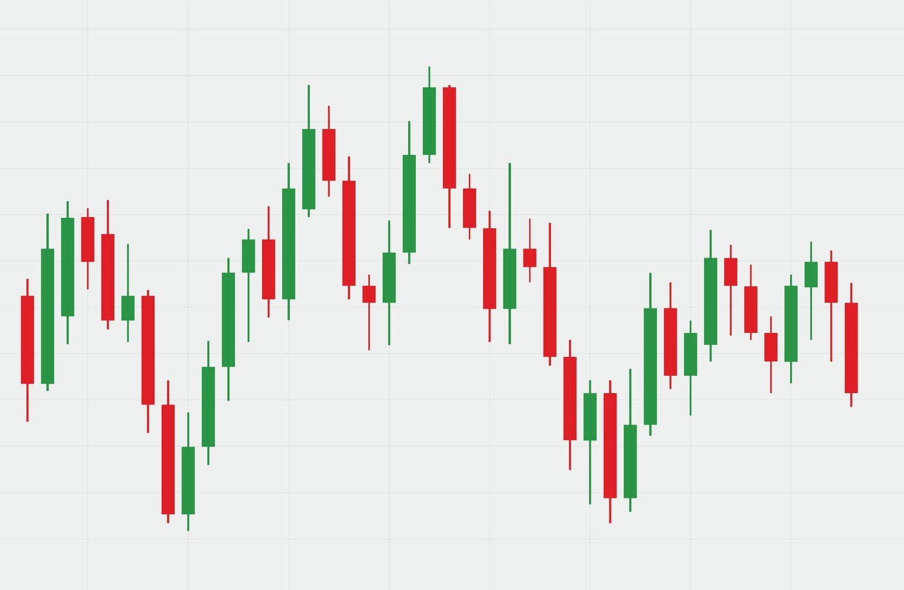

## Table of Contents

## What is a red candlestick in financial charts?

A red candlestick on a financial chart shows that the price of a stock or asset went down during a certain time period. It is part of a type of chart called a candlestick chart, which traders use to see how prices are moving. The top of the red candlestick shows the highest price the asset reached during that time, and the bottom shows the lowest price. The main body of the candlestick, which is red, shows the opening and closing prices, with the top of the body being the opening price and the bottom being the closing price.

Seeing a red candlestick tells you that the closing price was lower than the opening price. This can mean that sellers were more powerful than buyers during that time. Traders look at patterns of red and green candlesticks to decide when to buy or sell. If there are many red candlesticks in a row, it might mean the price is going to keep falling, which is called a downtrend.

## How does a red candlestick differ from a green candlestick?

A red candlestick and a green candlestick show different things about the price of a stock or asset on a candlestick chart. A red candlestick means the price went down during that time. It starts with the opening price at the top of the red part and ends with the closing price at the bottom of the red part. This shows that sellers were stronger than buyers, pushing the price down. On the other hand, a green candlestick means the price went up. The green part starts at the bottom with the opening price and ends at the top with the closing price, showing that buyers were stronger and pushed the price up.

Both red and green candlesticks have lines above and below the main body, called wicks or shadows. These lines show the highest and lowest prices the asset reached during that time, no matter if the price went up or down overall. For a red candlestick, the top of the upper wick is the highest price, and the bottom of the lower wick is the lowest price. For a green candlestick, it's the same, but the colors help you see quickly if the price went up or down. By looking at these candlesticks, traders can see patterns and decide when to buy or sell.

## What does a red candlestick indicate about market sentiment?

A red candlestick on a financial chart shows that the price of a stock or asset went down during that time. It means that sellers were more powerful than buyers, and they were able to push the price lower. When you see a red candlestick, it tells you that the market sentiment for that time was negative. People were selling more than they were buying, which shows that they were not feeling confident about the asset's future value.

If you see many red candlesticks in a row, it can mean that the market is in a downtrend. This means that more and more people are feeling negative about the asset, and the overall mood in the market is one of worry or pessimism. Traders look at these patterns to understand how people feel about the market and to make decisions about buying or selling. A single red candlestick might not mean much by itself, but when you see a lot of them, it's a clear sign that the market sentiment is leaning towards the negative side.

## Can you explain the anatomy of a red candlestick?

A red candlestick on a financial chart shows that the price of a stock or asset went down during a certain time. The main part of the candlestick, which is red, has a top and a bottom. The top of the red part is the opening price, and the bottom is the closing price. This means that the price started higher and ended lower, which is why the candlestick is red. The red part is called the body of the candlestick.

Above and below the body, there are thin lines called wicks or shadows. The line above the body, called the upper wick, shows the highest price the asset reached during that time. The line below the body, called the lower wick, shows the lowest price. These wicks help you see the full range of prices during that time, even if the price ended up going down overall. Together, the body and the wicks give you a clear picture of how the price moved, showing that sellers were stronger than buyers during that time.

## How is the length of a red candlestick interpreted in trading?

The length of a red candlestick shows how much the price of a stock or asset went down during a certain time. A long red candlestick means the price dropped a lot, showing that sellers were much stronger than buyers. Traders see this as a sign that the market might keep going down. On the other hand, a short red candlestick means the price did not drop by much. This shows that sellers were only a little bit stronger than buyers, and the market might not be as worried.

Traders use the length of red candlesticks to understand market feelings and make choices about buying or selling. If they see many long red candlesticks in a row, it can mean that the market is in a big downtrend, and people are feeling very negative about the asset. But if they see short red candlesticks, it might mean that the market is not as worried, and the price might not drop much more. By looking at how long the red candlesticks are, traders can guess what might happen next with the price.

## What are the common patterns involving red candlesticks?

Red candlesticks often show up in different patterns that traders watch closely. One common pattern is called a bearish engulfing pattern. This happens when a small green candlestick is followed by a big red candlestick that "engulfs" it. The red candlestick's body completely covers the green one, showing that sellers took over after buyers were in control. Traders see this as a strong sign that the price might go down more.

Another pattern is called a three black crows. This pattern has three long red candlesticks in a row, each one opening within the body of the one before it and closing lower. It looks like three black crows sitting on a branch, one below the other. This pattern tells traders that sellers are very strong and the price is likely to keep falling.

A third pattern is the evening star. It starts with a big green candlestick, followed by a small candlestick (which can be red or green) that gaps up from the first one. The pattern ends with a big red candlestick that gaps down from the small one and closes deep into the body of the first green candlestick. This pattern shows that the market might be turning from bullish to bearish, meaning the price could start going down after going up.

## How can red candlesticks be used in conjunction with other technical indicators?

Red candlesticks can be used with other technical indicators to help traders make better choices about buying and selling. One common way is to use them with moving averages. A moving average is a line on a chart that shows the average price of a stock over a certain time. If a red candlestick breaks below a moving average, it can be a strong sign that the price might keep going down. Traders might see this as a time to sell or to wait before buying.

Another way to use red candlesticks is with the Relative Strength Index (RSI). The RSI is a number from 0 to 100 that shows if a stock is overbought or oversold. If you see a red candlestick and the RSI is above 70, it might mean the stock is overbought and could go down soon. But if the RSI is below 30 with a red candlestick, it might mean the stock is oversold and could go back up. By looking at red candlesticks and the RSI together, traders can get a better idea of what might happen next with the price.

## What are the psychological impacts of seeing red candlesticks on traders?

Seeing red candlesticks on a chart can make traders feel worried or scared. Red candlesticks show that the price of a stock or asset is going down. When traders see a lot of red candlesticks, they might start to think that the price will keep falling. This can make them feel nervous about losing money, so they might decide to sell their stocks to avoid bigger losses. It's like seeing a warning sign that tells them to be careful.

On the other hand, some traders might see red candlesticks as a chance to buy. If they think the price has gone down too much and might go back up, they might feel excited about buying at a lower price. But even these traders can feel some stress because they need to guess if the price will really go up again. So, red candlesticks can bring different feelings to different traders, but they always make people think hard about what to do next.

## How do red candlesticks affect trading strategies in bearish markets?

In bearish markets, where prices are going down, red candlesticks are very important for traders. They show that the price dropped during a certain time, which fits with the overall trend of the market. Traders might use red candlesticks to decide when to sell their stocks. If they see many long red candlesticks in a row, they might think the price will keep falling and choose to sell before it goes down even more. This can help them avoid losing more money as the market keeps going down.

On the other hand, some traders might see red candlesticks in a bearish market as a chance to make money. They might use a strategy called short selling, where they borrow stocks and sell them, hoping to buy them back later at a lower price. When they see red candlesticks, they might feel more sure that the price will keep dropping, so they decide to short sell. By watching red candlesticks closely, these traders can try to make money even when the market is going down.

## Can red candlesticks predict future market trends, and if so, how?

Red candlesticks can give traders clues about what might happen next in the market. When traders see a lot of red candlesticks in a row, it might mean that the market is going to keep going down. This is called a downtrend. Traders look at these patterns to guess if the price will keep falling or if it might change soon. For example, if a red candlestick breaks below a key level, like a moving average, it can be a strong sign that the price will keep dropping.

However, red candlesticks alone do not always predict the future perfectly. They are just one part of the puzzle. Traders often use red candlesticks with other tools, like the Relative Strength Index (RSI) or other chart patterns, to make better guesses. If a red candlestick appears when the RSI is over 70, it might mean the stock is overbought and could go down soon. By looking at all these things together, traders can get a clearer picture of what might happen next in the market.

## What are the limitations of using red candlesticks for market analysis?

Red candlesticks show that the price of a stock went down during a certain time. But they don't tell the whole story by themselves. One big problem is that they only show what happened in the past, not what will happen in the future. Just because you see a red candlestick doesn't mean the price will keep going down. Other things, like news or changes in the economy, can change the market in ways that red candlesticks can't predict.

Another issue is that red candlesticks can be misleading if you don't look at them with other tools. For example, a single red candlestick might not mean much if it's part of a bigger pattern where the price is actually going up overall. Traders need to use red candlesticks along with other indicators, like moving averages or the Relative Strength Index, to get a better idea of what's going on. Without these other tools, red candlesticks can make you think the market is going one way when it might be going another.

## How do professional traders integrate red candlestick analysis into their overall trading system?

Professional traders use red candlesticks as part of their overall trading system to help them make better decisions. They don't just look at red candlesticks by themselves. Instead, they use them with other tools, like moving averages and the Relative Strength Index (RSI). For example, if they see a red candlestick and it breaks below a moving average, they might think the price will keep going down. They also look at the RSI to see if the stock is overbought or oversold, which can help them decide if it's a good time to sell or buy.

They also pay attention to patterns that include red candlesticks, like the bearish engulfing pattern or the three black crows. These patterns can give them stronger signs about what the market might do next. By combining red candlestick analysis with other technical indicators and chart patterns, professional traders can get a clearer picture of market trends and make more informed choices about when to buy or sell. This helps them manage their risks and try to make more money in the market.

## References & Further Reading

[1]: Nison, S. (1991). ["Japanese Candlestick Charting Techniques."](https://drive.google.com/file/d/0B_CADMk621uLNDEyZTEzZjYtMmZjOS00ZmUyLTlhYmYtN2E1YTViOWRiOTdi/view) Prentice Hall Press.

[2]: Bulkowski, T. N. (2002). ["Encyclopedia of Chart Patterns."](https://www.amazon.com/Encyclopedia-Chart-Patterns-Wiley-Trading/dp/1119739683) Wiley.

[3]: Homma Munehisa. ["Sakata Senho and the Japanese Way of the Chart."](https://en.wikipedia.org/wiki/Honma_Munehisa) (originally published in the 18th century, various modern analyses and translations)

[4]: Murphy, J. J. (1999). ["Technical Analysis of the Financial Markets."](https://archive.org/details/technicalanalysi0000murp) New York Institute of Finance.

[5]: Lopez de Prado, M. (2018). ["Advances in Financial Machine Learning."](https://www.amazon.com/Advances-Financial-Machine-Learning-Marcos/dp/1119482089) Wiley.

[6]: Aronson, D. R. (2006). ["Evidence-Based Technical Analysis: Applying the Scientific Method and Statistical Inference to Trading Signals."](https://onlinelibrary.wiley.com/doi/book/10.1002/9781118268315) Wiley.

[7]: Chan, E. P. (2008). ["Quantitative Trading: How to Build Your Own Algorithmic Trading Business."](https://github.com/ftvision/quant_trading_echan_book) Wiley.

[8]: Jansen, S. (2018). ["Machine Learning for Algorithmic Trading."](https://github.com/stefan-jansen/machine-learning-for-trading) Packt Publishing.