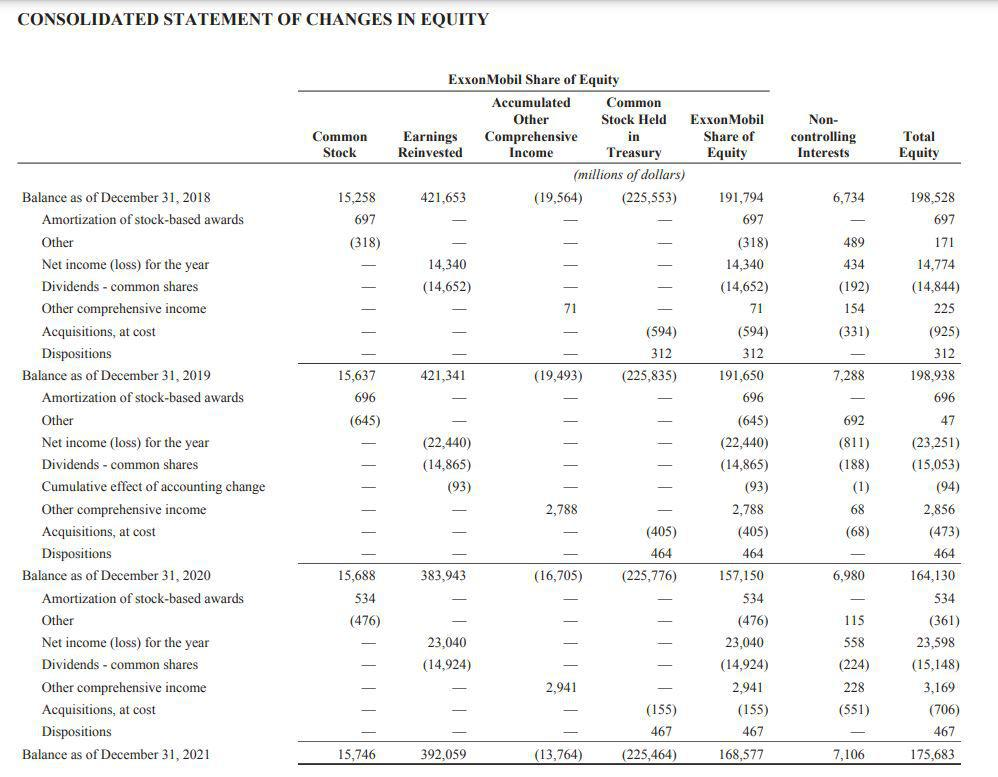

In the dynamic world of finance, understanding the nuances of financial statements is crucial for investors and analysts alike. These documents offer a window into the health and performance of companies, helping stakeholders make informed decisions. In particular, income statements deserve close scrutiny as they can reveal warning signs of financial trouble. This article explores the red flags in income statements that signal potential financial issues, specifically in the context of financial analysis and algorithmic trading. 

Revenue manipulation is one of the most critical warnings, often accomplished through overstated sales, premature recognition, or changes in accounting methods. Misrepresented expenses, where companies hide or distort costs, are another major concern. By recognizing these warning indicators, investors can better assess the financial stability of a company. This knowledge is particularly beneficial for those leveraging algorithmic trading strategies, as undetected financial irregularities can jeopardize trading models. Identifying these red flags equips market participants with the tools required to navigate financial and operational challenges effectively.



Understanding the nuances of income statements is not only essential for those interested in maintaining financial stability but also for optimizing trading strategies. Individuals and institutions can achieve better investment outcomes by paying close attention to potential red flags.

## Table of Contents

## Understanding Financial Statements

Financial statements are fundamental resources used by investors, analysts, and stakeholders to evaluate a company’s financial health and performance. Among the various financial statements, the income statement holds particular significance. It provides a comprehensive overview of a company's revenues, expenses, and profits over a designated accounting period, typically quarterly or annually. This document is essential for assessing a company’s operational efficiency and profitability.

The income statement, also known as the profit and loss statement, is structured to reflect the company’s financial activities during the period. It primarily consists of the following components:

1. **Revenues**: This section records all income generated from normal business operations, typically from sales of products or services. It's crucial that the recorded revenue reflects actual sales transactions to ensure the reliability of financial reporting.

2. **Cost of Goods Sold (COGS)**: COGS represents the direct costs attributable to the production of goods or services sold by the company. It includes expenses such as raw materials, labor costs, and manufacturing expenses. The relationship between revenue and COGS is a key indicator of a company’s gross profit margin.

3. **Gross Profit**: This metric is calculated by subtracting COGS from total revenue. Gross profit provides insight into the core profitability of the company’s primary business activities. The formula is:
$$
   \text{Gross Profit} = \text{Total Revenue} - \text{Cost of Goods Sold}

$$

4. **Operating Expenses**: These are costs incurred during regular business operations, not including COGS. Operating expenses often encompass selling, general and administrative expenses (SG&A), research and development (R&D), and other overhead costs. Analyzing operating expenses can reveal how well a company controls its costs.

5. **Operating Income**: This figure represents the profit realized from regular business operations. Operating income is derived by subtracting operating expenses from gross profit. It is an important indicator of a company’s earning potential from its core operations. The formula is:
$$
   \text{Operating Income} = \text{Gross Profit} - \text{Operating Expenses}

$$

6. **Net Income**: Net income signifies the total profit of a company after deducting all expenses, taxes, and costs, including non-operating expenses such as interest and taxes. Net income provides stakeholders with a clear view of the company’s overall profitability. It is calculated by:
$$
   \text{Net Income} = \text{Operating Income} + \text{Other Income} - \text{Other Expenses} - \text{Taxes}

$$

Comprehending each component of the income statement is indispensable for performing accurate financial analysis. It aids investors and analysts in making informed decisions by highlighting the financial performance and operational effectiveness of a company. Proper understanding of income statements can reveal insights into revenue trends, cost management, and overall financial strategy, serving as a crucial tool for predicting future financial performance and guiding investment decisions.

## Common Red Flags in Income Statements

Identifying red flags in income statements is a crucial step for investors to detect potential financial misrepresentations. These red flags can serve as early warning signs of underlying financial issues, protecting investors from making uninformed decisions. Two primary red flags in income statements are revenue manipulation and discrepancies in expense reporting.

Revenue manipulation is a common tactic where companies artificially inflate their reported income to paint a rosier picture of their financial performance. This can be achieved through various methods, such as recording fictitious sales, accelerating revenue recognition before it is actually earned, or employing changes in accounting policies that bolster revenue figures unfavorably. A noteworthy indicator of revenue manipulation is when there is an unexplained surge in revenue that is not consistent with industry trends or the company's past performance. Additionally, significant changes in accounting methods, such as switching from cash-based to accrual accounting, might indicate attempts to alter revenue figures.

Discrepancies in expense reporting denote another prevalent red flag. Companies may underreport expenses to artificially enhance profitability. Common strategies involve deferring expenses to future periods or misclassifying expenses as capital expenditures, thereby spreading them over future periods. A red flag for expense misreporting might include a disproportionate relationship between declining expense figures and rising revenues, suggesting that costs are not represented accurately. Further, the existence of large, one-time charges in financial statements can hint at attempts to manipulate expense records to create misleading results.

Understanding these red flags is essential for financial analysts and investors, enabling them to avoid potential financial pitfalls. By focusing on the integrity of revenue and expense reporting, investors can assess the true financial health of a company and make more informed investment decisions.

## Revenue Manipulation Techniques

Revenue manipulation is a critical concern for investors and analysts evaluating a company's financial health. It generally involves inflating sales figures through fraudulent practices or aggressive accounting techniques. One common method of revenue manipulation is through premature revenue recognition, where companies record sales before they are actually realized or earned. This practice distorts the timing of revenue, creating an artificial and potentially misleading portrayal of financial performance.

For example, a company may recognize revenue from a product before it is delivered to the customer, violating the revenue recognition principle, which states that revenue should only be recorded when it is earned and realizable. Similarly, shifting sales between fiscal periods or backdating contracts are tactics used to manipulate revenue to meet specific financial targets.

Another technique involves the use of channel stuffing, where a company inflates its sales figures by forcing more products onto distributors than they can sell. This practice can temporarily boost revenue numbers but often results in increased returns or future period reductions, creating long-term financial discrepancies.

Analyzing unexplained revenue growth or irregularities across different reporting periods is pivotal for identifying potential manipulation. A sudden and unexplained spike in revenue, especially if disproportionate to industry growth, should prompt further investigation. Additionally, inconsistencies between revenue figures and related business metrics, such as inventory levels or accounts receivable, may indicate revenue being recognized fraudulently or prematurely.

For algorithmic traders, these anomalies are crucial indicators. Algorithms can be programmed to detect such discrepancies by using statistical models and [machine learning](/wiki/machine-learning) techniques. Python, as a preferred programming language, offers robust libraries for this purpose. For example, using Python's pandas and scikit-learn libraries, traders can build models to analyze historical revenue data and detect patterns that suggest manipulation.

```python
import pandas as pd
from sklearn.ensemble import IsolationForest

# Sample data
data = {'Revenue': [100, 120, 150, 130, 300, 160, 200]}
df = pd.DataFrame(data)

# Using Isolation Forest to detect anomalies
iso_forest = IsolationForest(contamination=0.1)
df['Anomaly'] = iso_forest.fit_predict(df[['Revenue']])

# Flagging anomalous revenue periods
anomalies = df[df['Anomaly'] == -1]
print(anomalies)
```

This code snippet demonstrates how a machine learning model can identify revenue periods that deviate significantly from normal trends, flagging potential red flags for further analysis. Ensuring these checks are part of the [algorithmic trading](/wiki/algorithmic-trading) strategy enhances risk management by preemptively identifying companies that might be employing dubious financial practices, thereby safeguarding against potential losses.

## Expense Misrepresentation

Expense manipulation is a deceptive practice in which companies underreport costs or use creative accounting tactics to present a more favorable financial position. This can mislead investors and analysts, making it appear that the company is more profitable than it actually is.

One of the key signs of expense misrepresentation is when expenses show an unexpected decline while revenues increase. This discrepancy can be suspicious, as, generally, costs should rise in proportion to revenues if the company is expanding. This situation might indicate that costs are being deferred or not fully recognized, potentially through tactics such as capitalizing expenses that should be recorded in the current period. For instance, a company might capitalize a repair cost as an improvement, spreading it over a longer period rather than recognizing it immediately.

Significant one-time charges are another red flag. Companies might classify regular operating expenses as one-time charges to artificially boost operating profitability. For example, costs categorized as restructuring expenses might appear to be non-recurring and therefore excluded from core operating metrics, when in reality, these charges could be routine business costs.

Evaluating expense trends over time is crucial for financial analysts and traders who rely on quantitative methods. Anomalies in expense reporting can often be spotted by analyzing historical financial data. This requires setting up a systematic review process, looking for patterns or inconsistencies that suggest manipulation.

For example, Python can be used to automate the detection of such anomalies. Consider the following basic example that applies statistical analysis to detect unusual expense patterns:

```python
import pandas as pd
import numpy as np

# Load financial data
data = pd.read_csv('financial_data.csv')

# Calculate Year-over-Year percentage change
data['Expense_Change'] = data['Expenses'].pct_change()

# Flag significant deviations
threshold = 0.1  # Set 10% change as the threshold
data['Flag'] = np.where(data['Expense_Change'] > threshold, True, False)

print(data[['Year', 'Expenses', 'Expense_Change', 'Flag']])
```

In this example, the code checks for any year-over-year (YoY) change in expenses that exceeds a 10% threshold, which might warrant further investigation. Analysts can adjust the threshold and combine such quantitative analyses with qualitative insights from other parts of financial statements to detect potential manipulations.

Ultimately, a comprehensive understanding of expense trends and the implementation of systemic detection methods helps analysts and algorithmic traders enhance their scrutiny of financial reports, thereby improving decision-making and risk management.

## The Role of Cookie Jar Accounting

Cookie jar accounting is a financial strategy where companies manipulate earnings to present a facade of steady, consistent profits over time. This practice may encompass deferring expenses to future periods or reclassifying various types of income to effectively smooth out earnings fluctuations. The motivation behind such manipulations is often to meet market expectations or to create a perception of sustained financial health, which can influence stock prices positively in the short term.

One common tactic employed in cookie jar accounting involves delaying the recognition of certain expenses. For example, a company might defer maintenance costs to a later accounting period, thus falsely inflating the current period's profits. This deferral can create a misleading portrayal of profit consistency, shielding stakeholders from the true [volatility](/wiki/volatility-trading-strategies) of business operations.

Reclassification of income is another technique where revenues might be shifted between categories to alter financial perceptions. For instance, non-operational income could be reclassified as operational, thus giving the illusion of robust core business earnings. Such reclassifications can obfuscate the genuine sources of income, misleading analysts and investors alike.

Algorithmic traders must vigilantly scrutinize income statements for indications of these manipulations, as their models rely heavily on accurate financial data to inform trading decisions. Any distortion in earnings reports can lead to erroneous conclusions and suboptimal trading strategies. Identifying manipulation cues, such as disproportionate changes in net income relative to cash flows or inconsistent application of accounting policies, can mitigate the risk of basing trades on distorted financial information.

Incorporating this vigilance into algorithmic systems requires the development of algorithms capable of recognizing patterns indicative of cookie jar accounting. By setting parameters to detect deviations from expected financial report norms, these systems can flag suspicious financial activities. For instance, machine learning models can be trained to identify statistical anomalies in financial data, highlighting companies that may be engaging in suspicious accounting practices.

By proactively identifying and understanding these manipulative strategies, algorithmic traders enhance their risk management capabilities, ensuring more robust and reliable trading operations.

## Other Red Flags and Nonrecurring Transactions

Nonrecurring transactions, including asset disposals, restructuring charges, or significant legal settlements, can serve as a means for companies to manipulate their earnings in income statements. These transactions are typically irregular and not expected to recur in the normal [course](/wiki/best-algorithmic-trading-courses) of business. Consequently, they can obscure the true financial performance of a company if not adequately analyzed.

To accurately assess a company's financial health, it is crucial to scrutinize these unusual items. They can provide critical insight into whether the reported earnings reflect recurring operational performance or are inflated by one-time events. For example, a company might sell off an asset at an opportune time to produce significant gains, masking underlying operational weaknesses. 

Algorithmic trading systems can be designed to identify and flag such nonrecurring transactions for further analysis. By incorporating modules that analyze financial statements for these unusual items, traders can better understand a company's underlying profitability and risk profile. An effective approach could involve parsing income statements to isolate and quantify nonrecurring items. 

Here is a basic example of how one might use Python to flag nonrecurring transactions in financial data:

```python
import pandas as pd

# Assume df is a DataFrame containing financial statement data.
# Particularly interested in columns: 'Transaction_Type' and 'Amount'.
# 'Nonrecurring' transactions are specifically flagged in the 'Transaction_Type'.

def flag_nonrecurring(df):
    # Filter for nonrecurring transactions
    nonrecurring_items = df[df['Transaction_Type'] == 'Nonrecurring']

    # Provide a summary or detailed analysis as needed
    return nonrecurring_items

# Example DataFrame setup
data = {
    'Transaction_Type': ['Recurring', 'Nonrecurring', 'Recurring', 'Nonrecurring'],
    'Amount': [100, 500, 200, 600]
}

df = pd.DataFrame(data)
flagged_transactions = flag_nonrecurring(df)

print(flagged_transactions)
```

By integrating this type of analysis, algorithmic trading models can be tuned to account for nonrecurring items, providing a more comprehensive view of a company's financial statements. Advanced systems may also leverage machine learning techniques to predict the likelihood and impact of such transactions on future earnings, thereby enhancing decision-making processes. This proactive identification allows traders to mitigate risks associated with misleading financial representations.

## Integrating Red Flag Analysis into Algo Trading Strategies

Incorporating red flag analysis into algorithmic trading strategies is essential for improving risk management and making informed investment decisions. By integrating this scrutiny into algorithms, traders can effectively filter out companies with questionable financial practices and enhance the precision of their trading models.

Algorithmic trading systems are designed to process large volumes of financial data rapidly. By incorporating red flag analysis, these systems can detect anomalies in income statements, such as inconsistencies in revenue recognition or unusual expense patterns. This capability allows the algorithms to alert traders to potential issues in real time, enabling swift and informed decision-making.

A typical approach to integrating red flag analysis involves setting up specific parameters within the trading algorithms. For example, consider implementing a Python-based alert system that flags companies displaying significant discrepancies in financial statements:

```python
def detect_red_flags(financial_data):
    red_flags = []
    for company in financial_data:
        if company['revenue_growth'] > 0.20 and company['expense_decline'] < 0.10:
            red_flags.append(company['name'])
    return red_flags

# Example financial data
financial_data = [
    {'name': 'Company A', 'revenue_growth': 0.25, 'expense_decline': 0.05},
    {'name': 'Company B', 'revenue_growth': 0.15, 'expense_decline': 0.12},
]

flagged_companies = detect_red_flags(financial_data)
print("Flagged companies:", flagged_companies)
```

In this example, companies with revenue growth exceeding 20% while expenses decline by less than 10% are flagged for further investigation, as these discrepancies could indicate potential financial misrepresentation.

Furthermore, integrating this analysis into algorithmic trading strategies helps optimize trade execution by avoiding investments in companies with potential financial instability. This proactive approach not only safeguards against losses but also strengthens the robustness of trading portfolios against market uncertainties.

Overall, red flag analysis is a powerful tool for traders. By building algorithms that incorporate financial scrutiny, traders can maintain a competitive edge and improve their risk management capabilities in an ever-evolving financial market environment.

## Conclusion

Recognizing red flags in income statements is crucial for ensuring financial transparency and making informed investment decisions. Investors and analysts must remain vigilant in examining financial statements, as these documents can sometimes mask underlying financial issues through manipulative accounting practices. By identifying and understanding these red flags, stakeholders can better assess the financial health of a company and avoid potential pitfalls.

For algorithmic traders, the ability to decode these indicators is especially important as it strengthens trading strategies against unpredictable market conditions. Algorithmic models can incorporate these insights to filter out firms with questionable financial practices, thereby reducing the risk of unexpected losses. This can be achieved by developing algorithms that automatically flag anomalies or unusual patterns in financial data, such as unexpected changes in revenue or expenses, or the presence of nonrecurring transactions.

Continued vigilance and thorough financial analysis are key to navigating the complexities of today's financial markets. Each financial statement should be scrutinized not just for surface-level data, but for the subtle cues that might indicate deeper issues. By maintaining a rigorous analytical approach, traders and investors can better protect their portfolios and optimize their investment choices in the ever-evolving financial landscape.

## References & Further Reading

[1]: Schilit, H. M., & Perler, J. (2010). ["Financial Shenanigans: How to Detect Accounting Gimmicks and Fraud in Financial Reports"](https://www.amazon.com/Financial-Shenanigans-Fourth-Accounting-Gimmicks/dp/126011726X). McGraw-Hill Education.

[2]: Healy, P. M., & Wahlen, J. M. (1999). ["A Review of the Earnings Management Literature and Its Implications for Standard Setting."](https://papers.ssrn.com/sol3/papers.cfm?abstract_id=156445) Management Science, 43(3), 365-400.

[3]: Dechow, P., Ge, W., & Schrand, C. (2010). ["Understanding Earnings Quality: A Review of the Proxies, Their Determinants and Their Consequences."](https://www.sciencedirect.com/science/article/pii/S0165410110000339) Journal of Accounting and Economics, 50(2-3), 344-401.

[4]: Beneish, M. D. (1999). ["The Detection of Earnings Manipulation."](https://www.researchgate.net/publication/252059255_The_Detection_of_Earnings_Manipulation) Financial Analysts Journal, 55(5), 24-36.

[5]: Lo, A. W. (2017). ["Adaptive Markets: Financial Evolution at the Speed of Thought"](https://www.jstor.org/stable/j.ctvc77k3n). Princeton University Press.

[6]: ["Principles of Corporate Finance"](https://www.mheducation.com/highered/product/Principles-of-Corporate-Finance-Brealey.html) by Richard A. Brealey, Stewart C. Myers, and Franklin Allen.

[7]: Dechow, P. M., & Skinner, D. J. (2000). ["Earnings Management: Reconciling the Views of Accounting Academics, Practitioners, and Regulators."](https://cpb-us-w2.wpmucdn.com/u.osu.edu/dist/8/36875/files/2016/12/Dechow-Skinner_Earn_Mgmt-19dl84z.pdf) Accounting Horizons, 14(2), 235-250.