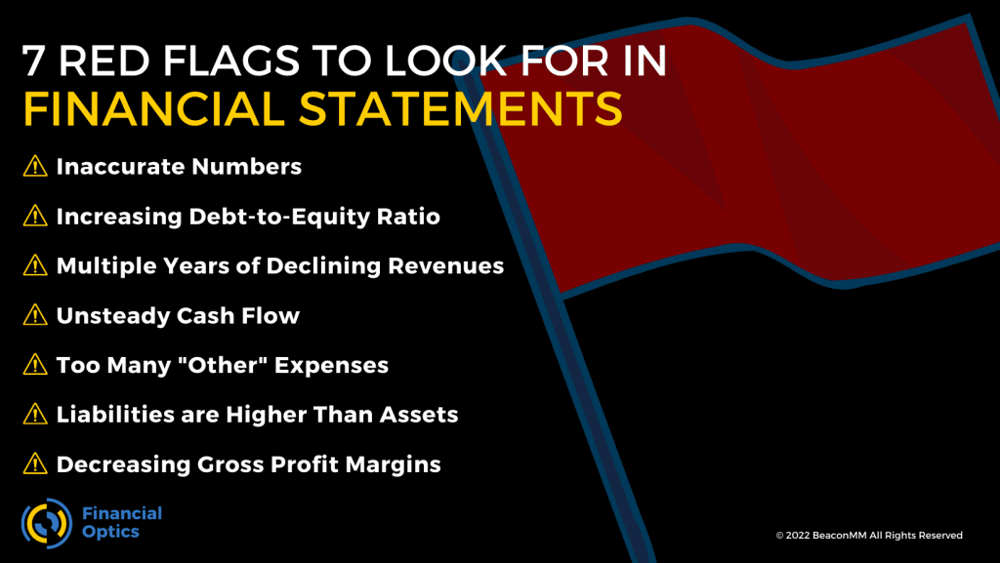

## Table of Contents

## What is an income statement?

An income statement is a financial report that shows how much money a company made and spent over a specific period, usually a year or a quarter. It's like a summary that tells you if the company is making a profit or a loss. The statement starts with the total revenue, which is all the money the company earned from selling its products or services. Then, it subtracts the costs of running the business, like the cost of goods sold, which are the expenses directly tied to making the products.

After subtracting the cost of goods sold from the revenue, you get the gross profit. The income statement then lists other expenses, like salaries, rent, and utilities, which are called operating expenses. These are subtracted from the gross profit to find the operating profit. If the company has other incomes or expenses, like interest or taxes, these are also included. The final number on the income statement is the net income, which shows the company's profit or loss after all expenses are accounted for. This statement is crucial for investors and managers to understand the financial health of the business.

## Why are red flags important in income statements?

Red flags in income statements are important because they can show problems that might hurt a company's money situation. If you see a red flag, it means you need to look closer at the numbers. For example, if a company's costs are going up much faster than its sales, that's a red flag. It might mean the company is spending too much and not making enough money to cover those costs.

Another reason red flags are important is that they help investors and managers make smart choices. If they see a red flag, they can ask more questions and maybe find out about issues before they get worse. For instance, if a company's profits are going down every year, that's a red flag. It might mean the company is losing its edge in the market, and investors might want to think twice before putting more money into it. By paying attention to these red flags, people can make better decisions and keep the company's finances healthy.

## What are common red flags beginners should look for in an income statement?

When you're new to reading income statements, there are a few common red flags you should keep an eye out for. One big one is when a company's expenses are growing faster than its revenue. This can mean the company is spending too much money and not making enough to cover those costs. It's like if you were spending more money on toys than you were getting from your allowance – eventually, you'd run out of money. Another red flag is when a company's profits are going down over time. If the company used to make a lot of profit but now it's making less and less, it might be losing customers or facing tougher competition.

Another thing to watch out for is if a company's revenue is going up, but its profits are going down. This can happen if the company is selling more products but having to spend a lot more to make them, or if it's selling products at lower prices to get more sales. It's like if you sold more lemonade but had to buy more lemons at a higher price, so you ended up making less money overall. Lastly, be careful if a company has a lot of one-time gains or losses. These can make the income statement look better or worse than it really is, so you need to look at the regular, ongoing parts of the business to get a true picture of how it's doing.

## How can irregularities in revenue recognition be identified?

Irregularities in revenue recognition can be spotted by looking at how and when a company says it made its money. If a company suddenly reports a big jump in revenue that doesn't match what's happening in the market or with its competitors, that's a sign something might be off. For example, if everyone else in the industry is struggling but one company says its sales are way up, you should check closer. Another way to spot issues is by looking at the timing of when revenue is recorded. If a company is recognizing revenue before it actually delivers products or services, or if it's pushing revenue into different time periods to make its numbers look better, those are red flags.

You can also look at the company's contracts and agreements to see if they match up with how revenue is being reported. If a company is recognizing all the money from a long-term contract right away instead of spreading it out over time, that's a problem. Checking the notes in the financial statements can help too. Companies often explain their accounting methods there, so if the explanations don't make sense or seem to change a lot, it might mean they're trying to hide something. By paying attention to these signs, you can catch irregularities in revenue recognition and get a clearer picture of a company's true financial health.

## What role do unusual expenses play as red flags?

Unusual expenses can be a big red flag on an income statement. These are costs that don't happen every day and can make the company's numbers look worse than they normally are. For example, if a company has to pay a lot of money because of a lawsuit or because it had to close down a factory, those are unusual expenses. When you see these, it's important to understand why they happened and if they will keep happening. If a company keeps having unusual expenses, it might mean there are bigger problems that need to be fixed.

Looking at unusual expenses helps you see if a company's financial troubles are just a one-time thing or part of a bigger issue. If the unusual expenses are just a one-time event, the company might still be doing okay overall. But if these expenses keep showing up, it could mean the company is not managing its money well or facing ongoing challenges. By keeping an eye on these unusual costs, you can get a better idea of whether the company's financial health is really as bad as it looks on the income statement.

## How can changes in accounting policies signal potential issues?

Changes in accounting policies can be a sign that a company might be trying to make its financial numbers look better or worse than they really are. When a company changes how it records money coming in or going out, it's important to understand why. If the change makes the company's profits look a lot better all of a sudden, it might be trying to hide problems or make things look good for investors. This is like if you changed the rules of a game to make it easier for you to win – it might not be fair.

You can spot these changes by reading the notes in the company's financial reports. These notes explain why the company made the change and how it affects the numbers. If the explanation doesn't make sense or if the change seems to happen at a time when the company needs to show better results, that's a red flag. It's important to look at the whole picture and not just the numbers on the income statement to make sure you understand what's really going on with the company's money.

## What are the implications of inconsistent gross margins?

Inconsistent gross margins can be a warning sign that something might be wrong with a company's business. Gross margin is the money a company makes after it pays for the stuff it sells. If this number keeps changing a lot, it could mean the company is having trouble keeping its costs down or it's having to sell its products at different prices. This can happen if the company is facing more competition, or if the cost of making the products is going up and down a lot. When you see big changes in gross margins, it's a good idea to look closer to see what's causing them.

If a company's gross margins are all over the place, it can make it hard for people to trust the company's financial health. Investors and managers like to see steady numbers because it shows the company is in control of its business. If the gross margins are bouncing around, it might mean the company is not doing a good job at managing its costs or setting its prices. This can make investors worried and might make them think twice about putting money into the company. So, keeping an eye on gross margins and understanding why they change can help you figure out if a company is doing well or if there are problems that need to be fixed.

## How can one detect aggressive income manipulation techniques?

Aggressive income manipulation happens when a company tries to make its money numbers look better than they really are. You can spot this by looking for big changes in how the company says it makes money. If a company suddenly reports a lot more money coming in than before, but nothing else has changed, that's a warning sign. Also, watch out for when a company starts using different ways to count its money, especially if it makes the numbers look a lot better. If the company's explanations for these changes don't make sense or seem fishy, it might be trying to hide something.

Another way to detect aggressive income manipulation is by looking at the company's expenses. If a company suddenly has a lot fewer costs than before, or if it keeps moving big expenses to different times to make its profits look better, that's another red flag. Checking the notes in the company's financial reports can help too. If the notes are hard to understand or if the company keeps changing how it explains its numbers, it might be trying to trick people. By paying attention to these signs, you can figure out if a company is playing fair with its money or if it's trying to pull a fast one.

## What advanced metrics should experts use to spot red flags in income statements?

Experts can use advanced metrics like the EBITDA margin to spot red flags in income statements. EBITDA stands for Earnings Before Interest, Taxes, Depreciation, and Amortization. It's a way to look at a company's profit without some of the usual costs. If this margin is going up and down a lot, it might mean the company is having trouble keeping its profits steady. Another useful metric is the operating cash flow to net income ratio. This tells you if the money the company says it made matches up with the actual cash it has. If this ratio is way off, it could mean the company is using tricks to make its profits look better than they really are.

Another important metric to watch is the quality of earnings ratio. This compares the company's net income to its cash flow from operations. If this ratio is low, it might mean the company's profits are not as good as they look because they're not backed up by real cash. Experts also look at the days sales outstanding (DSO), which shows how long it takes for the company to get paid for what it sells. If this number is going up, it could be a sign that the company is having trouble collecting money from its customers, which can hurt its finances. By using these advanced metrics, experts can get a deeper understanding of a company's financial health and spot red flags that might not be obvious at first glance.

## How do industry-specific benchmarks help in identifying red flags?

Industry-specific benchmarks are numbers that show what's normal for companies in the same kind of business. When you compare a company's numbers to these benchmarks, you can see if something looks off. For example, if most companies in the same industry have a profit margin of around 10%, but one company's profit margin is only 2%, that's a red flag. It might mean the company is not doing as well as others in its industry or it's facing problems that others aren't.

Using these benchmarks helps you understand if a company's financial troubles are because of its own problems or if it's something affecting the whole industry. If a company's numbers are way different from the industry average, it's a sign to look closer. Maybe the company is doing something wrong, or maybe it's just trying to do things differently. Either way, industry benchmarks give you a good starting point to spot red flags and figure out what's going on.

## What are the legal and regulatory considerations related to red flags in income statements?

When a company's income statement shows red flags, there are laws and rules that need to be followed. These laws are there to make sure companies are honest about their money. For example, the Securities and Exchange Commission (SEC) in the United States has rules that companies must follow when they report their finances. If a company tries to hide problems or make its numbers look better than they really are, it could be breaking the law. This can lead to big fines, lawsuits, or even criminal charges for the people running the company.

Regulators and auditors also play a big role in spotting red flags. They check the company's numbers to make sure everything is correct. If they find something fishy, they can ask the company to explain or even start an investigation. It's important for companies to be open about any red flags and fix any issues quickly. If they don't, they could face serious consequences from regulators, lose the trust of investors, and damage their reputation.

## How can data analytics be utilized to uncover subtle red flags in large datasets?

Data analytics can help find hidden red flags in big sets of numbers by looking for patterns that are hard to see just by looking at the numbers yourself. For example, if you use special computer programs, you can find small changes in how a company makes money or spends it over time. These programs can look at thousands of numbers quickly and find things that might not seem important at first but could be signs of bigger problems. By using these tools, you can spot if a company is doing things differently than it used to, or if it's not following the usual patterns for its industry.

Once you find these patterns, you can dig deeper to see if there's a real problem. For instance, if the computer program shows that a company's costs are going up faster than its money coming in, you can check to see why that's happening. Maybe the company is spending too much, or maybe it's trying to hide something. By using data analytics, you can catch these subtle signs early and make sure the company is being honest about its money. This helps investors and managers make better decisions and keep the company's finances healthy.

## What is the key to understanding financial statements?

Financial statements are fundamental resources used by investors, analysts, and stakeholders to evaluate a company’s financial health and performance. Among the various financial statements, the income statement holds particular significance. It provides a comprehensive overview of a company's revenues, expenses, and profits over a designated accounting period, typically quarterly or annually. This document is essential for assessing a company’s operational efficiency and profitability.

The income statement, also known as the profit and loss statement, is structured to reflect the company’s financial activities during the period. It primarily consists of the following components:

1. **Revenues**: This section records all income generated from normal business operations, typically from sales of products or services. It's crucial that the recorded revenue reflects actual sales transactions to ensure the reliability of financial reporting.

2. **Cost of Goods Sold (COGS)**: COGS represents the direct costs attributable to the production of goods or services sold by the company. It includes expenses such as raw materials, labor costs, and manufacturing expenses. The relationship between revenue and COGS is a key indicator of a company’s gross profit margin.

3. **Gross Profit**: This metric is calculated by subtracting COGS from total revenue. Gross profit provides insight into the core profitability of the company’s primary business activities. The formula is:
$$
   \text{Gross Profit} = \text{Total Revenue} - \text{Cost of Goods Sold}

$$

4. **Operating Expenses**: These are costs incurred during regular business operations, not including COGS. Operating expenses often encompass selling, general and administrative expenses (SG&A), research and development (R&D), and other overhead costs. Analyzing operating expenses can reveal how well a company controls its costs.

5. **Operating Income**: This figure represents the profit realized from regular business operations. Operating income is derived by subtracting operating expenses from gross profit. It is an important indicator of a company’s earning potential from its core operations. The formula is:
$$
   \text{Operating Income} = \text{Gross Profit} - \text{Operating Expenses}

$$

6. **Net Income**: Net income signifies the total profit of a company after deducting all expenses, taxes, and costs, including non-operating expenses such as interest and taxes. Net income provides stakeholders with a clear view of the company’s overall profitability. It is calculated by:
$$
   \text{Net Income} = \text{Operating Income} + \text{Other Income} - \text{Other Expenses} - \text{Taxes}

$$

Comprehending each component of the income statement is indispensable for performing accurate financial analysis. It aids investors and analysts in making informed decisions by highlighting the financial performance and operational effectiveness of a company. Proper understanding of income statements can reveal insights into revenue trends, cost management, and overall financial strategy, serving as a crucial tool for predicting future financial performance and guiding investment decisions.

## References & Further Reading

[1]: Schilit, H. M., & Perler, J. (2010). ["Financial Shenanigans: How to Detect Accounting Gimmicks and Fraud in Financial Reports"](https://www.amazon.com/Financial-Shenanigans-Fourth-Accounting-Gimmicks/dp/126011726X). McGraw-Hill Education.

[2]: Healy, P. M., & Wahlen, J. M. (1999). ["A Review of the Earnings Management Literature and Its Implications for Standard Setting."](https://papers.ssrn.com/sol3/papers.cfm?abstract_id=156445) Management Science, 43(3), 365-400.

[3]: Dechow, P., Ge, W., & Schrand, C. (2010). ["Understanding Earnings Quality: A Review of the Proxies, Their Determinants and Their Consequences."](https://www.sciencedirect.com/science/article/pii/S0165410110000339) Journal of Accounting and Economics, 50(2-3), 344-401.

[4]: Beneish, M. D. (1999). ["The Detection of Earnings Manipulation."](https://www.researchgate.net/publication/252059255_The_Detection_of_Earnings_Manipulation) Financial Analysts Journal, 55(5), 24-36.

[5]: Lo, A. W. (2017). ["Adaptive Markets: Financial Evolution at the Speed of Thought"](https://www.jstor.org/stable/j.ctvc77k3n). Princeton University Press.

[6]: ["Principles of Corporate Finance"](https://www.mheducation.com/highered/product/Principles-of-Corporate-Finance-Brealey.html) by Richard A. Brealey, Stewart C. Myers, and Franklin Allen.

[7]: Dechow, P. M., & Skinner, D. J. (2000). ["Earnings Management: Reconciling the Views of Accounting Academics, Practitioners, and Regulators."](https://cpb-us-w2.wpmucdn.com/u.osu.edu/dist/8/36875/files/2016/12/Dechow-Skinner_Earn_Mgmt-19dl84z.pdf) Accounting Horizons, 14(2), 235-250.