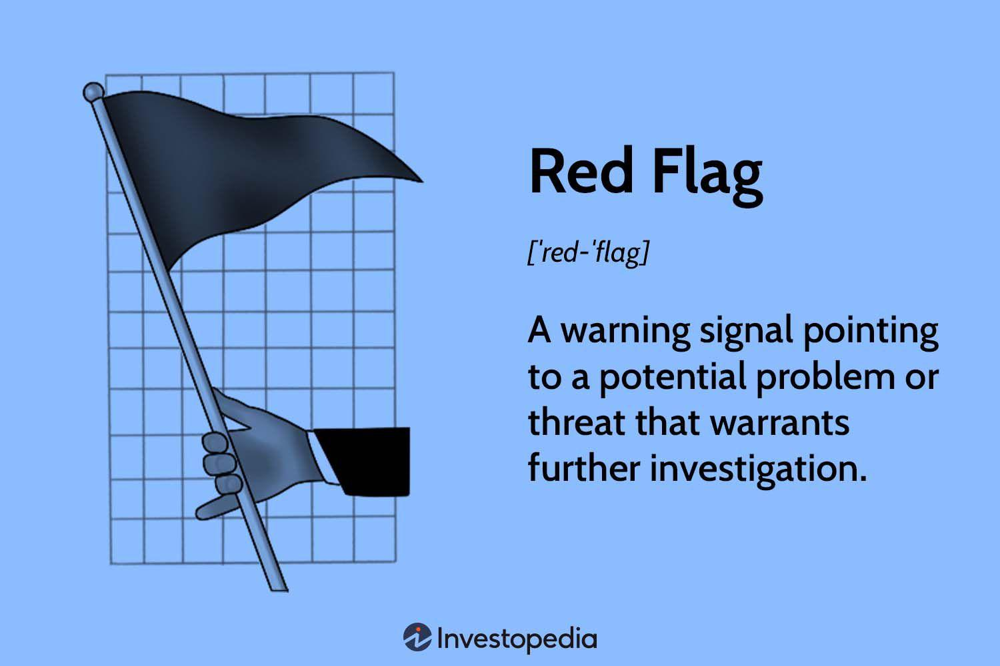

Algorithmic trading has revolutionized financial markets by offering an efficient approach to trading that minimizes human involvement. Through the use of sophisticated algorithms and high-speed computing, investors can now react almost instantaneously to market changes, creating opportunities that were largely inaccessible with traditional trading methods. This technological advancement enables market participants to execute orders with precision and at lightning speed, trading across different markets and asset classes with ease.

Despite its many advantages, algorithmic trading is not without risks. The allure of automated trading systems often obscures the potential pitfalls that can be detrimental to investors. It is crucial for traders to be aware of these risks and exercise caution. Over-reliance on automated systems without rigorous validation can lead to unexpected financial outcomes. While algorithms can process vast amounts of data, their performance is heavily dependent on the quality of the underlying models and the assumptions made during their development.



This article serves as a guide for investors, focusing on identifying financial warning signs associated with algorithmic trading. By examining common pitfalls, it emphasizes the importance of due diligence. We aim to provide practical strategies that can help investors avoid costly mistakes. Allocating time and resources to thorough research and understanding market dynamics is essential for leveraging the full potential of algorithmic trading while safeguarding against its inherent risks.

## Table of Contents

## Understanding Algorithmic Trading

Algorithmic trading refers to the process of executing financial transactions using pre-defined and automated trading instructions. These instructions are often based on variables such as timing, price, and [volume](/wiki/volume-trading-strategy). By leveraging programming and algorithms, investors can execute orders at speeds and frequencies that would be impossible for a human trader to achieve. 

One of the significant advantages of algorithmic trading is its ability to operate across multiple markets and asset classes with remarkable efficiency. By automating the decision-making process, it allows for rapid execution of trades, which is particularly beneficial in fast-moving markets where timing is crucial. This efficiency helps in optimizing the execution process by minimizing the impact of human error and emotional biases, potentially reducing transaction costs.

Algorithmic trading also facilitates the use of various trading strategies, including arbitrage, trend-following, and market-making. For instance, the arbitrage strategy capitalizes on price discrepancies of similar financial instruments across different markets. Similarly, market-making algorithms provide [liquidity](/wiki/liquidity-risk-premium) by buying and selling in markets to earn the bid-ask spread.

However, it's crucial for investors to grasp the complexities and risks involved with [algorithmic trading](/wiki/algorithmic-trading). The inherent reliance on technology and data quality means that errors in coding or data input can result in substantial financial losses. Moreover, the widespread adoption of algorithmic trading has increased market competition, potentially diminishing the profitability of commonly used strategies over time. Additionally, the algorithms must be well-tested under various market conditions to ensure their efficacy and robustness, as they might not perform as expected in live trading compared to controlled simulations. 

Understanding these aspects is vital for leveraging the advantages of algorithmic trading while mitigating its potential pitfalls.

## Common Red Flags in Algorithmic Trading

Algorithmic trading, while offering efficiency and potential profitability, is fraught with potential pitfalls that traders must be vigilant to identify and avoid. One of the primary red flags is the lack of proper [backtesting](/wiki/backtesting). Backtesting involves simulating a trading strategy using historical data to evaluate its performance. However, excessive reliance on historical data without robust stress testing can lead to significant financial losses. It's imperative to ensure that backtesting encompasses a variety of market conditions, including rare events or market anomalies, to validate the strategy's resilience. Stress testing complements backtesting by introducing hypothetical scenarios and extreme market conditions to ensure strategy endurance.

Another common red flag is overcomplexity in trading strategies. While complex algorithms may appear sophisticated, they often suffer from overfitting—a scenario where the strategy performs well on past data but fails to deliver in real-world scenarios. Overfitting occurs when a model captures noise rather than the underlying market signal, making it unreliable. Traders should aim for simplicity in their models and implement regular validations to ensure robustness and adaptability in live markets.

High-frequency trading ([HFT](/wiki/high-frequency-trading-strategies)) temptation is another potential trap. HFT involves executing numerous orders at high speeds, capitalizing on small price discrepancies. However, engaging in HFT without the requisite infrastructure, such as low-latency data feeds and co-located servers, can be detrimental. The competitive nature of HFT means that only a small margin of error exists, and inadequate infrastructure can lead to slippages and financial losses. Traders considering HFT should ensure they have the appropriate technological resources and expertise to support ultra-fast trading activities.

## Financial Warning Signs

Promises of high returns with minimal risk in algorithmic trading often signal fraudulent schemes. These assurances are appealing but frequently unrealistic, considering the inherent uncertainties and fluctuations in financial markets. Legitimate investment opportunities do not come with guarantees, as market dynamics are unpredictable, and various factors can impact performance. Therefore, any promise of assured profits should be scrutinized carefully, as it likely poses a substantial risk of loss.

Lack of transparency in the operational logic and performance metrics of an algorithm is another significant hazard. Investors should have access to a clear and understandable explanation of how an algorithm functions, including details of the underlying strategies and metrics that track its performance. A failure to provide this information can indicate that the algorithms are either too complex to be vetted or, worse, designed to deceive. Transparency in algorithmic operations ensures that investors are aware of the mechanisms driving their investments and can make informed decisions.

Ignoring risk management is a critical oversight in algorithmic trading. A comprehensive risk management strategy is essential for protecting against potential losses and ensuring long-term profitability. This includes mechanisms like stop-loss orders, which limit the amount an investor can lose on a particular trade, and conservative position sizing, which involves limiting the amount invested in any single market position to minimize risk exposure. The absence of a robust risk management plan exposes investors to significant financial jeopardy, as even highly sophisticated algorithms are not immune to unforeseen market events or errors in execution.

Overall, recognizing these financial warning signs is crucial for investors looking to engage in algorithmic trading. A vigilant approach, characterized by skepticism towards guaranteed returns, a demand for transparency, and a commitment to sound risk management practices, is vital to avoid potential pitfalls and maximize the benefits of algorithmic trading.

## Due Diligence and Risk Management

In algorithmic trading, due diligence and risk management are crucial to ensure successful trading outcomes. Rigorous backtesting stands as a cornerstone of due diligence, allowing traders to simulate algorithm performance across varying market conditions. This process helps ascertain the algorithm's reliability and robustness before deploying it in live trading. By examining historical market data, traders can identify potential weaknesses in their algorithms and make necessary adjustments to enhance performance.

Risk management is an indispensable aspect of algorithmic trading, crucial for mitigating potential losses. Implementing stop-loss orders is a widely recommended strategy. These orders automatically execute a trade once a security reaches a predetermined price, thereby limiting potential losses. For instance, if a trader sets a stop-loss order at 5% below the purchase price, the algorithm will sell the asset once it depreciates by 5%.

Another effective risk management technique is conservative position sizing, which involves determining the appropriate amount of capital to invest in each trade. This method minimizes exposure to any single investment, thereby spreading risk across the trading portfolio. A commonly used formula for position sizing is the Kelly Criterion, which helps optimize the fraction of capital allocated to each trade:

$$
f^* = \frac{bp - q}{b}
$$

where:
- $f^*$ is the fraction of the capital to bet,
- $b$ is the odds received on the wager (e.g., a 2:1 return translates to b=2),
- $p$ is the probability of winning,
- $q$ is the probability of losing (q=1-p).

Regularly reviewing and updating algorithms is essential to adapt to changing market dynamics. Market conditions are inherently volatile and can evolve based on various factors, such as economic indicators, geopolitical events, or technological advancements. By frequently analyzing algorithm performance and making necessary updates, traders can ensure alignment with current market conditions, thus maintaining the effectiveness of their trading strategies. Incorporating [machine learning](/wiki/machine-learning) or [artificial intelligence](/wiki/ai-artificial-intelligence) methods, such as [reinforcement learning](/wiki/reinforcement-learning), can further enhance the adaptability of trading algorithms to dynamic market environments.

Furthermore, documenting every phase of the algorithmic trading process, from backtesting to live deployment, is vital. Detailed documentation not only aids in identifying areas for improvement but also serves as a reference for future algorithm development. Through comprehensive due diligence and robust risk management practices, investors can significantly enhance their algorithmic trading ventures, potentially yielding sustainable returns while minimizing exposure to financial risks.

## Diversification and Strategy Adaptability

Diversification and adapting trading strategies are crucial components in managing the risks associated with algorithmic trading. Relying on a single trading strategy can be precarious, as markets are inherently volatile and unpredictable. A diversified approach, employing multiple strategies across different assets and markets, can reduce the dependence on any one method and help smooth out returns.

The unpredictability of financial markets necessitates flexibility in trading strategies. Markets may not always behave as they have historically; thus, it is important for investors to prepare for evolving conditions. By maintaining a variety of strategies and adjusting them as needed, traders can better navigate shifting market environments. This adaptability ensures that the trading algorithm remains robust and effective over time.

Diversifying algorithms involves incorporating different styles, such as trend-following, mean-reversion, and [arbitrage](/wiki/arbitrage) strategies, to balance potential losses in one area with gains in another. This approach is akin to investing in a well-rounded portfolio, where the performance of individual investments may vary but the overall risk is minimized. For instance, in a Python-based trading system, one could employ various libraries and backtesting tools to continuously monitor and adjust their algorithms. Consider the following example of a simple diversification through code:

```python
import numpy as np

def trend_following_strategy(data):
    # Placeholder for a trend-following algorithm
    return np.mean(data) > data[-1]

def mean_reversion_strategy(data):
    # Placeholder for a mean-reversion algorithm
    return np.mean(data) < data[-1]

data = [100, 102, 104, 103, 101]  # Example market data

trend_signal = trend_following_strategy(data)
mean_reversion_signal = mean_reversion_strategy(data)

# Diversification by having multiple signals
overall_signal = trend_signal or mean_reversion_signal

if overall_signal:
    print("Proceed with trade!")
else:
    print("Hold position.")
```

This Python snippet demonstrates the application of two different strategies based on historical data and their combined signal for making trading decisions. By applying multiple strategies, investors can position themselves to capitalize on various market conditions and minimize potential risks associated with algorithms that may not perform well in certain scenarios.

Ultimately, diversification and strategy adaptability are pivotal in achieving sustained success in algorithmic trading. By crafting a versatile trading framework, investors can enhance their resilience against market [volatility](/wiki/volatility-trading-strategies), paving the way for more consistent returns over time.

## Conclusion

Algorithmic trading presents a landscape rich with opportunities for investors aiming to capitalize on market movements with precision and efficiency. The promise of executing trades at lightning speed and the capability to manage vast datasets makes it an attractive option. However, this advanced form of trading is not without its inherent risks. As with any investment method, vigilance is crucial.

Recognizing potential red flags is an essential aspect of mitigating risks associated with algorithmic trading. Investors should be wary of unrealistic promises of high returns with minimal risk, as these often signal underlying fraudulent schemes. Additionally, the complexity and opacity of certain algorithmic strategies can mask potential weaknesses or risks. Lack of transparency in understanding the logic and performance metrics of trading algorithms can leave investors vulnerable.

Proper safeguards and due diligence are key components of a successful algorithmic trading strategy. Implementing comprehensive risk management practices, such as establishing stop-loss levels and diversifying trading portfolios, can help mitigate potential losses. Furthermore, regularly updating and adapting algorithms to accommodate shifting market conditions is crucial for sustaining their effectiveness.

Investors who approach algorithmic trading with a keen sense of caution and a willingness to prepare extensively can navigate the potential pitfalls effectively. By maintaining a balanced view of both the opportunities and challenges posed by algorithmic trading, investors stand to maximize their benefits while minimizing the associated risks. Such a prepared stance in algorithmic trading not only leverages the technology's full potential but also aligns with prudent investment practices.

## References & Further Reading

[1]: Bergstra, J., Bardenet, R., Bengio, Y., & Kégl, B. (2011). ["Algorithms for Hyper-Parameter Optimization."](https://dl.acm.org/doi/10.5555/2986459.2986743) Advances in Neural Information Processing Systems 24.

[2]: ["Advances in Financial Machine Learning"](https://www.amazon.com/Advances-Financial-Machine-Learning-Marcos/dp/1119482089) by Marcos Lopez de Prado

[3]: ["Evidence-Based Technical Analysis: Applying the Scientific Method and Statistical Inference to Trading Signals"](https://www.amazon.com/Evidence-Based-Technical-Analysis-Scientific-Statistical/dp/0470008741) by David Aronson

[4]: ["Machine Learning for Algorithmic Trading"](https://github.com/stefan-jansen/machine-learning-for-trading) by Stefan Jansen

[5]: ["Quantitative Trading: How to Build Your Own Algorithmic Trading Business"](https://www.amazon.com/Quantitative-Trading-Build-Algorithmic-Business/dp/1119800064) by Ernest P. Chan