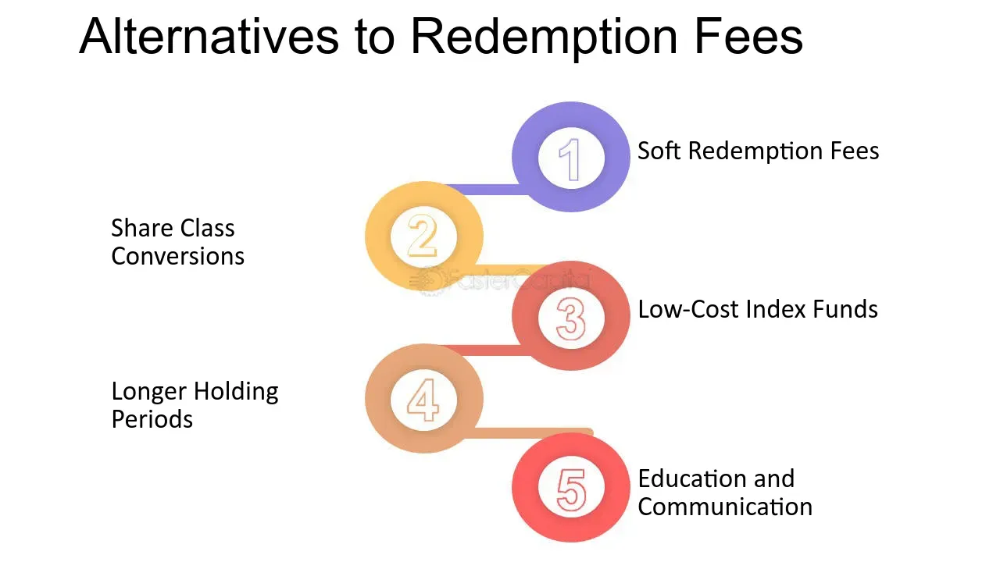

## Table of Contents

## What is a redemption fee?

A redemption fee is a charge that some investment funds put on when you take your money out of the fund. This fee is meant to stop people from taking their money out too soon. It helps the fund keep enough money to run smoothly and invest properly.

These fees are usually a small percentage of the money you are taking out. They are more common in mutual funds and some exchange-traded funds (ETFs). The fee goes back into the fund to help cover costs and keep the fund stable for other investors.

## Why do mutual funds and other investment vehicles charge redemption fees?

Mutual funds and other investment vehicles charge redemption fees to discourage investors from pulling their money out too quickly. When lots of people take their money out at the same time, it can hurt the fund. The fund needs to keep enough money to run properly and make good investments. By charging a redemption fee, the fund can make sure it has enough money to keep going strong.

These fees also help cover the costs that come with people taking their money out. When someone redeems their shares, the fund might need to sell some of its investments to give the money back. This can be expensive and can affect the fund's performance. The redemption fee helps pay for these costs and keeps the fund stable for everyone else who is still invested.

## How does a redemption fee benefit the investor?

A redemption fee can actually help investors by keeping the fund stable. When lots of people take their money out at the same time, it can make the fund's value go down. By charging a redemption fee, the fund can stop this from happening too much. This means the fund can keep running smoothly and keep its value up, which is good for everyone who still has their money in the fund.

Also, the redemption fee helps cover the costs of people taking their money out. When someone wants their money back, the fund might need to sell some of its investments. This can be expensive and can hurt the fund's performance. The redemption fee helps pay for these costs, so the fund doesn't lose as much money. This way, the fund can keep doing well, which is better for all the investors.

## What are the typical rates for redemption fees?

Redemption fees usually range from 1% to 2% of the amount you want to take out of the fund. This means if you take out $1,000, you might have to pay between $10 and $20 as a fee. The exact rate can be different for each fund, so it's a good idea to check the fund's rules before you invest.

These fees are meant to stop people from taking their money out too soon. By keeping the fee at a small percentage, the fund can still let people take out their money when they need to, but it also helps the fund stay stable. This way, everyone who keeps their money in the fund can benefit from its good performance.

## How long is the redemption fee period usually?

The redemption fee period is usually between 30 days and one year. This means if you take your money out of the fund within this time, you might have to pay a fee. The exact time can be different for each fund, so it's good to check the rules before you invest.

The reason for having a redemption fee period is to stop people from taking their money out too soon. If lots of people take their money out at the same time, it can hurt the fund. By having a fee for a certain time, the fund can stay stable and keep doing well for everyone who keeps their money in it.

## Can redemption fees be avoided, and if so, how?

Yes, redemption fees can be avoided if you know the rules of the fund you're investing in. Many funds have a period where you have to pay a fee if you take your money out too soon. This period is usually between 30 days and one year. If you wait until after this period, you won't have to pay the fee.

To avoid the fee, you need to plan when you will take your money out. Look at the fund's rules to see how long the redemption fee period lasts. If you can keep your money in the fund until after this time, you can take it out without paying any extra fees. This way, you can save money and still get the benefits of the fund.

## What are the alternatives to redemption fees for managing fund liquidity?

One way to manage fund [liquidity](/wiki/liquidity-risk-premium) without redemption fees is to use a system called "swing pricing." This means the fund changes its price a bit when lots of people want to take their money out. By doing this, the fund can cover the costs of selling investments without charging a fee to the people taking their money out. This helps keep the fund stable and fair for everyone.

Another way is to have a "lock-up period." This means investors have to keep their money in the fund for a certain time before they can take it out. This stops people from taking their money out too soon and helps the fund stay stable. It's like a waiting period that gives the fund time to manage its money better.

Using these methods can help funds manage their money without needing to charge redemption fees. They keep the fund running smoothly and make sure everyone who invests can benefit from the fund's performance.

## How do redemption fees impact the overall performance of an investment?

Redemption fees can help the overall performance of an investment by keeping the fund stable. When lots of people want to take their money out at the same time, it can hurt the fund. The fund might need to sell some of its investments to give the money back, which can be expensive and lower the value of the fund. By charging a redemption fee, the fund can stop this from happening too much. This way, the fund can keep running smoothly and keep its value up, which is good for everyone who still has their money in the fund.

On the other hand, redemption fees can also affect the performance in a different way. If the fee is too high, it might make investors think twice before putting their money into the fund. Some people might not want to invest if they know they will have to pay a fee to take their money out. This can mean less money coming into the fund, which can make it harder for the fund to grow and do well. So, while redemption fees can help keep the fund stable, they need to be at the right level to not scare investors away.

## Are there any regulatory considerations or limits on redemption fees?

Yes, there are rules about redemption fees. In the United States, the Securities and Exchange Commission (SEC) has rules to make sure these fees are fair. The SEC says that redemption fees can be up to 2% of the money you take out, but only if you take it out within 7 days of putting it in. This rule helps stop people from taking their money out too quickly, which can hurt the fund.

Different countries might have different rules about redemption fees. It's important for fund managers to follow these rules so that the fees are fair and clear for everyone. By having these rules, investors can feel more sure about where they put their money, knowing that the fees are controlled and won't be too high.

## How do redemption fees compare to other types of fees in investment funds?

Redemption fees are just one kind of fee you might see in investment funds. They are different from other fees like management fees and sales charges. A redemption fee is a charge you pay when you take your money out of the fund too soon, usually within a certain time like 30 days to a year. This fee helps the fund stay stable by stopping lots of people from taking their money out at the same time.

Other common fees in investment funds include management fees and sales charges. Management fees are what you pay the fund manager for running the fund and making investment choices. These fees are usually a small percentage of the money you have in the fund and are taken out regularly, like every year. Sales charges, or loads, are fees you might pay when you buy or sell shares in the fund. There are different kinds of loads, like front-end loads, which you pay when you buy shares, and back-end loads, which you pay when you sell shares. Each of these fees has a different purpose and can affect how much money you end up with from your investment.

## What strategies can investors use to minimize the impact of redemption fees?

Investors can minimize the impact of redemption fees by understanding the rules of the fund they are investing in. Most funds have a redemption fee period, which is the time you have to wait before you can take your money out without paying a fee. This period can be anywhere from 30 days to a year. If you know how long this period is, you can plan to keep your money in the fund until after it ends. This way, you can take your money out without having to pay any extra fees.

Another strategy is to invest in funds that don't charge redemption fees or have shorter redemption fee periods. Some funds might not have these fees at all, or they might have a shorter time before you can take your money out without a fee. By choosing these funds, you can avoid or reduce the impact of redemption fees. It's always a good idea to read the fund's rules and ask questions before you invest, so you know what fees you might have to pay.

## How might future trends in the investment industry affect the use of redemption fees?

In the future, the investment industry might change how it uses redemption fees. As more people invest online and use apps to manage their money, funds might look for new ways to keep their money stable without charging these fees. Some funds might start using other methods, like swing pricing or lock-up periods, to manage when people take their money out. This could mean fewer funds charging redemption fees, as they find other ways to keep their money safe and stable.

Also, rules from places like the SEC might change. If regulators decide that redemption fees are too hard on investors, they might make new rules to limit these fees or find other ways to help funds stay stable. This could make redemption fees less common or smaller. As the investment world keeps changing, funds will need to find the right balance between keeping their money safe and making sure investors are happy with the fees they have to pay.

## What is the impact of fees on investment returns?

Investment fees are critical in determining the overall returns from mutual fund investments, primarily by impacting the compounding effect. The compounding effect, a powerful mechanism where the investment gains themselves generate additional earnings, can be significantly diminished by persistent fees. For instance, the formula for compound interest is:

$$
A = P \times \left(1 + \frac{r}{n}\right)^{nt}
$$

Where:
- $A$ is the amount of money accumulated after n years, including interest.
- $P$ is the principal investment amount.
- $r$ is the annual interest rate (decimal).
- $n$ is the number of times that interest is compounded per year.
- $t$ is the time the money is invested for in years.

Investment fees, typically expressed as a percentage, reduce the effective [interest rate](/wiki/interest-rate-trading-strategies) $r$. For example, if a mutual fund claims a nominal annual return of 8% but charges fees amounting to 2%, the effective rate $r$ becomes 6%. Over extended periods, this seemingly small difference can drastically lower end returns due to diminished compounding.

Investors are thus advised to diligently identify and compare both hidden and disclosed fees, outlined in mutual fund prospectuses. Such documents generally provide a comprehensive breakdown of fees such as management fees, distribution and service fees (12b-1), and other operational costs that may not be overtly stated. For instance, while an expense ratio provides a glimpse into the ongoing charges extracted from fund assets annually, potential hidden fees might not be as explicit but could include trading commissions that subtly erode returns.

Balancing cost and fund performance is essential for achieving long-term investment success. This involves scrutinizing funds with historically high returns relative to their fees. Lower-cost funds may offer less drag on returns; however, they need balanced comparison against performance metrics. The goal is to ensure the fee savings do not come at the expense of disproportionately lower returns.

An effective strategy may involve calculating a "net of fee" return to better understand a fund’s value after accounting for fees. Performing this analysis consistently allows investors to make more informed choices about where to allocate their capital. 

In summary, while fees may seem like a minor percentage at first glance, they can compound over time and substantially eat into an investor's portfolio returns. Understanding the broader implications of investment fees on compounding empowers investors to make informed decisions aimed at maximizing net returns.

## References & Further Reading

[1]: Sharpe, W. F. (2000). ["The Sharpe Ratio."](https://web.stanford.edu/~wfsharpe/art/sr/SR.htm) The Journal of Portfolio Management, 21(1), 49-58.

[2]: ["Mutual Fund Fees and Expenses"](https://www.nerdwallet.com/article/investing/mutual-fund-fees-what-investors-need-to-know), U.S. Securities and Exchange Commission (SEC).

[3]: Bogle, J. C. (1999). ["Common Sense on Mutual Funds: New Imperatives for the Intelligent Investor."](https://archive.org/details/commonsenseonmut0000bogl) John Wiley & Sons.

[4]: Poterba, J. M. & Shoven, J. B. (2002). ["Exchange-Traded Funds: A New Investment Option for Taxable Investors."](https://www.nber.org/papers/w8781) National Bureau of Economic Research.

[5]: ["Expense Ratio Definition."](https://www.investopedia.com/terms/e/expenseratio.asp) Investopedia.

[6]: Reinganum, M. R. (1981). ["Misspecification of capital asset pricing."](https://www.sciencedirect.com/science/article/pii/0304405X81900192) Journal of Financial Economics, 9(1), 19-46.

[7]: ["Mutual Fund Fees and Expenses"](https://www.fidelity.com/learning-center/investment-products/mutual-funds/fees-expenses) by Financial Industry Regulatory Authority (FINRA).