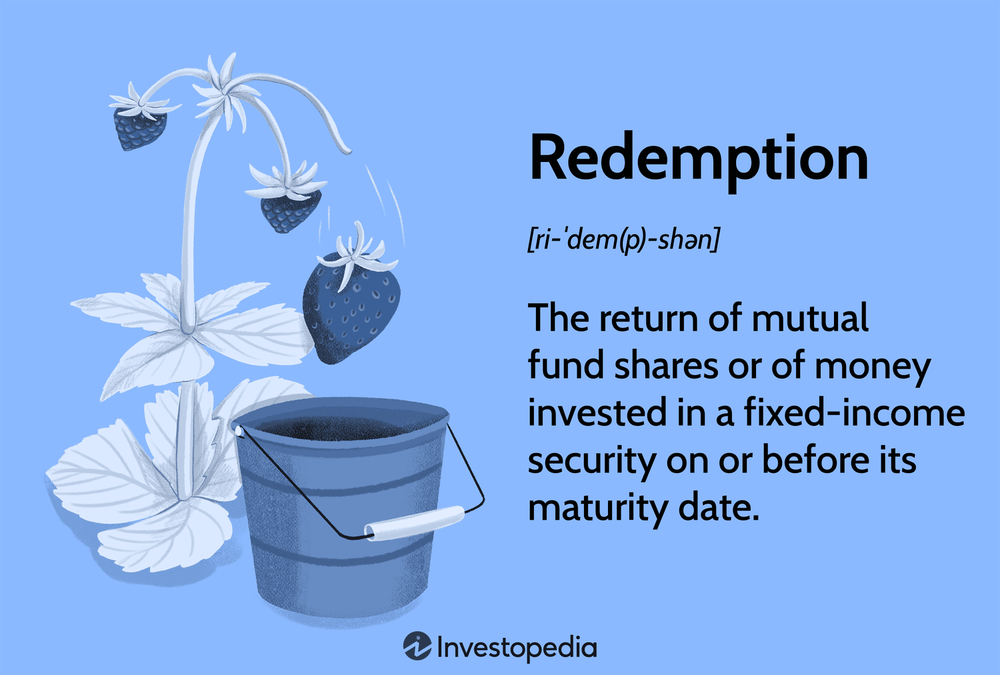

## Table of Contents

## What is redemption in the context of finance and business?

Redemption in finance and business refers to the act of paying back or buying back something. It often involves returning money to investors or repaying a debt. For example, when a company issues bonds, it might promise to redeem them at a certain date. This means the company will pay back the bondholders the amount they invested, plus any interest owed. Redemption can also happen with mutual funds, where investors can redeem their shares for cash based on the current value of the fund.

In a broader business context, redemption can relate to restoring a company's reputation or value after a negative event. If a business faces a scandal or financial loss, it might take steps to redeem itself in the eyes of the public and investors. This could involve new leadership, improved practices, or financial restructuring. The goal is to regain trust and improve the company's standing, showing that it has learned from past mistakes and is on a path to recovery.

## How does redemption work in investment funds like mutual funds?

In mutual funds, redemption is when an investor decides to sell their shares back to the fund. When you want your money back, you ask the fund to redeem your shares. The fund then gives you the value of your shares based on the current price, which is called the Net Asset Value (NAV). This process usually takes a few days to complete, and you might have to pay a small fee for redeeming your shares.

Mutual funds are designed to be easy to get in and out of, so redemption is a normal part of how they work. If many people want to redeem their shares at the same time, it can affect the fund's overall value. But the fund manager's job is to manage the money in a way that can handle these redemptions smoothly. This way, other investors are not negatively impacted by someone else's decision to take their money out.

## Can you explain the concept of bond redemption?

Bond redemption is when a bond reaches its maturity date and the issuer pays back the money they borrowed to the bondholder. When you buy a bond, you are lending money to the issuer, like a company or the government. The issuer agrees to pay you back the full amount, called the face value or principal, on a specific date in the future. This is the redemption date. They might also pay you interest along the way, which is called a coupon.

Sometimes, bonds can be redeemed before they reach their maturity date. This is called early redemption or calling the bond. The issuer might decide to do this if interest rates go down, so they can borrow money cheaper. When a bond is called early, the bondholder gets their money back, but they might not get as much interest as they expected. It's important for bondholders to know the terms of the bond, including when and how it can be redeemed, so they can plan their investments wisely.

## What are the tax implications of redemption for an investor?

When you redeem your investment, like selling your shares in a mutual fund or getting your money back from a bond, you might have to pay taxes on the money you get. If you made a profit, that profit is called a capital gain. You'll pay taxes on that gain. How much you pay depends on how long you held the investment. If you held it for more than a year, it's a long-term capital gain, and the tax rate is usually lower. If you held it for a year or less, it's a short-term capital gain, and you'll pay your regular income tax rate on it.

Sometimes, you might lose money on your investment when you redeem it. This is called a capital loss. You can use this loss to reduce the taxes you owe on other gains or even on your regular income, up to certain limits. It's important to keep good records of when you bought and sold your investments and how much you paid and received, so you can figure out your taxes correctly. If you're not sure about the tax rules, it's a good idea to talk to a tax professional.

## How does the redemption process differ between open-end and closed-end funds?

In open-end funds, redemption is easy and happens often. When you want to take your money out of an open-end fund, like a mutual fund, you can do it anytime. You just ask the fund to buy back your shares, and they give you the money based on the current value of the fund, which is called the Net Asset Value (NAV). Open-end funds are set up to handle people coming in and out all the time, so they usually have enough cash to pay you back quickly. If many people want their money back at the same time, the fund might need to sell some of its investments to pay everyone, but this is normal for these funds.

Closed-end funds work differently. When you buy into a closed-end fund, you're buying shares that trade on a stock exchange, just like stocks. If you want to get your money out, you don't ask the fund to buy back your shares. Instead, you sell your shares to another investor on the stock exchange. The price you get depends on what other investors are willing to pay, which might be more or less than the actual value of the fund's investments. This means redemption in closed-end funds can be less predictable and might take longer than in open-end funds.

## What role does redemption play in the lifecycle of a business?

Redemption plays an important role in the lifecycle of a business, especially when it comes to managing finances and maintaining trust. When a company issues bonds or other debt instruments, it promises to pay back the money it borrowed at a certain time. This is called redemption. By fulfilling this promise, the company shows that it can manage its money well and keep its commitments. This builds trust with investors and makes it easier for the company to borrow money in the future. If a company fails to redeem its bonds, it can hurt its reputation and make it harder to get funding.

Redemption also matters when a business faces challenges or makes mistakes. If a company goes through a tough time, like a financial loss or a scandal, it might need to take steps to redeem itself. This could mean changing how it does things, bringing in new leaders, or fixing its finances. By doing this, the company tries to show that it has learned from its mistakes and is working to get better. This process of redemption can help the business regain the trust of customers, employees, and investors, which is crucial for its long-term success.

## How can redemption strategies impact a company's financial health?

Redemption strategies can have a big impact on a company's financial health. When a company redeems its bonds or other debts, it shows that it can manage its money well and pay back what it owes. This makes investors and lenders trust the company more. When people trust the company, it can borrow money more easily and at lower interest rates. This helps the company grow and stay financially healthy. But if the company can't redeem its debts on time, it might have to pay more money in interest or even go bankrupt. This can hurt the company's finances and make it hard to get money in the future.

Redemption also matters when a company needs to fix its reputation after a problem. If a company loses money or gets into a scandal, it might need to change how it does things to win back trust. This could mean getting new leaders, fixing its finances, or improving how it treats customers and employees. Doing this well can help the company's finances by bringing back customers and investors. But if the company doesn't do a good job at redeeming itself, it might lose even more money and have a hard time recovering. So, good redemption strategies are important for keeping a company financially strong.

## What are the legal considerations a company must address during redemption?

When a company redeems its bonds or other debts, it has to follow certain legal rules. These rules are written in the bond agreement or the company's legal documents. The company must make sure it has enough money to pay back the investors on time. If it doesn't, the investors can take legal action against the company. The company also needs to tell investors ahead of time if it plans to redeem the bonds early, as this is often part of the agreement. Not following these rules can lead to lawsuits and damage the company's reputation.

Sometimes, a company might need to redeem itself after a problem, like a financial loss or a scandal. In this case, the company must follow laws about how it communicates with the public and its investors. It needs to be honest and clear about what went wrong and what it's doing to fix it. If the company doesn't follow these rules, it could face fines or more legal trouble. By following the law carefully, the company can work on rebuilding trust and improving its situation without making things worse.

## How do redemption policies affect investor behavior and market dynamics?

Redemption policies can really change how investors act and how the market works. When a company has clear and fair rules about when and how it will pay back investors, people feel more confident about putting their money into that company. They know they can get their money back when they need it, so they might be more likely to invest. But if the rules are confusing or if the company doesn't follow them, investors might pull their money out quickly, causing the company's stock price to drop. This can make the market go up and down a lot, which is called [volatility](/wiki/volatility-trading-strategies).

Redemption policies also affect how investors plan their investments. If a company says it will pay back its bonds early, investors might decide to put their money into those bonds to get their money back sooner. But if they think the company might not be able to pay back the money, they might sell their bonds to someone else or avoid buying them in the first place. This can change how much people are willing to pay for the bonds and how easy it is for the company to borrow money. In the end, clear and fair redemption policies help keep the market stable and help investors make smart choices.

## What advanced redemption strategies can be used to optimize portfolio management?

One advanced redemption strategy to optimize portfolio management is using a laddering approach with bonds. This means buying bonds that mature at different times. When each bond reaches its redemption date, you get your money back and can reinvest it in new bonds. This helps you spread out the risk of [interest rate](/wiki/interest-rate-trading-strategies) changes and gives you a steady flow of money. If interest rates go up, you can reinvest the money from redeemed bonds at the new, higher rate. If rates go down, you still have some bonds [earning](/wiki/earning-announcement) the old, higher rate. This way, you keep your portfolio balanced and can take advantage of market changes.

Another strategy is to use a systematic withdrawal plan from mutual funds. Instead of taking all your money out at once, you set up a plan to redeem a certain amount regularly, like every month or every quarter. This can help you manage your money better and avoid selling your investments when the market is down. By taking out a little bit at a time, you can reduce the risk of losing money and make your investments last longer. This approach is especially useful for people who are retired or need a steady income from their investments.

## How do global economic factors influence redemption decisions in multinational corporations?

Global economic factors can really affect how multinational corporations decide to redeem their bonds or other debts. If the world economy is doing well, interest rates might go up. This could make a company want to redeem its bonds early so it can borrow money again at the new, lower rates. But if the economy is not doing well, interest rates might go down. In this case, a company might hold off on redeeming its bonds because it can keep earning the higher interest rate it promised to pay when it issued the bonds. Also, if there's a lot of uncertainty in the world, like political problems or trade wars, a company might be more careful about when and how it redeems its debts.

Another thing to think about is how different countries' economies are doing. A multinational corporation has to look at what's happening in each country where it does business. If one country's economy is growing fast, the company might want to redeem its debts there to take advantage of new opportunities. But if another country's economy is struggling, the company might wait to redeem its debts there until things get better. This way, the company can manage its money carefully and make sure it's ready for whatever happens in the global market.

## What are the emerging trends in redemption practices within the fintech sector?

In the fintech sector, one big trend in redemption practices is the use of digital platforms to make it easier for people to get their money back from investments. Fintech companies are creating apps and websites that let you redeem your shares in mutual funds or bonds with just a few clicks. This is much faster and simpler than the old ways of doing things, where you might have to call someone or fill out a lot of paperwork. These digital platforms also use new technology like blockchain to make sure your redemption is safe and secure. This makes people trust fintech companies more and want to use their services.

Another trend is the use of smart contracts for redemption. Smart contracts are like computer programs that automatically do what they're supposed to do when certain things happen. For example, if you want to redeem your bond when it reaches its maturity date, a smart contract can make sure you get your money back right away without needing anyone to help. This saves time and money for both the company and the investor. It also makes the whole process more clear and fair, because everyone can see what the rules are and know that they will be followed.

## What is Understanding Financial Redemption?

Redemption in the financial world refers to the process by which an investor's principal is returned when a fixed-income security reaches its maturity date, or when the issuer opts to repay the principal before maturity. This practice applies to various fixed-income securities, including bonds, certificates of deposit (CDs), and Treasury notes. These securities offer investors regular interest payments until the principal is returned, and understanding redemption is essential to managing these investments effectively.

Fixed-income securities play a crucial role in the investment landscape, providing predictable income streams, and are often used by investors to balance portfolio risk. When these securities are redeemed, the investor receives the face value of the investment; however, the timing and conditions of this redemption can affect the overall financial outcome. For instance, an early redemption might occur if the issuer exercises a callable option on a bond to refinance at lower interest rates, which can lead to capital gains or losses for the investor. The calculation of capital gains or losses from such redemptions can be illustrated with a simple formula:

$$
\text{Capital Gain/Loss} = \text{Redemption Amount} - \text{Purchase Price}
$$

Mutual fund redemptions represent another form of redemption in finance. In this case, investors have the option to cash in their shares of a mutual fund based on the fund's current net asset value (NAV). This type of redemption provides [liquidity](/wiki/liquidity-risk-premium) to investors, allowing them to realign their portfolio in response to market changes or personal financial needs. Importantly, mutual fund redemptions can also lead to gains or losses, depending on the variation in NAV from the time the shares were originally purchased.

The tax implications of redemption are highly relevant to investors. Gains realized from redemptions are typically subject to capital gains tax, which varies based on the length of time the investment was held and prevailing tax laws. Losses, on the other hand, might be used to offset other taxable gains, subject to regulations. Therefore, investors are advised to consider the tax angle when planning their redemption strategy, as it can significantly impact their net financial returns.

In summary, understanding redemption in financial securities is essential for investors to optimize their strategies and outcomes. It involves not only recognizing the mechanics of redemption but also comprehending the nuanced implications, including potential gains or losses and associated tax responsibilities. This knowledge allows investors to make informed decisions, aligning their investment activities with broader financial goals.

## References & Further Reading

[1]: Bergstra, J., Bardenet, R., Bengio, Y., & Kégl, B. (2011). ["Algorithms for Hyper-Parameter Optimization."](https://dl.acm.org/doi/10.5555/2986459.2986743) Advances in Neural Information Processing Systems 24.

[2]: ["Advances in Financial Machine Learning"](https://www.amazon.com/Advances-Financial-Machine-Learning-Marcos/dp/1119482089) by Marcos Lopez de Prado

[3]: ["Evidence-Based Technical Analysis: Applying the Scientific Method and Statistical Inference to Trading Signals"](https://www.amazon.com/Evidence-Based-Technical-Analysis-Scientific-Statistical/dp/0470008741) by David Aronson

[4]: ["Machine Learning for Algorithmic Trading"](https://github.com/stefan-jansen/machine-learning-for-trading) by Stefan Jansen

[5]: ["Quantitative Trading: How to Build Your Own Algorithmic Trading Business"](https://www.amazon.com/Quantitative-Trading-Build-Algorithmic-Business/dp/1119800064) by Ernest P. Chan