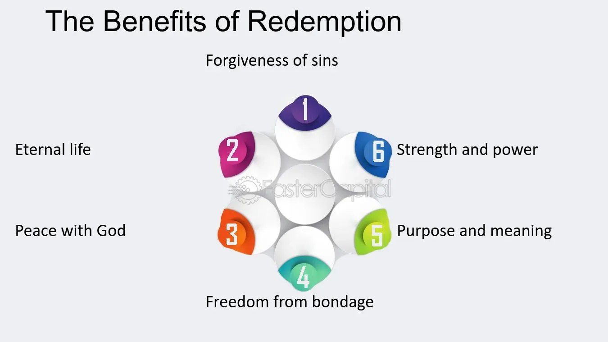

## Table of Contents

## What is a redemption mechanism?

A redemption mechanism is a way for people to get their money back from an investment. It's like a promise that if you want your money back, you can ask for it and get it. This is common in things like mutual funds or bonds, where you can sell your investment back to the company that issued it.

Having a redemption mechanism is important because it gives people confidence in their investments. They know they can get their money back if they need it. This can make people more willing to invest in the first place. It's a safety net that helps keep the financial system stable and trustworthy.

## Why is a redemption mechanism important in financial systems?

A redemption mechanism is important in financial systems because it gives people a way to get their money back from their investments. This makes people feel more secure about putting their money into things like mutual funds or bonds. When people know they can ask for their money back if they need it, they are more likely to invest. This helps more money flow into the economy, which can help businesses grow and create jobs.

Having a redemption mechanism also helps keep the financial system stable. If people can't get their money back when they need it, they might panic and try to pull out all their money at once. This can cause big problems, like bank runs or market crashes. But with a redemption mechanism in place, people know they have a way to get their money back calmly and safely. This helps prevent panic and keeps the financial system running smoothly.

## What are the basic components of a redemption mechanism?

A redemption mechanism has a few basic parts that make it work. First, there's the investment itself, like a mutual fund or a bond. This is what people put their money into. Second, there's the issuer, which is the company or organization that created the investment. They're the ones who promise to give the money back when asked. Finally, there's the process for asking for the money back, which is called redemption. This process tells people how to ask for their money and how long it might take to get it.

These parts work together to make sure people can get their money back safely and easily. The issuer sets up rules for how redemption works, like how often people can ask for their money back and any fees they might have to pay. The investor follows these rules when they want their money back. This helps keep everything clear and fair, so people know what to expect. By having these basic parts in place, a redemption mechanism helps keep the financial system stable and trustworthy.

## How does a redemption mechanism work in mutual funds?

In mutual funds, a redemption mechanism lets you take your money out of the fund whenever you want. When you decide to get your money back, you tell the mutual fund company you want to redeem your shares. They will then calculate how much money you should get based on the current value of the fund, which is called the Net Asset Value (NAV). This value changes every day, so what you get back depends on when you decide to redeem your shares.

The process is usually pretty quick and easy. Once you ask to redeem your shares, the mutual fund company will usually give you your money within a few days. Sometimes, there might be a small fee for taking your money out, but this depends on the rules of the specific mutual fund. Having this way to get your money back makes people feel more comfortable about investing in mutual funds, because they know they can access their money if they need it.

## What are the advantages of using a redemption mechanism for investors?

Using a redemption mechanism gives investors a lot of peace of mind. When you know you can get your money back whenever you want, it makes you feel safer about putting your money into things like mutual funds or bonds. This safety net means you don't have to worry as much about what might happen in the future. If you suddenly need your money for something important, like an emergency, you can just ask for it back and get it.

Another big advantage is that it helps you plan better. Knowing you can redeem your investment at any time lets you be more flexible with your money. You can invest with confidence, knowing that if your plans change or if you find a better opportunity, you can pull your money out without too much trouble. This flexibility can make a big difference in how you manage your finances and can help you feel more in control of your investments.

## Can you explain the process of redemption in exchange-traded funds (ETFs)?

In exchange-traded funds (ETFs), the process of redemption is a bit different from mutual funds. When you want to redeem your shares in an [ETF](/wiki/etf-trading-strategies), you usually don't go directly to the ETF company. Instead, you sell your shares on the stock market, just like you would with any other stock. The price you get depends on what other people are willing to pay for the ETF at that moment. This means the value of your investment can go up or down based on what's happening in the market.

The redemption process for ETFs is quick and easy because you're selling your shares on the stock market. Once you place your order to sell, it usually goes through within seconds, and you get your money soon after. This is different from mutual funds, where you have to wait a few days to get your money back. The flexibility and speed of redemption in ETFs make them a popular choice for people who want to be able to get their money out quickly if they need to.

## What role does a redemption mechanism play in maintaining market stability?

A redemption mechanism helps keep the market stable by giving people a safe way to get their money back when they need it. When people know they can redeem their investments without trouble, they are less likely to panic and try to pull out all their money at once. This is important because if everyone tries to get their money back at the same time, it can cause big problems like bank runs or market crashes. By having a redemption mechanism in place, people feel more secure, and this helps keep the market calm and steady.

In simple terms, a redemption mechanism acts like a safety net for investors. It makes people feel confident about putting their money into things like mutual funds or ETFs because they know they can get it back if something goes wrong. This confidence helps more money flow into the market, which is good for the economy. When people trust the system, they are more likely to keep their money invested, which helps prevent sudden drops in the market and keeps things running smoothly.

## How do redemption mechanisms differ across various financial instruments?

Redemption mechanisms can be different depending on the type of financial instrument. For example, in mutual funds, you go straight to the fund company to get your money back. You tell them you want to redeem your shares, and they calculate how much you get based on the fund's current value. It usually takes a few days to get your money, and there might be a small fee. This process is set up to be clear and fair, so everyone knows what to expect.

In exchange-traded funds (ETFs), the way you get your money back is different. Instead of going to the fund company, you sell your ETF shares on the stock market. The price you get depends on what other people are willing to pay at that moment. This can be faster than with mutual funds because the sale happens right away, and you get your money soon after. ETFs give you more flexibility because you can sell your shares whenever the market is open.

Bonds have another way of handling redemption. When you buy a bond, you're lending money to a company or government. They promise to pay you back on a certain date, called the maturity date. If you need your money back before that date, you might be able to sell the bond to someone else. The price you get will depend on how much other people want to buy it. This is different from mutual funds and ETFs because you can't just ask the issuer for your money back whenever you want.

## What are some common challenges faced when implementing a redemption mechanism?

One big challenge when setting up a redemption mechanism is making sure it works smoothly and quickly. People want to get their money back fast, especially if they need it for an emergency. But if too many people ask for their money back at the same time, it can be hard for the company to handle. They might need to sell assets to get the cash, and if the market is down, they might not get as much money as they need. This can cause delays and make people worried.

Another challenge is keeping the fees fair. Sometimes, companies charge a fee when you take your money out. If these fees are too high, people might feel like they're being punished for needing their money back. It's important to find a balance so the company can cover its costs but also treat investors fairly. Also, explaining how the redemption process works in a clear way can be tough. If people don't understand how to get their money back, they might not feel confident in their investment.

## Can you provide examples of redemption mechanisms in different financial markets?

In the stock market, redemption for exchange-traded funds (ETFs) happens when you sell your shares on the stock exchange. You decide you want your money back, so you place an order to sell your ETF shares. The price you get depends on what other people are willing to pay at that moment. It's quick because the sale happens right away, and you get your money soon after. This is different from mutual funds where you have to wait a few days to get your money back after telling the fund company you want to redeem your shares.

In the bond market, redemption works differently. When you buy a bond, you're lending money to a company or government, and they promise to pay you back on a specific date, called the maturity date. If you need your money back before that date, you can try to sell the bond to someone else. The price you get will depend on how much other people want to buy it. Unlike mutual funds and ETFs, you can't just ask the issuer for your money back whenever you want; you have to find another buyer.

## How do regulatory frameworks impact the design and operation of redemption mechanisms?

Regulatory frameworks play a big role in how redemption mechanisms are set up and run. They make rules that companies have to follow to keep things fair and safe for investors. For example, rules might say how quickly companies have to give money back when people ask for it, or what kind of fees they can charge. These rules help make sure that everyone knows what to expect and that companies don't take advantage of investors. Regulators also keep an eye on things to make sure companies are following the rules, which helps keep the financial system stable.

Different countries have different rules, which can affect how redemption mechanisms work in different places. In some places, the rules might be strict, making it easier for people to get their money back quickly and with low fees. In other places, the rules might be more relaxed, which could mean longer wait times or higher fees. These differences can influence where people choose to invest their money. Overall, regulatory frameworks are important because they help protect investors and keep the financial system running smoothly.

## What advanced strategies can financial institutions employ to optimize redemption mechanisms?

Financial institutions can use technology to make redemption mechanisms work better. They can use computer systems to handle redemption requests faster and more accurately. This means people can get their money back quicker and with fewer mistakes. Also, using data and smart computer programs can help predict when lots of people might want their money back at the same time. By knowing this ahead of time, the institution can get ready and make sure they have enough money to give everyone what they need without causing delays or problems.

Another strategy is to offer different ways for people to redeem their investments. For example, some people might want to get their money back right away, while others might be okay waiting a bit longer for a lower fee. By giving choices, the institution can meet different needs and keep more people happy. They can also use clear communication to explain how redemption works, so people feel more confident about their investments. This can help prevent panic and keep the financial system stable.

## References & Further Reading

[1]: ["Advances in Financial Machine Learning"](https://www.amazon.com/Advances-Financial-Machine-Learning-Marcos/dp/1119482089) by Marcos Lopez de Prado

[2]: ["Machine Learning for Algorithmic Trading"](https://www.amazon.com/Machine-Learning-Algorithmic-Trading-alternative/dp/1839217715) by Stefan Jansen

[3]: ["Quantitative Trading: How to Build Your Own Algorithmic Trading Business"](https://www.amazon.com/Quantitative-Trading-Build-Algorithmic-Business/dp/1119800064) by Ernest P. Chan

[4]: ["The Economics of Exchange Traded Funds"](https://pubs.aeaweb.org/doi/pdfplus/10.1257/jep.32.1.135) by Ananth Madhavan, Journal of Financial Markets, 2016

[5]: ["An Introduction to High-Frequency Finance"](https://archive.org/details/an-introduction-to-high-frequency-finance) by Ramazan Gençay, Michel Dacorogna, et al.