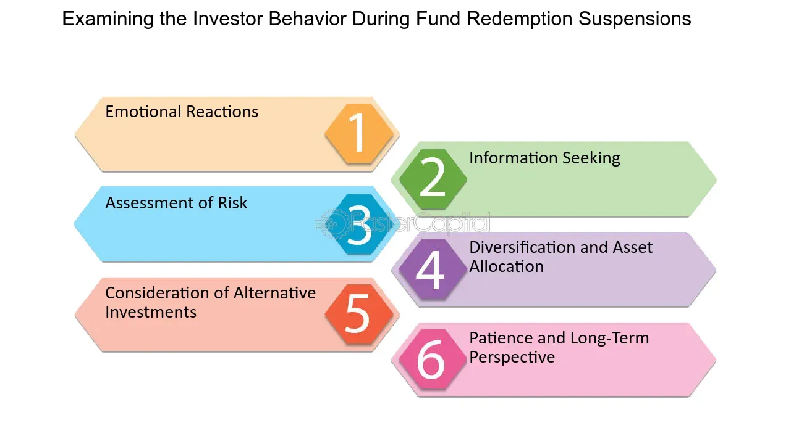

## Table of Contents

## What is redemption suspension?

Redemption suspension is when a fund stops investors from taking their money out. This can happen if the fund is having trouble selling its investments quickly enough to give money back to investors. It's like a temporary pause, and it's usually done to protect the remaining investors and the fund itself.

Fund managers might suspend redemptions if there's a lot of uncertainty in the market, or if too many people want their money back at the same time. This helps prevent a situation where the fund has to sell assets at low prices, which could hurt the value of the fund. Once things calm down, the suspension is lifted, and investors can withdraw their money again.

## Why might a fund suspend redemptions?

A fund might suspend redemptions when it's facing a lot of pressure from investors wanting to take their money out all at once. This can happen during times when the market is unstable or when there's a lot of uncertainty. If too many people want their money back quickly, the fund might have to sell its investments at low prices just to meet those requests. This can hurt the value of the fund and isn't good for the investors who stay in the fund.

To avoid this problem, the fund managers might decide to temporarily stop redemptions. This gives them time to manage the fund's assets better and wait for the market to stabilize. Once things calm down, they can lift the suspension and let investors withdraw their money again. This helps protect both the fund and the investors who are still in it.

## How does redemption suspension affect investors?

When a fund suspends redemptions, it means investors can't take their money out for a while. This can be frustrating because they might need that money or want to invest it somewhere else. It can also make investors worry about the fund's health, wondering why the fund can't let them withdraw their money.

On the other hand, redemption suspension can be good for investors who stay in the fund. It stops the fund from having to sell assets quickly at low prices, which could make the fund's value drop a lot. By waiting for the market to calm down, the fund can protect its value and give investors a better chance of getting their money back later. So, while it's annoying to wait, it might help the fund and the investors in the long run.

## What are the legal requirements for suspending redemptions?

When a fund wants to suspend redemptions, it has to follow certain rules set by the law and the people who watch over them, like regulators. These rules can be different depending on where the fund is and what kind of fund it is. Usually, the fund has to tell its investors right away that it's suspending redemptions and explain why. They also have to tell the regulators and might need to get their okay before they can do it.

The main idea behind these rules is to make sure the fund is doing what's best for its investors and not just trying to hide problems. The fund has to show that suspending redemptions is needed to protect the investors' money and that it's not just because the fund made bad choices. Once things get better, the fund has to lift the suspension and let investors take their money out again.

## Can you explain the process of implementing a redemption suspension?

When a fund decides to implement a redemption suspension, it starts by looking at the rules they have to follow. These rules come from the law and from the people who watch over funds, called regulators. The fund has to make sure they have a good reason for suspending redemptions, like if the market is too unstable or if too many people want their money back at once. They need to tell their investors right away about the suspension and explain why it's happening. They also have to let the regulators know and might need to get their approval before they can go ahead with the suspension.

Once the fund has told everyone and gotten any needed approval, they put the suspension into action. This means they stop letting investors take their money out of the fund until things get better. During this time, the fund managers work on managing the fund's investments carefully, waiting for the market to calm down. When things are more stable, the fund lifts the suspension and lets investors take their money out again. This whole process is meant to protect the fund and the investors who stay in it, even though it can be frustrating for investors who want their money back right away.

## What are the potential risks associated with redemption suspension for fund managers?

When fund managers decide to suspend redemptions, they face some risks. One big risk is that investors might lose trust in the fund. If people can't get their money out when they want to, they might think the fund is in trouble. This could make them want to leave the fund as soon as they can, which could hurt the fund even more. Also, if the fund doesn't handle the suspension well, it could get in trouble with the regulators who watch over them.

Another risk is that the suspension might not fix the problem. If the market stays unstable or if the fund's investments keep losing value, the suspension might just delay the problem instead of solving it. This could make things worse when the suspension ends because the fund might still have to sell assets at low prices to give money back to investors. Fund managers need to be careful and make sure they have a good plan for when the market gets better so they can lift the suspension at the right time.

## How does redemption suspension impact the liquidity of a fund?

When a fund suspends redemptions, it means the fund can't give money back to investors who want to take their money out. This can help the fund keep more money inside, which is good for its liquidity. Liquidity is about how easily the fund can turn its investments into cash. If the fund didn't suspend redemptions, it might have to sell its investments quickly, even if the prices are low. This could make the fund's liquidity worse because it would have less money and fewer good investments left.

But, if the suspension lasts too long, it can also make things harder for the fund. Investors might get worried and want their money back even more when the suspension ends. This could lead to a big rush of people wanting to withdraw their money all at once. If that happens, the fund might still have to sell its investments quickly at bad prices, which would hurt its liquidity. So, while a suspension can help in the short term, it needs to be managed carefully to not cause bigger problems later.

## What are the differences between redemption suspension and redemption gates?

Redemption suspension and redemption gates are both ways for funds to control how much money investors can take out, but they work differently. Redemption suspension is when a fund stops all investors from taking their money out for a while. This usually happens when the fund is having trouble selling its investments quickly enough to give money back to everyone who wants it. It's like hitting the pause button on withdrawals to protect the fund and the investors who stay in it.

On the other hand, redemption gates let a fund limit how much money investors can take out, but they don't stop it completely. Instead of saying "no" to all withdrawals, the fund might say, "You can only take out a certain amount of money right now." This helps the fund manage its money better during tough times without completely blocking investors from getting their money. Both methods are used to handle times when lots of investors want their money back, but they do it in different ways.

## How do regulatory bodies oversee redemption suspension practices?

Regulatory bodies keep a close eye on funds when they want to suspend redemptions. They do this to make sure the funds are following the rules and doing what's best for investors. When a fund wants to suspend redemptions, they have to tell the regulators right away. The regulators check to see if the fund has a good reason for the suspension, like if the market is too unstable or if too many people want their money back at once. They might also need to approve the suspension before it can happen.

Once the suspension is in place, the regulators keep watching to make sure the fund is handling it the right way. They check that the fund is telling investors everything they need to know and that the suspension isn't lasting longer than it should. If the fund doesn't follow the rules or if the suspension seems unfair, the regulators can step in and make the fund change what it's doing. This helps protect investors and makes sure the fund is doing what it's supposed to do.

## What historical examples illustrate the use of redemption suspension?

One famous example of redemption suspension happened during the 2008 financial crisis. The UK fund called M&G Property Portfolio had to stop people from taking their money out. This was because the real estate market was in bad shape, and the fund couldn't sell properties fast enough to give money back to everyone who wanted it. By suspending redemptions, the fund tried to protect itself and the people who kept their money in it. It was a tough time, but it showed how funds sometimes need to take big steps to survive during a crisis.

Another example is from 2020, when the COVID-19 pandemic caused a lot of uncertainty in the markets. The fund called LF Woodford Equity Income Fund had to suspend redemptions too. Many investors wanted their money back because they were scared about what was happening in the world. The fund couldn't sell its investments quickly enough without losing a lot of money, so it had to stop redemptions. This helped the fund manage its assets better during a very uncertain time. These examples show how redemption suspension can be a way for funds to handle tough situations and protect their investors.

## How can investors protect themselves during a redemption suspension?

When a fund suspends redemptions, it means you can't get your money out for a while. This can be scary, but there are things you can do to protect yourself. First, stay calm and read all the information the fund sends you. They have to tell you why they're suspending redemptions and how long it might last. Make sure you understand what's going on. If you're not sure, you can call the fund and ask them to explain it to you. It's also a good idea to keep some money in other places, like a savings account, so you have cash if you need it.

Another thing you can do is to keep an eye on the news and the market. If the fund is having trouble because of something big happening in the world, like a financial crisis or a health scare, it might help to know what's going on. This can give you a better idea of when the suspension might end. Also, talk to a financial advisor if you have one. They can give you advice on what to do next and help you plan for the future. Remember, even though it's hard to wait, the fund is trying to protect your money by suspending redemptions.

## What are the long-term effects of redemption suspension on a fund's reputation and performance?

When a fund suspends redemptions, it can hurt its reputation. Investors might start to think the fund is in trouble or that it's not being managed well. This can make people less likely to invest in the fund in the future. Even if the fund gets through the suspension okay, it might be hard for them to get new investors or keep the ones they have. Trust is really important in the world of investing, and a redemption suspension can make people question if they should trust the fund.

The long-term performance of the fund can also be affected by a redemption suspension. If the fund can't sell its investments at good prices during the suspension, it might not do as well when things get better. Also, if a lot of investors want their money back as soon as the suspension ends, the fund might still have to sell assets at bad prices. This can make the fund's value go down and hurt its performance over time. But, if the fund handles the suspension well and the market gets better, it might be able to recover and do okay in the long run.

## References & Further Reading

[1]: Committee on Capital Markets Regulation. (2009). ["The Global Financial Crisis: A Plan for Regulatory Reform"](https://www.europarl.europa.eu/meetdocs/2009_2014/documents/d-us/dv/d-us_tgfc-ccmr_executive_summa/d-us_tgfc-ccmr_executive_summary.pdf). Committee on Capital Markets Regulation.

[2]: Hu, H., & Black, B. (2008). ["The New Vote Buying: Empty Voting and Hidden (Morphable) Ownership"](https://papers.ssrn.com/sol3/papers.cfm?abstract_id=904004). Michigan Law Review, 96(4).

[3]: Lopez de Prado, M. (2018). ["Advances in Financial Machine Learning"](https://www.amazon.com/Advances-Financial-Machine-Learning-Marcos/dp/1119482089). Wiley.

[4]: SEC & CFTC. (2010). ["Findings Regarding the Market Events of May 6, 2010"](https://www.sec.gov/news/studies/2010/marketevents-report.pdf). Securities and Exchange Commission and Commodity Futures Trading Commission.

[5]: U.S. Securities and Exchange Commission (2020). ["Fast Answers: Redemption Fee"](https://www.sec.gov/about/reports-publications/sec-2020-agency-financial-report). U.S. Securities and Exchange Commission website.