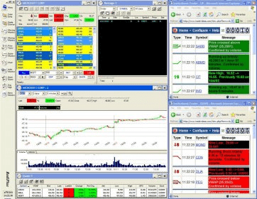

## Table of Contents

## What is the REDIPlus trading platform?

REDIPlus is a trading platform that helps people buy and sell stocks and other financial products. It is used by big investors like banks and hedge funds. The platform is made by a company called Thomson Reuters, which is known for giving financial information and tools to businesses.

REDIPlus is special because it can connect to many different places where stocks are traded. This means users can trade on lots of different markets from one place. It also has tools that help users make smart choices about when to buy or sell. These tools use a lot of data and can show users what might happen in the future based on what's happening now.

## Who developed the REDIPlus trading platform?

The REDIPlus trading platform was developed by Thomson Reuters. They are a big company that gives financial information and tools to businesses around the world. Thomson Reuters wanted to make a platform that would help big investors like banks and hedge funds trade easily and smartly.

REDIPlus is special because it connects to many different stock markets. This means users can trade on lots of different markets from one place. It also has smart tools that help users decide when to buy or sell stocks. These tools use a lot of data to predict what might happen in the future.

## What are the basic features of REDIPlus?

REDIPlus is a trading platform that helps big investors like banks and hedge funds buy and sell stocks easily. It connects to many different stock markets around the world. This means users can trade on lots of different markets from one place. It's like having a big map that shows you all the places you can trade, and you can move between them quickly.

The platform also has smart tools that help users make good choices about when to buy or sell stocks. These tools use a lot of data to predict what might happen in the future. It's like having a crystal ball that helps you see what the stock market might do next. This can help users make smarter trades and hopefully make more money.

## How can one access the REDIPlus platform?

To use the REDIPlus platform, you need to be a big investor like a bank or a [hedge fund](/wiki/hedge-fund-trading-strategies). These big investors can get access to REDIPlus by working with Thomson Reuters, the company that made the platform. They can sign up for the service and get special login details to use the platform.

Once you have access, you can log in to REDIPlus using a computer. The platform is designed to be easy to use, so even if you're not a tech expert, you can still use it to trade stocks. It connects to many different stock markets around the world, so you can trade on lots of different markets from one place.

## What types of assets can be traded on REDIPlus?

REDIPlus is a trading platform that lets big investors trade many different types of assets. You can use it to buy and sell stocks, which are shares in companies. Stocks are one of the most common things people trade on REDIPlus. But it's not just stocks; you can also trade other things like bonds, which are like loans to companies or governments, and options, which are agreements that give you the right to buy or sell an asset at a certain price.

Another type of asset you can trade on REDIPlus is futures. Futures are contracts to buy or sell an asset at a future date for a price agreed on today. They are often used for things like commodities, which are basic goods like oil or wheat. REDIPlus connects to many different markets around the world, so you can trade all these different types of assets in one place. This makes it easier for big investors to manage their trading and investments.

## What are the benefits of using REDIPlus for beginners?

REDIPlus can be a good choice for beginners who want to learn about trading. It connects to many different stock markets around the world, which means you can see what's happening in lots of places from one spot. This can help beginners understand how different markets work and how they are connected. Plus, REDIPlus has tools that use a lot of data to predict what might happen in the future. These tools can help beginners make smarter choices about when to buy or sell stocks, even if they are new to trading.

Another benefit for beginners is that REDIPlus is made by Thomson Reuters, a big company that knows a lot about finance. This means the platform is trusted and reliable. Beginners can feel more confident using a platform that is backed by experts. Even though REDIPlus is mainly for big investors like banks and hedge funds, beginners can still learn a lot from using it, as long as they can get access through a big investor.

## How does REDIPlus integrate with other Goldman Sachs services?

REDIPlus, which is made by Thomson Reuters, works well with other services from Goldman Sachs. Goldman Sachs is a big bank that helps people and companies with their money. REDIPlus can connect with Goldman Sachs' trading systems, which means users can trade stocks and other things easily using both platforms together. This makes it easier for big investors, like banks and hedge funds, to manage their trades because they can use the tools from both REDIPlus and Goldman Sachs without having to switch between different systems.

This integration helps users get the best of both worlds. REDIPlus has smart tools that use a lot of data to predict what might happen in the stock market. Goldman Sachs has its own set of tools and services that help with trading and managing money. When these two are combined, users can make smarter trades and manage their investments better. It's like having a powerful team working together to help big investors make the best decisions.

## What advanced trading tools does REDIPlus offer?

REDIPlus has many advanced tools that help big investors make smart trades. One of the main tools is the ability to use a lot of data to predict what might happen in the stock market. This tool looks at past information and current trends to guess what prices might do in the future. It's like having a crystal ball that helps you see what could happen next. This can be really helpful for deciding when to buy or sell stocks.

Another important tool is the ability to connect to many different stock markets around the world. This means users can trade on lots of different markets from one place. It's like having a big map that shows you all the places you can trade, and you can move between them quickly. REDIPlus also has tools that help with algo trading, where computers automatically make trades based on certain rules. This can help big investors trade faster and more efficiently, without having to do everything by hand.

## How does REDIPlus handle risk management and compliance?

REDIPlus helps big investors manage risks and follow rules by giving them tools to watch their trades closely. It has features that let users set limits on how much they can lose on a trade. This means if the price of a stock starts to go down too much, the platform can stop the trade automatically. This helps protect the investor's money. REDIPlus also keeps track of all the trades and makes sure they follow the rules set by different markets and governments. This is important because big investors need to make sure they are doing everything by the book.

Another way REDIPlus helps with risk management is by giving users real-time data and reports. This means investors can see what's happening with their trades right away and make quick decisions if they need to. The platform also has tools that help users understand how much risk they are taking with each trade. This can help them make smarter choices and avoid big losses. By using these tools, big investors can feel more confident that they are managing their risks well and staying compliant with all the rules.

## What are the costs associated with using REDIPlus?

Using REDIPlus can cost money, but the exact amount depends on what kind of services you need. Big investors like banks and hedge funds usually pay a fee to use the platform. This fee can be based on how much they trade or what special tools they use. Thomson Reuters, the company that makes REDIPlus, sets these fees, and they can change depending on the agreement between the company and the investor.

Besides the basic fee, there might be extra costs for using advanced features or getting special reports. For example, if you want to use the tools that predict what might happen in the stock market or if you need detailed reports about your trades, you might have to pay more. It's important for big investors to talk with Thomson Reuters to understand all the costs and make sure they fit their budget.

## How does REDIPlus compare to other trading platforms in terms of functionality and performance?

REDIPlus is a strong trading platform that big investors like banks and hedge funds use. It is special because it can connect to many different stock markets around the world. This means users can trade on lots of different markets from one place. REDIPlus also has smart tools that use a lot of data to predict what might happen in the stock market. These tools help users make smart choices about when to buy or sell stocks. Compared to other platforms, REDIPlus is known for being reliable and having a lot of advanced features that help with trading and managing money.

Other trading platforms might have some of the same features as REDIPlus, but they might not connect to as many markets or have the same level of smart tools. For example, some platforms might be easier to use for beginners but might not have the advanced tools that REDIPlus offers. On the other hand, some platforms might be faster at making trades, but they might not have the same level of risk management and compliance tools that REDIPlus has. Overall, REDIPlus is a good choice for big investors who need a lot of advanced features and want to trade on many different markets.

## What future developments or enhancements are planned for REDIPlus?

Thomson Reuters, the company that makes REDIPlus, is always working on making the platform better. They are planning to add more smart tools that can predict what might happen in the stock market even better. These new tools will use even more data and new ways of looking at it to help big investors make smarter trades. They also want to make the platform easier to use, so even people who are new to trading can understand it better.

Another thing they are working on is connecting REDIPlus to even more stock markets around the world. This will let users trade on even more places from one spot. They are also thinking about adding new types of assets that people can trade, like cryptocurrencies. This will give big investors more choices and help them manage their money in new ways.

## References & Further Reading

[1]: ["Algorithmic Trading and DMA: An Introduction to Direct Access Trading Strategies"](https://www.amazon.com/Algorithmic-Trading-DMA-introduction-strategies/dp/0956399207) by Barry Johnson

[2]: Aldridge, I. (2009). ["High-Frequency Trading: A Practical Guide to Algorithmic Strategies and Trading Systems"](https://www.wiley.com/en-us/High+Frequency+Trading%3A+A+Practical+Guide+to+Algorithmic+Strategies+and+Trading+Systems-p-9780470579770). Wiley Finance.

[3]: Gandomi, A., & Haider, M. (2015). ["Beyond the hype: Big data concepts, methods, and analytics."](https://www.sciencedirect.com/science/article/pii/S0268401214001066) International Journal of Information Management, 35(2), 137-144.

[4]: ["Flash Boys: A Wall Street Revolt"](https://en.wikipedia.org/wiki/Flash_Boys) by Michael Lewis

[5]: Hasbrouck, J. (2014). ["High-Frequency Trading: Updated with a New Afterword"](https://www.jstor.org/stable/pdf/26591921.pdf). Columbia University Press.