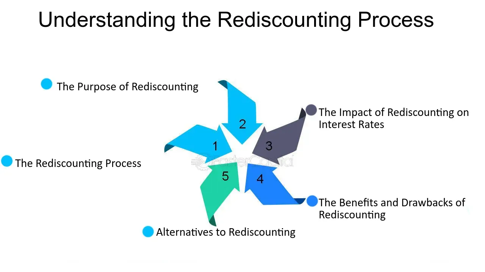

## Table of Contents

## What is rediscounting?

Rediscounting is when a bank takes a loan it has already given out and uses that loan as collateral to get money from a central bank or another financial institution. Imagine a bank has given a business a loan. If the bank needs cash quickly, it can take that business loan to the central bank and get money in exchange for it. The central bank will charge interest on the money it gives to the bank, and this process is called rediscounting.

This process helps banks manage their cash flow and meet their short-term financial needs. It's a way for banks to get quick cash without having to wait for the original loan to be paid back. Rediscounting is important because it helps keep the banking system stable by allowing banks to access funds when they need them. It also helps control the money supply in the economy, as the central bank can adjust the terms of rediscounting to influence how much money is circulating.

## What is the purpose of rediscounting for banks?

Rediscounting helps banks get quick cash when they need it. Imagine a bank has given out a lot of loans, but now it needs money to keep running smoothly. Instead of waiting for those loans to be paid back, the bank can take those loans to the central bank and get money right away. This is really helpful because it means the bank doesn't have to worry about running out of cash.

It also helps keep the whole banking system stable. If banks can easily get money when they need it, they are less likely to run into big problems. Plus, the central bank can control how much money is in the economy by changing the rules for rediscounting. This way, they can make sure there's not too much or too little money floating around, which helps keep the economy healthy.

## How does the rediscounting process work?

When a bank needs quick cash, it can use the loans it has given out as a kind of promise to get money from the central bank. This is called rediscounting. Let's say a bank gave a loan to a business. If the bank needs money, it can take that business loan to the central bank. The central bank will look at the loan and decide if it's good enough to give the bank money in exchange for it. If it agrees, the bank gets the cash it needs, and the central bank keeps the loan as a kind of security.

The central bank will charge the bank interest on the money it gives. This interest is called the rediscount rate. The central bank can change this rate to control how much money is in the economy. If it wants more money to be available, it might lower the rediscount rate, making it easier and cheaper for banks to get money. If it wants less money out there, it might raise the rate, making it more expensive for banks to borrow. This helps keep the economy balanced and stable.

## Who are the main participants in the rediscounting process?

The main participants in the rediscounting process are the banks and the central bank. Banks are the ones that give out loans to businesses or individuals. When a bank needs quick cash, it can take those loans to the central bank and ask for money in exchange.

The central bank is the one that decides if the loans are good enough to give money to the bank. If it agrees, the central bank gives the bank the cash it needs and keeps the loans as a kind of promise. The central bank also sets the rediscount rate, which is the interest it charges the bank for the money. By changing this rate, the central bank can control how much money is in the economy.

## What types of financial instruments can be rediscounted?

Banks can use different kinds of loans as financial instruments for rediscounting. These can include short-term loans like commercial paper, which businesses use to manage their cash flow, and promissory notes, which are written promises to pay back money. Banks can also use bills of exchange, which are documents that order someone to pay a certain amount of money at a specific time.

The central bank looks at these financial instruments to decide if they are good enough to give the bank money in exchange. The central bank wants to make sure that these loans are likely to be paid back. By accepting these instruments, the central bank helps banks get the cash they need quickly, which is important for keeping the banking system stable.

## What are the eligibility criteria for rediscounting?

When a bank wants to get money from the central bank through rediscounting, it has to meet certain rules. The loans the bank wants to use must be good quality. This means the central bank needs to believe that the people or businesses who got the loans will pay them back on time. The loans also need to be short-term, usually less than a year, because the central bank wants to help banks with quick cash needs.

The central bank also looks at the bank itself. It checks if the bank is doing well and following the rules. The bank needs to show that it is managing its money well and not taking too many risks. If the central bank thinks the bank is stable and trustworthy, it is more likely to let the bank rediscount its loans. This helps make sure that rediscounting helps the whole banking system stay strong and healthy.

## How does rediscounting affect the money supply?

Rediscounting can change how much money is in the economy. When the central bank makes it easy for banks to get money by lowering the rediscount rate, banks can borrow more money. This means more money is available for banks to lend to people and businesses. So, the total amount of money in the economy goes up. It's like turning on a tap to let more water flow.

On the other hand, if the central bank wants to slow down the economy, it can raise the rediscount rate. This makes it harder and more expensive for banks to borrow money. Banks will then have less money to lend, and the total amount of money in the economy will go down. It's like turning the tap to let less water flow. By controlling the rediscount rate, the central bank can help keep the economy balanced.

## What are the risks associated with rediscounting for banks?

Rediscounting can be helpful for banks, but it also comes with some risks. One big risk is that if the loans the bank uses for rediscounting don't get paid back, the bank might have to pay the central bank back with money it doesn't have. This can cause big problems for the bank and make it hard to keep running smoothly.

Another risk is that if too many banks use rediscounting at the same time, it can make the whole banking system less stable. If everyone is borrowing from the central bank, it might mean that banks are not managing their money well. This can lead to bigger problems in the economy, like too much money floating around, which can cause inflation. So, while rediscounting can help banks in the short term, it needs to be used carefully to avoid these risks.

## Can you provide examples of rediscounting in practice?

Imagine there's a small bank that gave a loan to a local business to help it buy new equipment. The business promised to pay the loan back in six months. But now, the bank needs cash quickly to cover some other costs. So, the bank takes the loan it gave to the business and goes to the central bank. The central bank looks at the loan and decides it's a good one. It gives the small bank the cash it needs right away, and the small bank promises to pay the central bank back with a little extra interest. This is rediscounting in action.

Another example could be during a time when the economy is slowing down. A big bank has given out a lot of short-term loans to different companies. But now, those companies are struggling to pay back the loans on time because they're not making as much money. The big bank needs cash to keep running smoothly, so it takes those loans to the central bank. The central bank sees that the loans are still good, even though they might take a bit longer to be paid back. It gives the big bank the money it needs, helping the bank stay stable during tough economic times.

## How do central banks use rediscount rates as a monetary policy tool?

Central banks use rediscount rates to control how much money is in the economy. When they want more money to be available, they lower the rediscount rate. This makes it cheaper for banks to borrow money from the central bank. Banks can then lend more money to people and businesses, which means there's more money flowing around in the economy. It's like turning up the [volume](/wiki/volume-trading-strategy) on a radio to make it louder.

On the other hand, if the central bank wants to slow down the economy and reduce the amount of money, it raises the rediscount rate. This makes it more expensive for banks to borrow money. As a result, banks will lend less money, and there will be less money in the economy. It's like turning down the volume on a radio to make it quieter. By adjusting the rediscount rate, the central bank can help keep the economy balanced and stable.

## What are the differences between rediscounting and other forms of bank financing?

Rediscounting is different from other ways banks get money because it involves using loans the bank has already given out as a kind of promise to get cash from the central bank. For example, if a bank gave a loan to a business, it can take that loan to the central bank and get money right away. The central bank will charge interest on this money, and the bank has to pay it back. This is helpful when a bank needs quick cash but it can be risky if the original loans don't get paid back.

Other ways banks can get money include taking loans directly from other banks or financial institutions, or by selling bonds to investors. When a bank takes a loan from another bank, it's usually for a set amount of time and has its own [interest rate](/wiki/interest-rate-trading-strategies). Selling bonds means the bank is borrowing from people who buy the bonds, and it promises to pay them back with interest over time. These methods don't involve using existing loans as collateral like rediscounting does, and they can have different terms and risks.

## How has the role of rediscounting evolved in modern financial systems?

In the past, rediscounting was a key way for banks to get quick cash when they needed it. Banks would take the loans they had given out to businesses or people and use them to borrow money from the central bank. This helped banks manage their money better and keep the economy stable. But as financial systems have grown and changed, other ways for banks to get money have become more popular. Now, banks can borrow from other banks or sell bonds to investors, which gives them more options.

Even though rediscounting is not as common as it used to be, it still plays an important role in modern financial systems. Central banks use the rediscount rate as a tool to control how much money is in the economy. By making it cheaper or more expensive for banks to borrow money through rediscounting, central banks can help keep the economy balanced. So, while rediscounting might not be the main way banks get money anymore, it's still a useful tool for managing the economy.

## References & Further Reading

[1]: ["Rediscount and Other Credit Techniques"](https://www.investopedia.com/terms/r/rediscount.asp) by Charles William Gettemy

[2]: Bernanke, B. S., & Blinder, A. S. (1988). ["Credit, Money, and Aggregate Demand."](https://www.nber.org/papers/w2534) American Economic Review, 78(2), 435-439.

[3]: Pratt, S. E., & Devereux, M. B. (1997). ["Sticky Prices, Exchange Rates and the Revaluation of International Money."](https://www.sciencedirect.com/science/article/pii/S0022199698000361) Review of Economic Studies, 64(3), 551-575.

[4]: Aldridge, I. (2010). ["High-Frequency Trading: A Practical Guide to Algorithmic Strategies and Trading Systems"](https://www.ahmetbeyefendi.com/wp-content/uploads/2020/07/High-Frequency-Trading-Irene-Aldridge.pdf) by Irene Aldridge

[5]: Golub, B. W., & Crumrine, P. J. (2003). ["Governing the Flow of Liquidity in the US Financial Markets."](https://www.semanticscholar.org/paper/Financial-Networks-and-Contagion-Elliott-Golub/3557986f42cb998d0803486b98dbca14f66328e3) Bank for International Settlements Papers, Proceedings of a Project on Trading and Electronic Markets, 44, 219-232.

[6]: Leibold, Andreas A. (2022). ["Algorithmic Trading and Price Impact: A Literature Synthesis."](https://www.researchgate.net/publication/378548435_Algorithmic_Trading_and_AI_A_Review_of_Strategies_and_Market_Impact) Annals of Operations Research, 302, 97-118.

[7]: Khandani, A. E., & Lo, A. W. (2007). ["What Happened to the Quants in August 2007?"](https://www.newyorkfed.org/medialibrary/media/research/conference/2007/liquidity/Khandani_Lo.pdf) Journal of Investment Management, 5(4), 5-54.