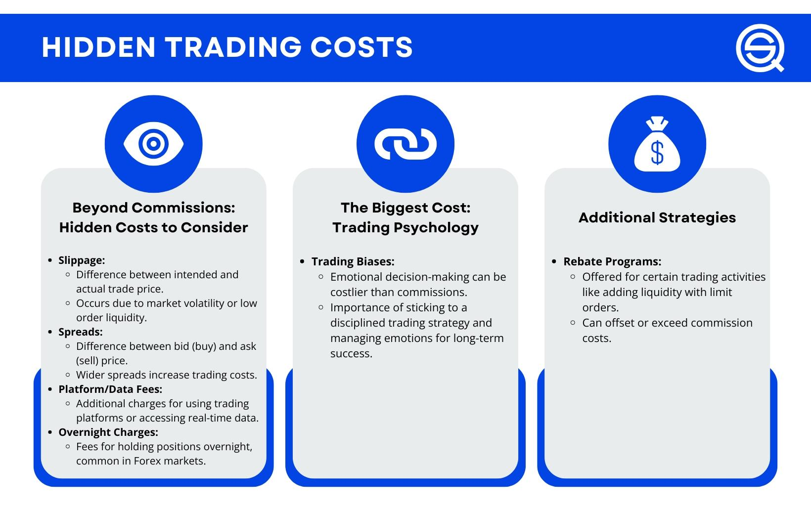

In the competitive world of trading, every decision counts, and trading fees play a crucial role in determining overall profitability. Trading fees, including commissions, spreads, and other related charges, directly affect the cost basis of each transaction, thereby influencing net returns. Understanding the impact of these fees on trading outcomes can empower traders to make more informed decisions. This requires a careful examination of how commission structures affect profitability, as well as the development of strategies to reduce costs.

Commission structures vary widely across brokers and trading platforms, presenting both challenges and opportunities for traders. Higher fees can erode returns, particularly for those engaged in high-frequency trading or operating with limited investment capital. By optimizing trading strategies and employing cost-effective methods, traders can significantly enhance their profitability.

This article examines how traders, whether novice or experienced, can master the art of minimizing fees to boost their profit margins. By intelligently navigating the landscape of trading fees, traders can enhance their financial outcomes. We will explore the role of algorithmic trading as a tool to automate and optimize trading costs, offering a modern solution for cost efficiency.

Join us as we uncover the key elements that link trading fees with trading success, providing insights and practical approaches to ensure that trading activities are as profitable as possible.

## Table of Contents

## Understanding Trading Fees and Their Impact on Profitability

Trading fees are essential considerations for anyone actively involved in financial markets, as they directly impact an investor’s bottom line. Trading fees encompass a range of charges, including commissions, spreads, and various other expenses associated with executing trades on different platforms.

**Commissions and Spreads**: Commissions are fixed costs charged by brokers for facilitating a trade. Often set as a percentage of the trade’s value or a flat fee, these charges are unavoidable but can vary significantly between providers. Spreads, on the other hand, refer to the difference between the bid (buying) and ask (selling) prices, and they are a form of implicit cost arising from the market mechanism itself. A narrow spread generally favors the trader’s profitability while a wide spread could erode potential gains.

**Accumulation of Charges**: Over time, trading fees can accumulate, diminishing returns on investment. For instance, consider a scenario where a trader pays an average commission of $10 per transaction. If they execute 100 trades in a month, the total commission paid amounts to $1,000. When coupled with other potential fees, such as spreads or overnight holding charges, these expenses can significantly cut into the trader’s overall profit.

**Impact on High-Frequency and Small Capital Traders**: The effect of trading fees is particularly pronounced for high-frequency traders who rely on executing a large volume of trades to capitalize on minute price movements. Similarly, traders with smaller investment capital might find that trading fees consume a larger proportion of their available funds, which could hinder their capacity to reinvest or expand their trading activities.

**Fee Structures**: Different trading strategies can be affected by the fee structure. For instance, day traders who enter and exit positions within short periods might incur fewer fees with a brokerage offering a low commission schedule, whereas swing traders who hold positions for several days might prioritize brokers with tighter spreads.

Understanding the fee structure is not just about identifying costs; it is vital for tailoring trading strategies to maximize profit. By conducting a thorough comparison of brokerage fees and charges, traders can make more informed decisions that align with their specific trading styles and financial goals. Awareness of these elements can facilitate improved budgeting and cost management, ultimately enhancing profit margins.

## Types of Trading Fees in the Financial Markets

Trading fees in financial markets encompass a range of charges that traders must navigate to maintain profitability. The primary types of fees include commissions, spreads, and account maintenance fees, each influencing trading activity differently. Understanding these fees is essential for traders to budget effectively and avoid unexpected expenses.

**1. Commissions:**
Commissions are fees charged by brokers for executing a trade, serving as a service charge for the broker's role in facilitating market access. These fees can be structured as a flat fee per trade or a percentage of the trade's value. For instance, a broker may charge a 0.1% commission on the trade value, or a fixed amount like $10 per trade. This fee structure can greatly affect trading strategies, especially for active traders who execute numerous trades, leading to accumulative costs. To manage commission costs, traders might opt for brokers offering lower commission rates or negotiate fees based on their trading [volume](/wiki/volume-trading-strategy).

**2. Spreads:**
The spread is the difference between the bid and ask price of a financial instrument. Unlike commissions, spreads are inherent in the market price and represent the broker's profit margin. Tight spreads are favorable for traders, reducing the cost incurred at trade execution. Markets such as Forex often operate on a spread-based pricing model, and spreads can vary significantly between different currency pairs and brokers. Monitoring and selecting assets with narrower spreads is a crucial strategy for cost management in high-frequency trading environments.

**3. Account Maintenance Fees:**
Account maintenance fees are periodic charges that some brokers levy to maintain a trading account. These fees could be monthly, quarterly, or annual, and they often depend on the account's trading activity level. Traders should be aware of these charges and consider brokers that offer fee waivers for maintaining a minimum account balance or achieving a certain trading volume.

**Broker-Specific Charges:**
Beyond standard fees, brokers may impose specific charges linked to their unique service offerings. These can include data access fees, costs for premium tools and platforms, and charges for inactive accounts. For example, some brokers may offer tiered pricing structures where active traders receive reduced rates, or premium services for a fee. Discrepancies among brokers necessitate comprehensive evaluation when selecting a trading partner, emphasizing the importance of researching broker-specific fee structures.

**Implications on Trading and Cost Management:**
High trading fees can significantly impact profit margins, particularly for traders with smaller capital or those engaging in frequent trades. To manage these costs, traders can adopt strategies such as:

- Choosing brokers with competitive fee structures.
- Aggregating trades to reduce the frequency of transaction-based charges.
- Leveraging technology to identify periods of lower spreads.
- Monitoring fee statements to identify and challenge unexpected charges.

**Comparing Broker Fee Structures:**
To aid in making informed decisions, traders should compare fee structures across leading brokers. For instance, a broker that offers zero-commission trading may offset costs through wider spreads. Other brokers might maintain narrow spreads but charge higher commissions. It's crucial to align the chosen broker's fee structure with the trader's specific trading strategy and volume.

In conclusion, navigating trading fees effectively enhances profitability. By understanding and comparing the various fee types and broker-specific charges, traders can strategically adjust their activities to optimize costs and improve financial outcomes.

## Strategies for Reducing Trading Fees

Minimizing trading fees is a critical step for any trader looking to maximize profitability. There are several practical strategies that traders can adopt to achieve this objective.

One effective approach is selecting low-cost brokers. Compared to traditional brokers, many online brokers offer lower fees and commissions, which can substantially reduce the overall cost of trading. When choosing a low-cost broker, it is crucial to evaluate the fee structure comprehensively, considering not only the commissions but also any additional fees that might apply.

Increasing trade sizes can also be beneficial in reducing trading fees. Since many brokers charge a fixed commission per trade, executing fewer but larger trades can decrease the percentage of the fee relative to the trade's total value. However, traders must be cautious with this strategy, as larger trades may involve higher risks.

Traders can also employ tax-efficient trading tactics such as adjusting the timing of trades to benefit from preferential long-term capital gains tax rates or using tax-advantaged accounts, which may offer additional benefits. Tax loss harvesting, where traders realize losses to offset gains, can also be a viable method to minimize tax obligations associated with trading.

Advancements in technology and modern trading platforms significantly aid in reducing trading costs. Automated trading systems, for example, allow traders to execute trades more efficiently, potentially minimizing spreads and execution costs. Additionally, platforms equipped with analytical tools can help traders develop and implement cost-effective strategies.

Insights from successful traders reveal that a thorough understanding of fee structures and a strategic approach to trading can greatly reduce unnecessary expenses. For instance, some traders successfully negotiate better terms with their brokers based on their trade volume. Others optimize their trading strategies by analyzing market conditions to avoid peak trading hours when spreads and fees may be higher.

It's important for traders to regularly review and adjust their trading tactics to better manage fee-related challenges. This involves staying informed about any changes in the broker’s fee schedule and continuously evaluating the effectiveness of current strategies. Adjustments based on performance analysis and market developments ensure that traders maintain an efficient trading process focused on cost reduction. Regular reviews can preemptively address potential cost issues, continuously aligning trading practices with profitability goals.

## Algorithmic Trading: Automating and Optimizing Cost Efficiency

Algorithmic trading has revolutionized the way trades are executed in financial markets by enhancing efficiency and reducing costs. At its core, [algorithmic trading](/wiki/algorithmic-trading) employs complex mathematical models and software to make decisions about the timing, pricing, and quantity of trade orders, thus optimizing execution.

Algorithms are designed to execute trades at moments that minimize transaction costs, such as spreads and commissions. By analyzing market data in real-time, these algorithms identify advantageous times to place trades, leveraging minor price fluctuations to maximize profit potential. One popular approach is the implementation of mean-reversion or trend-following strategies, which rely on mathematical algorithms to predict price movements. For example, a simple moving average crossover strategy can be employed to generate buy or sell signals when short-term moving averages intersect with long-term ones—a method that can be backtested and optimized through quantitative analysis.

Automation significantly reduces trading costs by lessening the need for manual intervention, thereby minimizing human errors and biases. Eliminating these factors can lead to a more consistent application of trading strategies, enhancing overall cost efficiency. Furthermore, automated systems can execute trades with high speed and precision, which is crucial in high-frequency trading where even milliseconds can impact profitability.

Developing and customizing algorithms allow traders to tailor strategies according to their unique specifications, risk tolerance, and financial goals. This customization enhances cost-effectiveness, as traders can program algorithms to minimize costs related to slippage and impact on market prices. For instance, volume-weighted average price (VWAP) algorithms aim to execute orders close to a predefined average price, ensuring minimal market disruption. Implementing [machine learning](/wiki/machine-learning) models to refine these trading strategies has also gained traction, providing adaptive and dynamic solutions that evolve with market conditions.

There are numerous case studies illustrating the success of algorithmic trading in boosting profitability. For example, Renaissance Technologies, a [hedge fund](/wiki/hedge-fund-trading-strategies) known for its Medallion Fund, has leveraged algorithmic strategies to achieve substantial excess returns over the years. By integrating sophisticated models and vast amounts of data, they demonstrated the transformative power of algorithmic trading in the financial industry.

Overall, algorithmic trading offers a means to automate and optimize trading operations, reducing costs and enhancing efficiency. Traders who deploy well-structured algorithms can attain a competitive edge by executing trades with greater speed, accuracy, and cost-effectiveness.

## The Future of Trading Fees and Profitability

The landscape of trading fees and profitability is expected to undergo significant transformations as both regulatory frameworks and technological advancements continue to evolve. Anticipating these changes can enable traders to better position themselves in the competitive financial markets.

Regulatory changes are poised to influence trading costs. Financial authorities worldwide are increasingly scrutinizing fee structures to promote transparency and protect retail investors from excessive charges. This scrutiny may lead to new regulations that could standardize fee disclosures and limit certain types of charges, effectively reducing the complexity and potential cost burden on traders. Traders should stay informed about regulatory developments, as compliance costs and altered fee structures could impact overall profitability.

Technological advancements are also instrumental in shaping the future of trading fees. The rise of zero-commission trading platforms, popularized by fintech companies, is reshaping the brokerage industry. These platforms, generally sustained by revenue from other sources such as securities lending or payment for order flow, offer trades without direct commissions. For traders, the adoption of zero-commission models can lead to significant cost savings, particularly for high-frequency traders or those engaging in large volumes of trades. However, traders should exercise due diligence in understanding the terms of these platforms, as hidden costs might offset some of the anticipated savings.

Increased market competition is driving the need for cost-efficient trading strategies. Brokers are under pressure to differentiate themselves not only through competitive pricing but also by offering value-added services such as enhanced research tools and educational resources. Traders who leverage these tools can achieve a more comprehensive understanding of market conditions, enabling them to execute trades more strategically and reduce unnecessary costs.

Expert insights suggest that traders can maintain and improve profitability by embracing cost-efficient strategies tailored to evolving conditions. These strategies may include adopting algorithmic trading to optimize execution and minimize market impact, diversifying trading venues to take advantage of lower fees, and consistently reviewing fee structures to ensure alignment with trading objectives. Additionally, traders should consider integrating advanced analytics to identify trends and anomalies in fee structures, allowing them to refine their approaches continually.

In conclusion, navigating the future of trading fees requires an adaptive approach that combines awareness of regulatory shifts and technological innovations with strategic cost management. By staying informed and proactive, traders can effectively mitigate fee-related challenges and enhance their profitability in increasingly competitive financial markets.

## Conclusion

Understanding and managing trading fees is critical to enhancing profitability, as they can significantly impact an investor's returns. A reduction in these fees directly correlates with improved trading profitability, providing a competitive edge in a market where every percentage point counts. Traders are encouraged to consistently analyze their fee structures, as identifying areas for cost reduction can lead to substantial savings over time. Strategies such as selecting low-cost brokers, employing tax-efficient trading practices, and leveraging larger trade sizes have proven effective in minimizing fees.

Algorithmic trading stands out as a particularly innovative approach for optimizing costs. By automating trade executions, algorithms can detect and respond to market fluctuations swiftly, thereby reducing the influence of spreads and commissions. This automation not only minimizes manual intervention and error but allows traders to customize their strategies for enhanced economic efficiency.

Staying informed about market trends and regulatory changes is essential, as these developments often influence trading costs. The emergence of zero-commission trading platforms exemplifies how the landscape is evolving. Such platforms have the potential to drastically alter fee structures, offering traders new opportunities for cost reduction.

Traders should regularly assess their current fee exposure and remain open to new technologies and strategies that boost performance sustainability. By maintaining a proactive approach, traders can effectively manage their fees and reinforce their trading practices, ensuring long-term success in a highly competitive environment.

## References & Further Reading

[1]: Bergstra, J., Bardenet, R., Bengio, Y., & Kégl, B. (2011). ["Algorithms for Hyper-Parameter Optimization."](https://papers.nips.cc/paper/4443-algorithms-for-hyper-parameter-optimization) Advances in Neural Information Processing Systems 24.

[2]: ["Advances in Financial Machine Learning"](https://www.amazon.com/Advances-Financial-Machine-Learning-Marcos/dp/1119482089) by Marcos Lopez de Prado

[3]: ["Evidence-Based Technical Analysis: Applying the Scientific Method and Statistical Inference to Trading Signals"](https://www.amazon.com/Evidence-Based-Technical-Analysis-Scientific-Statistical/dp/0470008741) by David Aronson

[4]: ["Machine Learning for Algorithmic Trading"](https://github.com/stefan-jansen/machine-learning-for-trading) by Stefan Jansen

[5]: ["Quantitative Trading: How to Build Your Own Algorithmic Trading Business"](https://www.amazon.com/Quantitative-Trading-Build-Algorithmic-Business/dp/1119800064) by Ernest P. Chan